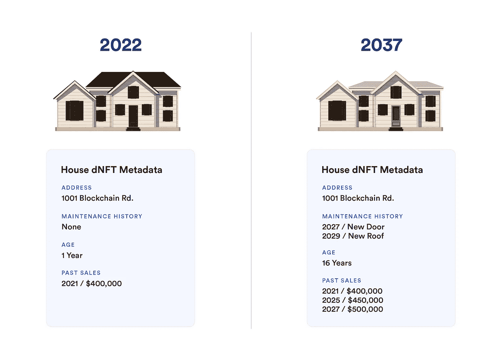
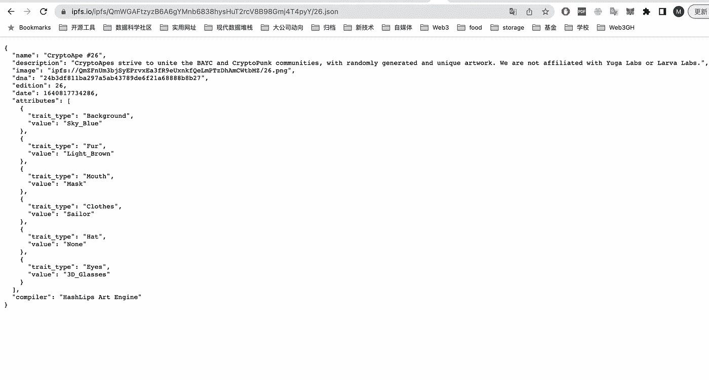
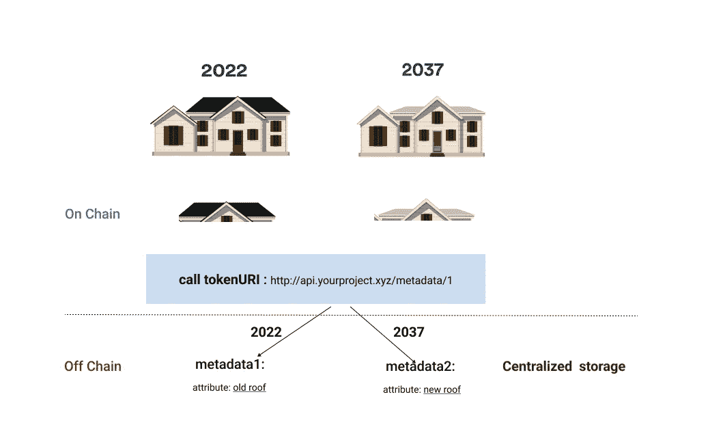
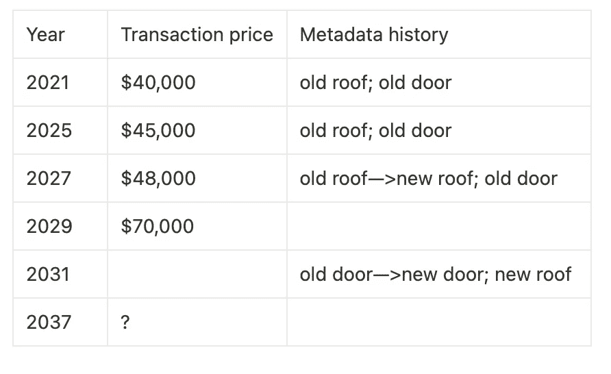
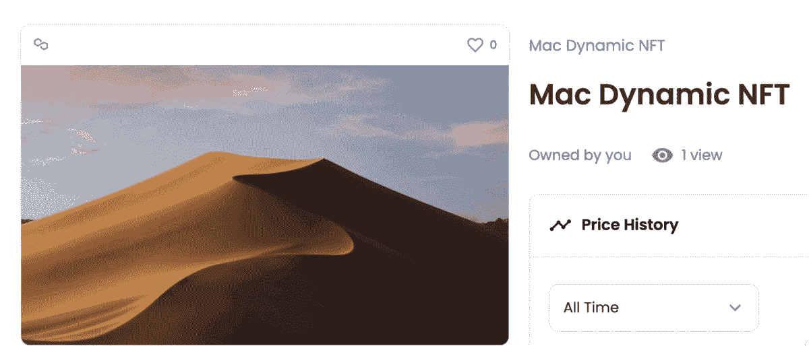
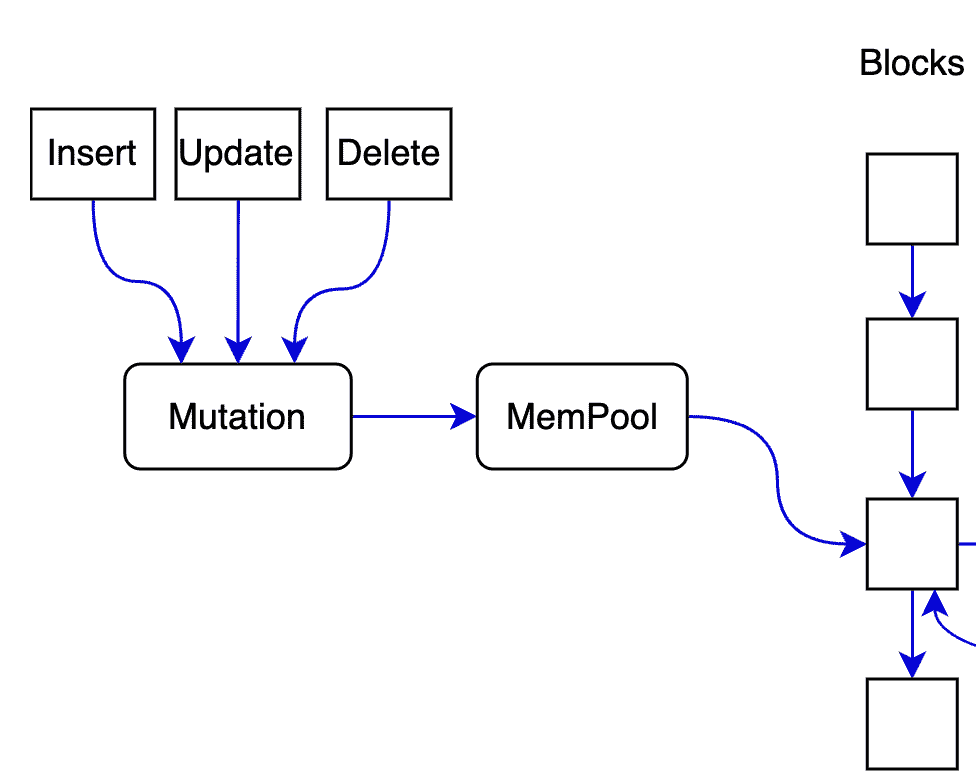

# 如何分散、动态地存储 NFT 元数据

> 原文：<https://medium.com/geekculture/storage-of-dynamic-nft-metadata-based-on-db3-network-f39bd1fe2a77?source=collection_archive---------5----------------------->



The metadata of a dNFT representing a property can change to reflect maintenance history, past sales, etc. image from [https://blog.chain.link/what-is-a-dynamic-nft/](https://blog.chain.link/what-is-a-dynamic-nft/)

dNFT(动态 NFT)中的元数据很难同时实现“**去中心化**和“**动态变化**”。

# 分散元数据存储

关于 [48%的 NFT](https://thecontrol.co/the-state-of-nft-data-storage-c471c1af58d5) (大多数 NFT 是静态的)元数据是分散的，存储在 IPFS 上。格式后缀为***ipfs/your _ collection _ file _ hash/token id****，*其中***your _ collection _ file****是指 NFT 集合，其中 ***tokenid*** 是一个数字，如“26”。此类项目的一个例子是 [Bored Ape Yacht Club](https://opensea.io/assets/ethereum/0xbc4ca0eda7647a8ab7c2061c2e118a18a936f13d/2193) ，其元数据存储在 IPFS，尽管用于 IPFS 的 BaseURI 可以由合同所有者更改。*

**

**The metadata of Bored Ape NFT is stored in IPFS, and it records multiple attributes, fur, mouth, etc. image from author**

*假设平台想要提供 NFT 定制功能，并将元数据放在分散存储中。在这种情况下，开发人员需要穷尽所有可能的属性组合，将所有种类的元数据放在 IPFS 上，然后根据属性组合进行索引，找到 IPFS 的 *tokenURI* 来获取元数据。*

**

*The picture demonstrated the relationship between the links. image from author*

*这种方法的缺点是:*

*元数据组合多，导致前期存储成本大。你必须提前储存它们。*

*如果平台希望在眼镜的功能中添加智能眼镜选项，或者当它提供动态更改的能力时，它可以根据世界杯在一场比赛中的进球，更改 NFT 中关于比赛级别的元数据信息和 NFT 中的其他元数据信息。此时，元数据更改的时效性要求更高。例如，这种动态变化几乎等于更换一个新的 NFT，改变 NFT 元数据的成本将急剧上升。*

# *先动态更新*

*第二种方法是放弃分散的元数据存储，只把所有权放在链上，保证及时快速的动态变化。有些项目通过集中服务器生成元数据，定制 NFT 的元数据信息会集中合并生成。*

**

*image from author*

*为了能够显示 2022 年和 2027 年的不同房屋，NFT·明特应该首先将其他屋顶放在链上，存储链外的元数据，以及一个集中式服务的 URL 来进行关联，在 2022 年指向其中的一个，并在 2037 年将其替换为另一个。*

*然而，他们将元数据存储在中央存储器上，这些服务器可能会在一眨眼的时间内发生故障，使全球 NFT 所有者损失数百万美元。*

*更重要的是，保证这样的存储不被篡改并不容易。尤其是一些游戏 NFT，它们的价值不在于显示的画面，而在于游戏中至关重要的信息，比如武力值、等级等。这些信息存储在元数据中。不可能保证只有 NFT 所有者的所有者能够改变基于集中存储的元数据。*

*当元数据存储与链上的数据分离时，动态元数据历史不会在链上留下痕迹，这两者是不相关的，因此不容易进行实际的分析和洞察。*

**

*The history of the house,image from author*

*目前，只有前两列数据被保存在链上，这可以从 OpenSea 这样的平台上直接看到。但是你只知道价格是随着时间的推移而增加的，但是你需要明白为什么。最后一个数据列在平台的集中式服务器里，不可靠。例如，2029 年的价格大幅上涨是由于维修新屋顶——关于此的信息在元数据的第三列中。因为元数据是变化的，没有存储在链上，可能被篡改，所以你无法知道，也没有挑战性去分析理解 2037 年一个比较合理的价格是多少。这些问题可能导致 dNFT 在 NFT 交易市场的展示体验不佳，使 dNFT 难以在二级市场流通和繁荣。*

**

*image from [https://i.ibb.co/8NcyKwh/dyanmic.gif](https://i.ibb.co/8NcyKwh/dyanmic.gif)*

*例如，在 OpenSea 中，一个随每日日照条件变化的 dNFT 每 8 小时旋转一次动画，元数据的变化历史不会呈现在网站上，动态特征在你第一次进入时完全看不到。你无法知道这是动态的。*

# *把所有的东西都放在链子上。*

*所以最好把所有的元数据，图片，交易信息等。并且可以方便地和动态地添加元数据和改变它。您的签名应该执行更改，NFT 平台作为一个中介将数据的直接接触(读写、缓存等)减到最少。).*

# *DB3 网络*

*在这里，让我介绍一下 [DB3 网络](https://github.com/dbpunk-labs/db3/)，这是一个分散式存储解决方案，它采用了键值存储范式，并具有高级数据库属性，如突变和可编程性。*

## *基于分散存储轻松更改元数据。*

*DB3 可以支持方便的类似 CRUD 的操作，插入、更新、读取和删除存储的数据。这对于集中式存储来说很容易实现，但是对于分散式存储来说很难实现。原因是更新操作与区块链的不可变特征相冲突。但在上面提到的动态 NFT 等用例中，不可变存储从安全角度来看很重要，但它限制了可能应用的数量(如 NFT 的进化能力)。*

*在 DB3 网络中，突变被定义为我们的核心概念。所有对数据修改的操作都被定义为变异。您可以使用变异来插入、更新和删除数据。例如，当您想要修改屋顶颜色元数据时，您可以轻松地完成数据更新。*

```
*>put house roofcolor offwhite
submit mutation to mempool done!
>get house roofcolor
roof -> offwhite*
```

*同时，mutation 可以执行数据更新操作，另外三个:insert/update/delete 以及这些操作返回的 hash 都会提交到块中。*

**

*the operation is recorded into blocks, image from author*

## *分析链上的元数据历史记录*

*dNFT 的每一次元数据更改都会像快照一样记录在链上。同时，因为我们优化了我们的存储引擎的效率，我们可以实现高性能的查询，不逊于 web2 数据库。因此，在未来，对 dNFT 的分析将非常容易阅读并显示更可信的元数据历史。*

## *索赔元数据**所有权***

*其次，dNFT 的描述信息会以类似 web2 中“表”的概念存储。**由于元数据定义了资产，保护元数据与保护所有权一样重要。**此表的操作和修改需要获得用户的许可，完全由用户控制，保证了 dNFT 的所有权。集中式服务应该很少涉及元数据。*

**

*image from author*

*我们的 [Github](https://github.com/dbpunk-labs/) :*

*   *浏览一些设计文档；*
*   *从 [*goodfirstissue*](https://github.com/dbpunk-labs/db3/issues?q=is%3Aissue+is%3Aopen+label%3A%22good+first+issue%22) 开始编码；*
*   *根据 [*WIPissue*](https://github.com/dbpunk-labs/db3/issues?q=is%3Aissue+is%3Aopen+label%3Adiscussion-required) 与我们讨论。*