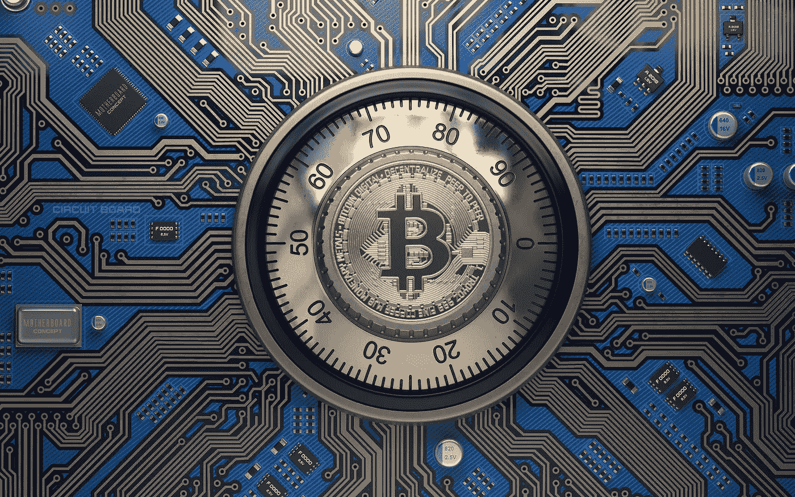

# 在交易所存储比特币？

> 原文：<https://medium.com/geekculture/storing-bitcoin-on-exchanges-8ab9aef2bb1d?source=collection_archive---------36----------------------->

## 以下是你不应该这么做的原因

为了鼓励加密货币爱好者远离加密交易所，密钥证明运动正在逐渐壮大。您可能想知道密钥证明是否是区块链的一种新的共识算法，类似于股权证明或工作证明。答案是否定的……一点也不。

