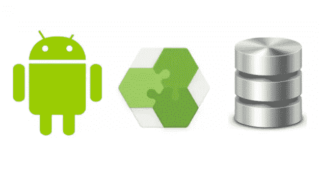

# 将 Json 响应存储在房间数据库 Android 中

> 原文：<https://medium.com/geekculture/storing-json-response-in-room-database-android-be9550728b54?source=collection_archive---------6----------------------->



由于其快速的响应，房间数据库现在是开发者的首选，与 realm 和 kotlin coroutines 相比，它不占用太多空间。我见过许多开发人员使用 kotlin 将整个 json 对象存储在房间数据库 android 中。

无论是对象格式还是数组格式，存储整个 json 都非常简单。您只需要通过创建数据库处理程序、数据库 Dao 和数据库表来设置数据库。

现在，假设您希望在用户登录到您的应用程序以维护用户会话时存储用户信息。

在您的 gradle 文件中添加以下 Gson 依赖项:

```
implementation 'com.google.code.gson:gson:2.8.6'
```

**第一步:**
你需要创建登录响应的数据类。

**步骤 2:**
您需要创建登录响应的类型转换器类，如下所示:

**步骤 3:**
你需要告诉你的数据库处理器类关于这个类型转换器，这样 room 就可以存储整个 json 对象。

```
@TypeConverters(LoginConverter::class)
```

您需要在数据库处理程序类名上方添加这个注释。现在，您的应用程序能够将 json 响应存储在房间数据库中。

如果你面临任何问题，然后留下评论，我会回答你的问题。
快乐编码！