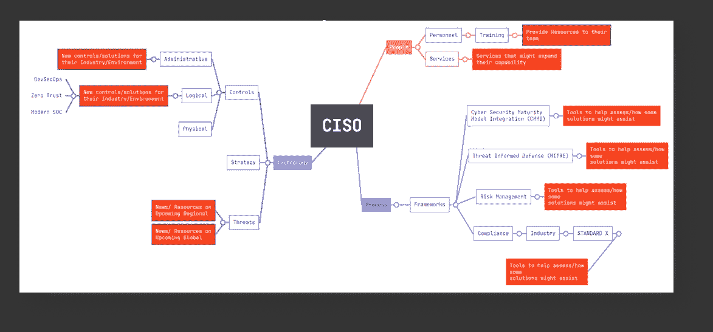

# 面向领导者的战略网络安全报告

> 原文：<https://medium.com/geekculture/strategic-cyber-security-report-for-leaders-1556a2bb44ac?source=collection_archive---------10----------------------->

网络安全领导者战略信息月度摘要

我每周都与大型组织的 CISOs 进行互动，在我准备进行有意义和相关的对话时，我决定开始这份基于战略网络安全信号的月度报告。

本系列的目的是为首席信息官和领导者提供相关信息的见解。因此，它承担着达到角色期望的责任。

在本文中，我将总结 CISO 角色的关键方面，以及该报告将如何帮助解决这些问题。

# 首席安全信息官

每个管理角色都对业务负有责任，不管它们是否是技术性的，这使得 CISO 成为一个困难的角色，因为它必须用安全价值来响应业务，这在历史上一直被视为成本。就像科技在我们生活中扮演重要角色之前的样子。

诚然，信息安全领域的时代变化非常快，由于所有网络安全事件的不幸，信息安全在新闻中获得了如此多的知名度和恶名，但有时我们仍会看到 CISOs 向 CFO 甚至 CTO 报告，他们间接处于明确的业务价值和成本之下。

我听说过此类组织中的 CISOs，他们不得不进行艰难的对话，以使其计划的预算获得批准，正如我们所知，这阻碍了安全成果，并潜在地增加了所述组织的整体风险。

虽然我对这种挑战没有发言权，但我读过一些关于每个 CISO(或领导者)在开始工作时必须做的事情。

> 最重要的是，他们的工作是在支持业务增长的同时降低风险。

## CISO 计划

我看到了一本名为《新领导者 100 天行动计划》的书，作者从领导者的角色出发，为他们提供了一系列建议，这是一本帮助你建立框架的好书。

有人利用这个框架创建了他们自己的 CISO 版本。现在，我将选择使用它作为资源，因为基于他们的背景，他们似乎足够可信。查看来源(linkedin)，[“克里斯蒂娜 s .”这里](https://www.linkedin.com/feed/update/urn:li:share:6967199152900296705?utm_source=linkedin_share&utm_medium=member_desktop_share&utm_content=post)。他们列举了一些目标，让某人从他们的 CISO 开始，利用他们过去几年在 3 个不同的 CISO 角色中的经验。他们列出的目标如下:

1.  定义 CISO 的角色和职责

2.建立融洽关系，建立信任

4.评估安全计划(今天)

5.制定安全计划(明天)

6.提交安全计划

7.获得领导和利益相关者的支持

8.执行计划

9.衡量并持续改进

阅读以上来源的更多信息。

我遇到的另一个来源是关于这个角色的播客，CISO 贸易公司是其中之一(在我听过的其他人中)，他们最近有一个关于 CISO 思维导图的很好的会议:

[# 86——CISO 思维导图(与拉菲克·拉赫曼)| podbean.com CISO 贸易公司](https://cisotradecraft.podbean.com/e/86-the-ciso-mindmap-with-rafeeq-rehman/)

如果你感兴趣，他们提到的思维导图可以在网上找到，虽然这是一个很好的信息安全思维导图，但它并没有从实际的管理角度专门解决这个问题。

因此，为什么我开始为这个报告创建一个…

## CISO 战略框架

根据我与 ciso 的对话、过去在微软工作的 ciso 以及其他来源，我定义了一个简单的模型，该模型着眼于他们的优先事项，我将在本系列中讨论这个模型。

我自己的框架基于两层方法:

1.  看领域:3 个主要领域集中在:**人员、流程和技术**(想到的那种更好的 PPT🙃).
2.  从他们国家的角度来看:当前的和期望的(想到的那种较小的 CD🙃).

这与 CSOonline 在此发布的内容一致— [首席信息安全官应该寻找的降低风险的指标](https://www.csoonline.com/article/3605493/3-metrics-every-ciso-needs-to-reduce-risk-and-build-budget.html)。

根据上面的内容，我创建了一个原型思维导图，用红色突出显示了月度报告中的相关内容。

本质上，这一系列将涵盖上述领域。

我很快就会出版第一期，在这里。

了解更多关于我的云和安全项目:[https://linktr.ee/acamillo](https://linktr.ee/acamillo)

[考虑订阅 Medium (here)](https://andrecamillo.medium.com/membership) 获取更多内容，让你更有力量！

感谢您的阅读，并留下您的想法/评论！

# 。/参考

[《新领导人 100 天行动计划》——本书](https://www.amazon.com/New-Leaders-100-Day-Action-Plan/dp/1536629200)