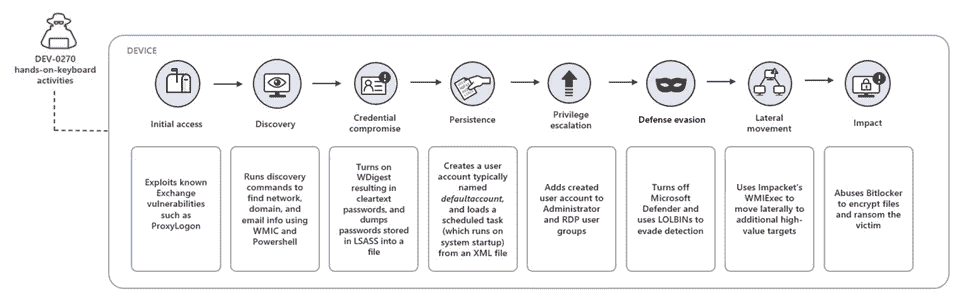

# 面向领导者的战略网络安全报告—2022 年 9 月版

> 原文：<https://medium.com/geekculture/strategic-cyber-security-report-for-leaders-september-2022-edition-322d55e731a2?source=collection_archive---------13----------------------->

网络安全领导者战略信息月度摘要

这是我在与 CISOs 交谈时发现的一个需求衍生出来的系列— [如开篇文章](https://andrecamillo.medium.com/strategic-cyber-security-report-for-leaders-1556a2bb44ac)中所述，该系列遵循以下格式:

> *CISO 在 3 个领域的想法:人、流程和技术。*

# 人

## 让团队了解如何最好地利用他们的工具集

## -Microsoft Defender for Office 365—SecOps 指南

9 月下旬，微软发布了 Microsoft Defender for Office 365 安全操作指南(SecOps)。

> SecOps 需要将新的工具和任务纳入他们现有的行动手册和工作流程中。我们经常听到这给团队带来了挑战，并提出了问题，例如:“我从哪里开始？我应该采取什么行动/任务？我如何与我现有的工具和流程集成？”
> 
> Microsoft Defender for Office 365 安全操作指南提供了回答上述问题的有用信息。

[这里是指南](http://aka.ms/opmdo)的链接，这是网络安全团队使用该工具的一个很好的资源。

与操作平台同样重要的是知道如何从 XDR 仪表板 M365 Defender 处理其事件。为此，请访问本[指南](https://learn.microsoft.com/en-us/microsoft-365/security/office-365-security/mdo-sec-ops-manage-incidents-and-alerts?view=o365-worldwide)。

## -澳大利亚政府基本配置指南 8

微软发布了许多最佳实践配置指南，以帮助组织遵守 Essential 8。

所有这些都是公开的，可以在[这里](https://servicetrust.microsoft.com/ViewPage/RegionalAustralia)获得。

## 关于主要威胁因素研究的战略信息

## -磷勒索软件操作

[来源，微软威胁情报](https://www.microsoft.com/security/blog/2022/09/07/profiling-dev-0270-phosphorus-ransomware-operations/)

> 微软威胁情报团队一直在跟踪多个勒索软件活动，并将这些攻击与 DEV-0270 联系起来，DEV-0270 也被称为涅墨西斯小猫，是伊朗演员磷的一个子团体。微软以中等信心评估 DEV-0270 代表伊朗政府进行恶意网络操作，包括广泛的漏洞扫描。

该运算符的典型附加链:

原始报告中突出显示了观察到的技术和建议，以抑制他们的行为，并为您的团队运行 KQL 查询。

请记住，您可以通过**微软的 XDR 使用威胁分析**来寻找您环境中的主要威胁，这可以节省网络安全分析师的搜索时间以及其他好处……了解更多信息[在此](https://learn.microsoft.com/en-us/microsoft-365/security/defender-endpoint/threat-analytics?view=o365-worldwide)和[在此视频](https://www.microsoft.com/en-us/videoplayer/embed/RE4bw1f?postJsllMsg=true)。

## -年中威胁报告

供应商已经开始提供他们的年中威胁报告。其中之一是趋势科技— [在他们的官方网站这里](https://www.trendmicro.com/vinfo/hk/security/research-and-analysis/threat-reports/roundup/defending-the-expanding-attack-surface-trend-micro-2022-midyear-cybersecurity-report)报告和信息。

# **流程**

## 新西兰信息安全手册更新

本月早些时候，新西兰 ISM 收到了一份更新。在 3.6 版中，对其进行了一些策略更改。GCSB 提供了变更概要:

> “NZISM and 版的最终更新包括四项政策变更(关于公共云安全的新章节、关于反向分割隧道 VPN 的新章节、NZISM 中的语言现代化以及第 15.2 节中对 DMARC/DKIM 的更新)以及少量次要和编辑性变更。
> 这些变化是由系统威胁和风险推动的，这些威胁和风险是通过机构询问、我们自己的研究、政府机构现在使用云技术的方式变化所凸显的信息安全政策差距，以及 NZISM 所基于的国际安全框架和标准的变化而确定的。我们还将继续与国际合作伙伴合作，按照他们的标准制定我们的政策和标准。”

点击查看所有细节[。](https://www.gcsb.govt.nz/news/september-2022-new-zealand-information-security-manual-v3-6-release/)

# 技术

## -优步遭受重大袭击

优步本月遭受了一次网络攻击，它发表了声明，并通过一个官方帖子提供了一些调查更新，如下所示。

[来源，优步](https://www.uber.com/newsroom/security-update):

> 一名优步 EXT 承包商的账户被攻击者攻破了。很可能是在承包商的个人设备感染了恶意软件，暴露了这些凭据之后，攻击者在黑网上购买了承包商的优步公司密码。攻击者随后多次试图登录该承包商的优步账户。每次，承包商都会收到一个双因素登录批准请求，该请求最初会阻止访问。然而，最终承包商接受了一个，攻击者成功登录。
> 
> 从那里，攻击者访问了其他几个员工帐户，最终使攻击者获得了许多工具的提升权限，包括 G-Suite 和 Slack。攻击者随后在公司范围内的 Slack 频道上发布了一条消息，你们很多人都看到了，并重新配置了优步的 OpenDNS，以便在一些内部网站上向员工显示图形图像。

几天后，负责人被确认并逮捕，一名来自伦敦的 17 岁少年被指责对此事件负责，显然也对黑客攻击 Rockstar 并泄露 GTA 6 片段负责。

> 据称，这两起入侵都是由同一个威胁行为者实施的，这个威胁行为者的名字是 Tea Pot(又名 teapotuberhacker)。
> 
> 优步方面已将漏洞归咎于一名(或多名)攻击者，该攻击者被认为与 LAPSUS$敲诈团伙有关，其中两人面临欺诈指控。

## - Optus 通知客户重大事故

[资料来源，Optus](https://www.optus.com.au/about/media-centre/media-releases/2022/09/optus-notifies-customers-of-cyberattack)

> 在一次网络攻击后，Optus 正在调查对现有和以前客户信息的可能的未授权访问。
> 
> 发现这一点后，Optus 立即关闭了攻击。Optus 正与澳大利亚网络安全中心合作，以降低客户面临的任何风险。Optus 还通知了澳大利亚联邦警察局、澳大利亚信息专员办公室和主要监管机构。
> 
> Optus 首席执行官 Kelly Bayer Rosmarin 表示:“我们发现我们受到了网络攻击，导致我们客户的个人信息泄露给了不该看到这些信息的人，我们感到非常震惊。”

ASCS(澳大利亚实体)就如何保持安全提供了额外的指导— [链接此处](https://www.cyber.gov.au/acsc/view-all-content/alerts/optus-notifies-customers-cyberattack-compromising-customer-information)。

了解更多关于我的云和安全项目:[https://linktr.ee/acamillo](https://linktr.ee/acamillo)

[考虑订阅 Medium(此处)](https://andrecamillo.medium.com/membership)获取更多内容，为您赋能！

感谢您的阅读，并留下您的想法/评论！

# 。/参考

分散在整个文档中