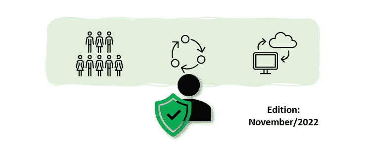
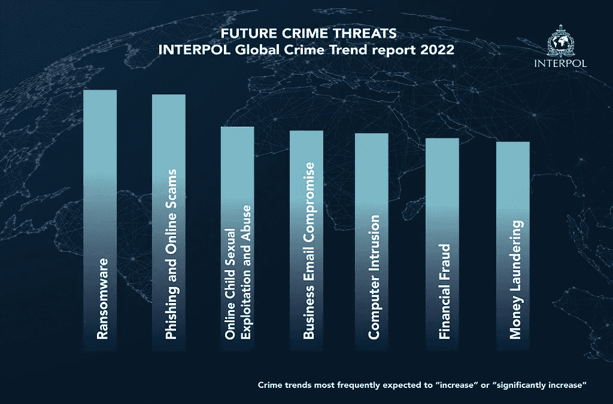

# 战略网络安全报告—2022 年 11 月版

> 原文：<https://medium.com/geekculture/strategic-cyber-security-report-november-2022-edition-90ac5b505058?source=collection_archive---------8----------------------->

网络安全领导者战略信息月度摘要

这是我在与 CISOs 交谈时发现的一个需求衍生出来的系列— [如开篇文章](https://andrecamillo.medium.com/strategic-cyber-security-report-for-leaders-1556a2bb44ac)中所述，该系列遵循以下格式:

> CISOs 在 3 个领域最关注的是什么:人员、流程和技术。

# 人

## 基本八项和以人为本的方法

[这是一篇有趣的文章，讲述了澳大利亚的八大基本框架如何需要以人为本的方法来补充](https://securitybrief.com.au/story/building-on-the-essential-eight-with-a-people-centric-approach-to-cybersecurity)。

正如文章所解释的，基本八项是澳大利亚实体的关键框架:

> Essential Eight 是由澳大利亚信号局(ASD)开发的澳大利亚网络安全框架。考虑到快速数字化导致攻击面扩大，澳大利亚政府旨在显著提高澳大利亚组织的网络弹性。政府要求联邦政府实体使用该框架。政府还希望私营部门能够广泛采用这一技术。

为什么框架需要补充？

从本质上来说，它侧重于预防和清单，正如本文作者所强调的:

> “想要一个简单的网络安全核对表方法并拥有实施建议控制的技能的组织，可以使用‘基本八要素’来确定其网络安全态势中的主要差距，并根据其风险承受能力做出改变。但仅仅遵循一份清单并不一定是建立一个受到良好保护的组织的关键。”

使用诸如 NIST 和/或米特 ATT&CK 等假定违规的框架有助于将重点放在更相关的、特定于环境的、迫在眉睫的风险上。

## 剩余的医疗银行数据被黑客泄露

澳大利亚医疗银行数据泄露事件已经有了最终结果(至少从数据隐私的角度来看)。

医疗银行拒绝为这些数据支付赎金，因此黑客们已经将所有剩余的数据都放在了他们自己的博客中。这最后一段数据是 5GB 大的 zip 文件。

[来自 ia.acs.org.au 的报道](https://ia.acs.org.au/content/ia/article/2022/-case-closed---medibank-hackers-dump-remaining-data.html?ref=newsletter&deliveryName=DM16312)，提到:

> 在周四上午的一份声明中，Medibank 表示，它仍在筛选文件，但“似乎”是被盗数据。
> 
> “虽然我们的调查仍在继续，但目前没有迹象表明金融或银行数据被窃取，”这家健康保险公司表示。
> 
> “个人数据本身不足以进行身份和金融欺诈。到目前为止，我们今天分析的原始数据是不完整的，难以理解。”

# 过程

## 微软数字防御报告 2022

微软安全团队在 11 月发布了年度数字防御报告，2022 年版，也被称为“MDDR”。

这些发现来自安全事件响应项目、跨其安全平台网格的信号、内部研究团队等。

今年的版本包括许多与民族国家行为者有关的发现，这些行为者在乌克兰战争中有很多活动。对公共服务的效果和影响已经感受到。

我发现的一些令人印象深刻的数字是:

*   实施现代安全方法可以防止多少安全事故。
*   5 个关键活动的影响，以实现 98%的攻击防护

我不打算在这里总结这些问题的答案，请随意访问该报告(下面的链接),或者我应该在未来几周内写一些关于它的东西。

报告[可在此](https://www.microsoft.com/en-us/security/business/microsoft-digital-defense-report-2022)公开访问。

## 2022 年国际刑警组织全球犯罪趋势总结报告

国际刑警组织[发布了第一版全球犯罪趋势报告](https://www.interpol.int/News-and-Events/News/2022/Financial-and-cybercrimes-top-global-police-concerns-says-new-INTERPOL-report)。

为什么报告是相关的？根据国际刑警组织秘书长的说法:

> *“了解和先发制人的犯罪趋势是警务工作的绝对基础，国际刑警组织的全球犯罪趋势报告为世界各地的警察提供了一幅无与伦比的全球犯罪图景。”* **尤尔根股票，国际刑警组织秘书长**

谁回复了？

> 它仅限于执法，汇集了从国际刑警组织 195 个成员国收到的数据，以及来自该组织的数据和其他来源的信息和详细分析。

调查结果包括:

*   超过 60%的受访者将洗钱、勒索软件、网络钓鱼和在线诈骗等犯罪列为高或非常高的威胁。
*   超过 70%的受访者预计，未来三到五年，勒索软件和网络钓鱼攻击等犯罪将会增加或显著增加。
*   虽然贩毒一直是犯罪威胁列表中的主要内容，但近年来，基于网络的金融犯罪急剧增加，尤其是在全球新冠肺炎疫情地区。在封锁期间和之后，数字化速度加快，专业和个人活动几乎完全在家里和网上进行。
*   未来的犯罪威胁:

source: [Financial and cybercrimes top global police concerns, says new INTERPOL report](https://www.interpol.int/News-and-Events/News/2022/Financial-and-cybercrimes-top-global-police-concerns-says-new-INTERPOL-report)

## NIST 安全供水和废水设施建筑项目

12 月初，国家网络安全卓越中心(NCCoE)将介绍拟议中的项目“确保水和废水设施的安全:水和废水系统的网络安全”。

官方[活动页面](https://www.nccoe.nist.gov/get-involved/attend-events/cybersecurity-water-and-wastewater-systems-sector)中的所有详情。

> “NCCoE 正处于一个项目的初始阶段，该项目将产生一个专门为供水和废水系统部门设计的参考架构。项目小组目前正在寻求公众对项目描述草案的意见，可在此处获得:[https://www . nccoe . NIST . gov/sites/default/files/2022-11/securing-water-and-waste-utilities-project-description-draft . pdf](https://www.nccoe.nist.gov/sites/default/files/2022-11/securing-water-and-wastewater-utilities-project-description-draft.pdf)。我们正在寻求供水和废水处理公用事业部门所有利益相关方的反馈。”

# 技术

## 使用内存安全的语言

根据美国国家安全局的说法，这里有一些值得注意的事情:

> “微软和谷歌都表示，大约 70%的漏洞都是软件内存安全问题造成的。糟糕的内存管理还会导致技术问题，例如不正确的程序结果、程序性能随着时间的推移而下降以及程序崩溃。”

因此，NSA 发布了使用内存安全语言的指南——内存安全语言的例子包括 C#、Go、Java、Ruby、Rust 和 Swift。

这里有官方的完整指导: [NSA 发布关于如何防范软件内存安全问题的指导>国家安全局/中央安全局>文章](https://www.nsa.gov/Press-Room/News-Highlights/Article/Article/3215760/nsa-releases-guidance-on-how-to-protect-against-software-memory-safety-issues/)

了解更多关于我的云和安全项目:[https://linktr.ee/acamillo](https://linktr.ee/acamillo)

[考虑订阅 Medium (here)](https://andrecamillo.medium.com/membership) 获取更多内容，让你更有力量！

感谢您的阅读，并留下您的想法/评论！

# 。/参考

分散在整个文档中