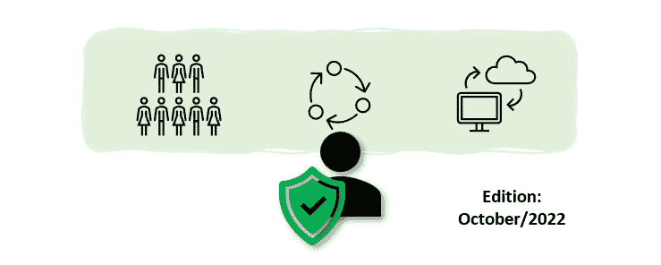

# 面向领导者的战略网络安全报告—2022 年 10 月版

> 原文：<https://medium.com/geekculture/strategic-cyber-security-report-october-2022-edition-454db1d977da?source=collection_archive---------13----------------------->

网络安全领导者战略信息月度摘要

这是我在与 CISOs 交谈时发现的一个需求衍生出来的系列— [如开篇文章](https://andrecamillo.medium.com/strategic-cyber-security-report-for-leaders-1556a2bb44ac)中所述，该系列遵循以下格式:

> CISOs 在 3 个领域最关注的是什么:人员、流程和技术。

# 人

## 数据泄露

虽然与人没有直接关系，但数据泄露会以多种方式影响人—从 PII 暴露到精神健康，10 月份是一个充满这方面新闻的月份，因此，我们来回顾一下数据泄露影响的一些支持数据。

*   ***1。澳币违约多有牵连***

Optus 的 1000 万用户隐私泄露影响可能高达 500 万。但是责任尚未确定[据 afr.com](https://www.afr.com/technology/investors-target-optus-chief-executive-20221028-p5btvj)报道:

> “Optus 对任何潜在失误的责任尚未确定，股东在支持拜耳罗斯玛林担任董事之前，可能有理由期待了解调查结果。”

Medibank 紧随其后，逾 400 万用户的数据遭到入侵。[MSN.com 报道](https://www.msn.com/en-au/money/markets/customers-in-limbo-as-medibank-data-breach-shapes-up-as-far-worse-than-the-optus-hack/ar-AA13nqAY):

> 这家私人健康提供商透露，对其客户数据的网络攻击比最初想象的要广泛得多，可能会影响大约 400 万现有客户以及数量不明的以前客户。
> 
> 该公司表示，数据泄露影响了其主要品牌，预算保险公司子品牌 ahm，以及收集的关于在澳大利亚学习的国际学生使用其职业安全和健康服务下的医疗银行的数据。

本月下旬，澳大利亚国防部队也被攻破[据报道](https://www.news.com.au/technology/online/hacking/australian-defence-force-confirm-data-breach-hack/news-story/c4c0d955be1f8018e0a19ce9233ad2b4):

> 黑客攻击了军方人员和国防部公务员使用的外部 IT 提供商。
> 
> 国防部长 Richard Marles 的一名女发言人向 NCA 通讯社证实，ForceNet 服务出现了漏洞。
> 
> 她说没有个人数据被泄露。

影响包括 10 月 22 日宣布增加对澳大利亚数据泄露的处罚—[IAPP 报道](https://iapp.org/news/a/australia-introduces-bill-to-increase-data-breach-penalties/):

> 澳大利亚司法部长马克·德雷福斯向澳大利亚议会提交了一项法案，旨在“大幅增加对反复或严重侵犯隐私行为的处罚。”《2022 年隐私立法修正案》提议增加 1988 年《隐私法》下的现行罚款计划，最高罚款为 222 万澳元。根据拟议的三因素计划，违反者将面临 5000 万澳元的罚款或基于数据货币化的罚款，以及调整后季度营业额的 30%。Dreyfus 说:“对重大数据泄露的罚款被视为做生意的成本是不够的，”他指出，该法案是对最近涉及 Optus 和 MyDeal 的数据泄露的回应。

*   **2*。这可能也值得知道*** [微软数据泄露暴露了 65，000 个组织的客户数据，雷德蒙猛烈抨击安全公司——CPO 杂志](https://www.cpomagazine.com/cyber-security/microsoft-data-breach-exposed-customer-data-of-65000-organizations-redmond-lashes-out-at-security-firm/)
*   ***3。AirNZ 面临网络入侵*** [***报道内容 NZ***](https://www.stuff.co.nz/business/130310228/air-nz-faces-cyber-breach-multiple-accounts-compromised)***:***

> 新西兰航空公司对网络入侵采取行动后，多名客户被锁定帐户。
> 
> 这次入侵是“凭据填充”的一个实例，骗子使用从另一个在线来源窃取的电子邮件和密码信息侵入新西兰航空公司的 Airpoints 帐户。
> 
> 新西兰航空首席数字官 Nikhil Ravishankar 表示，这一事件不是黑客攻击或破坏公司安全系统，而是个人账户。

*   ***4。考虑到这一点，一份报告发现，2022 年第三季度***[数据泄露激增 70%](https://www.spiceworks.com/it-security/data-security/news/data-breach-report/) ，根据这份报告:

> “与 Q2 相比，2022 年第三季度的违规事件增加了 70%，尽管这一数字低于去年，但仍在增加，”Surfshark 指出。
> 
> 在 2022 年第三季度，俄罗斯人继续成为最受攻击的人(2228 万)，今年在 Q1 击败了美国(几年来一直是受攻击最多的国家)，这与乌克兰冲突相对应。然而，他们在数据泄露列表中的比例继续下降(Q2 2022 年为 2459 万，Q1 2022 年为 4299 万)。

## 微软网络安全计划

[微软宣布在印度扩展网络安全技能计划 Cybershikshaa](https://news.microsoft.com/en-in/microsoft-expands-cybershikshaa-to-accelerate-cybersecurity-skilling-opportunities/):

> 微软和 DSCI 于 2018 年推出的 CyberShikshaa 旨在建立一个强大的多元化网络安全人才库，已通过多个培训批次成功培训了 1，100 名女性，雇用了 800 多名女性。5000 多名得不到充分服务的青年也接受了网络安全初学者模块的培训。CyberShikshaa for Educators with ICT Academy 是 2022 年 6 月推出的 CyberShikshaa 组合的最新成员，为 400 名教职员工提供网络安全培训，将有助于为 100 所农村技术机构的 6，000 名服务不足的学生建立网络安全职业生涯，并为 1，500 多名学生提供就业机会。

# 过程

## 美国新的医疗网络安全标准和指南

拜登政府负责网络和新兴技术的副国家安全顾问安妮·纽伯格(Anne Neuberger)表示，白宫的目标是很快发布新的医疗网络安全标准和指南。来自 healthitsecurity.com[的报道:](https://healthitsecurity.com/news/white-house-sets-sights-on-new-healthcare-cybersecurity-standards)

> 具体而言，Neuberger 指出，医疗保健、水和通信部门是白宫接下来的三个网络安全重点领域，进一步加强了政府对关键基础设施安全的重视。

# 技术

## 微软 Ignite

这个月，微软 Ignite 在几乎所有企业服务领域发布了许多产品。所有公告的完整列表可在 [Ignite 新闻手册中找到。](https://news.microsoft.com/ignite-2022-book-of-news/)

个人认为，这些都是值得了解的(详情尽在《新闻之书》):

*   ***安全***

Microsoft Defender Cloud:Microsoft Defender for devo PS(预览版)

微软防御云:安全态势管理(CSPM)(预览版)

M365 防御者:自动攻击中断(预览版)

Microsoft Defender for Endpoint:P1/P2 限时特卖–五折

*   ***合规***

微软权限 Adobe 文档云信息保护

新的数据丢失防护功能(预览版)

电子发现(高级版)将支持发现文档版本的能力

电子发现(高级版)现在包括捕捉反应

*   ***身份***

Microsoft Entra 身份治理(预览版)

生命周期工作流(身份治理的一部分，预览)

有条件访问身份验证优势

## 即将到来的 OpenSSL 错误

10 月下旬发布的一份公告称，OpenSSL 3.0 的一个新缺陷将在 11 月 1 日其新版本(OpenSSL 3.0.7)发布后暴露出来。[根据暗读](https://www.darkreading.com/vulnerabilities-threats/prepare-critical-flaw-openssl-security-experts-warn):

> 11 月 1 日星期二，该项目将发布 OpenSSL 的新版本(版本 3.0.7 ),该版本将修补该技术当前版本中一个尚未披露的缺陷。漏洞的特征及其被利用的难易程度将决定组织解决问题的速度。

人们担心这种病毒会成为 2014 年的又一次“心脏出血”。以及受当时易受攻击的 OpenSSL 版本的部署影响的基础设施。

> 如果新的漏洞被证明是另一个 heart bleed bug——影响 OpenSSL 的最后一个关键漏洞——组织和整个行业都将面临尽快解决这个问题的压力。

注意——还没有给它分配 CVE。

了解更多关于我的云和安全项目:[https://linktr.ee/acamillo](https://linktr.ee/acamillo)

[考虑订阅 Medium (here)](https://andrecamillo.medium.com/membership) 获取更多内容，让你更有力量！

感谢您的阅读，并留下您的想法/评论！

# 。/参考

分散在整个文档中