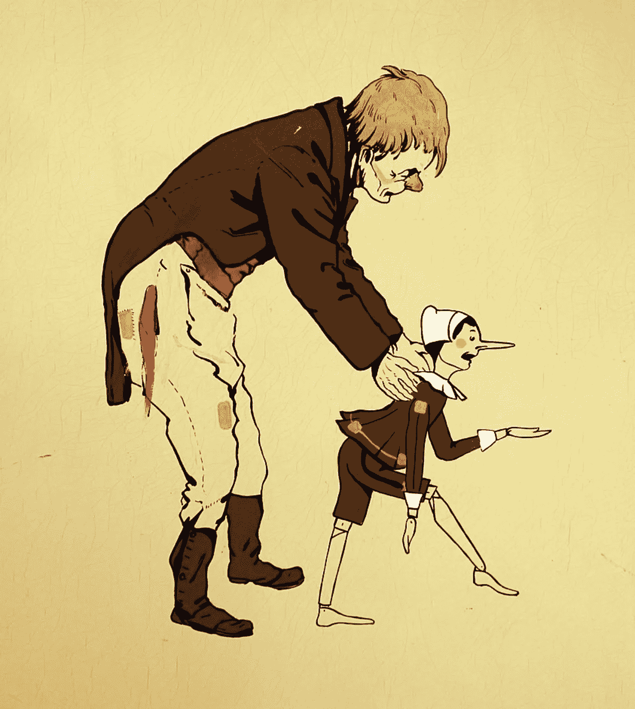

# 战略误导:行为经济学的盲点

> 原文：<https://medium.com/geekculture/strategic-misrepresentation-the-blind-spot-in-behavioral-economics-8896b078d2c4?source=collection_archive---------4----------------------->

## 行为经济学家批评传统经济学对实际的人类行为视而不见。但是行为经济学有其自身的盲目性——政治偏见。

Pinocchio (source: [Wikimedia Commons](https://commons.wikimedia.org/wiki/File:Industria_veneziana_di_mobili_laccati,_cameretta_pinocchio,_1928_circa,_armadio_03_geppetto.jpg)).

> 战略性误导是一种倾向…