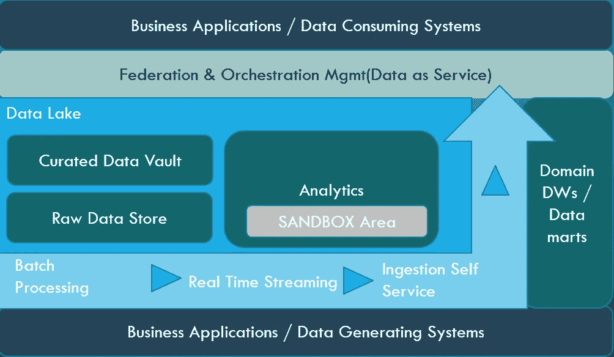

# 实现数据驱动架构的战略途径

> 原文：<https://medium.com/geekculture/strategic-path-to-data-driven-architecture-253dd79d9c83?source=collection_archive---------20----------------------->

许多公司现在专注于数据驱动的架构，但往往将这一点交给受资助的团队，他们总是专注于在固定的时间内向他们的产品或业务所有者交付价值。

问题是这是否是实现目标的正确策略？

从我的角度来看，答案是肯定的。然而，团队经常将他们的精力集中在及时交付定义不明确的 MVP 上，而没有集中在构建正确的基础上。这是恶性循环的开始，公司需要避免这种情况。

数据架构看起来像下面的三明治，中间夹着多汁的肉饼、泡菜、奶酪和调味汁(打个比方)

通常，数据生成和消费系统可以是相同的，也可以是不同的，但它们往往会在与客户、产品、服务能力或与其他业务的合作方面推动公司的整体业务。

Data Driven Architecture

我想提一下任何组织都可以采取的几个基本步骤，作为走向以数据为中心的企业的方向，并为数据驱动的架构构建正确的基础

1.  **建立你的团队** :-你必须有一个合适的团队，由所需的知识、专业技能和对目标的热情组成。这包括商业头脑、领域专家、数据技术专家和最重要的“智能”交付或技术专家，他们可以有效地管理业务和交付团队。这个团队是你准备三明治的“厨师”。不要认为内部厨师总是知道新的食谱，同时外部厨师可能不知道你的厨房和顾客。找到平衡！
2.  **为所有类型的数据管道构建框架:**根据传统技术，大多数公司已经建立了基本的数据管道，以便在其数据平台中将数据从“A”点移动到“B”点。但是工业中的用例每天都在变化。建立所有类型的数据管道、摄取框架和基础模式，无论是实时流、建立自助摄取机制、社交媒体分析还是处理任何此类复杂的数据模式。准备好！不要指望企业会投资技术。

启用所有概念和模式，如消息传递、实时流、警报和通知平台(如果您现在没有预见到此类需求，那么我必须说业务战略需要重新审视，但我确信业务很快会出现用例只是时间问题)，列举这些领域的几项现有技术:- Kafka 流、Spark 流、Flume、Graphite、Splunk 等。

寻找聪明的方法来管理小规模的技术计划，最终形成大规模的商业项目。这类似于餐馆在推出菜单上的新菜品之前，向顾客免费试用新食谱或提供新的免费菜肴。

在这个行业中，投资新技术的成本比以往任何时候都低。这是因为市场正在转向开源，新工具和平台中的免费开发者许可模式，云转型进一步提供了帮助。

3.**接受 OLAP & OLTP** 之间越来越细的界限:由于数据来源种类极其繁多，并且需要敏捷性，公司不能再仅仅依靠 OLAP(传统的数据仓库)进行所有分析，因为在数据仓库中对所有类型的来源和主题进行建模在时间和金钱方面都非常昂贵。其次，许多用例本质上是临时的，可能不需要您构建完整的 OLAP 域。因此，寻找混合解决方案来联合您的生态系统中现有的 OLAP 和 OLTP 系统之间的数据。这里可以探索和应用数据虚拟化/数据联合技术，而且成本和上市时间都非常低。开始为您的应用构建 DaaS 模型“数据即服务”,这是准备您的主数据并将其作为 Rest APIs 公开以便与微服务架构轻松集成的最佳方式之一。

4.**迁移到云:-** 开始您的云之旅如果尚未开始，我知道这需要一些投资&战略变革，但这将有助于长期发展。走向无服务器和容器化的解决方案将有助于公司建立灵活和低成本的解决方案模型，而无需在基础设施上投入太多。在存储、计算和处理方面，云以低成本为您带来了许多颠覆性的数据技术，您可以快速适应和部署这些技术。所有三个主要的云玩家，亚马逊、微软和谷歌在这些领域都有惊人的服务堆栈。

这种方式还降低了在本地托管大数据和其他数据平台所产生的总体运营和管理成本。

5.**与企业合作创建“数据驱动”文化:-** 这是最重要的一步，但却常常被忽视。当您与业务团队合作时，他们不了解技术&架构的能力、用途和价值，而 IT 团队不了解真正的业务目标。在 IT 和业务团队之间建立合作模式，以确保“数据”以正确的方式提供和使用&。不要问企业他们想要什么，要问他们的业务和财务目标。准备并调整联合 ROI 模型，该模型有助于为数据驱动项目的所有团队创建定义共同成功的衡量标准。

随着数据分析在当今组织的工作方式中得到广泛应用，很明显，数据驱动的架构对于创建和发展以数据为中心的企业是必不可少的。技术领导者需要迎接这一新的挑战，重新审视他们的角色、运作方法，并敏捷地适应这一竞争环境。