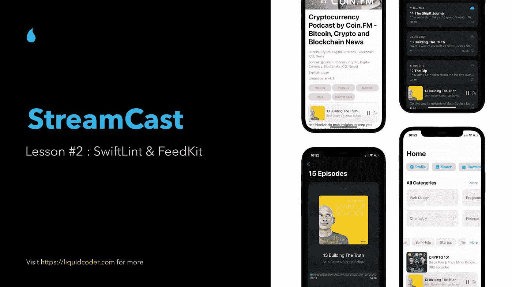

# stream cast—Swift UI 中的真实世界播客应用程序

> 原文：<https://medium.com/geekculture/streamcast-a-real-world-podcast-app-in-swift-ui-27d4e21aa464?source=collection_archive---------1----------------------->

## 第 2 课— SwiftLint & FeedKit

嘿，伙计们，欢迎回到第二课。在[上一课](/codestory/streamcast-a-real-world-podcast-app-in-swift-ui-781d1008344?sk=9164a1c82e19e2f5540ff8502efec98d)中，我们设置了项目。我们还根据运行环境的类型添加了应用图标。在这一部分中，我们将添加 swiftLint 来帮助我们编写更好的代码，以及定义模型和视图模型，并谈一谈我们将成为什么样的服务…