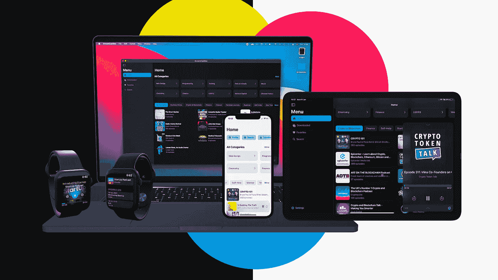

# stream cast—Swift UI 中的真实世界播客应用程序

> 原文：<https://medium.com/geekculture/streamcast-a-real-world-podcast-app-in-swift-ui-781d1008344?source=collection_archive---------1----------------------->

## 第 1 课:xcode 中带有应用程序图标的项目环境设置

> 嘿，读者，这是我的高级课程中的一课，在这个课程中，我们通过视频和书面课程从头开始构建你在上面的图片或下面的视频中看到的应用程序。我们会的。为 iOS、iPadOS、macOS 和 watchOS 构建应用程序。如果你有兴趣，就来加入吧…