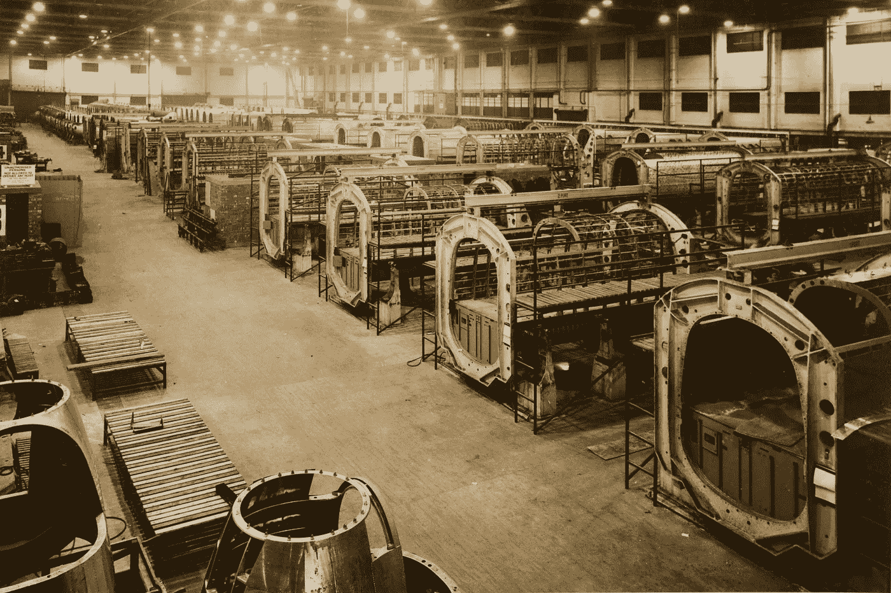

# 使用 Flask 和 Kafka 的流模型推理

> 原文：<https://medium.com/geekculture/streaming-model-inference-using-flask-and-kafka-3476d9ff5ca5?source=collection_archive---------3----------------------->

## 卡夫卡用烧瓶使之变得简单

Photo by [Birmingham Museums Trust](https://unsplash.com/@birminghammuseumstrust?utm_source=unsplash&utm_medium=referral&utm_content=creditCopyText) on [Unsplash](https://unsplash.com/s/photos/chocolate-factory?utm_source=unsplash&utm_medium=referral&utm_content=creditCopyText)

# 卡夫卡是什么？

Apache Kafka 是一个高度容错的事件流平台。在流媒体中，数据是实时捕获的，甚至来自不同的来源，可以是你的网络分析数据，来自恒温器的数据，甚至是数据库。除了数据采集，还有大量的资源…