# 使用 Apache NiFi 将 Twitter Feed 流式传输到 Elasticsearch 和 MySQL

> 原文：<https://medium.com/geekculture/streaming-twitter-feed-into-elasticsearch-and-mysql-using-apache-nifi-6fb0b17583d5?source=collection_archive---------4----------------------->


Photo by [Kurt Bohi](https://www.flickr.com/photos/145790030@N05/) on [Flickr](https://www.flickr.com/)

在这篇博文中，我将解释如何通过使用 Apache NiFi，轻松提取 Twitter feed，将其实时传输到 Elasticsearch，分析并可视化 Kibana 中的数据，并近乎实时地将 feed 插入 MySQL 数据库。

**什么是阿帕奇尼菲？**

Apache NiFi 是一个简单、强大、可靠的数据接收平台，可以在各种系统、数据库和云存储提供商之间处理和分发数据。Apache NiFi 支持多种数据格式，比如日志、地理位置数据、社交提要等等。Apache 可以处理任何可以通过 HTTPS 访问的东西。Apache NiFi 还支持几种不同的协议，包括 HTTP/S、SFTP、HDFS，以及几种不同的消息传递系统，如 Apache Kafka 或 ActiveMQ，以及大多数主要的数据库。

**如何设置 Twitter API 开发者账号并获取凭证？**

只需用你的 twitter 账户登录并提供必要的详细信息。此外，他们还会询问您关于如何以及为什么对使用他们的 API 感兴趣的信息。一旦你提交了这些细节，Twitter 会审核并给你一个开发者账户。

我按照这里提到的[的步骤](https://developer.twitter.com/en/docs/developer-portal/overview)。一般来说，他们需要几天的时间来审核并回复您，所以请耐心等待。

**先决条件**

1.  确保在您的机器上设置了 JAVA
2.  点击从[下载 Elasticsearch 二进制文件。对于本教程，不需要修改二进制文件中的任何现有配置。](https://www.elastic.co/downloads/elasticsearch)
3.  下载 [Kibana](https://www.elastic.co/downloads/kibana) 以可视化您的 ES(弹性搜索)索引中的数据
4.  在本地设置 MySQL 数据库。

**数据流图**

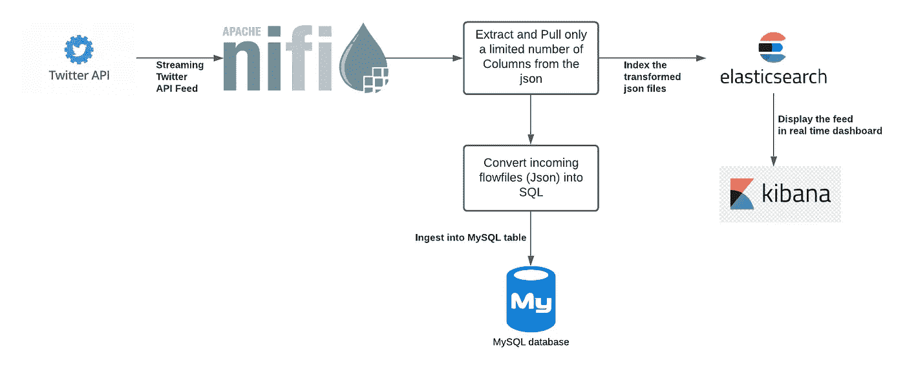

**旋转弹力搜索的步骤:**

进入您下载的发行版的 bin 文件夹(路径如下所示:elasticsearch-7.15.2/bin)并执行以下命令:

。/elasticsearch

**旋转基巴纳的步骤:**

进入下载的发行版的 bin 文件夹(路径如下所示:kibana-7.15.2-linux-x86_64/bin)并执行以下命令:

。/基巴纳

**启动 NIFI 的步骤:**

进入下载的发行版的 bin 文件夹(路径如下所示:nifi-1.15.0/bin)并执行以下命令:

。/nifi.sh 运行

理想情况下，这会启动 NiFi 服务器，这通常会在您的初始启动过程中花费一些时间。如果没有正确设置 JAVA 或者内存太低，它可能会抛出错误。您可以从 nifi-1.15.0/logs/nifi-app.log 中检查堆栈跟踪或详细的异常

一旦您能够顺利启动服务器，您就可以在浏览器中导航到这个 web URL:localhost:8443/nifi/log in

您应该能够看到类似如下的窗口:

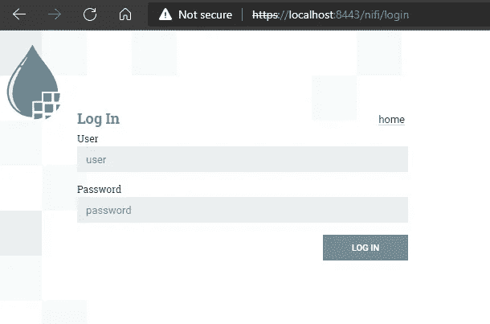

NiFi 将自动为您生成凭证，您可以从 logs/nifi-app.log 中获取凭证。如果您需要与凭证相关的更多信息，您可以参考[这个](https://nifi.apache.org/docs/nifi-docs/html/getting-started.html#i-started-nifi-now-what)。

> 日志文件将包含带有`Generated Username [USERNAME]`和`Generated Password [PASSWORD]`的行，指示访问所需的凭证

如果您不想使用生成的凭据，您仍然可以通过运行以下命令来创建自己的凭据:

```
/bin/nifi.sh set-single-user-credentials <username> <password>
```

但是一旦您创建了它们，请确保重新启动 NiFi 服务器，如果您已经启动并运行了它。成功登录后，您应该能够看到如下所示的空白模板。

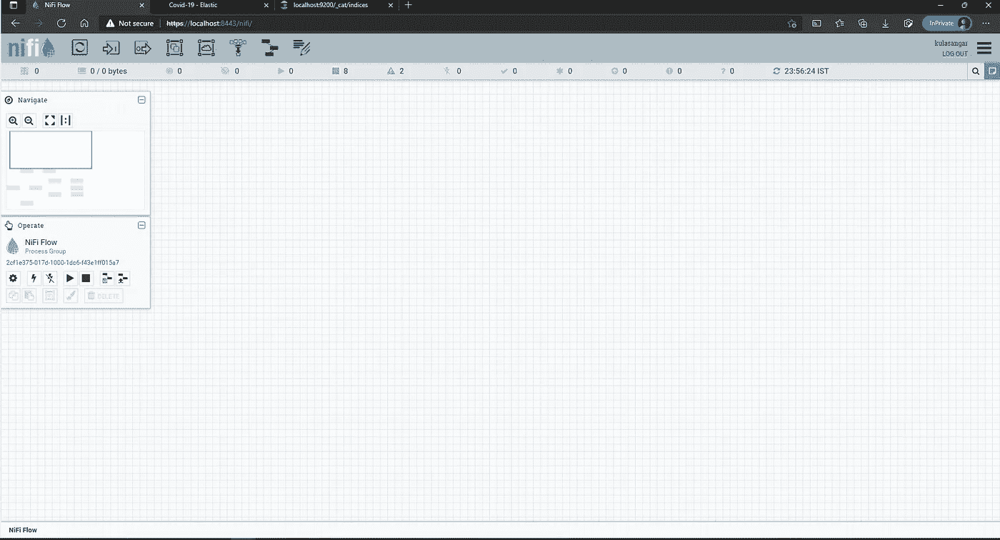

在继续学习本教程之前，必须理解 NiFi 的一些核心概念，比如什么是流文件？什么是处理器？有哪些可用的处理器？什么是过程组？等等

我不打算在这里解释这些概念，因为这不是这篇博客的动机，但请确保浏览他们的[文档](https://nifi.apache.org/docs/nifi-docs/html/overview.html)，其中有一个很好的解释，因为如果你对这些概念没有基本的理解，跟随教程的其余部分会有点困难。

继续前进…

我将使用的处理器列表:

*   GetTwitter:提取 Twitter API 提要
*   JoltTransformJson:能够从原始 Json 的 100 多个属性中只提取必要的字段
*   QueryRecord:设置 Json 读取器和写入器，将必要的键值对写入流文件
*   SplitJson:将一个 Json 文件分割成多个流文件
*   PutElasticsearchHttp:提供关于 ES 索引的详细信息
*   PutSQL:使用生成的 SQL 语句插入到表中
*   ConveryJSONToSQL:将流文件中的 JSON 转换成 SQL

如果您想查看上述处理器的详细说明，请访问此 [url](https://nifi.apache.org/docs/nifi-docs/components/nifi-docs/components/org.apache.nifi/nifi-standard-nar/1.9.0/) 并搜索您需要的处理器。

我已经为两个流设计了 NiFi 模板，如流程图所示。我将提供我的 NiFi 模板的链接，这样你就可以根据你的需要简单地重用它。

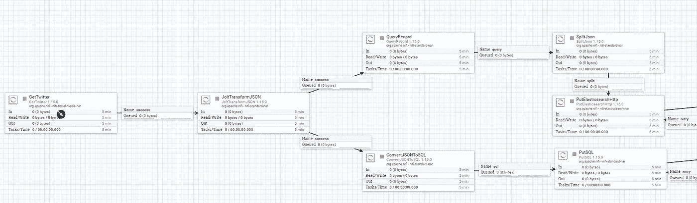

解释:

1.  使用 GetTwitter 处理器，通过提供您现在已经收到的 Twitter 开发人员证书来获取 Twitter API 提要。另外，如果你注意到，我使用与 Covid 相关的关键字作为过滤器，这样我只引入与 Covid 相关的数据(这只是这篇博文的一个例子，你可以使用任何你想要的关键字)

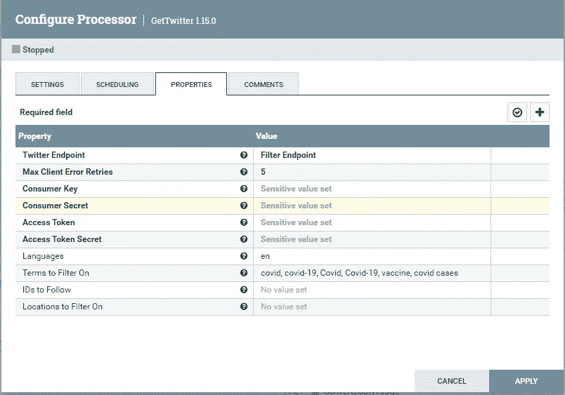

2.JoltTransformJson 用于添加 JoltSpecification，它将只引入我们需要的属性，而不是引入所有的列。正如您在下图中看到的，我只从我们得到的原始提要中提取了某些字段。

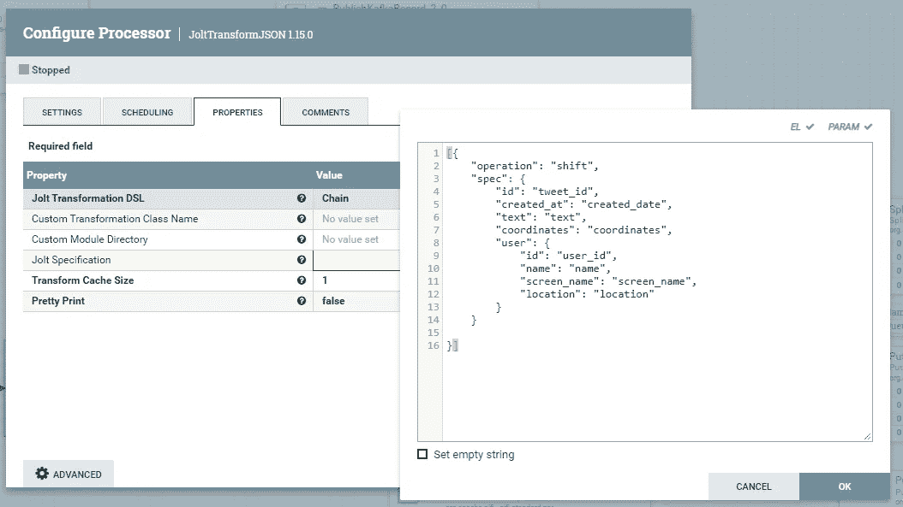

3.然后，我们利用 QueryRecord 处理器添加 JsonReader 和 Writer，这对于将更新的 json 添加到流文件中是至关重要的。。

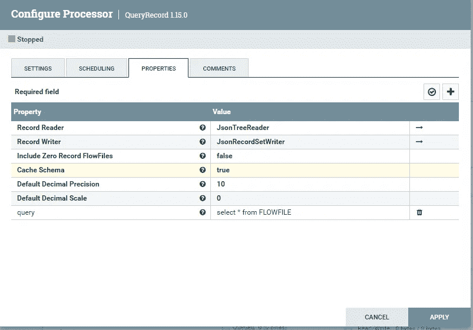

4.SplitJson 是将一个 Json 文件拆分成多个流文件

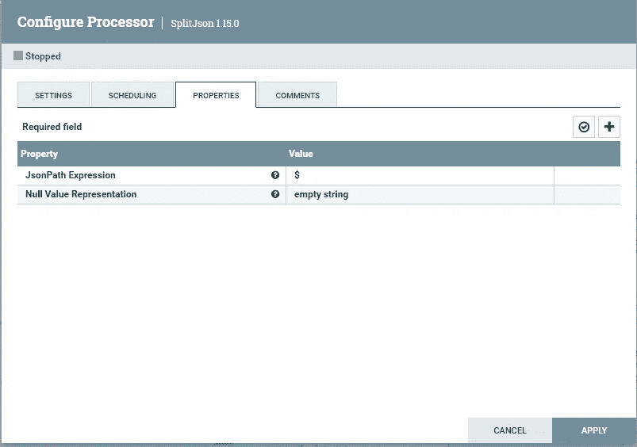

5.PutElasticsearchHttp 处理器用于将流文件中的数据推送到特定的 Elasticsearch 索引中

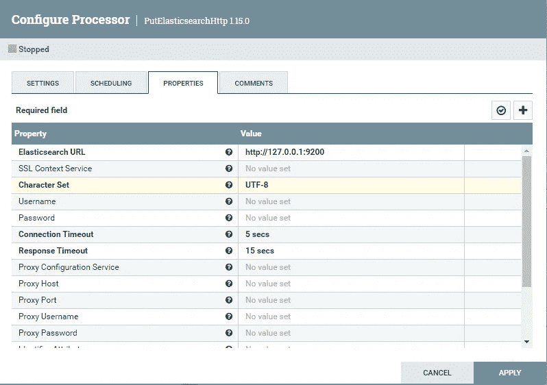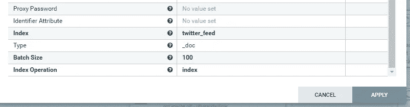

正如您在上面两张图片中看到的，我已经指定了 Elasticsearch 主机 URL，这是我的本地主机和默认端口 9200。此外，我还创建了一个名为 twitter_feed 的 elasticsearch 索引，上面我已经给出了它的索引名。

要创建 ES 索引，您需要向以下 URL 发送 PUT 请求:

[http://localhost:9200/<index _ name>](http://localhost:9200/twitter_feed_raw)

创建索引后，请务必列出索引并参见。这可以通过使用以下 URL 发出 GET 请求来实现:

http://[localhost:9200/_ cat/indexes](http://localhost:9200/_cat/indices)

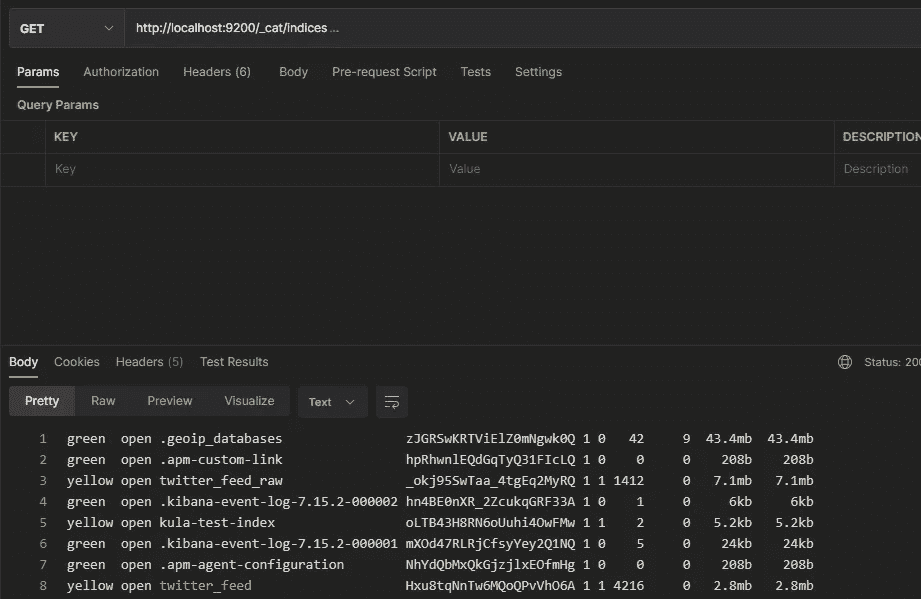

6.ConvertJSONToSQL 处理器用于将流文件中的 JSON 转换成 SQL 语句。这里我们需要指定应该是哪种类型的语句(插入/更新/删除)以及模式/表名。

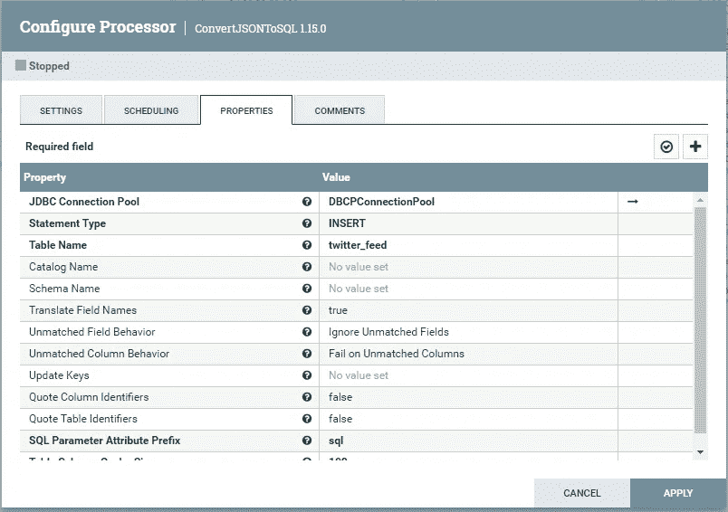

我已经在本地创建了一个名为 twitter_feed 的 MySQL 表以及我们需要的列。

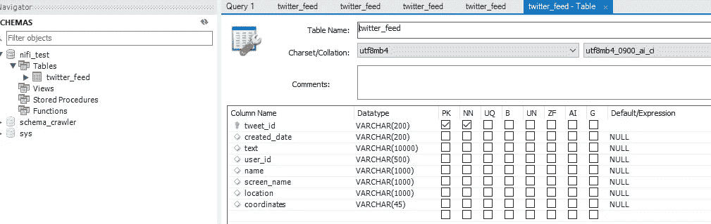

7.最后，使用 PutSQL 处理器最终将记录插入到表中。

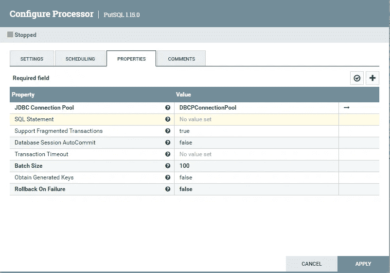

应该使用数据库连接详细信息来定义 JDBC 连接池。

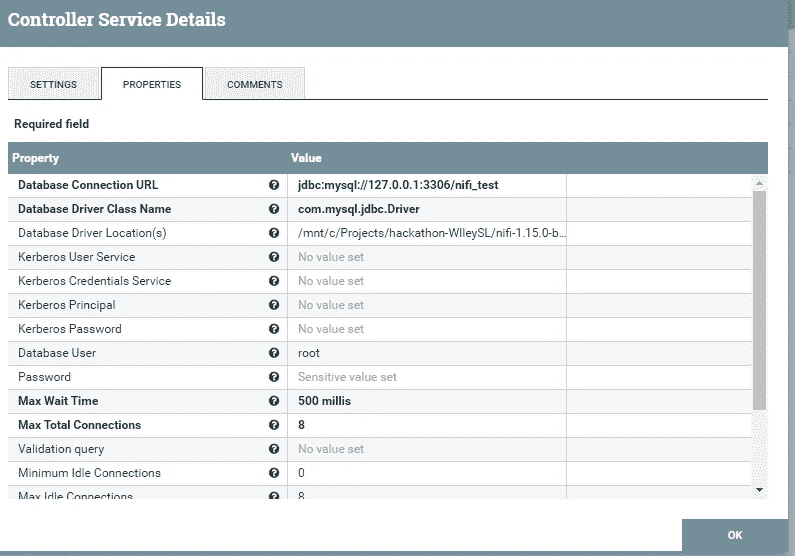

设置好所有处理器后，您只需右键单击模板上的任意位置，然后单击 Start。这将运行所有相互连接的处理器。

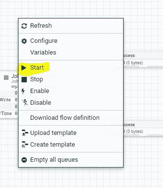

几秒钟后，你应该会看到推文实时流入你的弹性搜索指数。您可以通过进入 Kibana 仪表板( [localhost:5601](http://localhost:5601/app/discover) )并选择 discover 选项来轻松查看数据。可以通过展开随机记录来验证数据，并查看 JSON 是否能够看到您期望的属性。

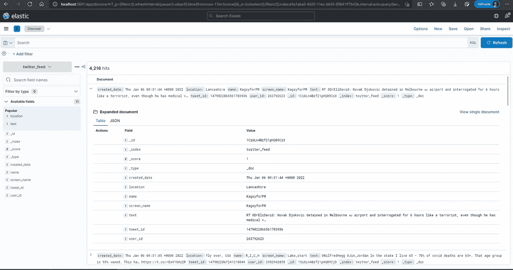

您还应该看到数据流入 MySQL 表:

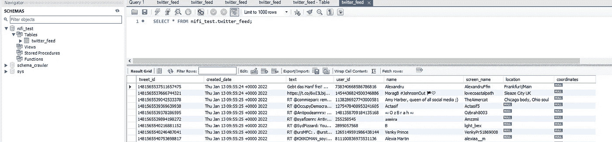

你可以从[这里](https://gist.github.com/Kulasangar/e604ded2f950ffe2d31f6846d559d0cb)下载 NiFi 流文件。确保在二进制文件位置 nifi-1.15.0\conf 下替换它之前对其进行 gzip 压缩。gzip 文件名将是 flow.xml.gz

这个用例还可以扩展到将数据推送到多个目标，比如 Kafka 主题或 S3 桶，最好的部分是 NiFi 已经有现成的处理器。

**参考文献:**

1.  [Apache NiFi 入门](https://nifi.apache.org/docs/nifi-docs/html/getting-started.html)
2.  [用 NiFi 和 Elasticsarch 摄取 Tweet—vichargrave . github . io](https://vichargrave.github.io/programming/tweet-ingestion-with-nifi-and-elasticsearch/)
3.  [Apache Nifi 速成班——YouTube](https://www.youtube.com/watch?v=fblkgr1PJ0o)
4.  [NiFi(cloudera.com)的核心概念](https://docs.cloudera.com/HDPDocuments/HDF3/HDF-3.2.0/apache-nifi-overview/content/the-core-concepts-of-nifi.html)