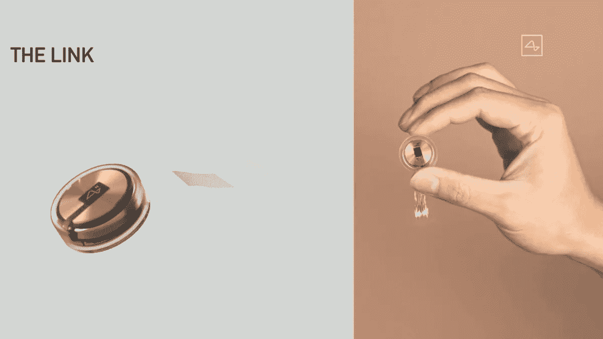

# 几秒钟内将整部电影输入你的大脑

> 原文：<https://medium.com/geekculture/streaming-whole-movies-into-your-brain-in-a-matter-of-seconds-6ad442fa7429?source=collection_archive---------15----------------------->

## 这就是 Neuralink 计划在不久的将来要做的事情。

Image from [Nerdist](https://nerdist.com/article/elon-musk-neuralink-implant-demonstration-brain-computer-communication/)

我不知道你最近是否看了什么电影或者读了什么书，但是这些占据了我**小时**的时间。现在想象一下，能够以快 100 倍的速度体验电影或书籍，并且让所有内容直接流入你的大脑。