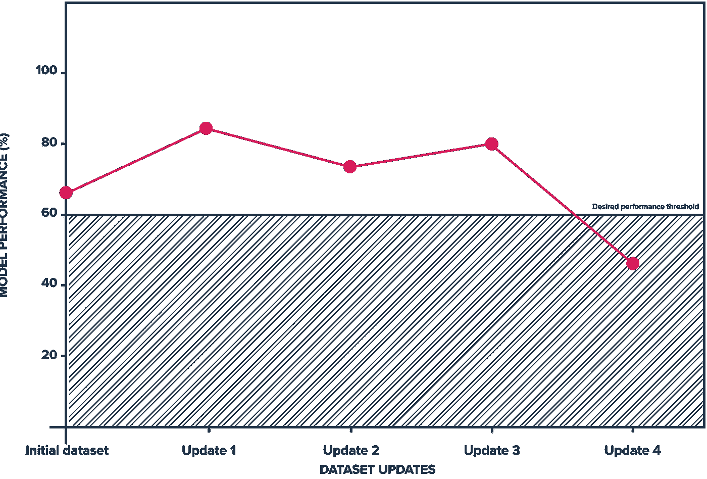
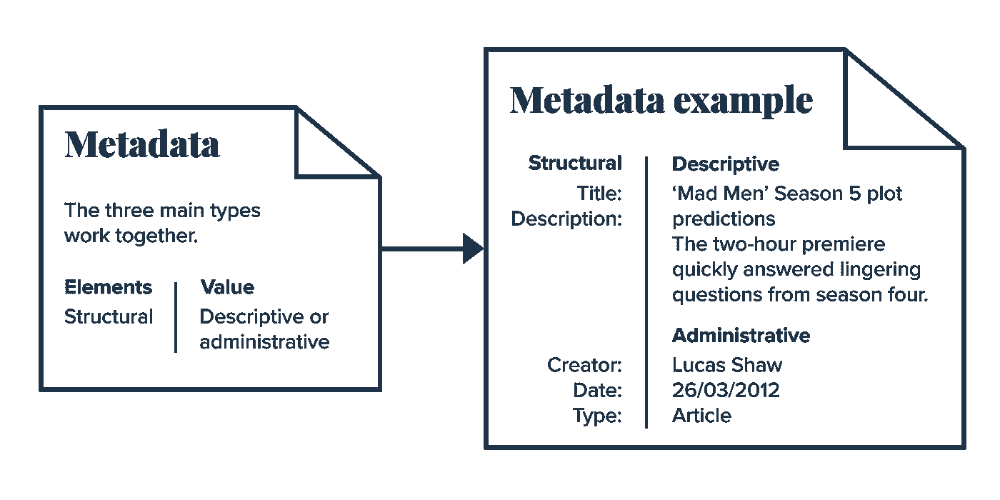
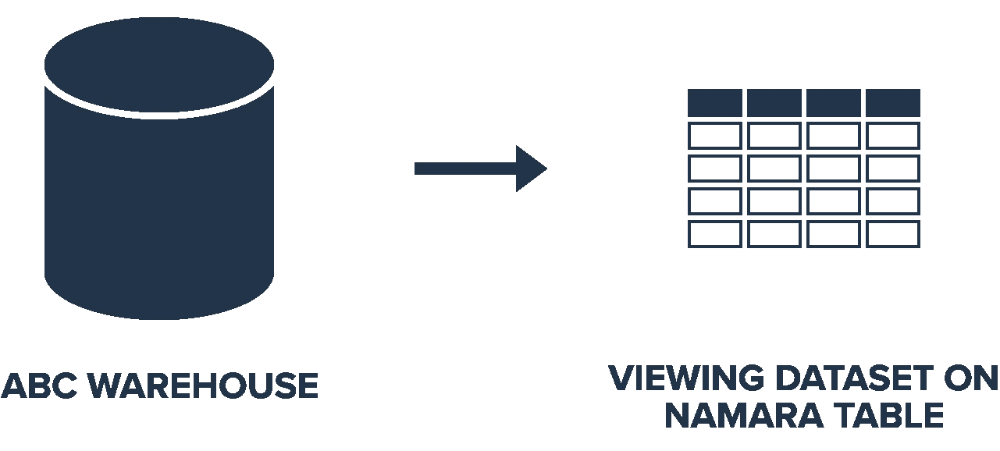
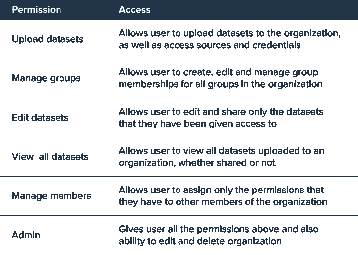

# 使用 Namara 简化您的数据科学

> 原文：<https://medium.com/geekculture/streamline-your-data-science-with-namara-f5cf456f05b0?source=collection_archive---------37----------------------->

我们最近写了很多关于寻找和准备数据的内容。但这仅仅是从中获取价值的开始。当组织开始让外部数据在组织中流动时，与数据共享相关的各种问题就开始产生了。这些问题包括:

*   控制权限和数据访问，包括共享部分/过滤视图或画中画数据
*   准确地跟踪数据的变化，并监控其对模型性能的影响，即使(尤其是)数据定期更新
*   开放数据并与可能从中受益的其他人和/或组织共享数据的能力

使用最新数据非常重要。然而，当数据集定期更新时，数据科学中的再现性变得复杂，并且在使用数据集的特定时间点实例时进行扩展是一个问题。

例如，有人可能使用数据集来建立机器学习模型，达到他们期望的准确度，然后彻底测试它，并对结果感到满意。但如果数据更新较晚，他们模型的性能可能会大幅下降。随着旧数据的消失，模型必须更新以适应新情况。这可能会令人讨厌、耗时，甚至令人尴尬(“昨天还好好的……”)。

User can select ‘Update 3’ to maintain an acceptable model performance instead of being defaulted to the latest revision (Update 4).

在 ThinkData，我们首先是数据人，我们理解这些挫折，因为我们也经历过。有一天一切都很好，然后数据集更新，一切都结束了。在一个封闭的系统中，使用静态数据，这种情况不会发生。但是在模型、应用程序或系统中引入任何种类或速度的数据(数据的结构和更新方式)都会使您面临这些问题。

在我们解释如何解决问题之前，我们需要解释什么问题更好一点。数据科学家对此再清楚不过了，但如果你不是数据专家，你可能会惊讶地发现数据集更新并不都是一样的。*修订*可以以改变、添加或替换数据中先前值的形式对数据集进行修订。

假设一个数据集每周添加一个新行。在这一年中，随着时间的推移，数据集将会有 52 次修订，但随着源数据的更新，也可能会对以前的值进行额外的修订(“最初的数据显示 3 月 17 日有 42 起新感染，但较新的数据显示该数字接近 48”)。修订是一个用于跟踪数据集变化的概念，其中值发生变化，但模式保持不变(即添加或删除数据行)。然而，版本是一个用于跟踪模式变化(即添加、更改或删除列)的概念。因此，如果在前面的示例中，除了感染率之外，数据源突然开始跟踪恢复率，数据集属性将发生变化，从而创建一个新版本。

# 带有跟踪修订的数据跟踪

为了创建数据科学再现性的解决方案，我们在 Namara 平台中内置了修订跟踪功能。换句话说，如果数据集中的行发生更改，将对该数据集进行新的修订。用户可以使用“标签”来识别、查询和跟踪这些修订。您不再局限于只使用数据集的最新版本。用户可以在时间上来回流动，以利用他们需要的数据集，直到他们准备好处理最新的更改。

**跟踪修订的主要优势:**

*   **可再现性:**在稳定数据的基础上创建可扩展解决方案的能力
*   **灵活性:**用户可以通过使用标签来使用持久化的修订，并手动废弃修订
*   **适应时间:**永远不要因为更新数据而措手不及——使用工作版本，直到您可以更新您的模型、分析和仪表板
*   **审计和可追溯性:**仅仅说“在某一点上”数据看起来是特定的方式是不够的。为了维护数据治理，能够引用数据在建模或使用当天的状态的时间点快照至关重要。

# 通过一个镜头从任何地方获取数据——外部表

外部数据增强解决方案的潜力是无限的。从替代资源中寻找有价值的数据并不困难；在您的组织中使用这些数据是需要付出努力的(参见如何[使用 ETL 或数据准备工具将数据放入您的组织](https://blog.thinkdataworks.com/etl-vs-data-prepation-what-are-the-differences))。

Namara 平台旨在减少在组织内使用更多数据时的开销。我们的用户可以通过拖放界面将数据导入 Namara 的私有实例，或者直接从他们自己的数据仓库导入，以获得更多的功能和控制。我们已经在其他地方写了我们所做的工作，以使我们的[摄取管道](https://www.thinkdataworks.com/products/ingester)能够动态地管理数据变化。

但是对于那些希望不使用外部 ETL 而直接传输数据的组织来说，我们希望使用 Namara 来查看和查询任何地方存在的数据变得简单。为了方便快速引入大数据，我们构建了外部表来与各种数据科学环境集成。外部表允许用户直接链接到他们自己的仓库并查询数据，而不需要对任何流程进行重大的重组。

# 没有外部表的外部数据:

# 带有外部表的外部数据:

**外部表的主要优势:**

*   **空白画布**:在 Namara 中使用外部数据的不可知方式
*   **摩擦更少**:与其他数据科学工具相比，减少了获取外部数据的开销
*   **超安全数据驻留:**绝对确保私有或敏感数据留在应有的位置，并可自由直接查询

# 数据协作和共享——RBAC

数据共享和协作是创建多样化解决方案的关键方面。但它不能是一个简单的开关—组织需要对数据的使用和共享方式进行精细控制。

我们意识到了共享权限和微调数据隐私策略的重要性。相应地，我们将我们的权限模型发展为一个[基于角色的访问控制](https://en.wikipedia.org/wiki/Role-based_access_control) (RBAC)系统。在 Namara 中，可以为组和组织的成员分配角色，以便经理和管理员可以选择谁负责什么。可以分配用户来管理成员、查看所有数据集、编辑数据集、管理组和导入数据集，或者执行上述操作的任意组合。

每个权限都可以独立分配，以适应每个用户需要的个人权限。通过这一更改，用户可以被添加到组织中，甚至可以被添加到该组织中的一个组中，并且只获得他们需要的访问权限。

**定义权限的主要优势:**

*   **数据治理:**用户可以根据需要获得访问权限，确保他们无法使用他们不需要/不应该拥有的功能
*   **明确定义:**很容易理解任何角色被赋予了什么样的访问权限，分配它们甚至更简单
*   **更高的透明度:**比以往任何时候都更容易审核访问并了解组织中的数据流

## 为您的数据操作增加灵活性

数据团队越来越需要利用外部数据并进行协作。看起来所需要的是矛盾的:更好的整体访问，但增加了数据治理，并在某种程度上保持了可再现性。

Namara 平台旨在帮助组织以更高的信心和更低的开销使用更多的数据，这意味着为我们的用户提供一种方法来模拟他们的组织结构，控制数据流，并像使用自己的数据一样使用任何数据。

我们每天都与数据打交道。我们想让连接不同来源的不同数据变得容易，因为这是最好的洞察力的来源。随着数据治理和审计需求的增长，我们将继续开发工具和功能，让用户信任他们所依赖的数据。

想了解有关协调业务和数据战略的更多信息吗？

[请求咨询我们的数据专家](https://meetings.hubspot.com/eugene)或[浏览](https://marketplace.namara.io/)最大的解决方案就绪数据目录，以确定 [ThinkData 的技术](https://www.thinkdataworks.com/products/namara)如何推进您的项目。

*原载于***。**