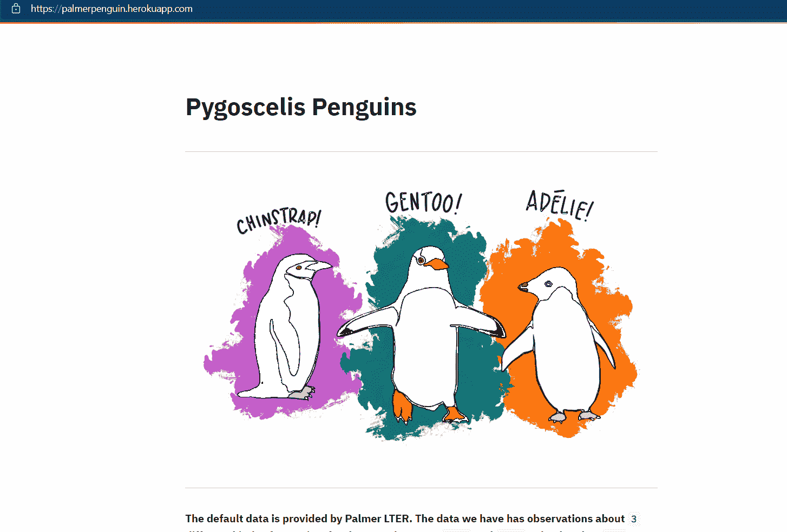

# 细流企鹅和帕尔默企鹅

> 原文：<https://medium.com/geekculture/streamlit-and-palmer-penguins-92a09004ed45?source=collection_archive---------22----------------------->

上周在网飞暴饮暴食，在 Streamlit 上创建了一个关于企鹅的应用程序！

2014 年，Kristen B. Gorman 发表了一篇关于南极企鹅群落环境可变性的论文，2017 年 Netfix 推出了节目“非典型”，2021 年我观看了节目，找到了数据集，并创建了一个探索性的仪表板，用于娱乐和学习！

我为此使用的堆栈保持最小，VS 代码、CSV 数据、Heroku 和 Streamlit。

我简单介绍一下 Steamlit 和 Heroku:

> “Streamlit 可在几分钟内将数据脚本转化为可共享的 web 应用。
> 全部用 Python。全部免费。不需要前端经验。”

> Heroku 是一个云平台即服务，支持多种编程语言。作为首批云平台之一，Heroku 从 2007 年 6 月开始开发，当时它只支持 Ruby 编程语言，但现在支持 Java、Node.js、Scala、Clojure、Python、PHP 和 Go。

Heroku

现在，数据到底是什么，我是如何创建 webapp 并发布它的，所有这些都是免费的！

数据来自 Kaggle！由其中一位大师上传给 EDA！最后给出了该数据集的链接，该数据集是网站上最受欢迎的数据集之一，有超过 97 次投票和 50 个代码。数据文件夹包含两个 CSV 文件，但我们主要关注 penguins_size.csv

*   企鹅种类(下颚带企鹅、阿德利企鹅或巴布亚企鹅)
*   `culmen_length_mm`:竿长(毫米)
*   `culmen_depth_mm`:竿深(毫米)
*   `flipper_length_mm`:脚蹼长度(毫米)
*   `body_mass_g`:体重(克)
*   `island`:帕尔默群岛(南极洲)的岛屿名称(梦幻、托格森或比斯考)
*   `sex`:企鹅性爱

## 什么是长度和深度？

鸟喙是“鸟喙的上脊”(来自牛津语言的定义)。

现在我们来看应用程序的代码！

现在又是 App！

## 该应用程序的链接是 [Streamlit 应用程序](https://palmerpenguin.herokuapp.com/)

代码的完整存储库在[udbhavpangotra/streamlit _ palm er(github.com)](https://github.com/udbhavpangotra/streamlit_palmer)

数据可以在[帕尔默群岛(南极洲)企鹅数据| Kaggle](https://www.kaggle.com/parulpandey/palmer-archipelago-antarctica-penguin-data) 找到

干杯！