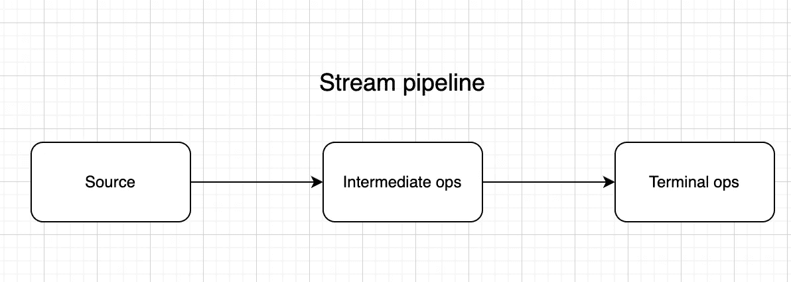

# Java 中的流

> 原文：<https://medium.com/geekculture/streams-in-java-a40c83ae5cca?source=collection_archive---------18----------------------->

一种在 java 中引入函数式编程的方法


用 java 做同样的事情有两种不同的方法。

> 必要的
> 
> 宣言的

好，我们举个例子。假设我们有一份员工名单和他们的薪水。雇员类是这样的；

```
public class Employee {
    private final String name;
    private final int year_of_experience;
    private final long salary;

    public Employee(String name, int year_of_experience, long salary) {
        this.name = name;
        this.year_of_experience = year_of_experience;
        this.salary = salary;
    }

    public String getName() {
        return name;
    }

    public int getYear_of_experience() {
        return year_of_experience;
    }

    public long getSalary() {
        return salary;
    }

    @Override
    public String toString(){
        return "Employee: "+
                "name:- " +
                name+ " years_of_experience:- "+
                year_of_experience+ " salary:- "+
                salary;
    }
}
```

我们有一份员工名单。

```
private static List<Employee> getEmployee() {
    return List.*of*(
            new Employee("Alice", 3, 500_000),
            new Employee("Bob", 2, 300_000),
            new Employee("Cindy", 1, 80_000),
            new Employee("Diana", 8, 700_000),
            new Employee("Emmy", 5, 500_000),
            new Employee("Finn", 0, 50_000)

    );
}
```

我们希望获得所有工资超过 10 万英镑的员工。

强制性方法:

```
// Imperative approach
List<Employee> high_paid_employees = new ArrayList<>();
for(Employee employee: employees){
    if (employee.getSalary() > 100_000){
        high_paid_employees.add(employee);
    }
}
high_paid_employees.forEach(System.*out*::println);
```

声明式方法:

```
// Declarative approach
List<Employee> high_paid_employees =  employees.stream()
        .filter(e-> e.getSalary() > 100_000)
        .collect(Collectors.*toList*());
high_paid_employees.forEach(System.*out*::println);
```

不用定义每一个步骤，使用流，我们可以很容易地过滤所需的数据，并将它们收集在一个单独的列表中。

有**两种类型**的操作组合起来形成一个流管道。



***中级操作*** 包括；过滤，映射，排序。

> 这些操作总是很懒，一如既往。
> 
> 这些操作产生一个新的流。

***终端操作*** 包括；forEach，reduce。

> 终端操作产生一个结果。
> 
> 在这些操作之后，流被认为是已消耗的，不能再使用。

集合上的流:

*   **无存储**

流本身不是数据结构，因此不存储元素；相反，它充当从源传递元素以执行各种操作的管道。

*   **功能性质**

如上所述，streams 产生一个结果，并不修改源。然后，我们可以使用。收藏功能。

*   **偷懒的人**

许多流操作，比如过滤、映射或重复删除，都可以延迟实现，为优化提供了机会。例如，“查找具有三个连续元音的第一个字符串”不需要检查所有输入的字符串。

*   **可能无界**

虽然集合的大小是有限的，但是流却不需要。诸如 limit(n)或 findFirst()之类的短路操作可以允许在有限时间内完成对无限流的计算。

*   **耗材**

在流的生命周期中，流的元素只被访问一次。像 java.util.Iterator 一样，必须生成一个新的流来重新访问源中的相同元素。

对流的其他操作包括排序、所有匹配、任何匹配、无匹配、最小、最大。你应该练习一下:)

# 参考

Java streams 教程，Amigoscode:[https://www.youtube.com/watch?v=Q93JsQ8vcwY&ab _ channel = Amigoscode](https://www.youtube.com/watch?v=Q93JsQ8vcwY&ab_channel=Amigoscode)

Java 文档:[https://docs . Oracle . com/javase/8/docs/API/Java/util/stream/package-summary . html](https://docs.oracle.com/javase/8/docs/api/java/util/stream/package-summary.html)