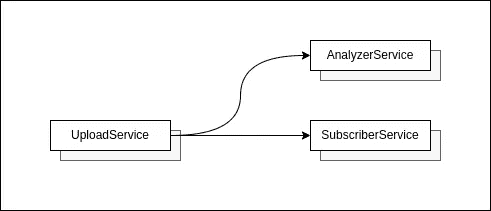
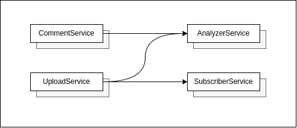
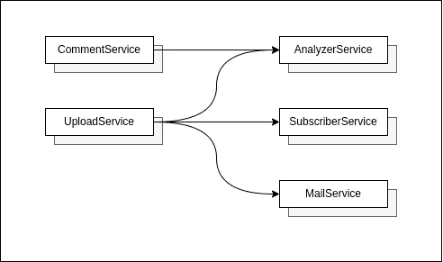
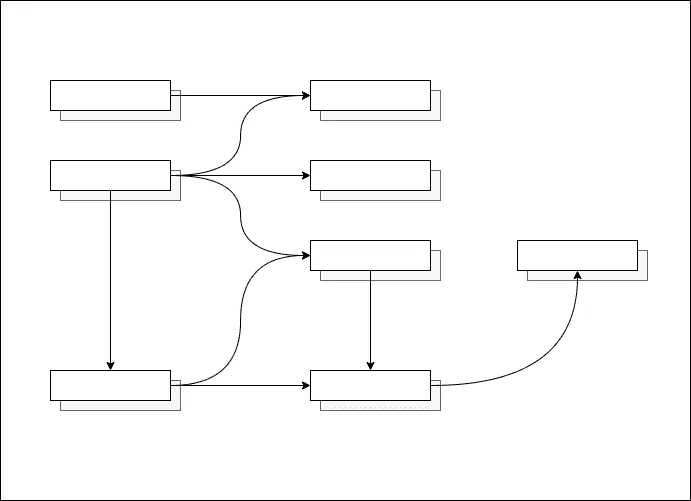
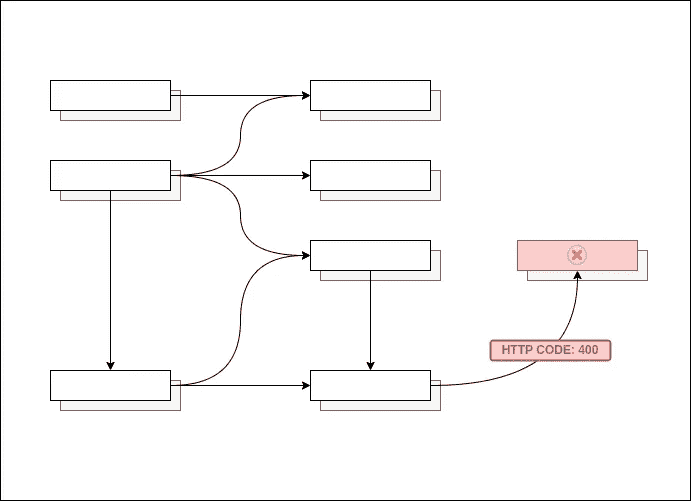
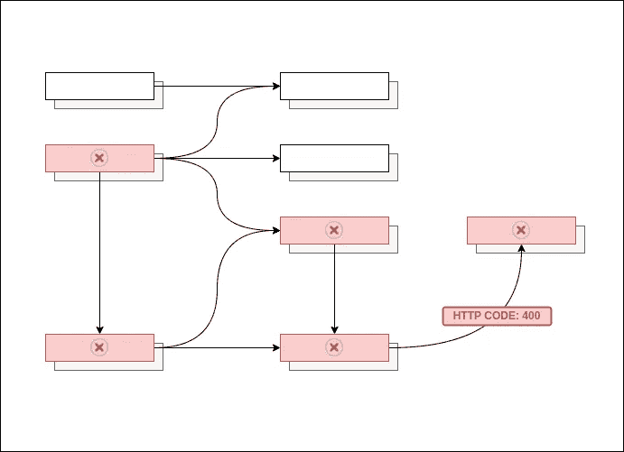
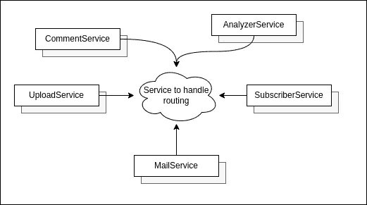
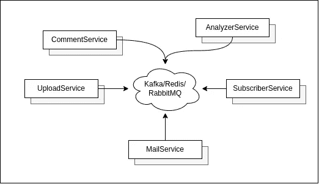
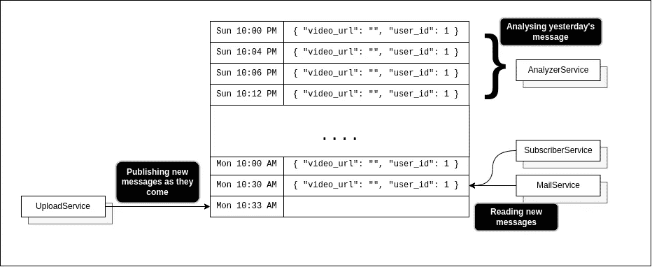

# 流和发布订阅系统，为什么我们应该喜欢它们，以及它们在 Redis 中是如何工作的

> 原文：<https://medium.com/geekculture/streams-vs-pub-sub-systems-in-redis-70626821cc2f?source=collection_archive---------4----------------------->

# 一个问题

我们先来布置一下舞台。

假设我们有一个平台，用户可以上传视频，其他用户可以看到这些视频(有点像 Youtube)。我们现在只关心一个流，即上传视频流。

在我们的系统中，我们有一个简单的 UploadService，它获取上传的视频。为了向用户的订阅者发送通知，它向 SubscriberService 发送 HTTP 请求。它还向 AnalyzeService 发送 HTTP 请求，analyze service 运行算法来分析视频。该算法可能分析关于视频的元数据，可能是用户的国家、长度、描述等。对于我们平台的推荐系统。这是我们现在拥有的平台。



然而，随着时间的推移，产品团队增加了构建评论系统的需求。所以我们的团队很快建立了一个评论服务。然而，他们又提到这些 CommentService 也需要与 AnalyzerService 通信，因为他们也想分析评论。好的，我们也可以这样做，我们只需从新的 CommentService 向 AnalyzerService 发送另一个 HTTP 请求，这样就可以了。



几个月后，一个新的需求出现了，用户可以注册频道的邮件列表。当一个新的视频发布时，他们想要一封关于该视频的电子邮件(虽然不太确定为什么用户已经有了订阅功能还需要电子邮件，但是产品人员很好地要求我们开始编码！)



好了，在这一点上，我们在 UploadService 中的代码看起来相当混乱

```
const uploadAPI = () => {
  // Send a request to Analyzer service
  let res = sendToAnalyzeService() // Send a request to Subscriber service
  res = sendToSubscriberService() // Send a request to Mail service
  res = sendToMailService()
}
```

不仅如此，当我们编写 UploadService 时，我们还必须考虑许多边缘情况，如果订户服务中断了怎么办？，如果邮件服务的响应时间太长怎么办？，如果 analyzer 服务发送 400 状态代码会怎样？(想象一下作为开发人员为这个特性编写单元测试)如果路由有任何变化，例如，我们可能不再需要分析视频上传，我们还需要在上传服务中进行代码级别的更改。所有这些开始看起来有点混乱。

现在想象一个有很多组件的大型系统，你可以开始看到这种架构会出现的问题。



单个服务停止运行…



错误要么传播到调用它的服务，要么需要错误处理来恢复。



所有这一切都是因为我们的服务彼此紧密耦合。

显然，我们可以有超时、错误处理(无论如何我们都应该这样做)，但潜在的问题仍然存在，为什么一个特定的服务，比如说 UploadService，要小心或处理可能在一个完全独立的服务中出现的问题，比如 AnalyzerService。为什么 it 部门要关心或意识到 analyzer 服务呢？！UploaderService 的工作只是上传视频并存储它们，而不是 ping 系统中的其他服务。


UploadService probably

如果 UploadService 要与如此多的服务通信，编写 UploadService 的开发人员将很难为如此多的边缘情况编写代码，编写单元测试，然后在单元测试失败时进行调试，等等。


Also, guys coding the UploadService

这种架构可能很难扩展，并且需要大量的测试和代码才能使其可靠。

# 引入事件驱动架构

如果我们能把上传服务从不断更新每个人的压力中解放出来会怎么样？

如果你认为这些服务都是处理自己问题的实体，有自己的责任，上传服务的任务不应该是通知分析者服务有一些数据可以分析，或者订阅服务，他们应该向用户发送通知。如果它所能做的就是大喊“XYZ 用户上传视频完毕！!"所有的服务都可以听到这些，任何感兴趣的人都可以根据这些信息采取行动，这将使它的工作变得容易得多。这就像在 Slack 上发送一条关于一个涉及 10 个人的项目的群发消息，而不是直接给他们每个人发消息。


这似乎也更…明智。这意味着更新每个人不再是上传服务的责任。它只需要做好自己的工作，然后大喊。任何感兴趣的人都可以收听和查看新视频，那些不感兴趣的人可以忽略 UploadService。这也意味着，由于 UploadService 不关心任何其他服务，它也不关心它们是否崩溃或停止工作。事实上，服务可能会因为它的关心而停止。

此外，我们可以有一种集中的路由系统，其中每个服务可以决定它听谁的，忽略谁的。任何服务都可以*选择*它想听的内容，这个集中的系统可以在事情发生时协调发送消息给所有相关的服务。

这是它在我们的架构图中的样子



# 发布-订阅系统

Kafka、Redis 或 RabbitMQ 等发布子系统为我们设计这些松散耦合的服务提供了一种方式。



现在，让我们只讨论一下 Redis。

在 Redis 中，我们可以让发布者向一个频道发布消息，消费者可以收听他们感兴趣的特定频道。这意味着 UploadService 可以在频道 UploadChannel 中发布新视频上传的消息，任何对其感兴趣的服务都可以订阅该频道。当上传新视频时，订阅该频道的用户会收到新视频上传的通知。

Redis 也很容易使用。消费者就是这样做的

```
SUBSCRIBE UploadChannel
```

当一个新的视频被上传时，UploadService 简单地运行

```
PUBLISH UploadChannel '{"video": "https://s3../video_bucket/1.mp4"}'
```

这确实有效…在很大程度上。

让我们也讨论一下在这种方法中出现的一些问题。

## 异步通信

如果邮件服务因维护而关闭，用户上传了一个新视频，该怎么办？邮件服务错过了用户上传的视频。由于邮件服务不做时间要求很高的事情，如果它关闭几秒钟也没关系，只要它在备份后可以读取旧的上传。但是对于 Redis 发布/订阅，这是不可能的。更多的是火和遗忘。它向此刻正在收听的订户发送消息，并且任何此刻没有收听的订户将再也不会听到相同的消息。

## 不同的访问模式

不同的消费者也很可能有不同的访问模式。例如，也许我们正在 analyzer 服务中运行一个计算密集型 AI 模型。因为这个服务不做任何时间关键的事情，为了节省服务器成本，我们在晚上或者下班时间运行这个算法。这仍然符合产品要求，因为我们的推荐系统可能接受长达 24 小时的延迟。但是如果我们使用这个发布/订阅系统，那么我们就不能这样做。我们必须全天候运行我们的 AnalyzerService，这样我们就不会错过任何一个视频上传。

## 数据存储

根据我们的用例，保持这些消息也可能很重要。也许我们的产品团队可能对分析用户模式感兴趣，或者也许我们想要更有趣的东西，比如[事件源](https://martinfowler.com/eaaDev/EventSourcing.html)。

让我们谈谈 Redis 流如何帮助我们解决这些问题。

# 流

redis 流既可以作为数据存储解决方案，也可以作为发布/订阅系统。这个想法是，发布者将消息发布到一个流中，消费者收听这些流(类似于我们之前在通道中所做的)。关键的区别在于，这些消息保留在系统中，而系统只是附加的。

这似乎是一个微小的变化，但它会对我们的架构产生巨大的影响。我们的建筑不再是火了就忘，而是有信息在里面持续存在。这意味着消费者可以决定何时阅读哪条信息。

一个很好的类比可能是电话会议或群发短信。发布/订阅系统更像是一个召集 5 个人的朋友会议。他们中的一些人可能在那个时候有空并且可以加入，而一些人可能没空并且最终会错过呼叫。Redis 流更像是在 Whatsapp 群组上发送消息。每个人都可以决定他们想什么时候阅读邮件，并且也有所有旧邮件的历史记录。有些人可能忙于工作，在晚上阅读所有的消息(不像我们的 AnalyzerService，他也只在晚上有时间)，有些人可能在网上阅读每条发布的消息。只是一个简短的说明，我并不是说 Redis Streams 总是比 Redis Pub/Sub 好，我只是说有时给人们打电话更好，有时给人们发消息更好。

回到我们的架构，使用 Redis Streams，UploadService 只需发布一条关于视频的新消息到这个只附加的数据存储，消费者可以选择如何使用这些消息。有些服务，如 AnalyzerService，可能希望使用旧的消息，而有些服务，如 MailService 和 SubscriberService，可能选择实时使用消息。一些消费者可能希望以阻塞方式阅读消息，而一些消费者可能更喜欢非阻塞方式。一些消费者可能批量阅读消息，而一些消费者可能更喜欢逐个阅读消息。并且所有这些消息也保存在流中！



让我们看看这如何解决我们之前面临的所有问题

## 异步通信

由于消费者决定何时阅读信息，他们实际上不必 24/7 都在听。他们可以下去，再上来，阅读他们错过的所有信息。对于 Redis Streams，如果我们的邮件服务宕机几秒钟，错过了几个视频上传，这不会是一个问题，因为当它再次恢复时，它可以读取它错过的消息。

## 不同的访问模式

消费者可以决定阅读哪些消息以及何时阅读，他们是希望以阻止或非阻止的方式阅读消息，还是希望一次阅读 1 或 2 或 10 或 100 条消息。现在，我们可以通过在夜间运行 analyzer 服务来节省资金，而不是全天候运行。

## 数据存储

所有这些消息也保存在我们的流中。根据我们的用例和需求，这可能是一个有用的特性。现在，如果需要，我们的产品团队可以下载这些数据并分析用户访问模式。如果没有 Redis 流，我们可能必须建立一个不同的数据存储解决方案。我们可以清除我们的流，或者根据我们的要求设置流中的最大消息数量。

# 结论

Redis Streams 教会了我一个以前从未遇到过的有趣的架构模式。这似乎很有意义，并为一些用例提供了优于发布/订阅的优势。让消息异步，让消费者自由决定如何消费消息，为消费者增加了更多的灵活性，而且看起来很直观。然而，科技中的一切也有不利的一面，我看到的是管理这些额外的数据。在内存中存储数据是很昂贵的(就像 Redis 中的其他东西一样，流中的数据也存储在内存中)，我们需要清除我们的流或者设置一个最大限制。它也只是附加的，我当然可以看到这样的用例:计算时间和存储被浪费在消耗可能不需要的实时消息上(假设一条消息更新一篇文章。如果帖子经常更新，就像民意测验一样，那么只有最终状态是重要的，中间状态是过时的，存储和处理它们是对资源的浪费)。就像科技中的其他事情一样，我们必须根据我们的需求来决定什么是重要的，什么是可以牺牲的。

# 看够了，我们来编码吧？

虽然我很喜欢阅读和学习 Redis streams，但我觉得在接触一些代码之前，我对一项技术还不够了解。我心中有一个项目，这将是一个测试流的很酷的小方法，但如果我的项目跟踪记录是任何证据，我可能会在项目中途对其他东西感兴趣(不要表现得好像你以前没有做过这件事😜).但是不管我接下来要探索什么，我一定会在这里发表！感谢你阅读这些，如果你喜欢，请告诉我！