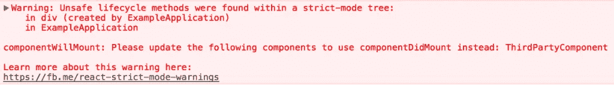

# React 中的严格模式

> 原文：<https://medium.com/geekculture/strict-mode-in-react-12ad065f704c?source=collection_archive---------9----------------------->


# 介绍

StrictMode 是一个回复 Inventor 工具，用于突出显示应用程序中的潜在问题。它主要用于解决 web 应用程序中可能出现的问题。它会为其子因子激活新的折旧检查和警告。其时尚性的一个原因是，每当不遵循 React 指南和推荐的实践时，它都会提供可视化的反馈，例如警告和错误调度。就像 React 片段一样，React StrictMode 组件不呈现任何可见的 UI。

在本文中，我们将深入讨论 React 中的严格模式。

# 描述

React StrictMode 可以被视为一个辅助元素。它使发明者能够有效地解码，并使他们注意到任何可能意外包含在操作中的可疑法律。StrictMode 可以实现到操作的任何部分，而不是不可避免地实现到整个操作。它特别有助于开发新的卡农或修补手术。

我们可以在应用程序的任何部分使用严格模式。例如:

```
import React from 'react';function ExampleApplication() {
  return (
    <div>
      <Header />
      <React.StrictMode>        <div>
          <ComponentOne />
          <ComponentTwo />
        </div>
      </React.StrictMode>      <Footer />
    </div>
  );
}
```

在这个例子中，将对`Header`和`Footer`组件运行严格的模式检查*而不是*。不过，`ComponentOne`和`ComponentTwo`，以及他们所有的后代，都将拥有这些检查。

`StrictMode`现在支持着:

*   识别具有不安全生命周期的组件
*   关于旧字符串引用 API 用法的警告
*   关于已弃用的 findDOMNode 用法的警告
*   检测意外的副作用
*   检测遗留上下文 [API](https://www.technologiesinindustry4.com/2021/08/ethereum-javascript-api-web3-js.html)

React 的未来版本将包含额外的功能。

# 优势

React StrictMode 帮助我们在开发阶段识别和检测许多警告和错误，例如；

**支持查找生命周期不安全的组件:**

少数遗留组件、生命周期方法被确定为在异步应用程序中使用不安全。React StrictMode 支持查找这种不安全方法的使用。一旦允许，它将显示使用不安全生命周期方法的所有组件的列表作为警告消息。

**关于使用遗留字符串 ref**[**API**](https://www.technologiesinindustry4.com/2021/08/ethereum-javascript-api-web3-js.html)**:**的警告

在启动时，有两种方法来管理 refs——遗留字符串 ref API 和回调 API。在此之后，包含了第三种替代方法 create API，它用对象引用替换字符串引用，这使得 StrictMode 能够在使用字符串引用时提供警告消息。

**关于不推荐使用的 findDOMNode 的警告:**

由于 findDOMNode 只是一个一次性的 read API，所以当子组件试图呈现不同的节点时，不可能控制更改。这些问题是由 React StrictMode 发现的，并显示为警告消息。

# 识别不安全的生命周期

众所周知，在异步 React 应用程序中使用某些遗留生命周期方法是不安全的。因此，如果我们的应用程序使用第三方库，确定这些生命周期没有被使用可能会很复杂。幸运的是，严格模式可能支持这一点。启用严格模式时，React 会编译使用不安全生命周期的所有类组件的列表。并记录一条包含这些组件信息的警告消息，如下所示:



# 关于传统字符串引用 API 用法的预警

早些时候，React 给出了两种管理 ref 的方法:

*   传统字符串引用 API 和
*   回调 [API。](https://www.technologiesinindustry4.com/2021/08/ethereum-javascript-api-web3-js.html)

React 16.3 增加了第三个选项，它提供了字符串引用的便利，但没有任何缺点:

```
class MyComponent extends React.Component {
  constructor(props) {
    super(props); this.inputRef = React.createRef();  } render() {
    return <input type="text" ref={this.inputRef} />;  } componentDidMount() {
    this.inputRef.current.focus();  }
}
```

# 关于使用不推荐使用的 findDOMNode 的警报

React 用于帮助`findDOMNode`在树中搜索 DOM 节点，提供了一个类示例。通常，我们不需要这样做，因为我们可以[将一个引用直接附加到一个 DOM 节点](https://reactjs.org/docs/refs-and-the-dom.html#creating-refs)。

`findDOMNode`同样可以用于类组件。这打破了抽象层次，允许父母要求渲染某些孩子。它产生了重构的危险，我们不能改变组件的应用程序细节，因为父组件可能会进入它的 DOM 节点。`findDOMNode`只归还第一个孩子。通过使用片段，组件可以方便地呈现各种 DOM 节点。`findDOMNode`是一次性读取的 API。它只是在我们要求时给了我们一个答复。如果子组件呈现不同的节点，则没有其他方法来控制此更改。因此，只有当组件返回一个永不改变的 DOM 节点时才有效。

相反，我们可以通过将一个引用传递给我们的自定义组件，并使用 [ref forwarding](https://reactjs.org/docs/forwarding-refs.html#forwarding-refs-to-dom-components) 将它传递给 DOM，从而使这一点显式化。我们还可以在组件中包含一个包装器 DOM 节点，并直接向它附加一个引用。

```
class MyComponent extends React.Component {
  constructor(props) {
    super(props);
    this.wrapper = React.createRef();  }
  render() {
    return <div ref={this.wrapper}>{this.props.children}</div>;  }
}
```

更多详情请访问:[https://www . technologiesinindustry 4 . com/2021/11/strict-mode-in-react . html](https://www.technologiesinindustry4.com/2021/11/strict-mode-in-react.html)