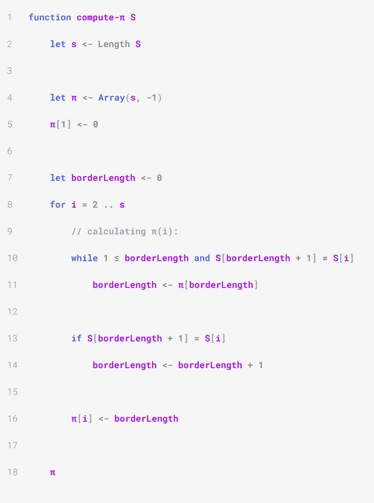

# 字符串算法:什么是前缀函数，如何计算它

> 原文：<https://medium.com/geekculture/string-algorithms-what-is-the-prefix-function-and-how-to-compute-it-7fa80035651b?source=collection_archive---------28----------------------->

许多字符串算法都使用前缀函数，包括用于字符串匹配的 Knuth-Morris-Pratt 算法。本文推导、实现并分析了一种在线性时间内计算给定字符串前缀函数的算法。

Photo by [Glen Carrie](https://unsplash.com/@glencarrie?utm_source=medium&utm_medium=referral) on [Unsplash](https://unsplash.com?utm_source=medium&utm_medium=referral)

# 符号、术语

我将在本文中使用以下符号和术语:

*   除非另有说明，大写字母表示字符串，小写字母表示字符串的长度(例如， *S* 是长度为 *s* 的字符串)。
*   *S* 的索引是介于 1 和 *s* 之间的整数。
*   *TU* 表示由 *T* 和 *U* 串联而成的字符串，其中 *T* 和 *U* 可以是字符串或字符。
*   对于 *T* 的所有索引 *i，j* ， *T* [ *i* ]表示 *T* 和 *T* [ *i* 的第 *i* 个字符.. *j* 表示字符串*T*[*I*……*T*[*j*]。

# 边框和前缀功能

我们考虑一串 *S* 。然后，我们可以如下定义边界:

> **定义:**
> 
> S 的边界是字符串 B，它是 S 的真前缀和真后缀。

比如空字符串 *ε* 是任何非空字符串的边框，但是 *ε* 没有边框(因为它唯一的子串是它自己，不是*专有的*前缀或后缀)。字符串`baobaba`的最长边框是`ba`。

> **定义:**
> 
> s 的前缀函数是将 s 的索引 I 映射到 s[1]的最长边界长度的函数𝜋..我】。

例如，如果我们考虑字符串`baobaba`，那么𝜋(1) = 𝜋(2) = 𝜋(3) = 0，𝜋(4) = 1，𝜋(5) = 2，𝜋(6) = 1，𝜋(7) = 2。

我们的目标是写一个算法，它接受一个字符串并给出它的前缀函数。

# 铺平我们的道路

borders 的第一个有趣的性质告诉我们，S 的每个边界都是 S 的子串的最长边界。更准确地说:

> **属性 1:**
> 
> S 的第 n 条最长边是 S 的第(n-1)条最长边的最长边。

证据就在这些方面:

> **证明大纲:**
> 
> 我们可以从证明 A 和 B 是 S 的边开始，那么 a < b implies that A is a border of B. In particular, the n-th longest border of S is a border of the (n-1)-th. We now need to prove that it is the longest. Suppose that it is not: the (n-1)-th longest border of S has a border B which is strictly longer than the n-th longest border of S. Since B is a border of a border of S, it must be a border of S as well. It is strictly shorter than the (n-1)-th longest and strictly longer than the n-th longest: this is impossible.

We will use this property to derive a recurrence relation to find all values of 𝜋.

The base case is simple: the longest border of a string containing one single character is ε. Therefore, 𝜋(1) = 0.

Suppose that *S* 的长度 *s* ≥ 2。当且仅当下列条件都满足时， *B* 为 *S* 的非空边界:

1.  *B*[*B*]=*S*[*S*；
2.  *B*【1..*b*-1】=*S*[*S*-*b*..*s*-1】；
3.  *B*[*B*]=*S*[*B*]；
4.  *B*【1.. *b* - 1] = *S* [1..*b*-1】；
5.  *b* ≤ *s* - 1 *。*

我们刚刚重新表述了定义，将边界的最后一个符号与其余符号分开。报表 1。第二。相当于说 *B* 是 *S* 的后缀，语句 3。第四。相当于说 *B* 是 *S* 和语句 5 的前缀。暗示 *B* 是*S*的前缀/后缀。这使得能够找到 S 的边界和*S*【1】的边界之间的关系.. *s* - 1]:

> B 是 S 的非空边界当且仅当:B[1..b - 1]是 S[1]的边界..s - 1]和 B[b] = S[b] = S[s]。

这意味着 *S* 的任何边框都是通过将 *S* [ *s* ]附加到*S*【1】的边框上而构建的.. *s* - 1】，前提是*S*[*S*]=*S*[*b*。因此:

> **属性二:**
> 
> 当且仅当:S[1..s - 1]的边界长度为 b - 1，S[b] = S[s]。

# 编写解决方案

因此，我们可以建立以下非正式算法:

> 为了找到𝜋(i)，迭代 s[1]的所有边界长度 b..i - 1]按降序排列。第一次 S[b + 1] = S[i]，我们设𝜋(i) = b + 1。如果它从未发生，𝜋(i = 0。

所以我们从最长的边界*S*【1】开始.. *i* -1】，长度𝜋( *i* -1)。如果 s[𝜋(*I*-1)+1]=*s*[*I*]，我们可以设𝜋(i) = 𝜋( *i* -1) + 1。否则，我们需要找到 S[1]的第二长边界的长度..*我* -1】。 ***性质 1*** 告诉我们是𝜋(𝜋(i - 1)给定的:s 的第二长边是 *S 的最长边*的最长边。所以我们需要检查 S[1..𝜋(𝜋(*I*-1))+1]=*s*[*I*]，这种情况下我们设𝜋(i) = 𝜋(𝜋(i - 1)) + 1。我们不断重复，直到找到最长的边界——如果我们永远找不到，我们设置𝜋(i = 0。

这用伪代码给出了下面的算法(数组和字符串索引从 1 开始):

我们首先初始化一个对应于前缀函数的数组(第 4 行)，并将其第一个值设置为 0(这是基本情况)。

while 循环(第 10 行)以降序遍历 S 的所有边界长度。我们确保`borderLength`保持正面(𝜋(0 不会有任何意义)。如果字符串的第(`borderLength` + 1)个字符等于第 *i* 个字符，那么我们就找到了我们最长的边界(它的长度为`borderLength` + 1)。

如果条件线 13 被满足，那么我们已经找到 S[1]的最长边界的长度.. *i* 并相应设置`borderLength`的值。否则，`borderLength`为零，这对应于 S[1]的最大边界长度..我】。

因此，我们可以定义𝜋( *i* 并继续前进。

# 分析

正如承诺的那样，算法根据字符串的长度在θ(*s*)时间内运行。这并不明显，特别是因为 while 循环。

决定 while 循环迭代次数的唯一变量是`borderLength`。它被初始化为 0，可以增加(第 14 行)或减少(第 11 行)。

由于`borderLength`总是非负的，所以它的减少不能超过它的增加。它增加不超过*s*-1(for 循环每次迭代一次)，这证明 while 循环在整个程序执行过程中运行不超过 *s* - 1 次。

由于 for 循环恰好运行 *s* - 1 次，所以`compute-𝜋`的总复杂度为θ(*s*)。