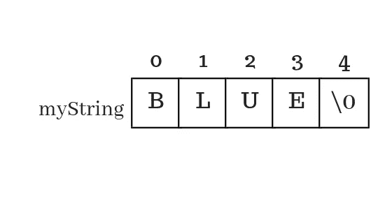

# 字符串—带有“\0”的字符数组

> 原文：<https://medium.com/geekculture/string-an-array-of-characters-with-0-a133fd56e9d9?source=collection_archive---------14----------------------->



数字和字符可以存储在一个数组中。如果一个单词或一个句子需要存储在变量中怎么办？一种方法是使用字符数组。有一种更方便的方法，将它们存储为字符串。

# 什么是字符串？

字符串是以空终止符结束的字符数组。空终止符是一个特殊字符' \0 '，其数值为 0。它被用来代表空虚。因此，在字符串的情况下，空终止符表示字符串的结束位置。所以，我们不能用一个空字符来终止吗？不，char 不接受空值。事情不是这样的。这就是使用空终止符的原因。

```
char myself[] = {'I', ' ', 'a', 'm', ' ', 'c', 'o', 'o', 'l'};
printf("%c", myself[0]);
```

输出:

```
I
```

这是如何使用 char 数组存储一个句子或单词。现在，想想如果需要显示整个句子会怎么样。方法是创建一个 for 循环，循环遍历每个 char 并显示它们。当处理许多单词或者需要比较两个字符串是否相等时，这是不方便的。

```
char myself[] = {'I', ' ', 'a', 'm', ' ', 'c', 'o', 'o', 'l', '\0'};
printf("%s", myself);
```

输出

```
I am cool
```

除了结尾的' \0 '以外，字符串的存储方式类似于 char。可以使用“% s”[格式说明符](https://medium.datadriveninvestor.com/code-factory-variables-and-data-types-aa20cfccfe80)显示字符串。现在，不需要循环数组来显示整个句子。这是字符串的实际格式，但是声明字符串更容易。

```
char myself[] = "I am cool";
printf("%s", myself);
```

这也给出了相同的输出。像这样声明一个字符串时，字符串被转换成一个 char 数组，并在后台以' \0 '结束。所以，很酷。

# 比较字符串

要比较字符串，我们需要包含' string.h '。

```
#include <string.h>
```

这个头文件提供了一些函数或方法来对字符串进行一些操作。“strcmp()”用于比较字符串。

```
strcmp(string1, string2);
```

在“strcmp()”的括号内，提供了要比较的字符串。如果字符串相等，则输出 0，如果字符串不相等，则输出其他值。

输出

```
0
```

# 分配给字符串

字符串赋值不以通常的方式工作。

```
char myCar[] = "BMW";
char myNewCar[] = "Tesla";myCar = myNewCar;
printf("%s", myCar);
```

输出

```
main.c:16:11: error: assignment to expression with array type
```

该错误说明我们试图将数组类型赋值给一个表达式。基本上，字符串是一个字符数组。所以，我们必须做一个循环，把 myCar 数组的每一项赋值给 myNewChar 数组的每一项。我们不能直接分配它。我们需要使用“string.h”中的函数 strcpy()。

要将一个字符串分配给另一个字符串，请按顺序传递目标字符串和源字符串，即 strcpy(目标字符串，源字符串)。

```
#include <stdio.h>
#include <string.h>int main()
{
    char myCar[] = "BMW";
    char myNewCar[] = "Tesla";
    strcpy(myCar, myNewCar);
    printf("%s", myCar);
}
```

输出

```
Tesla
```

# 读取字符串

读取用户输入的字符串有点不同。

```
char name[30];
scanf("%s", name);
```

通常,“与”符号放在要存储输入值的变量之前。

```
int num;
scanf("%d", &num);
```

对于字符串，不需要&符号。原因超出了本文的范围。有兴趣可以搜索一下。

这就是如何读取字符串。它适用于不带空格的单词。在句子和全名中，会有空格。

```
char name[30];
printf("Enter name: ");
scanf("%s", name);
printf("%s", name);
```

如果名称是一个像' Shafi '这样的单词，则输出“Shafi”。如果名称包含空格，如“Shafi Sahal ”,输出仍然是“Shafi”。这里发生的情况是，在读取输入时，读取在字符串中第一次出现空格时停止。

要读取带空格的字符串，方法不止一种。这里，我们将讨论使用扫描集的方法。[有兴趣可以查查其他方式。](https://www.geeksforgeeks.org/taking-string-input-space-c-3-different-methods/) [你可能还会检查什么是 scanset？](https://www.geeksforgeeks.org/scansets-in-c/)

```
char name[30];
printf("Enter name: ");
scanf("%[^\n]", name);
printf("%s", name);
```

输出

```
Enter name: Shafi Sahal
Shafi Sahal
```

这里，给出的是扫描集，而不是[格式说明符](https://medium.datadriveninvestor.com/code-factory-variables-and-data-types-aa20cfccfe80)。扫描集告诉如何读取输入。方括号中给出了扫描集:%[]，在本例中，扫描集是“^\n".”这会告诉读取输入，直到遇到换行符。因此，直到按下 enter 键，整个句子或单词将被视为输入。

# 示例测验程序

让我们用通过这篇文章和以前的文章获得的所有知识做一个小测验程序。

[**Previous = >数组—使用同一个变量存储多个项目。**](/geekculture/arrays-store-multiple-items-using-the-same-variable-7e2af6e2bdf)

[**Next = >功能—可重用逻辑**](/geekculture/functions-reusable-logic-b1fad28e72cb)