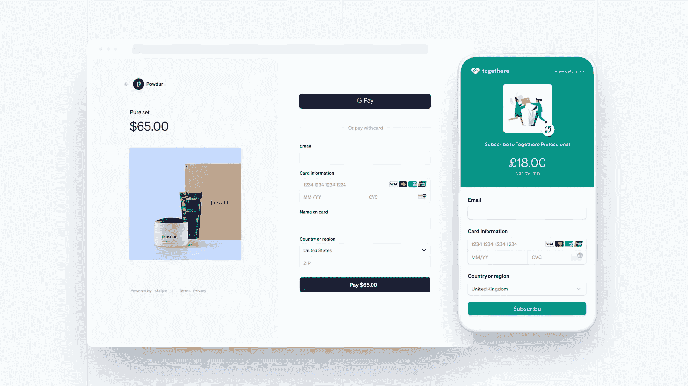

# 条带订阅付款:创建并应用订阅优惠券

> 原文：<https://medium.com/geekculture/stripe-subscription-payment-create-coupon-for-subscription-89908ea86d93?source=collection_archive---------1----------------------->

## 订阅优惠券


# 介绍

优惠券是为你的服务赢得新客户的好方法之一。它为顾客提供了购买你的产品的动机。对于营销策略，优惠券可以发挥巨大的作用，以扩大你的业务。

在本文中，我将介绍如何使用 Stripe 提供的 [Stripe API](https://stripe.com/docs/api) 创建优惠券并将其应用于新的和现有的订阅，该 API 允许将支付无缝集成到您的应用程序中。在构建需要付费的应用程序时，它可以节省你大量的时间。

> [Stripe](https://stripe.com/jp) 是世界上最强大的支付基础设施。

Stripe 处理几乎所有复杂的支付处理，因此您可以专注于开发完全依赖其 API 的电子商务等应用程序。他们还有一个特殊的结帐功能，称为 Stripe Checkout，这是一个由 Stripe 创建和维护的页面。



在上面显示的示例图像中，该结账不包括优惠券部分，但是您可以从“设置”中为客户启用它。使用这个内置页面的优势在于，当客户被重定向到结账页面以完成购买时，您不需要在应用程序中编写任何一行代码。如果你想在完成购买的过程中添加一些逻辑，你也可以在后台设置 [webhook](https://stripe.com/docs/webhooks) 。

这个特性在这里就不赘述了，但是作为参考，你可以去这里[详细查看一下](https://stripe.com/jp/payments/checkout)。虽然内部开发可能会花费大量的金钱和时间，特别是当工程师使用其 API 从头开始构建时，但这一功能开辟了一种新的方式，非工程师也可以毫不费力地将支付系统实现到应用程序中。它带有 Apple Pay、Google Pay、优惠券功能等——无需代码。非常酷。

本文旨在帮助那些已经集成或将集成 Stripe API 的应用程序。这将引导您了解 Stripe API 中的折扣是如何工作的，并为您的应用程序实施折扣。

在我们深入开发之前，请让我先解释一下试用和优惠券之间的区别，这是理解 Stripe 折扣的关键概念。因为为了将折扣功能集成到您的应用程序中，这种差异非常重要。

# 关于折扣

当我们听到“折扣”时，我们通常会把它与一种购物体验联系起来，在这种购物体验中，你可以买到比实际价格更便宜的商品，如鞋子或配饰——比如说打 5 折或 5 美元。

在 Stripe 中，折扣通常被称为**试用**和**优惠券**。它们主要用于发生经常性费用的订阅支付。在对订阅进行折扣时，它们之间有明显的区别。

下面我总结了一下。

## 试验

> **Stripe 中的试用**指的是在免费期结束之前，订阅可以享受 100%的折扣。

> 此功能只能用于定期收费和订购。您不能对一次性购买使用此功能，因为一次性购买没有试用。

苹果音乐、网飞和 Spotify 等服务就是很好的例子。当您注册此类服务时，有时会给你一个“免费使用月”期，例如从注册之日起的免费 3 个月。在截止日期到来之前，您可以免费使用它。换句话说，折扣是不可灵活定制的。例如，1 美元的优惠券不能从 10 美元中扣除。

作为开发人员，您可以通过试用功能来满足这一要求。您可以指定一个结束日期来启用此功能。免费试用期结束后，客户将定期收到全部订购金额的账单。

## 优惠券

> C oupon in Stripe 指的是订阅的可定制折扣。

> 当你听到优惠券时，你可能想知道你是否可以用它来一次性购买商品。Stripe Checkout 似乎接受它，但如果您想使用优惠券在您的终端上一次性购买，您需要一个自定义逻辑来根据优惠券的金额调整您的产品金额。在 2021/07/10 撰写本文时，Stripe 还没有处理产品优惠券的功能。

使用**优惠券 API** ，您可以进行各种类型的折扣，并将其分发给客户。如果您的企业需要 100%的折扣，试用功能将是您阅读上述部分的最佳选择。但是，如果你想从总价中减去 5 美元，那么优惠券 API 将是你的选择。您当然可以使用 Coupon API 为订阅添加 100%的折扣，但通常设置试用会更好。

除了优惠券 API，还有**促销代码** **API** 、也可以让你把优惠券代码分发给客户。我还没有足够的研究来解释这个特性，但据我所知，当涉及到促销代码时，如何分发和管理优惠券是不同的，其核心功能保持不变。重要的一点是*您不能自定义促销代码金额。*

每个促销代码指向一个特定的优惠券，并引用其优惠券信息。由于这种行为，优惠券金额是不可定制的。此外，如果父优惠券被删除，与其相关联的促销代码将来将不再可用。

它还有其他属性，比如优惠券 API 没有提供的限制。在某些情况下，似乎促销代码 API 在如何分发和管理优惠券方面可能比优惠券 API 本身更具灵活性，但我不确定在什么情况下使用促销代码最好。因为你可以用优惠券 API 做任何你想做的事情，而不用创建促销代码。这在我的研究清单上。

好了，这可能是足够的信息来理解试用和优惠券之间的区别。下面，让我们开始研究如何创建带有试用版和优惠券的订阅。

# 发展

我不打算在这里详细地写所有的东西，但是相反，我将用一些代码片段解释优惠券和试用功能的重要元素。对于本节，我假设您已经对 javascript 等技术有所了解。

首先，确保您已经注册到您的 Stripe 帐户，并且测试环境已经设置好。如果您不知道如何设置您的测试条纹，请参考此[页](https://stripe.com/docs/development)。

## 通过 API 试用订阅

您可以在创建订阅时设置 trial_end 属性。如果日期到了，免费期结束。在试验结束前不久，Stripe 将触发一个 webhook 事件。如果你想做某事，你可以从`customer.subscription.trial_will_end`开始抓住它。例如，您可以使用电子邮件通知客户他们的免费期即将结束。试用结束后，将为下一个订购周期自动创建一张发票，以便向客户开出账单。

```
const coupon = await stripe.subscriptions.create({
  customer: customer_id,
  items: [{plan: planid, quantity: 1}],
  trial_end: 1610403705
});
```

更多参考:[https://stripe.com/docs/billing/subscriptions/trials](https://stripe.com/docs/billing/subscriptions/trials)

## 通过 Stripe API 创建优惠券

为了实现优惠券 API，首先请参考此[页](https://stripe.com/docs/api/coupons)了解优惠券对象的属性。

如果你想直接编码优惠券，这个视频应该很有帮助。这个 Stripe 的官方优惠券教程视频对开发很有用。

正如 API doc 所描述的，当您发出创建优惠券的 post 请求时，您将收到下面的一个对象。

## 响应对象

```
{
  "id": "25_5OFF",
  "object": "coupon",
  "amount_off": null,
  "created": 1625883109,
  "currency": "jpy",
  "duration": "repeating",
  "duration_in_months": 3,
  "livemode": false,
  "max_redemptions": null,
  "metadata": {},
  "name": "25.5% off",
  "percent_off": 25.5,
  "redeem_by": null,
  "times_redeemed": 0,
  "valid": true
}
```

在这里，我将解释属性以及如何定义它们来创建优惠券。

**Id** :这是用户在您的结账表单或 Stripe Checkout 中输入的优惠券代码。Id 必须是唯一的，否则，当您通过 API 生成它时会抛出一个错误。

**名称**:不需要说明。如果缺少，Stripe 会自动用优惠券代码 id 的文本填充。在仪表板中，优惠券显示在带有名称标题的列表中。好的命名对管理优惠券很有用。

**金额**:您想从客户的任何发票的小计中扣除的金额。如果你想从总价中减去 5 美元，那么使用 amount_off，而不是 percent_off。

**持续时间**:这是优惠券制作中的一个重要概念。它有三个属性，称为一次、重复和永远。如果您希望优惠券只在订阅中使用一次，那么一次是合适的。如果您希望将多个月应用于订阅，重复是正确的。永远订阅？就像永远本身说的，永远。

**Duration_in_months** :仅当您将持续时间设置为重复时才可用。如果您想从订阅中减去三个月$5，您可以将重复设置为 3。在这种情况下，您必须指定。

**Max_redemptions** :这是优惠券兑换的最大次数。如果设置为 5，优惠券使用 5 次后就不能再使用了。

**Times _ redempted**:这是优惠券被使用的次数。如果您想知道它被使用了多少次，这个属性很有帮助。

**renamed _ by**:这大概是最近出的新楼盘。这是优惠券的截止日期。您可以通过不设置任何内容或设置 null 来忽略此属性。

**applied _ to**:这大概是最近出的新楼盘。您可以在此设置散列产品 id，以限制要应用的产品。如果你只想用优惠券购买某些产品，这应该会有帮助。

## 通过 API 创建优惠券对象

```
const coupon = await stripe.coupons.create({
  amount_off: 5,
  currency: 'usd',
  duration: 'repeating',
  duration_in_months: 3,
});
```

成功创建优惠券后，优惠券应该会出现在您的仪表板的优惠券部分。优惠券创建后，除元数据外，您不能修改其属性。

## 将优惠券附加到订阅

代替上面显示的 trial_end 属性，这里您分配了一个*优惠券*。计费价格将在后台自动计算，并为客户开具金额发票。所有处理完成后，您可以从前端获取它的对象来显示折扣金额。这将有点棘手，因为如果附有优惠券， *Stripe 不会改变计划金额。*您需要从其获取的订阅对象中获取订阅金额和折扣金额，然后根据这些数字计算其计费价格。

```
// Create subscription with coupon
const coupon = await stripe.subscriptions.create({
  customer: customer_id,
  items: [{plan: planid, quantity: 1}],
  metadata: { ...metadata },
  coupon: coupon
});
```

优惠券结束后，将自动为下一个订阅周期创建发票，这意味着客户将不再需要优惠券。您可以监听一个名为`customer.discount.deleted`的事件，以检测订阅优惠券的客户。您可以向他们发送电子邮件或创建一个自定义提醒，显示在您的前端，告诉他们他们的订阅不可用。在创建下一个周期的发票之前调用此事件。

## 用优惠券更新订阅

```
// Update subscription with coupon
const coupon = await stripe.subscriptions.update(subscription_id, {
  coupon: coupon
});
```

为了用优惠券更新订阅，获取订阅 id 和优惠券 id，并设置更新函数的参数。更新的套餐将在下一个计费周期开始时生效。

更多参考:[https://stripe.com/docs/billing/subscriptions/trials](https://stripe.com/docs/billing/subscriptions/discounts)

## 摘要

我不确定促销代码的最佳用例是什么，但我成功地将折扣功能集成到了我们的服务中——到目前为止，效果相当不错。将来，我可能会为推广代码 API 更新这篇文章。

(如果您希望向我发送提示🙂☕️)
-以太坊地址
0x 45 b 8 c 8712159 be fab 29 C3 B1 e 97 b 4534272 ADF 31