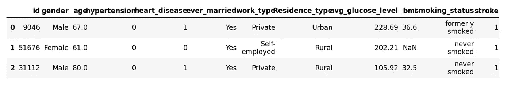
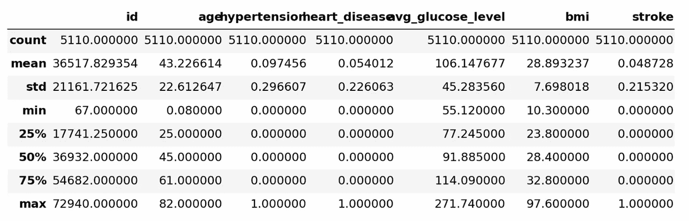
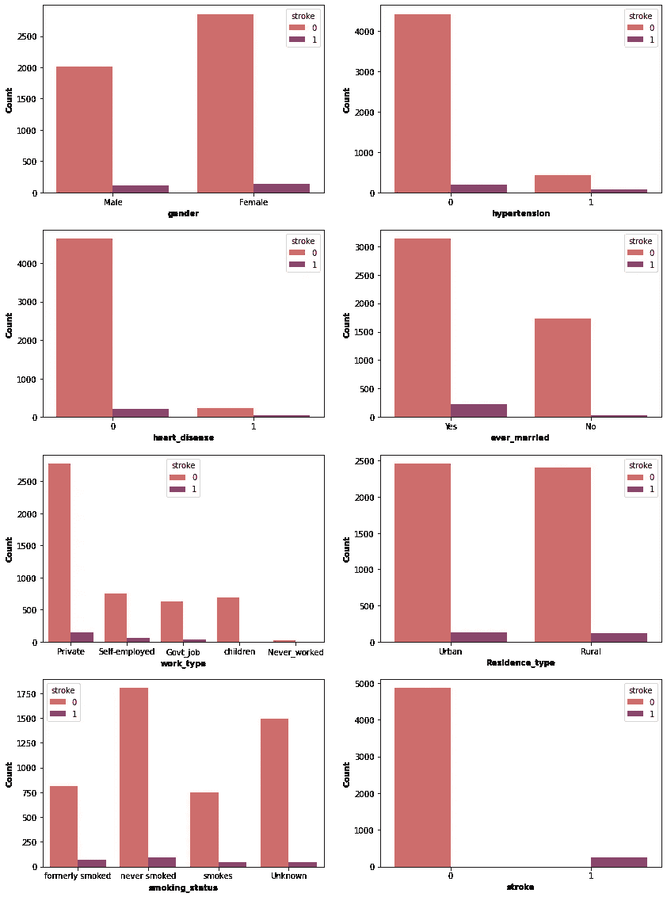
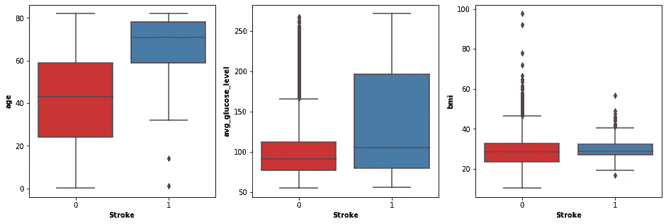
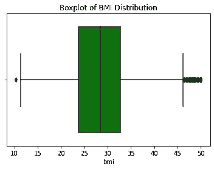
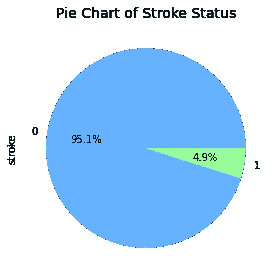
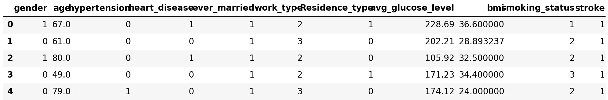
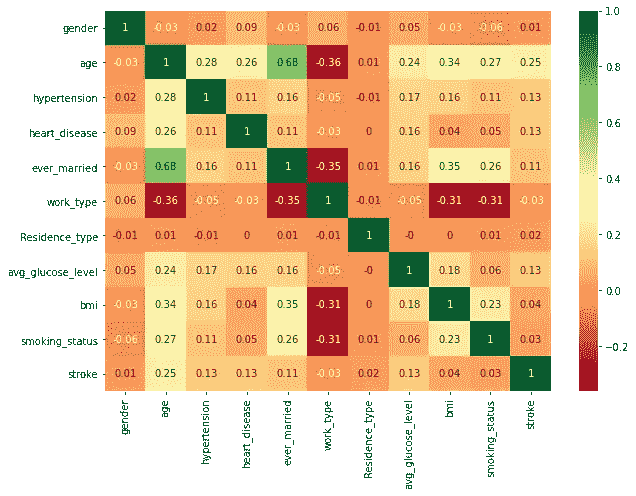
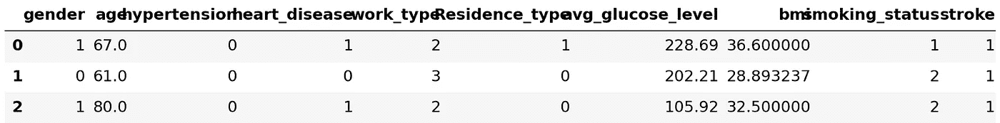
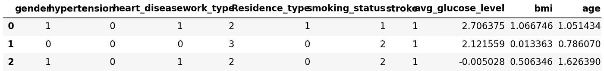

# 中风预测

> 原文：<https://medium.com/geekculture/stroke-prediction-d26c15f9d1?source=collection_archive---------1----------------------->

## 构建脑卒中风险预测模型


Photo by [Austrian National Library](https://unsplash.com/@austriannationallibrary?utm_source=medium&utm_medium=referral) on [Unsplash](https://unsplash.com?utm_source=medium&utm_medium=referral)

## 1.介绍

根据世界卫生组织(世卫组织)的数据，中风是全球第二大死亡原因和第三大残疾原因。中风是由于大脑动脉阻塞或破裂导致大脑血流减少时，由于缺氧而导致一些脑细胞突然死亡，它也是痴呆症和抑郁症的主要原因。

美国每年有近 80 万人患有中风，其中约四分之三是首次中风。80%的情况下这些中风是可以预防的，因此对中风的征兆进行适当的教育是非常重要的。

本研究的目的是构建一个预测中风的预测模型，并评估该模型的准确性。我们将探索七种不同的模型，看看哪种模型能产生可靠且可重复的结果。这些模型是:决策树、逻辑回归、随机森林、支持向量机、K 近邻、朴素贝叶斯和 K 均值聚类。根据模型的预测结果，最佳性能模型将经历交叉验证过程，以评估其可重复性。

## 2.数据源

本研究涉及 5110 人，其中女性 2995 人，男性 2115 人。本研究的数据集提取自 Kaggle 数据仓库(https://www.kaggle.com/datasets ),用于根据以下属性信息预测患者是否可能患中风:

```
1\.  id                : unique identifier
2\.  gender            : "Male", "Female" or "Other"
3\.  age               : age of the patient
4\.  hypertension      : 0 if the patient doesn't have hypertension, 1 if the patient has hypertension
5\.  heart_disease     : 0 if the patient doesn't have any heart diseases, 1 if the patient has a heart disease
6\.  ever_married      : "No" or "Yes"
7\.  work_type         : "children", "Govt_jov", "Never_worked", "Private" or "Self-employed"
8\.  Residence_type    : "Rural" or "Urban"
9\.  avg_glucose_level : average glucose level in blood
10\. bmi               : body mass index
11\. smoking_status    : "formerly smoked", "never smoked", "smokes" or "Unknown"
12\. stroke            : 1 if the patient had a stroke, 0 the patient do not have a stroke
```

## 3.导入库和数据

```
import numpy as np
import pandas as pd
import matplotlib.pyplot as plt
import seaborn as sns
%matplotlib inline
import warnings
warnings.filterwarnings(action='ignore')data = pd.read_csv('healthcare-dataset-stroke-data.csv')
data.head(3)
```



## 4.数据清理

```
data_row_count, data_column_count = data.shape
print('Row Count:', data_row_count)
print('Column Count:', data_column_count)Row Count: 5110
Column Count: 12data.info()<class 'pandas.core.frame.DataFrame'>
RangeIndex: 5110 entries, 0 to 5109
Data columns (total 12 columns):
 #   Column             Non-Null Count  Dtype  
---  ------             --------------  -----  
 0   id                 5110 non-null   int64  
 1   gender             5110 non-null   object 
 2   age                5110 non-null   float64
 3   hypertension       5110 non-null   int64  
 4   heart_disease      5110 non-null   int64  
 5   ever_married       5110 non-null   object 
 6   work_type          5110 non-null   object 
 7   Residence_type     5110 non-null   object 
 8   avg_glucose_level  5110 non-null   float64
 9   bmi                4909 non-null   float64
 10  smoking_status     5110 non-null   object 
 11  stroke             5110 non-null   int64  
dtypes: float64(3), int64(4), object(5)
memory usage: 479.2+ KBdata.isna().sum()id                     0
gender                 0
age                    0
hypertension           0
heart_disease          0
ever_married           0
work_type              0
Residence_type         0
avg_glucose_level      0
bmi                  201
smoking_status         0
stroke                 0
dtype: int64
```

身体质量指数要素中有 201 个缺失值。处理缺失值的一个简单方法是删除具有空值的行，但是这可能会删除不为空的数据。因此，我们将用 bmi 的平均值替代缺失值，并检查是否完成了插补。

```
data['bmi'] = data['bmi'].fillna(data['bmi'].mean())
data.info()<class 'pandas.core.frame.DataFrame'>
RangeIndex: 5110 entries, 0 to 5109
Data columns (total 12 columns):
 #   Column             Non-Null Count  Dtype  
---  ------             --------------  -----  
 0   id                 5110 non-null   int64  
 1   gender             5110 non-null   object 
 2   age                5110 non-null   float64
 3   hypertension       5110 non-null   int64  
 4   heart_disease      5110 non-null   int64  
 5   ever_married       5110 non-null   object 
 6   work_type          5110 non-null   object 
 7   Residence_type     5110 non-null   object 
 8   avg_glucose_level  5110 non-null   float64
 9   bmi                5110 non-null   float64
 10  smoking_status     5110 non-null   object 
 11  stroke             5110 non-null   int64  
dtypes: float64(3), int64(4), object(5)
memory usage: 479.2+ KBdata.describe()
```



## 4.1 身份证

```
data.id.nunique()5110
```

唯一 id 的总数与行数相同。我们不需要另一个标识符。因此，我们将删除该列。

```
data = data.drop(columns ='id')data.shape(5110, 11)
```

## 4.2 性别

```
data.gender.value_counts()Female    2994
Male      2115
Other        1
Name: gender, dtype: int64
```

性别需要被归类为二元变量。从分析的角度来看，为一个行值创建另一个变量(' Others ')会很繁琐。因此，我们将在这一列中用 mode 估算这个值。

```
data['gender'] = data['gender'].replace('Other', list(data.gender.mode().values)[0])
data.gender.value_counts()Female    2995
Male      2115
Name: gender, dtype: int64
```

## 5.探索性数据分析

## 5.1 分类特征分析

```
df_cat = ['gender','hypertension','heart_disease','ever_married','work_type','Residence_type','smoking_status', 'stroke']

fig, axs = plt.subplots(4, 2, figsize=(14,20))
axs = axs.flatten()

# iterate through each column of df_catd and plot
for i, col_name in enumerate(df_cat):
    sns.countplot(x=col_name, data=data, ax=axs[i], hue =data['stroke'], palette = 'flare')
    plt.title("Bar chart of")
    axs[i].set_xlabel(f"{col_name}", weight = 'bold')
    axs[i].set_ylabel('Count', weight='bold')
```



从上面的计数图中，可以得出一些观察结果:

*   高血压:先前诊断为高血压的受试者有很高的中风风险。
*   心脏病:先前诊断患有心脏病的受试者有很高的中风风险。
*   曾经结过婚:曾经结过婚的受试者患中风的风险很高。
*   工作类型:有工作经验和从事政府相关工作的受试者患中风的风险很高，而没有工作经验的受试者几乎没有经历过中风。
*   居住类型:与发生中风的可能性无明显关系。
*   吸烟状况:吸烟或曾经吸烟会增加患中风的风险。

## 5.2 数值特征分析

```
df_num = ['age', 'avg_glucose_level', 'bmi']

fig, axs = plt.subplots(1, 3, figsize=(16,5))
axs = axs.flatten()

# iterate through each column in df_num and plot
for i, col_name in enumerate(df_num):
    sns.boxplot(x="stroke", y=col_name, data=data, ax=axs[i],  palette = 'Set1')
    axs[i].set_xlabel("Stroke", weight = 'bold')
    axs[i].set_ylabel(f"{col_name}", weight='bold')
```



从上面的箱线图中，可以得出一些观察结果:

*   年龄:中风患者的平均年龄更高。
*   平均血糖水平:中风患者的平均血糖水平往往较高。
*   身体质量指数:身体质量指数并不能说明患中风的可能性。超级肥胖的 bmi 指数是 50。此功能中的异常值应被替换到其最高限制(50)。

总共检测到 79 个异常值。

```
bmi_outliers=data.loc[data['bmi']>50]
bmi_outliers['bmi'].shape(79,)
```

将 bmi 列中大于 50 的值替换为 50。

```
data["bmi"] = pd.to_numeric(data["bmi"])
data["bmi"] = data["bmi"].apply(lambda x: 50 if x>50 else x)
```

通过绘制 bmi 列的箱线图来确认所做的更改。

```
sns.boxplot(data=data,x=data["bmi"],color='green')
plt.title("Boxplot of BMI Distribution");
```



```
plt.figure(figsize=(4,4))
data['stroke'].value_counts().plot.pie(autopct='%1.1f%%', colors = ['#66b3ff','#99ff99'])
plt.title("Pie Chart of Stroke Status", fontdict={'fontsize': 14})
plt.tight_layout()
```



该数据集中 4.9%的人口被诊断患有中风

## 5.3 多重共线性分析

由于相关性检查只接受数字变量，预处理分类变量成为一个必要的步骤，我们需要将这些分类变量转换成编码为 0 或 1 的数字。我们使用 sklearn.preprocessing 的 labelEncoder，因为如果需要的话，在预测之后可以很容易地将特定的标签解码回来。

```
from sklearn.preprocessing import LabelEncoderle = LabelEncoder()

data['gender'] = le.fit_transform(data['gender'])
data['ever_married'] = le.fit_transform(data['ever_married'])
data['work_type'] = le.fit_transform(data['work_type'])
data['Residence_type'] = le.fit_transform(data['Residence_type'])
data['smoking_status'] = le.fit_transform(data['smoking_status'])

df_en = datadf_en.head()
```



```
corr = df_en.corr().round(2)
plt.figure(figsize=(10,7))
sns.heatmap(corr, annot = True, cmap = 'RdYlGn');
```



从上面的相关矩阵中，我们可以验证某些变量之间存在多重共线性。例如，ever_married 和 age 列的相关性为 0.68。在这两个属性中，年龄包含了关于一个人是否易患中风的更多信息。因此，我们将删除曾经结婚一栏。

```
df_en = df_en.drop(['ever_married'], axis = 1)df_en.head(3)
```



## 5.4 最终预处理

不同尺度下测量的变量对模型拟合的贡献不同，最终可能会产生偏差。因此，为了处理这个潜在的问题，通常在模型拟合之前使用特征标准化(μ=0，σ=1)。我们创建了一个 StandardScaler()对象，然后应用 fit_transform()函数对“avg_glucose_level”、“bmi”和“age”列应用标准化。

```
from sklearn.preprocessing import StandardScaler
s = StandardScaler()columns = ['avg_glucose_level','bmi','age']
stand_scaled = s.fit_transform(df_en[['avg_glucose_level','bmi','age']])
stand_scaled = pd.DataFrame(stand_scaled,columns=columns)

df_en=df_en.drop(columns=columns,axis=1)stand_scaled.head()
```


```
df = pd.concat([df_en, stand_scaled], axis=1)
df.head(3)
```



## 6.系统模型化

所有预测变量将映射到数组 x，目标变量映射到数组 y。目标变量是“stroke”列。

```
x=df.drop(['stroke'], axis=1)
y=df['stroke']# Models
from sklearn.model_selection import train_test_split
from sklearn.tree import DecisionTreeClassifier
from sklearn.linear_model import LogisticRegression
from sklearn.ensemble import RandomForestClassifier
from sklearn.svm import SVC
from sklearn.neighbors import KNeighborsClassifier
from sklearn.naive_bayes import GaussianNB
from sklearn.cluster import KMeans

# Evaluation
from sklearn.metrics import confusion_matrix, accuracy_score, classification_report

x_train, x_test, y_train, y_test = train_test_split(x, y, test_size=0.3, random_state= 124)
```

用它们的参数建立模型并将它们存储到字典中。我们将探讨 7 种算法，看看哪种算法能产生可靠且可重复的结果。这 7 种算法是:

*   决策图表
*   逻辑回归
*   随机森林
*   支持向量机
*   k 最近邻
*   朴素贝叶斯
*   k 均值聚类

```
models = dict()
models['Decision Tree'] = DecisionTreeClassifier()
models['Logreg'] = LogisticRegression()
models['Random Forest'] = RandomForestClassifier()
models['Support Vector Machine'] = SVC(kernel = 'sigmoid', gamma='scale')
models['kNN'] = KNeighborsClassifier()
models['Naive Bayes'] = GaussianNB()
models['KMeans'] = KMeans(n_clusters=2, n_init=10, random_state=42)for model in models:

    models[model].fit(x_train, y_train)
    print(model + " model fitting completed.")Decision Tree model fitting completed.
Logreg model fitting completed.
Random Forest model fitting completed.
Support Vector Machine model fitting completed.
kNN model fitting completed.
Naive Bayes model fitting completed.
KMeans model fitting completed.print("Test Set Prediction:\n")

for x in models:

    print('-'*20+x+'-'*20)
    model = models[x]
    y_pred = model.predict(x_test)
    arg_test = {'y_true':y_test, 'y_pred':y_pred}
    print(confusion_matrix(**arg_test))
    print(classification_report(**arg_test))Test Set Prediction:

--------------------Decision Tree--------------------
[[1398   66]
 [  63    6]]
              precision    recall  f1-score   support

           0       0.96      0.95      0.96      1464
           1       0.08      0.09      0.09        69

    accuracy                           0.92      1533
   macro avg       0.52      0.52      0.52      1533
weighted avg       0.92      0.92      0.92      1533

--------------------Logreg--------------------
[[1464    0]
 [  69    0]]
              precision    recall  f1-score   support

           0       0.95      1.00      0.98      1464
           1       0.00      0.00      0.00        69

    accuracy                           0.95      1533
   macro avg       0.48      0.50      0.49      1533
weighted avg       0.91      0.95      0.93      1533

--------------------Random Forest--------------------
[[1463    1]
 [  69    0]]
              precision    recall  f1-score   support

           0       0.95      1.00      0.98      1464
           1       0.00      0.00      0.00        69

    accuracy                           0.95      1533
   macro avg       0.48      0.50      0.49      1533
weighted avg       0.91      0.95      0.93      1533

--------------------Support Vector Machine--------------------
[[1412   52]
 [  64    5]]
              precision    recall  f1-score   support

           0       0.96      0.96      0.96      1464
           1       0.09      0.07      0.08        69

    accuracy                           0.92      1533
   macro avg       0.52      0.52      0.52      1533
weighted avg       0.92      0.92      0.92      1533

--------------------kNN--------------------
[[1457    7]
 [  66    3]]
              precision    recall  f1-score   support

           0       0.96      1.00      0.98      1464
           1       0.30      0.04      0.08        69

    accuracy                           0.95      1533
   macro avg       0.63      0.52      0.53      1533
weighted avg       0.93      0.95      0.94      1533

--------------------Naive Bayes--------------------
[[1310  154]
 [  41   28]]
              precision    recall  f1-score   support

           0       0.97      0.89      0.93      1464
           1       0.15      0.41      0.22        69

    accuracy                           0.87      1533
   macro avg       0.56      0.65      0.58      1533
weighted avg       0.93      0.87      0.90      1533

--------------------KMeans--------------------
[[ 266 1198]
 [   2   67]]
              precision    recall  f1-score   support

           0       0.99      0.18      0.31      1464
           1       0.05      0.97      0.10        69

    accuracy                           0.22      1533
   macro avg       0.52      0.58      0.20      1533
weighted avg       0.95      0.22      0.30      1533
```

注意，召回可以被认为是分类器完整性的度量。中风(1)的低召回率表示许多假阴性。

```
print('Summary of Accuracy Score\n\n')
for i in models:
    model = models[i]
    print(i + ' Model: ',accuracy_score(y_test, model.predict(x_test)).round(4))Summary of Accuracy Score

Decision Tree Model:  0.9159
Logreg Model:  0.955
Random Forest Model:  0.9543
Support Vector Machine Model:  0.9243
kNN Model:  0.9524
Naive Bayes Model:  0.8728
KMeans Model:  0.2172
```

从以上准确度总结来看，逻辑回归、随机森林和 KNN 模型都给出了 0.95 的高准确度分数。但是，考虑每个模型的错误类型和召回值也很重要。如混淆矩阵所示，准确度分数为 0.95 的模型通常具有较高的假阴性。高假阴性表示 2 型错误。对于我们的中风预测研究，我们希望避免 2 型错误，因为这意味着我们无法识别患有中风的受试者，而是认为他们没有中风。从上面的分类报告来看，朴素贝叶斯模型符合我们的目标，虽然准确率为 0.87。

## 7.交互效度分析

```
from sklearn.model_selection import cross_val_score

gnb = GaussianNB()

scores = cross_val_score(gnb, x_train, y_train, cv = 10, scoring='accuracy')

print('Cross-validation scores:{}'.format(scores))Cross-validation scores:[0.87430168 0.84916201 0.88826816 0.87709497 0.89944134 0.88547486
 0.86592179 0.86554622 0.86834734 0.85714286]print('Average cross-validation score: {:.4f}'.format(scores.mean()))Average cross-validation score: 0.8731
```

*   使用平均交叉验证，我们可以得出结论，我们预计该模型的平均准确率约为 87.31%。
*   如果我们观察由 10 倍交叉验证产生的所有 10 个分数，我们也可以得出结论，在各倍之间的准确度存在相对较小的方差，范围从 84.91%准确度到 89.94%准确度。因此，我们可以得出结论，该模型独立于用于训练的特定褶皱。
*   我们的原始模型精度是 0.8728，但是平均交叉验证精度是 0.8731。因此，10 倍的交叉验证准确性确实提高了该模型的性能。

## 8.结论

1.  使用各种模型来预测一个人是否遭受中风。朴素贝叶斯模型产生了非常好的性能，如通过发现的 87.28%的模型准确度所表明的。
2.  使用平均交叉验证，我们可以得出结论，我们预计该模型的平均准确率约为 87.31%。
3.  如果我们观察由 10 倍交叉验证产生的所有 10 个分数，我们也可以得出结论，折叠之间的准确性存在相对小的差异，因此该模型独立于用于训练的特定折叠。
4.  我们的原始模型准确率为 87.28%，平均交叉验证准确率为 87.31%。因此，10 倍的交叉验证准确性确实提高了该模型的性能。
5.  朴素贝叶斯模型可以通过调整超参数得到更好的结果或调整概率阈值来改善其性能。