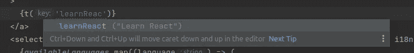

# React 中的强类型 I18N

> 原文：<https://medium.com/geekculture/strong-typed-i18n-in-react-c43281de720c?source=collection_archive---------2----------------------->

将 i18n 支持添加到您的应用程序可能会很痛苦。将所有文本字符串从 JSX 提取到翻译文件，并用密钥替换它们是一项细致单调的工作。一个小小的拼写错误和哎呀你得到了一个错误。但是如果我告诉你，你可以使用 TypeScript 来验证翻译呢？


这个想法非常简单:翻译以键值字典的形式存储在 JSON 文件中，TypeScript 能够解析它们并确定翻译字典的类型，我们称这种类型为`Translation`。任何流行的 i18n 解决方案都提供了一个通过 key 获取翻译后的字符串的函数，姑且称之为`t`。所以，你唯一需要做的就是确保传递给`t`函数的键具有`keyof Translation`类型。因此，TypeScript 将验证所有转换键，并在您的 IDE 中自动完成它们。

让我展示一个如何在`react-i18next`库中使用这种技术的例子。

# react-i18 接下来


[React-i18next](https://react.i18next.com/) 是 [i18next 框架](https://www.i18next.com/)的 React 包装器。它支持国际化所需的所有特性，如翻译模板、名称空间、动态翻译加载等等。另外`i18next`有其他前端框架的适配器，如 VueJS、AngularJS 和许多后端框架，你可以在这里找到完整的列表。

好，让我们先创建一个支持 TypeScript 的 React 应用程序:

```
yarn create react-app my-app --template typescript
```

现在，我们有了一个标准的 Create React 应用程序项目。让我们添加`i18next`库:

```
yarn add react-i18next i18next i18next-browser-languagedetector
```

让我们为英语和德语添加两个翻译文件:

现在我们可以初始化`i18next`:

如你所见，我已经添加了`LanguageDetector`插件。这是一个非常有用的工具来检测用户的首选语言。如果你想定制它的行为，请点击查看文档[。](https://github.com/i18next/i18next-browser-languageDetector)

最后一步，加入`i18next`反应组分。让我们修改一下`App.tsx`:

`i18next`可通过`useTranslation`挂钩接近。在这个例子中，我用本地化值替换了“Learn React ”,并添加了一个非常简单的语言选择器。

# 打字稿魔术

现在是时候通过将该文件添加到`./src`来配置 TypeScript 以检查翻译键了:

这里发生了什么？我已经重载了`react-i18next`typing，现在 TypeScript 知道翻译文件的格式了。如果我们试图使用一个不正确的翻译键，例如`learnReac`，我们会得到这个错误:

```
Failed to compile./blog/typed-i18n/src/App.tsx
TypeScript error in /blog/typed-i18n/src/App.tsx(21,14):
No overload matches this call.
  Overload 1 of 2, '(key: "learnReact" | TemplateStringsArray | ("learnReact" | TemplateStringsArray)[], options?: string | TOptions<StringMap> | undefined): string', gave the following error.
    Argument of type '"learnReac"' is not assignable to parameter of type '"learnReact" | TemplateStringsArray | ("learnReact" | TemplateStringsArray)[]'.
  Overload 2 of 2, '(key: "learnReact" | TemplateStringsArray | ("learnReact" | TemplateStringsArray)[], defaultValue?: string | undefined, options?: string | ... 1 more ... | undefined): string', gave the following error.
    Argument of type '"learnReac"' is not assignable to parameter of type '"learnReact" | TemplateStringsArray | ("learnReact" | TemplateStringsArray)[]'.  TS276919 |           rel="noopener noreferrer"
    20 |         >
  > 21 |           {t('learnReac')}
       |              ^
    22 |         </a>
    23 |         <select defaultValue={i18n.language} onChange={(e) => i18n.changeLanguage(e.target.value)}>
    24 |           {availableLanguages.map((language) => (
```

此外，IDE 将建议自动完成选项，在这种情况下:



# 结论

老实说，在我开始使用`react-i18next`之前，我不知道有可能使翻译类型安全。这是一个惊人而有用的特性，它使得国际化过程变得更加简单。在本文中，我分享了一个简单的概念证明，它可以通过使用任何`react-i18next`特性进行扩展，比如名称空间和插值。示例源代码可在[这里](https://github.com/lucky-libora/blog-typed-react-i18n)获得。

希望这个话题对你有帮助。如果你有任何问题，请随意写评论。

*下次见！Servus！*