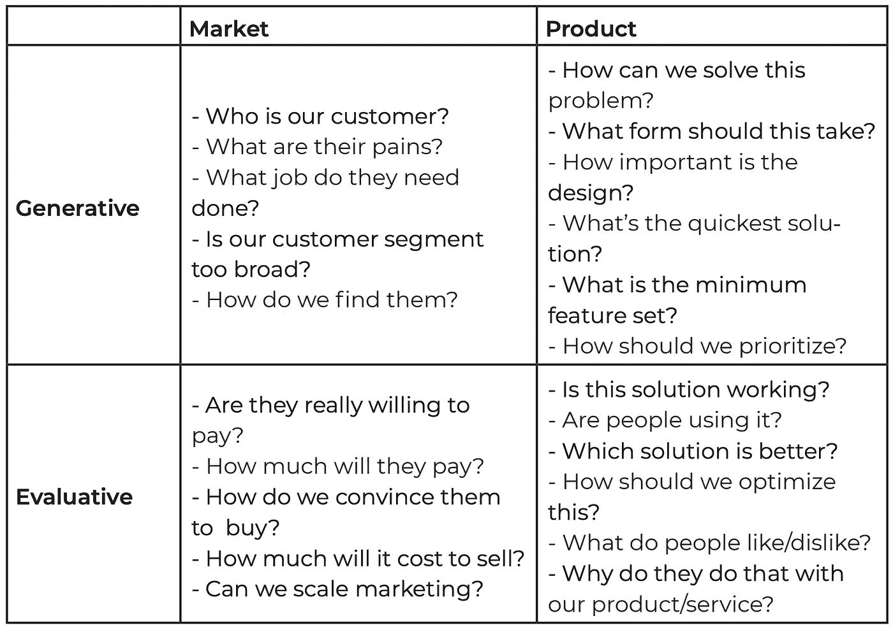
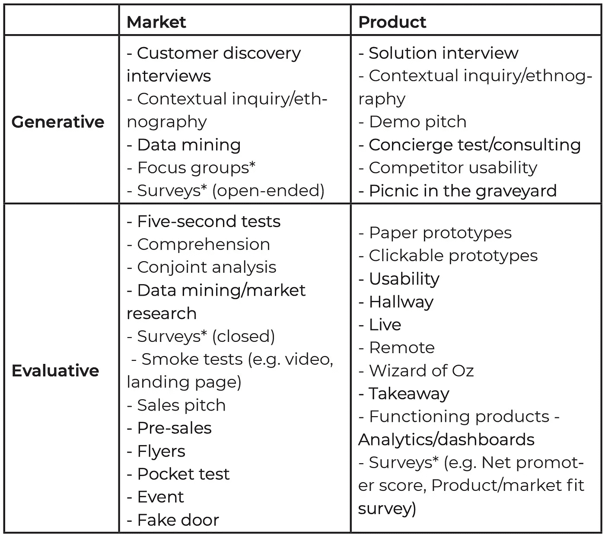

# 产品管理中的结构化思维

> 原文：<https://medium.com/geekculture/structured-thinking-in-product-management-37ba50171ca7?source=collection_archive---------3----------------------->


Photo: Westend61/Getty Images

产品经理不断被要求解决问题。可以说这是我们的工作。对于我们中的许多人来说，涉众每天都会向我们提出类似“添加这个集成”或者“构建这个特性”的请求这就是雷区所在——你必须能够在永无止境的机会、症状、问题和解决方案的海洋中进行筛选，以 1)了解真正的问题/机会 2)评估它是否是一个值得解决的问题/机会，3)有效地开发能够带来结果的解决方案。这可能令人望而生畏。

在本帖中，我们将讨论以下主题:

```
**1\. Prioritize your time and make better decisions****2\. Scope the problem/opportunity**
- Symptoms
- Success
- Constraints
- Actors**3\. Frame the problem**
- Question burst
- Constrained questions**4\. Decompose the problem**
- Create an equation
- Behavioral pressures
- Jobs to Be Done
- User Interviews**5\. State your hypothesis** - Uncover implicit assumptions**6\. Identify and manage risks** - Four types of risk
- Conduct a premortem
- Reduce risk with cheap tests
```

这篇文章的目标是扩展 OKRs 为高层次组织思维提供的同样的严谨性和结构，一直到分解和解决个体问题。我知道这远不是一个原创的想法，但是，我坚信给这个过程添加结构是有价值的。

# 1.优先安排你的时间，做出更好的决定

在这篇文章中，我不打算尝试解决整个产品优先级主题；已经有很多关于这方面的文章了。相反，我想指出产品经理的无声杀手——决策疲劳。我们要为做出如此多的决定负责，我们不能对每一个决定都过于严格。

在做出决定之前，问自己以下问题:

*   这个决定容易逆转吗？想象一下，如果你尝试了某件事，但你不喜欢它的结果，你能轻易地改变方向，尝试别的事情吗？杰夫·贝索斯把退出成本低的决策称为双向决策。如果你可以用很少的成本多咬几口苹果，就不要在这里花费太多的精力。
*   决定的幅度有多大？即使你打错了电话，不能再试，最坏的情况是什么？如果潜在的不利因素是有限的(包括机会成本)，很可能就不值得花很多时间做决定。
*   这个决策的结果会帮助你的团队完成既定的目标吗？如果不是，首先深入思考你为什么要做这个决定。
*   你需要什么信息来提高你的决策质量？有可能得到这个信息吗？如果是，需要多少努力/时间？等待更多信息很诱人，但时间是必须考虑的真实成本。

我承认，我提倡在做决定之前花更多的时间评估决定，这有点讽刺。**我认为这种深思熟虑有助于对抗专注于最容易理解的问题而不是最有价值的问题的自然倾向。**

**附加资源**

*   [作为产品经理做出正确的决策](https://blackboxofpm.com/making-good-decisions-as-a-product-manager-c66ddacc9e2b)
*   [Gokul 的 S.P.A.D.E .工具包:如何实现 Square 著名的决策框架](https://coda.io/@gokulrajaram/gokuls-spade-toolkit)
*   [产品策略意味着说不](https://www.intercom.com/blog/product-strategy-means-saying-no/)
*   [我们如何在比特币基地做决定](/@barmstrong/how-we-make-decisions-at-coinbase-cd6c630322e9)

# 2.确定问题/机会的范围

*注意:这一部分对许多人来说可能非常明显，但是，我认为明确说明这一点很重要，因为我已经看到了太多的问题，因为人们在基本原则上不一致。*

有时候，首先应该问的不是问题是什么，而是，我知道的足够多了吗？在开始之前，确保你能够清楚地描述由于问题/机会而产生的问题(或者我称之为症状)，清楚地说明成功是什么样子，理解你工作中的限制，并准确地确定你需要与之共事的不同人群。我们将在下面详细介绍每一项。

## 症状

对于每一个问题或机会，在你目前的位置(观察)和你想要的位置(渴望)之间都有差距。这些差距代表了有待确定的更广泛问题的症状。这听起来很简单，但是能够清楚地表达症状是这个过程中非常重要的一部分。

识别症状时需要考虑的一些提示:

*   **解释不是症状。**例如，有人可能会说用户界面令人困惑。这不是一个症状——这是某人对一个更基本问题的解释。区分症状和解释是很重要的，因为如果你从表面上接受解释，你可能会排除其他潜在的解释。
*   **具体一点，现在问为什么**。解决大范围的模糊问题是不可能的。为了解决这个问题，请确保症状定义明确且及时。如果现实和愿望之间的差距是一个永恒的问题，就像“我们想赚更多的钱”，这是一个太模糊的症状，无法采取行动。
*   **考虑外部/环境因素。**你不是在真空中工作——重要的是要注意环境的变化是如何导致症状或创造机会的。

## 成功

如果你不清楚成功是什么样子，就很难解决问题。问下面的问题是一个有用的技巧，可以确保你的团队是一致的，你不会掉进用解决方案定义问题的陷阱。

```
We are in the future and this project has been a great success. What is the date, and what do we see?
```

弄清楚如何衡量成功可能很困难。一个有用的技术是[水晶球测试](/the-year-of-the-looking-glass/building-products-91aa93bea4bb)，你要求`If I could know anything about how people are using my product, what would I want to know in order to tell me whether or not my product was successful?`思考人们将如何受益于当前的基线——这种改进的可观察到的副产品是什么？跟着价值走。

## 限制

很重要的一点是，要清楚自己所处的环境，这样你才能在探索解决方案时理解其局限性。

*   你有多少时间？截止日期背后的原因是什么？
*   有哪些资源可用？
*   开发解决方案时的风险偏好是什么？
*   成功指标的限制是什么？

最后一点，[反公制护栏](https://uxdesign.cc/wtf-is-your-metric-doing-to-your-customers-473942ea3829)的概念很有帮助。例如，你可以通过将产品成本减半来提高注册转化率，但这现实吗？尽早进行这些讨论将有助于澄清界限并理解什么样的权衡是可接受的。

## 演员

从最终用户到利益相关者，重要的是要明确:

*   谁有这些症状
*   谁负责这个项目的各个方面
*   谁最终对成功负责(提示:可能是你，总理。)
*   在开发解决方案时，应该咨询谁，需要谁批准

一旦你收集了尽可能多的信息，与你的团队一起回顾，以确保每个人都是一致的。可能会有你不完全清楚的地方——这是意料之中的。你现在有明确的已知未知，而不是隐含的假设。

# 3.框定问题

> 很多时候问题比答案更难。如果你能恰当地表达这个问题，那么答案就简单了。
> 
> -埃隆·马斯克

当你试图解决一个棘手的挑战时，框定问题是你所做的最重要的步骤之一，然而它经常被忽视。你有没有遇到过这样的情况:有人问了一个事后看来非常明显的问题，却戏剧性地改变了你解决问题的方式，让你大吃一惊？这就是好框架的力量。这些“催化”问题可以揭示盲点，开辟新的探索之路。

在缩小框架以创造焦点和扩大框架以鼓励创造性解决方案之间存在一种天然的张力。在确定问题范围时，应该通过与更广泛的团队讨论约束来解决这种紧张关系。然而，重要的是要考虑到专注对于分析选项是强大的，但是对于发现它们却是可怕的。一般的经验法则是在问题探索的早期阶段保持尽可能宽的框架。

下面是一些技巧，可以帮助你发现催化性问题，这些问题可能会改变你解决问题的方式。

## 问题爆发

在 Hal Gregersen 的书[中，问题就是答案](https://www.amazon.com/Questions-Are-Answer-audiobook/dp/B07HCLGGF6)，他建议召集一个跨职能的利益相关者小组，向他们提供问题的高层次概述(症状、成功、限制、参与者)。与其让小组集体讨论解决方案，不如让他们集体讨论问题。为了解决问题，他们想知道什么？他们对问题中隐含的假设有什么疑问？虽然许多问题是显而易见的，但一些问题可能会跳出来，让你从不同的角度思考这个问题。

## 受限制的问题

想想你正在操作的问题空间。可能有很多你想回答的问题。现在考虑为了有效地解决问题，回答什么问题是最重要的。如果你只能问两个问题，会是什么？做这个思考练习迫使你深入思考什么是真正重要的。你经常会发现，通过回答一个真正好的问题，许多其他问题也会得到回答。

**其他资源**

*   [特征问题:框架问题的艺术](https://coda.io/@shishir/eigenquestions-the-art-of-framing-problems)

# 4.分解问题

既然您已经确定了问题的范围和框架，那么就很容易一头扎进去，开始想出解决方案。然而，花时间从多个角度来分解问题是很重要的，这样你就可以识别单个组件并理解它们如何影响整体。

没有一个放之四海而皆准的方法来分解一个问题，你的问题的性质将决定什么是最有意义的。以下是我发现特别有帮助的几个出发点。

## 创建一个等式

你的产品团队(希望)已经在进行分析工作，所以这应该是一个将问题分解成更小部分的简单方法。试着从业务指标的角度(收入、客户流失、LTV 等)考虑这个领域。)和用户行为视角(用户目标、实现目标的关键行动以及与这些行动相关的度量)。

例如，当我在 NBC News 担任产品经理时，我创建了这个等式来代表他们的代销商业务的基本原则:

`Total affiliate revenue = Page views per article X Revenue per article X # of articles published`

一旦你第一次通过了方程，下一步就是将每个部分分解成更小的子部分(如下例)。您可以利用这一点来了解业务和产品的各个杠杆是如何相互作用的。它还允许您理解对产品的不同部分进行改进的潜在影响——一些部分可能比其他部分具有更好的 ROI 潜力。


## 行为压力

归结起来，解决方案通常只是在一群人中创造一种行为改变。人们目前在做 X，我们希望他们做 y。在马特·沃勒特的书[Start In the End](https://www.amazon.com/Start-End-Products-Create-Change-ebook/dp/B07L2HM12P/)中，他从行为变化和压力的角度概述了分解问题的过程——导致行为或多或少可能发生的因素。

要做到这一点，试着写一个行为声明。行为陈述是对我们试图创造的世界的描述，从用户行为的角度来写(非常类似于用户故事)。行为陈述的简化版“mad-libs”是:

`When [population] want to [motivation], they will [behavior] (as measured by [data]).`

*   **人群** =你想改变其行为的一群人。
*   动机=为什么人们会有这种行为？是什么驱使他们这样做？他们雇佣你的产品做什么工作？
*   **行为** =你希望看到改变的行为是什么？
*   **数据** =你将如何衡量行为？

这方面的一个例子是`When business professionals in NYC want to get from point A to point B, they will take a Lyft (as measured by rides).`

一旦你有了自己的行为声明，就和你的团队一起想出以下方法:

*   **促进压力** =什么会鼓励想要的行为？
*   **抑制压力** =什么会阻碍想要的行为？

你的团队提出的许多想法都不相关，或者超出了你的影响能力——这没关系。可能会有一部分人很有见地，会让你从不同的角度考虑问题。

## 要做的工作

类似于从行为改变的角度思考问题，你可以通过[要做的工作](https://jtbd.info/2-what-is-jobs-to-be-done-jtbd-796b82081cca)来思考问题——这是一个由克莱顿·克里斯滕森开发的框架。用户雇佣你的产品是为了完成什么工作？用户做这项工作的动机是什么？如果你陷入了困境，这种宏观的视角会很有帮助。

## 用户访谈

分析会告诉你什么，但不会告诉你为什么。为此，你需要收集定性反馈。这里有一些策略可以帮助你更深入地理解这个问题:

五个为什么——屡试不爽。对于问题探索步骤中列出的每个症状，尝试与不同参与者一起完成 [5 个为什么练习](/pm101/learn-about-the-five-whys-technique-78283d75800f)。为什么的数量并不重要，它只是一个帮助你剥开洋葱皮和理解症状根源的指南。

**妈妈测试**——Rob Fitzpatrick 在他的同名[书中概述了这个过程](http://momtestbook.com/)。本质上，这只是一次有针对性的用户访谈——之所以这样命名，是因为爱和支持孩子的妈妈们很可能会给出令人鼓舞的答案，而这些答案可能会把你引入歧途。在菲茨帕特里克的指导下，读者学会了如何提问，即使是一位母亲也会诚实地回答。Mom 测试的核心原则是:

*   谈论他们的生活/经历。不要谈论你对解决方案的想法或你对问题的看法。
*   询问过去的细节，而不是泛泛而谈或对未来的看法。人们通常不擅长准确预测自己未来的行为。
*   少说多听。

不管这些对话使用什么技巧，试着梳理出以下信息:

*   用户今天表现如何？
*   是什么影响了他们的选择和行动？
*   什么让用户感到沮丧和/或受到激励？
*   用户目前是如何做出决策、花费他们的金钱/注意力，并最终决定价值的？

当与人谈论问题时，要记住的最重要的事情是，你不允许告诉别人他们的问题是什么，作为回报，他们也不允许规定解决方案。在通常情况下，他们确实试图给你解决方案，这取决于你是否理解他们建议背后的基本原理。他们拥有问题，你拥有解决方案。

# 5.陈述你的假设

> 许多人认为他们在思考，但他们几乎是在重新整理他们的偏见。
> 
> 威廉·詹姆斯

任何时候，产品经理想要创造或改变一个产品，他们这样做是因为他们认为这会导致一些事情发生。他们有一个假设，即使没有写下来。人们经常对问题、机会和解决方案有模糊的想法，但他们不会花时间去明确他们所陈述的是什么，或者他们的提议要成功必须是什么。**写一个清晰的假设，并使其隐含的假设显而易见，这对于清晰地思考、发现偏差以及在整个团队中建立一致性至关重要。**

在其最基本的形式中，假设只是一个预期因果的清晰命题。

`If we do X, then we expect Y to happen (as measured by Z).`

每个假设都包含假设——它们是免费的！不幸的是，隐含的假设经常是有缺陷的，但却被认为是正确的。好消息是，验证或否定你的假设通常比对你的原始假设进行实验要容易得多。

## 揭示隐含的假设

为了揭开隐含的假设，问问你自己`What would have to be true for the proposal under consideration to work out fantastically?`。例如，假设我们有以下假设:

```
If we implement Apple Pay in the checkout flow, then we expect more customers to complete checkout, as measured by checkout conversion rate.
```

为了验证这个假设，我们必须通过一个[适当的实验设计过程](https://www.producttalk.org/2017/08/experiment-design/)，在这个过程中我们会设定成功标准、实验持续时间等。然后实际构建 Apple Pay 集成。如果在继续之前，我们花时间揭示隐含在假设中的假设会怎么样？我们会意识到我们的假设包含以下假设:

*   试图购买我们产品的相当一部分用户希望在结账时使用 Apple Pay。
*   想要使用 Apple Pay 的用户中有相当一部分在结账时放弃了，因为他们首选的支付方式不可用。

有了对假设的清晰理解，你就可以开始思考如何识别风险，并创建廉价的测试来及早发现风险——下文将对此进行详细介绍。

# 6.识别和管理风险

创造新功能或新产品的过程可能是有风险的。风险本质上并不坏，但它们是产品经理需要确保理解和管理的东西。

总是试图最小化风险是很诱人的；这在某些情况下是有意义的。例如，优化可以是低风险、高回报的活动。然而，最终你会到达收益递减点，然后你需要进入未知的创造新事物的世界。

## 四种风险

驾驭产品风险世界的第一步是能够识别所有不同类型的风险。马蒂·卡甘有这个[伟大的框架](https://svpg.com/four-big-risks/):

*   价值风险(Value risk)——人们会发现我们提议构建的东西有用吗？
*   可用性风险——人们能想出如何使用它吗？
*   **可行性风险**——在给定可用资源的情况下，我们真的能造出我们想要的东西吗？这包括技术风险和交付风险。
*   **生存风险** —该产品/功能对业务有意义吗？它有合适的市场规模吗？

作为一名产品经理，你的主要责任将是拥有价值和生存风险，然而，为了从你的团队获得最好的结果，你需要确保你授权设计师和工程师在所有领域做出贡献。一个有用的技术是预死亡。

## 进行预验尸

premortem 是 Gary Klein 开发的一种工具，用于帮助团队在项目开始时识别风险并建立一致性。首先，召集你的跨职能团队，让他们想象现在是目标发布日期的第二天，事情进展不顺利。从这个想象的未来的角度来看，让每个人独立写下事情不顺利的五个原因，这些原因是由于团队的行动或决策造成的。另外，列出五个你无法控制的事情导致失败的原因。最后，请团队尝试确定最大的未知因素(显然这些不容易预测，但值得讨论)。

如果你想了解更多关于如何进行有效的预死亡，我强烈推荐[这篇由 Shreyas Doshi 写的文章](/@shreyashere/how-to-use-pre-mortems-to-prevent-problems-blunders-and-disasters-6ecc6df6e22a)。

## 通过廉价测试降低风险

风险是由不确定性导致的，不确定性是什么会产生预期的结果。减少不确定性的决定性方法是发布一个新功能或产品，并衡量其影响——但这是昂贵的。当产品团队依赖运送最终产品作为他们“测试”是否会产生预期结果的主要方法时，时间和机会成本最大化。我们都知道 MVP 的概念，但是一个更有帮助的概念是 RAT — [最危险假设测试](https://hackernoon.com/the-mvp-is-dead-long-live-the-rat-233d5d16ab02)。

对于上面列出的每一种风险类型，通常都有一些实验可以用相对较少的成本快速获得信息。虽然这些实验不会给你明确的答案，但它们可以提供方向性的反馈，用于决定是否需要额外的投资或路线修正。

在之前关于实施 Apple Pay 以提高结账转换率的例子中，我们发现假设中隐含的两个假设是:

*   试图购买我们产品的相当一部分用户希望在结账时使用 Apple Pay。
*   想要使用 Apple Pay 的用户中有相当一部分在结账时放弃了，因为他们首选的支付方式不可用。

这两个假设都必须为真，假设才会为真。知道了这一点，我们可以很容易地将这些假设转化为他们自己的假设，并创建一个快速实验来了解 1)如果 Apple Pay 是一个选项，有多少百分比的用户会在结账流程中选择 Apple Pay，以及 2)当这些用户发现点击 Apple Pay 会导致他们出现“即将到来”的提示时，有多少百分比的用户会决定放弃。

这是一个“油漆门”测试的例子，但根据你的具体情况，还有许多其他类型的测试。Kromatic 的 Tristan Kromer 创建了一个奇妙的(免费的)资源，名为 [The Real Startup Book](https://www.amazon.com/Real-Startup-Book-Product-Customers-ebook/dp/B07ZJZ6TD5) ，它提供了一个全面的指南，介绍如何对产品进行廉价测试。

为了帮助澄清你需要学习什么来降低风险，他把事情分成了四个象限:

*   **市场问题 vs 产品问题** —你需要了解市场/客户/难题还是产品/价值主张/解决方案？
*   **生成性问题 vs 评价性问题** —你是否有一个可证伪的假设要检验，或者你需要生成一个清晰的想法？



Source: [The Real Startup Book](https://www.amazon.com/Real-Startup-Book-Product-Customers-ebook/dp/B07ZJZ6TD5)

每个问题象限都配有多个运行成本低廉的实验，以及如何运行这些实验的详细说明。



Source: [The Real Startup Book](https://www.amazon.com/Real-Startup-Book-Product-Customers-ebook/dp/B07ZJZ6TD5)

我强烈推荐这个资源，因为它包含了产品领域一些最优秀的头脑所提供的丰富信息。

唷——如果你已经走了这么远，谢谢你！写这篇文章对我巩固自己的一些产品想法很有帮助。我希望这篇文章能给你启发，让你知道自己的产品开发过程中需要改进的地方。如果您有任何想法或反馈，请联系我们或发表评论。


If you like what you read and are looking to hire a product manager, please [get in touch](https://www.linkedin.com/in/jaspercurry/)! I’m looking for my next opportunity.