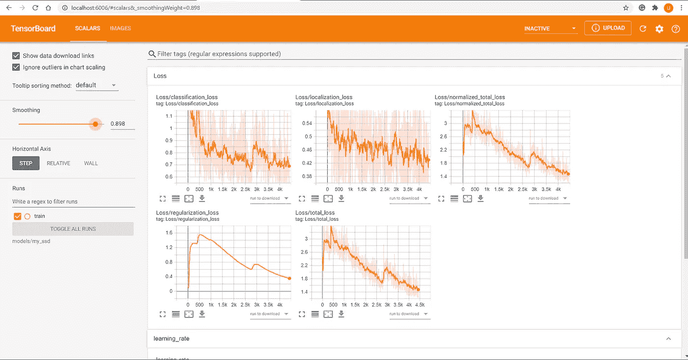

# 构建 Tensorflow 对象检测项目

> 原文：<https://medium.com/geekculture/structuring-tensorflow-object-detection-project-590c9177d9e7?source=collection_archive---------14----------------------->

在这篇博客中，我将带您了解如何使用 TensorFlow 对象检测 API 高效地构建对象检测项目


Image credits: [TensorFlow](https://medium.com/u/b1d410cb9700?source=post_page-----590c9177d9e7--------------------------------) team

每一个曾经使用 TensorFlow 并遇到对象检测作为任务的数据科学家或机器学习工程师都经历过 TensorFlow 对象检测(TF-OD) API。这是一个建立在 TensorFlow 基础上的强大框架，可以轻松构建、训练和部署检测模型。

老实说，我在不同的时间为不同的项目使用过 TF-OD，但每次我都必须从头开始，然后要记住大量的配置，这使得这个过程非常漫长。

让我们通过设置来简化流程:

**第一步:准备 Anaconda 环境**

```
# create new environment
>> conda create --name object_detection_env python=3.6

# activate your environment before installation or running your scripts 
>> conda activate object_detection_env# Installing tensorflow
>> conda install tensorflow==2.3.0 tensorflow-gpu==2.3.0

# installing cudatoolkit and cudnn
>> conda install cudatoolkit==10.1.243=h74a9793_0 
>> conda install cudnn==7.6.5=cuda10.1_0
```

**步骤 2:安装对象检测 API 框架**及其依赖关系:

```
# Cloning the repository
>> git clone [https://github.com/tensorflow/models.git](https://github.com/tensorflow/models.git) 
```

通过键入`protoc --version`确保你有 [protobuf 编译器](https://grpc.io/docs/protoc-installation/#install-using-a-package-manager)版本> = 3.0，或者通过键入`apt install protobuf-compiler`将其安装在 Ubuntu 上。
然后按如下方式继续安装 python 包:

```
# remember to activate your python environment first
>> cd models/research# compile protos:
>> protoc object_detection/protos/*.proto --python_out=.# Install TensorFlow Object Detection API as a python package:
>> cp object_detection/packages/tf2/setup.py .
>> python -m pip install .# Test the installation (If all installed then following will show all passed output)
>> python object_detection/builders/model_builder_tf2_test.py# install OpenCV python package
>> pip install opencv-python
>> pip install opencv-contrib-python
```

**第三步:文件夹结构:**使用 TFOD API 的一种有效的文件夹结构方式是什么？下面是文件夹[1]，它将帮助你得到一个大致相同的概念。

```
training_demo/
├─ annotations/
├─ exported-models/
├─ images/
│  ├─ test/
│  └─ train/
├─ models/
│  └─ my_ssd_mobilenet_v2/
│      ├─ checkpoint/
│      ├─ saved_model/
│      └─ pipeline.config
├─ pre-trained-models/
│  ├─ ssd_resnet50_v1_fpn_640x640_coco17_tpu-8/
│  │   ├─ checkpoint/
│  │   ├─ saved_model/
│  │   └─ pipeline.config
│  └─ efficientdet_d1_coco17_tpu-32/
│      ├─ checkpoint/
│      ├─ saved_model/
│      └─ pipeline.config
```

**步骤 4:准备用于训练的自定义数据集**:
创建 pbtxt 文件(这是目标标签的对象检测 API 所需要的)([代码链接](https://gist.github.com/maheshwariumang/d75f7e52e1996bb553da889eebe5088f#file-xml_to_csv-py) )
`>> python generate_pbtxt.py csv train_labels.csv label_map.pbtxt`
将训练图像添加到训练和测试图像文件夹，并运行[代码](https://gist.github.com/maheshwariumang/d75f7e52e1996bb553da889eebe5088f#file-xml_to_csv-py)来创建数据集 CSV，它将包含文件名、边界框和目标
`python xml_to_csv.py`
。是时候创建 TFRecord 文件了:
`>> python generate_tfreccords.py train_labels.csv annotations/label_map.pbtxt train train_tf_record.record`

`>> python generate_tfreccords.py test_labels.csv annotations/label_map.pbtxt test test_tf_record.record`

**步骤 5:下载预先训练的模型权重** :
我们将使用带有 MobileNetV2 主干的 SSD 模型，因为它是用于演示目的的小型模型。你可以在[模型动物园](https://github.com/tensorflow/models/blob/master/research/object_detection/g3doc/tf2_detection_zoo.md)【2】中用 COCO 数据集检查另一个预训练模型。(如步骤 3 所示，您将把预训练模型保存在*预训练模型*文件夹下。

```
# download the mobilenet_v2 model
wget [http://download.tensorflow.org/models/object_detection/tf2/20200711/ssd_mobilenet_v2_320x320_coco17_tpu-8.tar.gz](http://download.tensorflow.org/models/object_detection/tf2/20200711/ssd_mobilenet_v2_320x320_coco17_tpu-8.tar.gz)
# extract the downloaded file
tar -xzvf ssd_mobilenet_v2_320x320_coco17_tpu-8.tar.gz 
```

**步骤 6:配置管道配置:** 下载重量和配置文件后，您可以调整 pipeline.config 参数:

*   使用`num_classes: 3`因为我们只有三个类(苹果、橘子、香蕉)，而不是 coco 数据集中的 90 个类。
*   将`fine_tune_checkpoint_type: "classification"`更改为`fine_tune_checkpoint_type: "detection"`，因为我们使用预训练的检测模型作为初始化。
*   添加了预先训练好的模型在野外的路径，`fine_tune_checkpoint:`比如使用移动网 v2 模型，我添加了`fine_tune_checkpoint: "./models/ssd_mobilenet_v2_320x320_coco17_tpu-8/checkpoint/ckpt-0"`
*   改了`batch_size: 512`，给我的 GPU 内存用了一个合理的数字。我有 4GB 的 GPU 内存，所以我用的是`batch_size: 8`
*   在`num_steps:`中增加了最大训练迭代次数，在`total_steps:`中也使用了相同的次数
*   根据我们的模型和批量调整学习率(最初他们使用更高的学习率，因为他们有更大的批量)。这个值需要一些测试和调整。
*   `label_map_path:`应该指向我们的标签映射文件(这里是浣熊标签映射)`label_map_path: "./annotations/labelmap.pbtxt"`
*   您需要将`tf_record_input_reader`设置在`train_input_reader`和`eval_input_reader`下。这应该指向我们生成的 TFRecord(一个用于训练，一个用于验证)。

```
train_input_reader: {
    label_map_path: "./annotations/labelmap.pbtxt"
    tf_record_input_reader {
        input_path: "../annotations/train.record"
    }
}
```

**第七步:训练模型:** 现在是模型的训练和自定义数据集上的训练。您可以将文件`model_main_tf2.py`(从[链接](https://github.com/tensorflow/models/tree/master/research/object_detection)中)复制到 *training_demo* 文件夹中

```
python model_main_tf2.py --model_dir=models/my_ssd_mobilenet_v2 \ 
 -- pipeline_config_path=models/my_ssd_mobilenet_v2/pipeline.config \
 --alsologtostderr
```

**第八步:检查训练进度:** 现在为了检查模型的进度。
`>> tensorboard --logdir=models/my_ssd_mobilenet_v2`
这将在您的浏览器上打开`[http://localhost:6006/](http://localhost:6006/)`，出现如下仪表板:



**第九步:导出训练好的模型:**

```
python exporter_main_v2.py --input_type="image_tensor" \
                           --output_directory=streamlit_ui/exported_model \
                           --pipeline_config_path=models/my_ssd_mobilenet_v2/pipeline.config \
                           --trained_checkpoint_dir=models/my_ssd_mobilenet_v2/
```

恭喜你，你已经训练出了你的第一个模型。既然您已经创建了一个项目结构，您可以很容易地遵循不同的模型。这里最好的部分是什么？你不会弄乱预先训练的文件和你训练的文件。

请让我知道对这篇文章的任何反馈。我很乐意听到他们的声音，并不断改进。

***参考文献—*** *1。**[*https://tensor flow-object-detection-API-tutorial . readthedocs . io/en/latest/*](https://tensorflow-object-detection-api-tutorial.readthedocs.io/en/latest/) *2 .*[*https://github . com/tensor flow/models/tree/master/research/object _ detection*](https://github.com/tensorflow/models/tree/master/research/object_detection) *3 .*[https://github.com/tensorflow/models](https://github.com/tensorflow/models)*