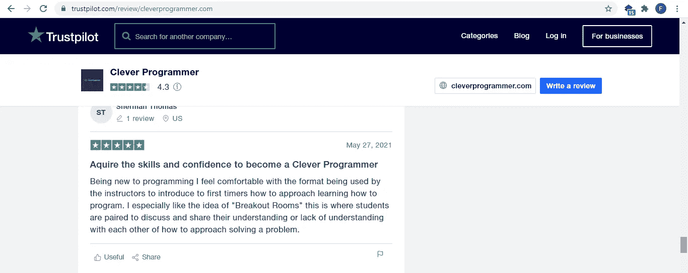
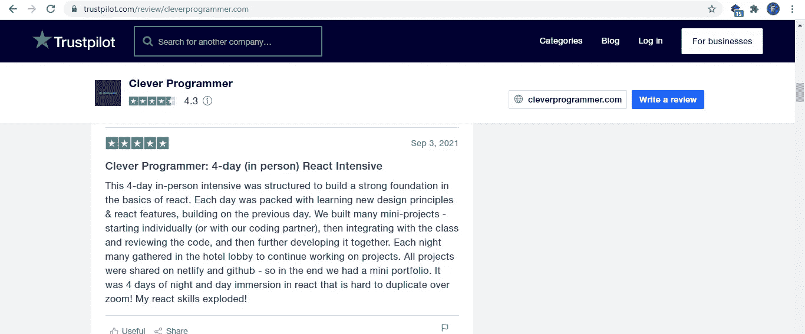

# 苦苦挣扎的程序员们，有这个——5 个容易访问的编码社区，为什么数百万人在过去 5 年中出类拔萃

> 原文：<https://medium.com/geekculture/struggling-programmers-have-this-5-effortlessly-accessible-coding-communities-why-millions-have-f5c623279010?source=collection_archive---------11----------------------->

## 他们的时间。他们的钱。他们的努力。所有人都获得了惊人的结果。对真正的朋友来说，他们享受你所没有的。

Photo by [Helena Lopes](https://www.pexels.com/@wildlittlethingsphoto?utm_content=attributionCopyText&utm_medium=referral&utm_source=pexels) from [Pexels](https://www.pexels.com/photo/four-person-standing-at-top-of-grassy-mountain-697244/?utm_content=attributionCopyText&utm_medium=referral&utm_source=pexels)

一年过去了，多处伤痕，你还没想明白。可能是教程地狱的症状。另一篇博文的主题[。](/illumination/give-me-2-mins-and-ill-give-you-the-template-to-exterminate-tutorial-hell-for-good-90a18c784a76)

但是这些人却实现了相反的目标。我不想告诉你。但是，你错过了很多。

**你需要的是一个能引起你共鸣的社区。**

理解你的挣扎的人。那些通过挑战他们的潜能来提升你的潜能，激励你挑战你的潜能的人。

让你负起责任的人。你可以向他们提问。当你犯错误或你将要犯错误时，会通知你的人。

由相同兴趣联系在一起的人们，对他们遇到的问题有不同和独特的观点，但有一个统一的目标。

你需要一个地方来建立牢固的关系。一个找到优秀导师和朋友的地方。

> “分担一个问题，问题减半”——德国谚语

感受这些编码社区，体验令人惊叹的结果。

# 聪明的程序员

[Screenshot by Author from Youtube video/RafehQazi](https://www.google.com/url?sa=t&source=web&rct=j&url=https://www.youtube.com/watch%3Fv%3DjmvbhuJXFow&ved=2ahUKEwj53u-Gup_zAhXBxoUKHQlFAQQQ3e4CegQIAxAU&usg=AOvVaw25JKjWOhYlLu7j2Fm_Buuh)

这个社区由[拉菲·卡齐](https://www.google.com/url?sa=t&source=web&rct=j&url=https://www.linkedin.com/in/cleverprogrammer&ved=2ahUKEwiyw8L-yp7zAhUNohQKHa1JAo0QFnoECDEQAQ&usg=AOvVaw30ol_bHxN4gULXpEO1t61d)创建，并得到了[亚伦·伯纳兹](https://www.instagram.com/aaron_bernath/?hl=en)、[弗兰基·阿拉尔孔](https://www.instagram.com/frankiexalarcon/?hl=en)、[大卫·拉科西](https://www.instagram.com/davidrakosi/)、[纳兹·杜曼斯基](https://www.instagram.com/nazdumanskyy/)等整个开创性团队中其他人的支持。

它由一群人组成，他们不遗余力地倾听并帮助其他人成为更好的开发人员，再加上创始人的参与。

在帮助成千上万的开发者超越之后，[社区的脸书小组](https://www.google.com/url?sa=t&source=web&rct=j&url=https://m.facebook.com/CleverProgrammerr/groups&ved=2ahUKEwiyw8L-yp7zAhUNohQKHa1JAo0QFnoECBkQAQ&usg=AOvVaw3oTd2ILX_0vIT0Cb7J3WBD)已经覆盖了你。

这里是聪明的程序员对 Trust pilot 的评论截图。

[Screenshot by Author on review for Clever Programmer on Trust Pilot](https://www.trustpilot.com/review/cleverprogrammer.com)

[Screenshot by Author on review for Clever Programmer on Trust Pilot](https://www.trustpilot.com/review/cleverprogrammer.com)

这里是它的[网站](https://www.google.com/url?sa=t&source=web&rct=j&url=https://www.cleverprogrammer.com/&ved=2ahUKEwiyw8L-yp7zAhUNohQKHa1JAo0QFnoECAQQAQ&usg=AOvVaw14cioUMRX6rAUq4XcnQrBo&cshid=1632726717247)了解更多详情。

*更新* [这是加入他们免费不和谐小组的链接](https://www.cleverprogrammer.com/discord)

# Papafam 官方社区

[Screenshot by Author from Youtube video/Sonny Sangha](https://www.google.com/url?sa=t&source=web&rct=j&url=https://www.youtube.com/watch%3Fv%3DifcODOhSH1o&ved=2ahUKEwjNycyeup_zAhVFxhoKHXtADYcQ3e4CegQIAxAw&usg=AOvVaw1G8tJVTsdsCTSe-XKDEAGX)

[这个社区](https://www.google.com/url?sa=t&source=web&rct=j&url=https://www.papareact.com/&ved=2ahUKEwikmrqQzJ7zAhUh8-AKHZ68CrAQFnoECAQQAQ&usg=AOvVaw3ztLIxQeLm-zG0ik5vCeSP&cshid=1632726657934)是由[桑尼·桑加](https://medium.com/u/43d0a2a7e3d?source=post_page-----f5c623279010--------------------------------)在其惊人的背景团队支持下创建的。这是[脸书集团社区](https://www.google.com/url?sa=t&source=web&rct=j&url=https://m.facebook.com/groups/1388021798201385/%3Flocale2%3Den_US&ved=2ahUKEwjGt-CdzJ7zAhXr0eAKHYwaAp0QFnoECAUQAg&usg=AOvVaw19FFGK1VEdPivXUACXbw_V)包含理解你的挣扎、指出你的错误并让你负责的开发者。我要说的是无数伟大的心灵。这是创始人的简介

# 旅游媒体

[Screenshot by Author from Youtube video/Brad Travesy](https://www.google.com/search?q=travesy+media+overworkung+yourself+as+a+programner&client=ms-android-transsion-tecno-rev1&sxsrf=AOaemvLA_N83Kzv7PzN2pUMMv3BfFenrIg%3A1632756234597&ei=CuJRYZbmI-yZjLsPx-S_8Ag&oq=travesy+media+overworkung+yourself+as+a+programner&gs_lcp=ChNtb2JpbGUtZ3dzLXdpei1zZXJwEAMyBAgAEEcyBAgAEEcyBAgAEEcyBAgAEEcyBAgAEEcyBAgAEEcyBAgAEEcyBAgAEEdQoLkDWJLyA2Cp9ANoAHABeACAAQCIAQCSAQCYAQCgAQHIAQjAAQE&sclient=mobile-gws-wiz-serp#fpstate=ive&vld=cid:7212aec4,vid:BKQVqzhnP8I,st:0)

[布拉德·特拉维斯](https://www.linkedin.com/in/bradtraversy)，特拉维斯媒体的创始人。在脸书上拥有大约 33，968 名关注者的[社区。考虑到目前的情况，你认为这群人当中有多少伟大的头脑？](https://www.google.com/url?sa=t&source=web&rct=j&url=https://m.facebook.com/traversymedia/likes&ved=2ahUKEwjt-NSjzZ7zAhVB8OAKHa4jBUsQFnoECAUQAQ&usg=AOvVaw2MLx3TpzLDeepUyiVKMsOy)

> 页（page 的缩写）s:这个场景表明，大量的人因为这个社区而变得优秀。

# Gitconnected

[Screenshot by Author from home page of website](https://gitconnected.com/)

[Gitconnected](https://www.google.com/url?sa=t&source=web&rct=j&url=https://gitconnected.com/&ved=2ahUKEwjv4PCI9J7zAhUHkRQKHXPSBEUQFnoECAUQAg&usg=AOvVaw2iReZsGLYIidI4vXAiLkKN) 。一个目标明确的社区。为开发者和软件工程师提供一个平台，**分享**知识，**连接**，**协作**，**学习**。

为了帮助你完成这个使命，我们邀请你加入。

1.[一脸书集团](https://www.facebook.com/groups/gitconnected/)二 T12。[一个松弛组](https://community.gitconnected.com)和
3。一个[平台](https://levelup.gitconnected.com/)，在这里你可以以博客的形式分享你的想法、思想和知识。

终于！

# 开发到

[Screenshot by Author from home page of website](https://dev.to/)

因此，由[本·哈尔彭](https://www.linkedin.com/in/ben-halpern-3a1aa731)、[彼得·弗兰克](https://www.linkedin.com/in/peter-frank-a207823b)和李佳薇[于 2017 年创立的](https://www.google.com/url?sa=t&source=web&rct=j&url=https://dev.to/&ved=2ahUKEwjq3brr8p7zAhWC2uAKHRZKDd8QFnoECAQQAQ&usg=AOvVaw3NTfo40Q3wZyaXn3lV-lWf) [Dev.to](https://www.google.com/url?sa=t&source=web&rct=j&url=https://dev.to/&ved=2ahUKEwjq3brr8p7zAhWC2uAKHRZKDd8QFnoECAQQAQ&usg=AOvVaw3NTfo40Q3wZyaXn3lV-lWf) 一直在继续教育、激励和提升开发者，无论是通过他们的博客帖子，还是通过 Ace-stoning 社区😉😊

# 外卖食品

综上所述，假设您从这些社区获得了:

1.3 个走在你前面的朋友，做你的导师。

2.3 个和你同级的朋友，他们努力挑战自己的极限，一起编写代码

3.3 个比你低一级的朋友来教你所学的东西。

在所有事情都相同的情况下，在这个世界上，什么会阻止你的进步呢？

因为，就我所知，教书是变得更擅长一项技能的最佳途径之一。

就连约翰·桑梅兹也这么认为。我引用他在《软技能》一书中的话。

> “如果我告诉你怎么做，你可能会忘记，但如果你自己做，你可能会记住，如果你真的把你想学的东西教给别人，你不仅会记住，而且会对它有更深的理解。”

# 有趣的事实！

看看有多少人参加了聪明的程序员的现场直播

[Screenshot by Author from Youtube video](https://www.google.com/search?q=clever+programmers+day+3+slack+clone&oq=clever+programmers+day+3+slack+clone&aqs=chrome..69i57j33.12419j0j7&client=ms-android-transsion-tecno-rev1&sourceid=chrome-mobile&ie=UTF-8#fpstate=ive&vld=cid:40c2cf7e,vid:ml_04VfhrNs,st:0)

将近 1000 人在直播！更不用说一天的浏览量和观看时间了😯

这显示了一个愿意学习、联系和超越的社区。

享受这个？ [订阅我的简讯，获取更多我的故事。](https://favour-thoughts.ck.page/40a6f097f4)

如果你喜欢这个， [**考虑在这里订阅 Medium 来支持你最喜欢的作家。**](https://favouragbejule.medium.com/subscribe)