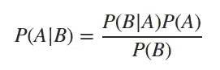
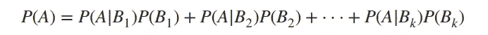
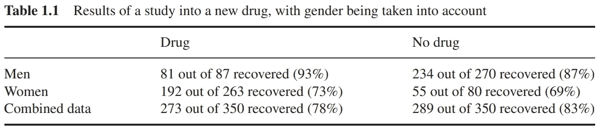
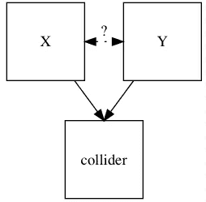
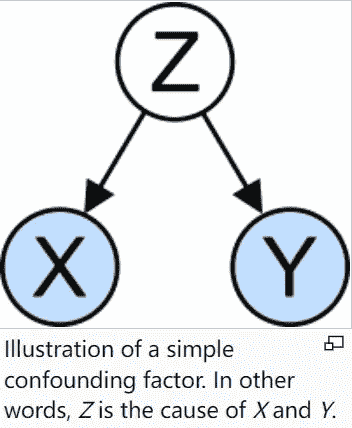
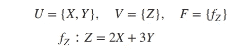
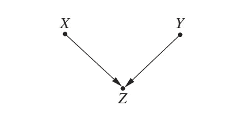
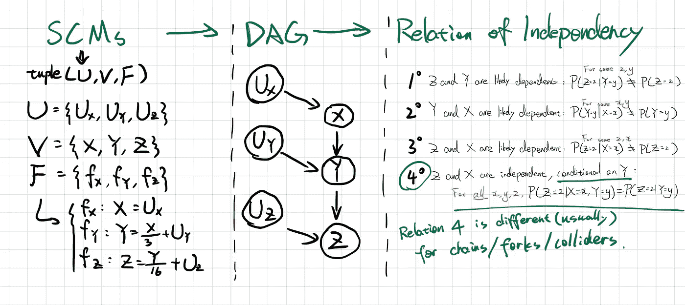
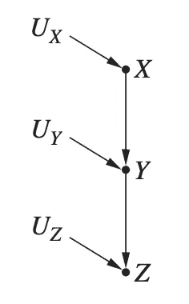
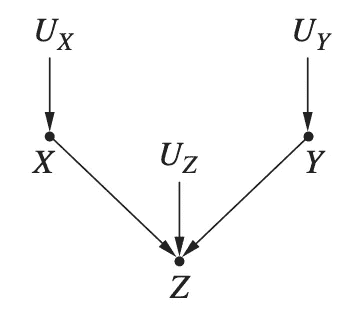

# 统计学中因果推断的学习笔记:入门

> 原文：<https://medium.com/geekculture/study-note-for-causal-inference-in-statistics-a-primer-23e47c4bd47?source=collection_archive---------13----------------------->

这是我在阅读“[统计学中的因果推断:初级读本](http://bayes.cs.ucla.edu/PRIMER/)”时，统计概念的一个未完成的列表。我大量借用书中的图片和引文，这个博客只是为了记录我阅读这本书的过程。

Photo by [Derek Oyen](https://unsplash.com/@goosegrease?utm_source=unsplash&utm_medium=referral&utm_content=creditCopyText) on [Unsplash](https://unsplash.com/s/photos/penguin?utm_source=unsplash&utm_medium=referral&utm_content=creditCopyText)

# 第一章:预备工作

## 基本概率概念

我跳过了变量/事件/条件/概率/独立性/概率分布的基本概念。

关于期望/矩(方差)/不等式的详细注释，请查看普林斯顿大学“随机变量的期望和函数”的[注释](https://imai.fas.harvard.edu/teaching/files/Expectation.pdf)。

这里还有其他一些等式:

Bayes’ Rule

“the law of alternatives” or “extending the conversation”, in the book referenced as **conditionalizing on B**

Law of Total Probability

## 基本图形概念

详细的图论概念列表可以在[这里](https://stanford.edu/~rezab/discrete/Notes/2.pdf)找到。这是斯坦福大学 CME 305 的课程笔记:离散数学和算法。

一些图算法可以在这里[找到](https://condor.depaul.edu/ichu/csc383/notes/notes9/Graph.html)来自德保罗大学。不一定都知道，但是很好的参考。

现在知道以下基本概念就足够了，

父节点/子节点/有向图/循环图/无环图/有向无环图(DAG)

## 辛普森悖论

悖论是指存在这样一种数据，其中适用于整个人群的统计关联在每个亚人群中都是相反的。

Example from the book. In subpopulation by gender, the drug raises the probability of recovering. But on aggregated data, the conclusion is reversed.

## 碰撞机

在统计学和因果图中，当一个变量受到两个或更多变量的因果影响时，它就是一个碰撞体。“碰撞器”这个名字反映了这样一个事实，即在图形模型中，从变量指向碰撞器的箭头似乎“碰撞”在作为碰撞器的节点上。

在因果图的术语中，碰撞器上的条件打开了 **X** 和 **Y** 之间的路径。这将在估计 **X** 和 **Y** 之间的因果关联时引入偏差，潜在地引入不存在的关联。因此，对撞机会破坏检验因果理论的尝试。

[Wikipedia](https://en.wikipedia.org/wiki/Collider_(statistics))

## 混杂因素

在统计学中，混杂因素是一个既影响因变量又影响自变量的变量，会导致虚假关联。混杂是一个因果概念，因此不能用相关性或关联性来描述。混杂因素的存在是为什么相关性并不意味着因果关系的一个重要的定量解释。

[Wikipedia](https://en.wikipedia.org/wiki/Confounding)

## 结构因果模型

> SCM 是一种描述世界相关特征以及它们如何相互作用的方式。具体来说，结构因果模型描述了自然如何为感兴趣的变量赋值。
> 
> —[http://bayes.cs.ucla.edu/PRIMER/primer-ch1.pdf](http://bayes.cs.ucla.edu/PRIMER/primer-ch1.pdf)

**因果关系的定义**:变量 X 是变量 Y 的直接原因，如果 X 出现在给 Y 赋值的函数中。如果 x 是 Y 的直接原因，或者是 Y 的任何原因，那么 x 就是 Y 的原因。

形式上，结构因果模型由两组变量 U 和 V 以及一组函数 f 组成，函数 f 根据模型中其他变量的值为 V 中的每个变量赋值。

U 中的变量被称为**外生变量**，大致意思是它们在模型之外；不管出于什么原因，我们选择不去解释它们是如何产生的。V 中的变量是**内生**。模型中的每个内生变量都是至少一个外生变量的后代。外生变量不能是任何其他变量的后代，尤其不能是内生变量的后代。如果我们知道每个外生变量的值，那么利用 f 中的函数，我们就可以完全确定每个内生变量的值。

基本上，我们将**外生**变量作为原因，并用它们来推理**内生**变量。

**示例:基于教育和经验的工资**

A minimal example of SCM from [book](http://bayes.cs.ucla.edu/PRIMER/primer-ch1.pdf). U is the set fo exogenous variables, while V is the set for endogenous variables. F is the function set, which in this case has only one mapping function.

The graph for the above SCM.

该模型表示雇主支付给受教育时间为 X 年、职业时间为 Y 年的个人的工资(Z)。X 和 Y 都出现在 fZ 中，所以 X 和 Y 都是 z 的直接原因，如果 X 和 Y 有任何祖先，那么那些祖先将是 z 的潜在原因。

## 示例问题(待完成)

# 第 2 章:图形模型和应用

在这一章中，在概率语言中由代数等式定义的独立性概念可以使用有向无环图(DAG)直观地表达出来。

所以之前，如辛普森悖论的例子所示，数据本身并不能说明问题。我们阐述了数据背后的“因果故事”,以揭示数据生成的机制。

基于不同场景下的供应链管理，我们将其抽象为图形表示，然后尝试得出变量之间依赖关系的结论。

Example for “School Funding, SAT scores, and College Acceptance”in [chapter 2](http://bayes.cs.ucla.edu/PRIMER/primer-ch2.pdf).

在这种情况下，SCM 表示一所高中在给定年份的资金(X)、SAT 平均分(Y)和大学录取率(Z)之间的因果关系。我们用 U 集来表示所有影响内生变量(X/Y/Z)的外因。

看看右边的专栏，我们有几个假设，可以用我们的数据来支持或反驳。对于 bulletpoint 4，请记住，当我们以 Y 为条件时，我们根据 Y 的值将数据筛选到组中。因此，我们比较 Y = a 的所有情况，Y = b 的所有情况，依此类推。

> 假设我们正在研究 Y = a 的情况。我们想知道，仅在这些情况下，Z 的值是否独立于 X 的值。之前，我们确定 X 和 Z 可能是相关的，因为当 X 的值改变时，Y 的值可能会改变，当 Y 的值改变时，Z 的值可能会改变。然而，现在只考察 Y = a 的情况，当我们选择具有不同 X 值的情况时，U_Y 的值发生变化，以使 Y 保持在 Y = a，但由于 Z 只取决于 Y 和 U_Z，而不取决于 U_Y，所以 Z 的值保持不变。所以选择不同的 X 值不会改变 z 的值，所以，在 Y = a 的情况下，X 独立于 z，这当然是正确的，不管我们以 Y 的哪个特定值为条件。所以 X 独立于 Z，以 y 为条件。

简单来说，当我们为 Y 选择一个特定的值时，我们过滤掉了内生变量 X 和外生变量 U_Y 的影响，无论这两个变量如何变化，它们的输出总是 Y=a(因为这是我们选择数据来检验假设的方式)。然后我们将能够观察到，尽管 X 变化，Z 保持不变，给定相同的 U_Z 和 Y=a。

## 链条、叉子和碰撞器

在 SCMs 的图形表示中，这三种结构很常见，如下所示:链、叉和碰撞器。

Chains, Forks, and Colliders

根据所有三个图形表示的中间内生变量(Y 代表链结构，X 代表叉结构，Z 代表碰撞体结构),我们会得到不同的依赖关系的结果。

在碰撞器中，X 和 Y 应该是不相关的，因为它们分别只受 U_X 和 U_Y 的影响。但是当我们选择 Z=a 时，X 和 Y 必须控制它们的值，以便生成相同的 Z = a。在这种情况下，X 和 Y 是违反直觉的相关。

碰撞器中关于**条件独立的重要规则:如果一个变量 Z 是两个变量 X 和 Y 之间的碰撞节点，并且 X 和 Y 之间只有一条路径，那么 X 和 Y 无条件独立但条件依赖于 Z 和 Z 的任何后代。**

我的一篇文章解释了为什么相关性不是因果关系。[链接](/mlearning-ai/correlation-is-not-causation-but-why-88d807bfe736)。

## d-分离(d 代表方向)

如果两个节点 A 和 B 之间有一条或多条依赖路径，我们说 A 和 B 是 d 连通的。否则，我们说 A 和 B 是 d 分离的。

一个技巧:如果我们以碰撞体或它们的后代为条件，我们会在碰撞体的父对象之间创建一条路径。

## 模型测试和因果搜索(待续)

## 参考

*   [http://bayes.cs.ucla.edu/PRIMER/primer-ch1.pdf](http://bayes.cs.ucla.edu/PRIMER/primer-ch1.pdf)
*   http://bayes.cs.ucla.edu/PRIMER/primer-ch2.pdf
*   【https://imai.fas.harvard.edu/teaching/files/Expectation.pdf】T4 随机变量的期望和函数
*   [https://condor . depaul . edu/ichu/CSC 383/notes/notes 9/graph . html](https://condor.depaul.edu/ichu/csc383/notes/notes9/Graph.html)图形算法
*   [https://stanford.edu/~rezab/discrete/Notes/2.pdf](https://stanford.edu/~rezab/discrete/Notes/2.pdf)图论
*   [https://medium . com/mlearning-ai/correlation-is-not-causality-but-why-88d 807 bfe 736](/mlearning-ai/correlation-is-not-causation-but-why-88d807bfe736)