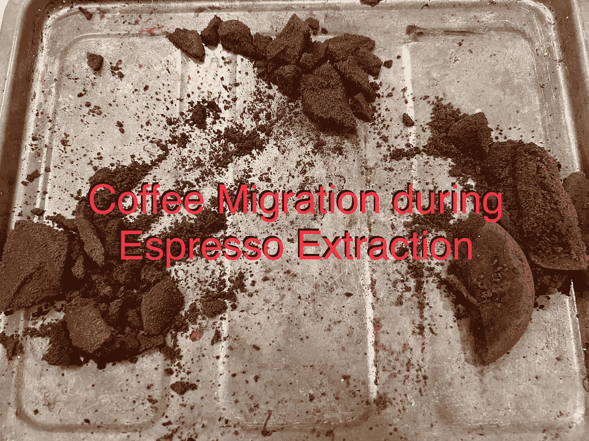

# 通过实验研究咖啡迁移

> 原文：<https://medium.com/geekculture/studying-coffee-migration-through-experimentation-1c20a1275e3e?source=collection_archive---------14----------------------->

## 咖啡数据科学

## 推动浓缩咖啡知识的极限

我想更好地了解咖啡渣是如何在较大的巨石周围移动的。所以我用整粒豆子和废豆渣做了更大的实验。

当较小的颗粒穿过豆子之间的空隙时，它们移动得更慢，最终堵塞。

这是一个有趣的实验，用整颗豆子和用过的磨碎物来观察冰球是如何被侵蚀的。

我重复了我的整个豆和花咖啡实验与我的 DE。正如预期的那样，咖啡渣填满了空隙，但它们进入杯子的量不超过 0.01 克。

我观察了咖啡是如何迁移的，并思考了是什么原因导致微粒迁移的数量远远超过了一小部分移动的微粒。

稍微搅拌一下，我就能把许多颗粒放进杯子里。

我用粉笔做了另一个强迫微粒迁移的实验。这表明白垩被迫进入杯中，就像咖啡粉一样，这有助于验证我最初的白垩粉迁移实验。

最初的批评是，粉笔的行为不像咖啡粉，但这个实验表明，粉笔的行为类似。

测量咖啡中的微粒很有挑战性，更不用说定义它们了。对于直径小于 50 微米的微粒，它们很难成像。

因此，如果罚款难以衡量，那么总会有这样一个问题:实际上存在多少罚款。

我发现我可以用 Kompresso 进行湿筛，所以我做了一些测量微粒的实验。这一结果与之前对整个冰球中粒子分布的测量并不矛盾。

 [## 用水测量咖啡粉末

### 受强制微粒迁移启发的有趣方法

towardsdatascience.com](https://towardsdatascience.com/measuring-coffee-fines-using-water-aa17595526c9) 

在浓缩咖啡中，我们谈论一些进入杯中的粉末，但是没有量化。

因此，我做了一个实验，基于我用来理解强制微粒迁移的一些技术，来测量一杯浓缩咖啡后有多少微粒落在杯子里。

 [## 数一杯浓缩咖啡中的粉末

### 试图测量小东西

medium.com](/nerd-for-tech/counting-fines-in-a-cup-of-espresso-f3e2ea11d20b) 

我真的对奥斯马浓缩咖啡和它的工作原理很感兴趣。

我担心振动会导致更细小的颗粒以比普通浓缩咖啡更显著的方式迁移，所以我和 Hiver 拍了几张照片，做了一些测试来探索。

 [## Osma 咖啡机中的粉末迁移

### 对我来说是 Osma 数据的开始

towardsdatascience.com](https://towardsdatascience.com/fines-migration-in-the-osma-coffee-machine-148530bd0657) 

我在 espresso 中调整了我的一个实验变量，以更好地匹配学术文献中关于细颗粒在土壤中迁移的说法。

瞧啊。罚款大量迁移！

浓缩咖啡变量的微小变化会产生巨大影响。

 [## 浓缩咖啡中的微粒迁移:更有力的证据

### 该理论的确凿证据

towardsdatascience.com](https://towardsdatascience.com/fines-migrate-in-espresso-stronger-evidence-15c42a3d41d8) 

如果你愿意，可以在推特、 [YouTube](https://m.youtube.com/channel/UClgcmAtBMTmVVGANjtntXTw?source=post_page---------------------------) 和 [Instagram](https://www.instagram.com/espressofun/) 上关注我，我会在那里发布不同机器上的浓缩咖啡照片和浓缩咖啡相关的视频。你也可以在 [LinkedIn](https://www.linkedin.com/in/dr-robert-mckeon-aloe-01581595) 上找到我。也可以关注我在[中](https://towardsdatascience.com/@rmckeon/follow)和[订阅](https://rmckeon.medium.com/subscribe)。

# [我的进一步阅读](https://rmckeon.medium.com/story-collection-splash-page-e15025710347):

[我未来的书](https://www.kickstarter.com/projects/espressofun/engineering-better-espresso-data-driven-coffee)

[我的链接](https://rmckeon.medium.com/my-links-5de9eb69c26b?source=your_stories_page----------------------------------------)

[浓缩咖啡系列文章](https://rmckeon.medium.com/a-collection-of-espresso-articles-de8a3abf9917?postPublishedType=repub)

工作和学校故事集