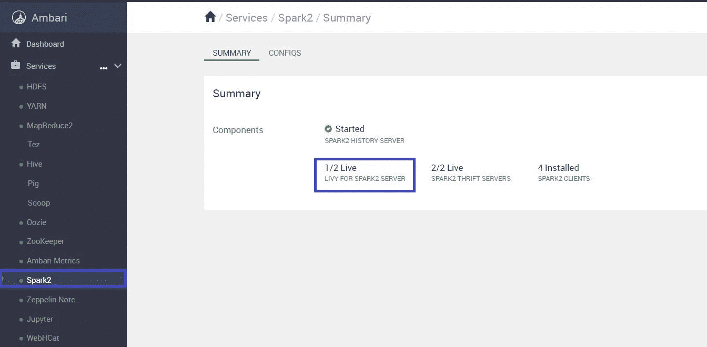
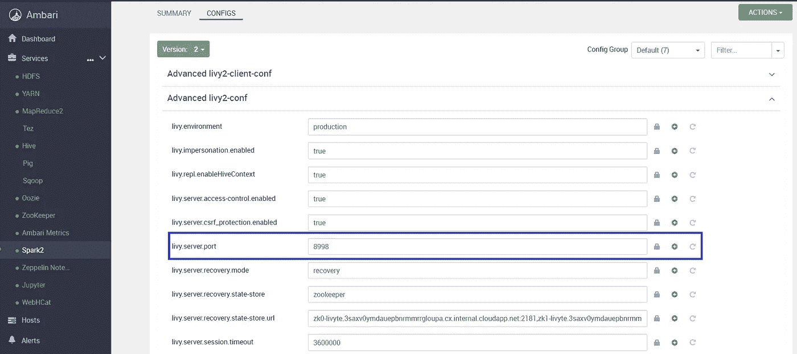
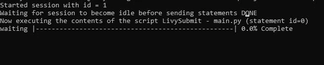
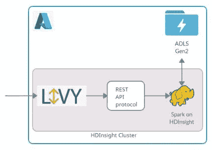

# 通过 Apache Livy 在 Azure HDInsight 中提交 spark 作业

> 原文：<https://medium.com/geekculture/submitting-spark-job-in-azure-hdinsight-through-apache-livy-93a6129e8489?source=collection_archive---------23----------------------->

Apache Livy 被设计成可以通过 REST 接口与任何运行 spark 的远程集群进行同步/异步交互，而无需对集群进行太多控制。访问 spark 不需要边缘节点。另外，livy 服务器本身管理长期运行的 spark 上下文，而不是在 spark 服务器中运行它们。这篇博客是关于如何从本地机器访问 spark 运行 HDInsight 集群的。

李维有各种类型—

▹ **交互模式**——由 spark-shell、pySpark 和 sparkr repls 提供。

▹ **批处理模式**——使用 spark-submit 向集群提交应用程序，在运行时中间没有交互

## 正在创建 HDInsight 集群

按照[官方文档](https://docs.microsoft.com/en-us/azure/hdinsight/hdinsight-hadoop-use-data-lake-storage-gen2-portal)创建一个 HDInsight 集群和一个 ADLS gen2 存储。除了作为集群集成存储，它还可以存储所有支持 spark 代码的包/jar。spark job 会使用哪个。默认情况下，HDInsight 集群将在端口 8998 运行 livy。

要在集群中触发作业，需要几个参数——

1.  群集的公共端点(*https://{ my cluster name } . azurehdinsight . net*)
2.  集群凭据

只需通过 Ambari dashboard 确认 livy 服务器是否启动并运行。



Ambari dashboard showing livy server running



livy configuration setting

## livy-提交作业

首先，它需要 pip 安装一个开源包‘Livy-Submit’，该包使用 Livy 的交互模式来连接集群。

```
pip install Livy-Submit
```

要提交作业，请使用所需的参数进行调用。

```
livy_submit **--livy-url** https://{clustername}.azurehdinsight.net/livy **-u** <cluster_username> \
**-p** <cluster_password> \
**-s** <local path of python file>
```

这个库将 REST API 请求传递给集群，传递所提供的参数。

## 提交具有程序包相关性的作业

执行作业的理想场景是将多个 python 文件作为包依赖项。在 spark-submit 中，这可以通过将归档文件作为 jar 传递来实现。在这里也可以遵循相同的归档过程，当在 YARN 模式下运行时，它工作得非常好。另一种方法是压缩文件，并从与集群集成的 ADLS 存储中访问它们。

压缩包装，使其在 ADLS 第二代集装箱中可用。要导入它，请按以下格式将参数添加到"- -py-files "中。

```
abfs://<BlobStorageContainerName>@<StorageAccountName>.blob.core.windows.net/<filepath>/<file>.zip
```

> 对于除 ADLS Gen2 以外的存储类型，使用“wasb”而不是“abfs”。

```
livy_submit **--livy-url** https://{clustername}.azurehdinsight.net/livy **-u** <cluster_username> \
**-p** <cluster_password> \
**--py-files** abfs://<BlobStorageContainerName>@<StorageAccountName>.blob.core.windows.net/scripts.zip \
**-s** <local path of python file>
```

## 示例作业

假设结构如下，依赖关系在 data_processing.py 之上，只需在 scripts 文件夹级别压缩即可。

```
| — scripts
| | — project_f
| | | — __init__.py
| | | — data_processing.py
| | | — main.py
```

**main.py**

```
from scripts.project_f import data_processingdef **main**():
 print(‘Into main’)
 data_processing.processing()**main**()
```

**data_processing.py**

```
def **processing**():
 print(‘Processing block’)
```

执行—

```
livy_submit **--livy-url** https://livytest.azurehdinsight.net/livy **-u** <cluster_username> \
**-p** <cluster_password> \
**--py-files** abfs://testcontainer@testlivystorage.blob.core.windows.net/livytest/scripts.zip \
**-s** D:\scripts\project_f\main.py
```



Status in console

**可选参数—** livy 提交包提供了一些用于管理资源分配的可选参数。提到的是那些—

```
**--driver-cores** -to specify the number of cores for the driver (default 4) **--driver-memory** - to specify the memory for the driver (default 32g) **--num-executors** - to specify the number of executors you want to use in non dynamic setting (default 10) **--executor-cores** -to specify the number of cores you want to use for each executor(default 4) **--executor-memory** - to specify the memory for each executor(default 32g) **--dynamic-max-executors** - to specify the maximum number of dynamic executors(default 50) **--spark-yarn-executor-memoryoverhead -** to specify the *spark.yarn.executor.memoryOverhead* value in megabytes (default 10% for executor memory)
```

**运行 livy 之前需要了解的事实** —

1.  作业的资源将仅根据命令行参数进行分配。代码中的 Spark-session 配置设置将不被考虑，因为资源甚至在代码被读取之前就被分配了。
2.  外部参数可以通过实参" *- exe-env"* 传递，作为键值对，可以通过 spark 的 executor 变量访问。

```
spark.sparkContext.getConf().get(“spark.executorEnv.<variable_name>”)
```

3.如果 livy 作业被异常中止，那么提供的 ADLS 文件存储路径可能不正确。



## 结论

Livy 有多种用途，因为它管理大部分资源工作负载。事实上，运行在 HDInsight 中的 Jupyter 在幕后使用了 livy cluster，他们称之为‘Spark magic’，这是一套通过 livy 与远程 Spark clusters 交互工作的工具。这篇博客解释了如何利用 livy 直接从本地环境提交作业，而无需处理/控制 spark 相关的依赖项。

## 参考资料:

 [## 会话- REST API (Azure HDInsight)

### 以下信息适用于您可能要执行的与群集相关的所有任务:将{cluster-endpoint}替换为…

docs.microsoft.com](https://docs.microsoft.com/en-us/rest/api/hdinsightspark/hdinsight-spark-interactive-session) [](https://databricks.com/session/livy-a-rest-web-service-for-apache-spark) [## livy:Apache Spark-data bricks 的 REST Web 服务

### Livy 是一个开源的 Apache 许可的 REST web 服务，用于管理长期运行的 Spark 上下文和提交 Spark…

databricks.com](https://databricks.com/session/livy-a-rest-web-service-for-apache-spark)