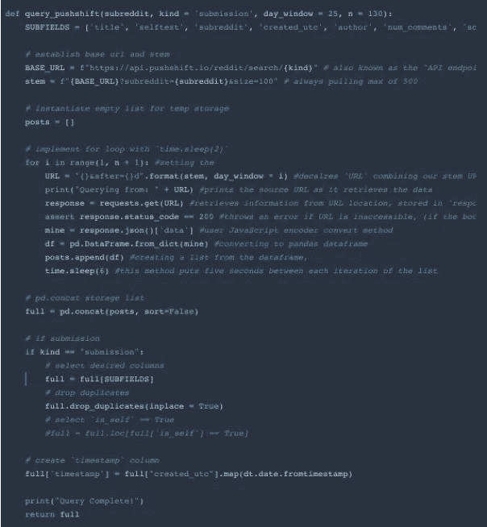
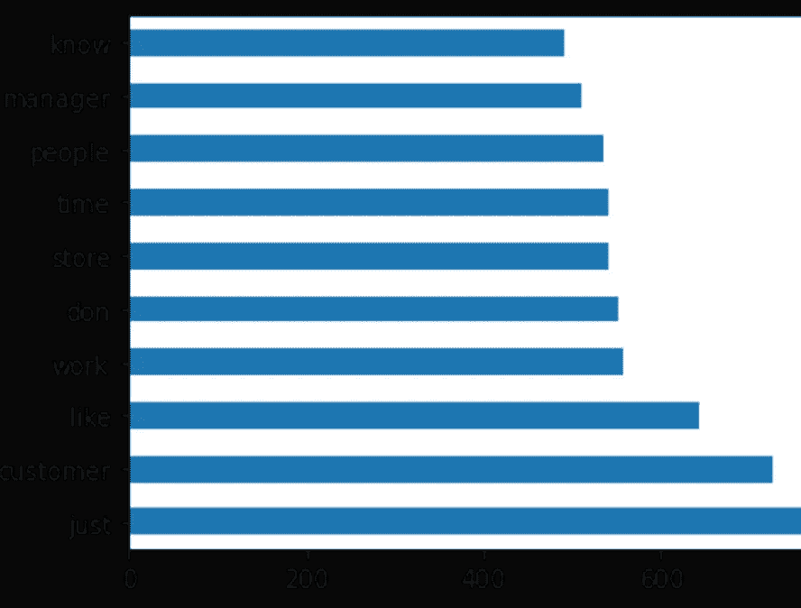
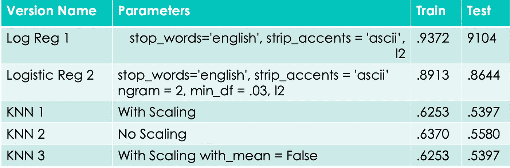
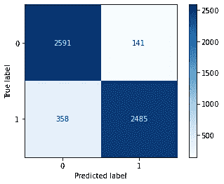
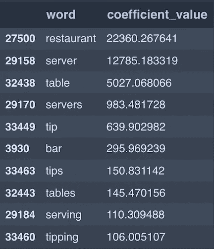

# 子编辑预测:网页抓取、自然语言处理和二元分类

> 原文：<https://medium.com/geekculture/subreddit-predictions-web-scraping-nlp-binary-classification-8ddc376d5741?source=collection_archive---------22----------------------->

这个项目无疑测试了我认为我能做到的极限。

这个项目的基本前提是从两个不同的子编辑中收集数据(来自 10，000 篇帖子的文本),并建立一个分类模型，该模型可以根据帖子的文本预测一篇帖子属于两个子编辑中的哪一个(希望有一定的准确性)。

## **背景:Reddit 101 &挑选一对子编辑**

对于生活在岩石下、需要被告知的人来说，就像我一样，Reddit 是互联网上一个主办论坛的网站。它拥有大约 130，000 个子主题，涵盖所有主题。

爱好。电子游戏。非常私人的提示。专业意见查询。政治话语。Reddit 上内容的广度是巨大的，深度是深刻的。一个既可怕又奇妙的地方。

是的，我听说过 Reddit，但更重要的是，我对使用 Reddit 和填充它的内容创作者的特殊社区是完全陌生的。

考虑到这一点，我很难为这个项目挑选一对子网格。我考虑的主要标准是体积；挑选子主题，我可以从每个子主题中收集至少 10，000 个帖子。

Reddit 不显示属于一个子编辑的帖子总数，因此确定是否有足够多的帖子变成了一个非正式的公式，基于这些考虑因素的组合:用户总数、总用户与活跃用户的比率、帖子的频率(基于对一些最近帖子的帖子时间的快速浏览)以及子编辑的创建日期。

按照设计，这个项目的很大一部分是练习自然语言处理(NLP)领域的技能。因此，下一个主要标准排除了大量替代形式的内容，如图像(主要是模因)、视频等。虽然文章的标题是专有的文本，可以矢量化和建模，但如果子编辑的“文章”文本的可识别部分只存在于标题中，这就违背了任务的精神。

从概念上来说，我所努力的是选择一对子涡旋，它们不会太不相似，以至于它们的预测信号对模型来说太*太*明显。最初的想法是使用“外星人”和“幽灵”子标题，但肯定的是，即使是名义上的词也会在帖子中出现太频繁，并成为致命的泄露。我决定我的模型需要一个挑战的表象，所以我想要一些更微妙的东西。

我选定了我认为满足我所有条件的地方——一对子街道，零售工人和餐馆服务员分别在这里记录他们的日常经历，并诉说他们的职业不满。大多是后者。

两者都有很好的总活跃用户比率，似乎都有频繁的帖子，而且他们都是在近十年前开始的——在 Reddit 上的开始日期之间不到一年。他们的绝大多数帖子都是大量的文本，重要的是，他们的词汇表中可能有足够的重叠，从而在模型中产生所需数量的噪声。我也在餐馆工作了很多年，所以我能理解一些被讲述的故事。

是的，也许看起来我在这一阶段投入了很多精力。然而，我花了几个小时阅读 reddit，尝试不同的子编辑对，以实现我对数据的预期；所以不知不觉中，选择阶段变成了一个大的时间消耗。

## **网页抓取**

为了从子编辑中获取数据，我使用了一个基于代码的函数，该代码是由我出色的大会讲师格温·拉斯格贝尔创建的。

这个函数通过循环发送 URL 请求来访问 Reddit 的 pushshift API。这个循环从给定子编辑的 post (submission)中检索指定的数据子字段，检索日期范围由 day_window 参数指定。

从日期范围中检索数据后，它移动窗口，并再次移动，移动次数为 *n-* 。在这种情况下，我们的窗口是 25 天，循环 130 次，总范围为 3250 天(大约九年的帖子)。每次请求最多 100 个帖子，两次请求间隔 6 秒钟，以免 Reddit 服务器不堪重负。

我使用这个函数从两个子记录中抓取数据。考虑到空内容和重复行，然后进行数据清理，并为检查两个论坛中的帖子设置一个共同的开始日期(2012 年 11 月 1 日),我从 TalesFromRetail 获得了 11，177 个可用帖子，从 TalesFromYourServer 获得了 11，120 个可用帖子。总共 22，297 篇帖子，几乎完全平衡，大约 50%是零售，50%是服务器。因此，我们的模型的基线分数被建立在 50%的准确度。

## **NLP**

既然我们已经准备好了数据框架，我们就可以开始我们的自然语言处理了！(NLP)

下面是我们在处理自然语言时做的一些事情:作为基础，我们从句子中提取单词作为单个对象(tokenize)。然后，我们可以通过单数名词、标准化动词的主语变化或简化缩写(词汇化)等机制，同时缩短和进一步同质化相似的词。或者更彻底地，仅仅将每个单词减少到一个前缀(波特词干)。我们删除那些没有多少上下文/预测价值的常用词(停用词)。

计数矢量化是为数据集中文本数据的每个“单词”创建列的过程。它有自己的术语:“文档”是数据集,“语料库”是文档中某一列的全部文本(或整个文档中的全部文本),每个标记化的字符串(wordish 对象)称为一个“术语”。

它从文档的语料库中提取所有术语，为每个术语创建列，然后返回一个稀疏数组，其中包含特定术语在它填充的行(观察)中出现的总次数；产生了俗称的“词汇袋”。

## TFIDF

基于与计数矢量化相似的基础，术语频率-逆文档频率(TFIDF)超越了标准的词袋方法，如果某个术语在较少的文档中频繁出现，则本质上增加了该术语的值，同时降低了更普遍存在的术语的值。

通过采用更动态的方法，使用 TFIDF 而不是标准的 CountVectorizer 应该可以提供更多的价值，因为不可避免地会有重叠的术语(特别是对于子编辑内部的区分)。

我们将使用英语作为 stop_words 参数的参数，根据存储在 TFIDF 转换器中的预定列表删除常见的英语单词。

在通过 TFIDF 矢量器对文本进行初步处理后，将文本整体可视化。下面的可视化显示了两个子编辑中最常见的十个术语。从本质上来说，这些术语将是用来区分我们的子区域的最差的词。

## **建模**

尽管我希望尽可能创建最健壮的模型，但作业的一个不成文的参数是，我们只能使用矢量化的文本列作为预测变量。这意味着排除其他相应的帖子特征，如分数、评论、用户或日期信息——所有这些都有可能提高我们的整体预测能力。哦，好吧…

## **LogReg**

作为分类的入门模型，我碰巧喜欢逻辑回归。我喜欢:它的简单性和与线性回归概念上的相似性，它的透明性(白盒模型)，它在缩放预测变量[X]方面的优势和灵活性，它的整体可靠性，也许最重要的是…它的系数的可解释性！

我们最好的逻辑回归模型在训练数据上的准确率接近 0.94，在测试数据上的准确率接近 0.91。考虑到我们使用的是未调整的变量，没有调整任何逻辑回归模型超参数，这些分数相当不错。事实上，添加更多的超参数会产生一个稍微过拟合且不太精确的模型。

此外，我们还可以看出我们的模型是过度拟合的，测试数据的准确度分数比训练数据低 4 %;这表明我们的模型由于高方差而受损。

## **KNN**

抽象地说，我认为 KNN 实际上是一个更酷的模型。KNN 的工作原理是对模型要素进行矢量化，聚合值，将其绘制在超平面上，测量它们之间的距离，然后根据特定半径内确定数量的“相邻要素”的分类情况来预测分类。

我特别欣赏 KNN 模型，因为空间元素支持一种隐含的地理学——作为一门学科，我对此充满热情。我想象他们的机制就像一张在彩色超平面上的矢量化预测变量城市的地图。

我们的 KNN 模型非常相似，训练分数约为 0.63，测试分数约为 0.54。这些分数不仅说明了我们的模型的预测能力是多么的小，它们也遭受了显著更高的方差，使它们比我们的逻辑回归模型更加过度拟合。

## **公制评估**

根据我们的分类标准，我们的测试数据的准确度分数大约是 0.91。虽然这个测试准确度分数并不可怕，但是仍然有所欠缺。我们的灵敏度/召回分数是大约 0.87，我们的精确度分数是大约 0.94，这告诉我们，我们的模型更有可能预测假阴性而不是假阳性。

Label “0” represents a retail origin, label “1” a server origin.

## **系数解释**

逻辑回归模型的系数最能表明 reddit 帖子是否是由服务器而不是零售人员写的，这可能是显而易见的，当然也很能说明问题。Servers subreddits 是通过引用他们的工作地点(餐馆)、他们自己(服务器)、他们引用他们的客户的方式(桌子)的术语来预测的。但实际上，服务器不一定会通过这样做来区分它们自己。

Top ten coefficients from the logistic regression, sorted in descending order by their exponentiated values.

当检查在确定帖子是由服务器写的方面贡献最小预测能力的系数时，也就是在确定帖子是由零售工作人员写的方面贡献最大预测能力的系数，它们占据了类似于服务器词汇表的空间。

简单地说，与服务器类似，帖子中最能预测零售来源的词也是他们的工作地点(商店)、他们自己(收银员)、他们提及客户的方式(顾客)。

Bottom ten coefficients from the logistic regression, sorted in ascending order by their exponentiated values.

## 结论

这个项目涵盖了这么多！我们使用 API 从 web 上抓取数据，使用 TFIDF 转换我们的数据，我们尝试了几种不同的分类模型，使用各种指标对它们进行了评估，显然得出了一个并不可怕的模型！是的，有时很难在概念上围绕几个新鲜的、看似复杂的想法和工具进行操作；但是，最终，我发现这是一个非常有用的练习，也是一个有效的入门练习。