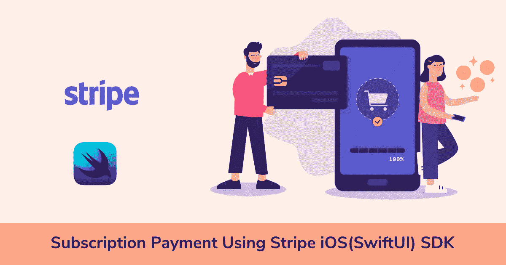
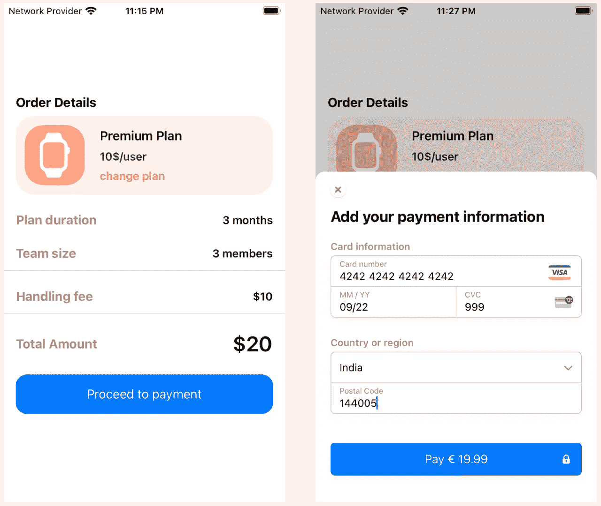

# 使用 Stripe iOS(SwiftUI) SDK 进行订购支付

> 原文：<https://medium.com/geekculture/subscription-payment-using-stripe-ios-swiftui-sdk-409a9fdc1a0?source=collection_archive---------2----------------------->



Stripe 拥有令人惊叹的文档，涵盖了他们产品的所有用例，包括示例代码和逐步指南。但我有一个用例，我需要使用新的 Stripe SwiftUI SDK 进行订阅支付，我很难找到一些文档或样本来实现这一点。最后，我们有一个解决方案，这个博客致力于该解决方案的实施。

Stripe 支付集成需要一些后端和前端移动工作，所以让我们先从第一件事开始，项目设置和 pod 安装。

## 1.1 Podfile(添加依赖项)

```
pod 'Stripe'
pod 'Alamofire', '~> 5.4'
```

将这些添加到您的 Podfile、Stripe SDK 和 Alamofire 中。对于 API 调用，下一步是在 AppDelegate 文件中添加发布密钥。

## 1.2 AppDelegate(为 SDK 提供发布密钥)

您可以从 Stripe 开发人员控制台获得您的测试发布密钥。

## 1.3 内容视图(让我们做一些快速的 UI 工作)

在这里，我们创建了一个示例 UI，只是为了演示，但你们可以将其集成到现有的 SwiftUI 视图中。

## 1.4 订阅视图模型(条带配置的视图模型)

在这里，我们在应用程序开始时调用托管在 [Glitch](https://glitch.com/) 上的测试后端 API，以获取启动 stripe 预构建 UI 所需的密钥和支付意图。这就是我们配置 SDK 并启动它所需要的全部内容。现在按照下面的后端部分，这是关键的一步，以使订阅付款在原生用户界面。

## 1.5 后端代码(创建订阅支付意向的重要部分)

在这里，我们创建一个支付行为为`default_incomplete`的订阅支付意图。另外，请记住添加一个有效的价格 id，您可以从开发人员控制台的 products 选项卡中获取该 id 进行测试，但是在实际的用例中，您将调用 stripe API 来动态获取价格 id。

因此，问题是我们在服务器端代码中为普通的一次性付款而不是订阅付款创建付款意向，如下所示。因此，请注意，如果您想进行基于订阅的支付，则需要创建一个订阅支付意向，而不是常规的意向。

**一次性付款**

```
//use this code for one time payment
const paymentIntent = await stripe.paymentIntents.create({
    amount: 1099,
    currency: 'eur',
    customer: customer.id,
    payment_method_types: ['bancontact', 'card', 'ideal', 'sepa_debit', 'sofort'],
  });
```

**认购付款**

```
//use this code for subscription payment
const subscription = await stripe.subscriptions.create({
  customer: customer.id,
  items: [{ price: "price_2JfB2RKdI6ztUgqfnckNNSg3" }],
  payment_behavior: "default_incomplete",
  expand: ["latest_invoice.payment_intent"],
});
```

现在，我们终于有了一个在 SwiftUI 原生 SDK 中接受订阅付款的运行应用程序。我希望这对那些寻找这个用例样本的人有所帮助。如果需要运行代码，请找到所附的示例项目。



## Github 项目 iOS 示例

[](https://github.com/worstkiller/ios_stripe_subscription_swiftui) [## GitHub-worst killer/ios _ stripe _ subscription _ swift ui:这个 iOS 示例是针对…

### 此 iOS 示例用于基于订阅的支付的条带集成- GitHub …

github.com](https://github.com/worstkiller/ios_stripe_subscription_swiftui) 

## Glitch 服务器端项目示例

[https://glitch.com/edit/#!/lowly-evening-plant](https://glitch.com/edit/#!/lowly-evening-plant)

对于新的 Glitch 项目，点击[此处](https://glitch.com/edit/#!/remix/stripe-mobile-payment-sheet)，

> 注意:为了正常工作，请替换与您的条带帐户相关联的发布密钥和秘密密钥。

## 参考资料:

*   【https://stripe.com/docs/payments/accept-a-payment? 平台=ios
*   【https://github.com/stripe/stripe-ios/issues/1868 

特别感谢 [@Jack murphy](https://github.com/summer-mute) 在这个问题上的帮助。