# 使用统计数据在乌贼游戏玻璃桥中取得成功。

> 原文：<https://medium.com/geekculture/succeed-at-the-squid-games-glass-bridge-using-statistics-26635415de00?source=collection_archive---------4----------------------->

## 赌客的鱿鱼游戏玻璃桥指南。

如果你已经看过《乌贼游戏》系列*或者你不怕《T2》的大剧透，请继续阅读这篇文章，了解统计数据如何拯救你的生命。*

*乌贼游戏*是网飞历史上最受关注的系列。在这本书里，一群丢脸的参赛者如果通过六项测试，就有机会赢得一大笔钱，这六项测试由流行的儿童游戏组成。

第五项测试包括*通过一座有 18 个玻璃台阶的浮桥*，间隔一米。每个台阶由两块瓷砖组成，一块是钢化玻璃，能够支撑一个人的重量，另一块是普通玻璃，踩上去会碎。


十六名玩家将尝试一个接一个地过桥，每次跳跃从两块瓷砖中选择一块。如果一个玩家倒下，下一个玩家通过安全牌前进到前一个玩家的位置，并试图越过其余的玩家。


## 我应该赌哪个玩家？

假设一个玩家穿越，后面的人也会穿越，我们问自己的问题是**哪个玩家会第一个穿越？**

为了回答这个问题，我们需要把这座桥的每一步都想象成一个实验。玩家将跳到两个方块中的一个。如果他们幸存下来，他们将执行下一个实验(跳到下一个瓷砖)。否则就是下一个玩家来做了。

这样，我们可以把桥牌游戏看成是一系列的 18 次实验，每次失败都意味着一个玩家倒下了。零次失败意味着第一个玩家成功过桥，而 5 次失败意味着只有 11 个玩家通过。

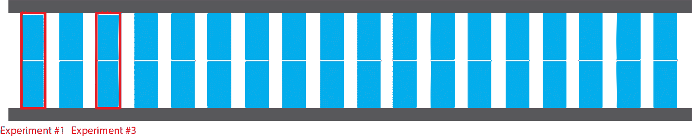

从这个角度来看，我们可以看到桥梁问题是一个服从二项式分布的随机变量:

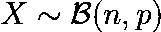

其中 n=18 是实验的次数，p=0.5 是每个实验成功的概率(有两个图块，只有一个是正确的)。

一旦我们知道了问题所遵循的分布，我们就需要计算出有 0 次失败(全部交叉)、1 次失败(除第一次外全部交叉)等的概率。这被称为**概率质量函数**，由以下公式描述:

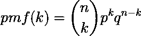

其中 **k** 是失败次数。我们将使用 Python 库 **scipy** 来计算这个函数。首先，我们创建描述游戏的随机变量:

```
import numpy as np
from scipy.stats import binom

n = 18
p = 0.5
rv = binom(n, p)
```

然后，我们计算函数:

```
failures = np.arange(16)
probs = rv.pmf(failures)
```

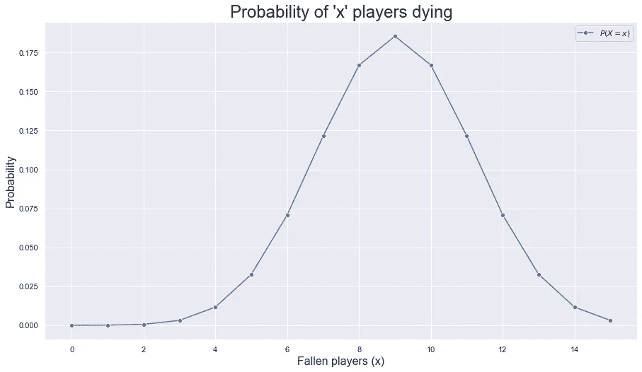

正如你所看到的，我们很可能会在游戏中出现**九落**，而**第十位玩家**将会第一个过桥。所以这是我们应该下注的玩家。

我们还想知道发生 **k 次或更少**次故障的概率。也就是说，最多 k 个玩家死亡。这是通过上述函数的累积和实现的，它被称为**累积分布函数**:

```
probs = rv.cdf(failures)
```

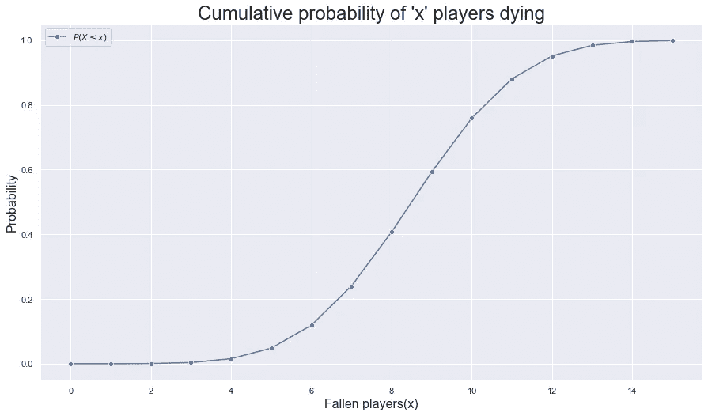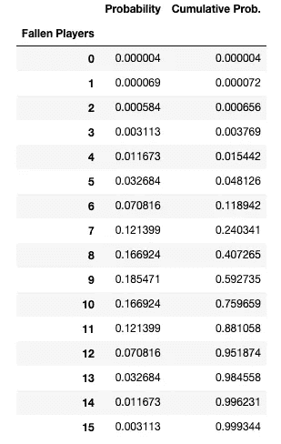

Probability (individual and cumulative) of x players falling.

如你所见，如果我们是第十二名或以上的玩家，我们有足够的理由在游戏开始前保持冷静。

## 平均下来，有多少玩家会活下来？


预期的故障次数可计算如下:

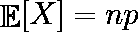

也就是二项随机变量的**期望值**。在 Python 中，我们可以将其计算为:

```
mean = rv.mean()
```

因此，**我们预计会有 9 次失败**，只留下 7 名玩家存活。

## 他们都活下来的概率有多大？没有吗？

直觉上，对于第一个过桥而不掉下来的玩家来说，他必须击中所有的跳跃。如果命中的概率是 1/2，有 18 次跳跃，穿越的概率是:

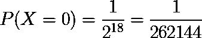

要知道**无人幸存**的概率，我们就用**二项分布**的**生存函数**。这个函数将是简单的 1-CDF。我们将计算 15 次失败的概率。在我们达到 100%之前剩下的概率将是 16 个玩家全部倒下的概率。在 Python 中，我们可以如下计算该值:

```
prob_none_survived = rv.sf(15)
```

这个概率是 **0.065612%** 。

## 如果轮到我，我穿越的几率有多大？

假设我们是其中一个玩家，感谢之前的参赛者，我们已经成功地前进到了第十一步。我们生还的概率有多大？

我们尝试杂交的结果是一个随机变量，它遵循**几何分布**。这个分布计算了在事件(坠落)发生之前，我们必须尝试(跳跃)**的次数**。通过这种分布，我们可以看到预期的结果。****

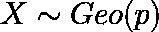

Geometric probability distribution.

首先，我们将计算出**我们期望跌倒的台阶，即平均值**。对于几何分布，计算如下:

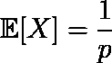

```
mean = rv.mean()
```

**平均值为 2** 。也就是说，我们可以预期**会在下一步**中存活，而**会在下一步**中死亡。现在，让我们看看在每一个**步骤**中我们死亡的可能性有多大:

```
tiles = np.arange(1, 8)
probs = rv.pmf(tiles)
```


如你所见，在第 12 步摔倒的概率是 50%。在第 13 步，它是 25%，依此类推。将以下步骤的跌倒概率相加，我们得到**的跌倒概率为 99.21%** 。所以，**生还概率为 0.78125%** 。

## 如果我排第四，第一个选手在第十级，我应该担心吗？

为了回答这个问题，我们可以使用与前面相关的概率分布:负二项分布。这个分布描述了在一个事件(坠落)发生给定次数之前，我们必须进行的实验次数。

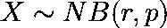

在这个分布中， *r* 是我们将要计数的事件数。因为我们将排在第四位，r=4。在接下来的 4 名参与者摔倒之前，我们将前进的平均步数计算如下:

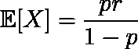

在这种情况下，平均值为 **4 步**。也就是我们的寿命是 4 步，还有 8 步要跨。现在让我们来看看前 4 名参与者在他们前面的每一级台阶上摔倒的概率。为此，我们需要使用以下公式计算分布的概率质量函数:

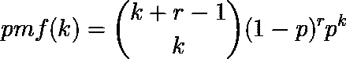

结果将如下图所示:


在此图中，我们可以看到直到最后一步的累积概率:

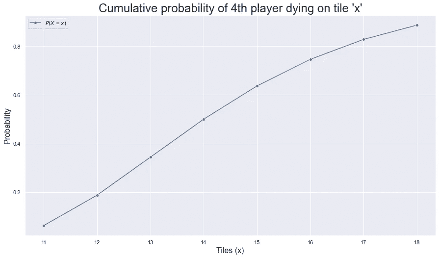

使用生存函数，我们可以分析在前四个参与者摔倒之前，克服剩余 8 个步骤的概率是多少(即，我们的生存概率):

```
prob = rv.sf(7)
```

这个概率是~11.32%。

## 总而言之:

如果在这次审查后，你仍然想参加，你需要做的就是打电话给邀请卡背面的号码。祝你好运！

