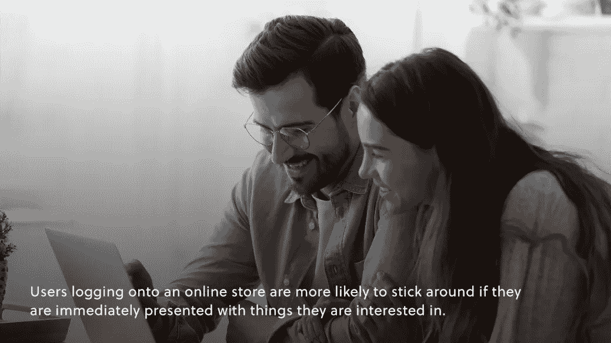

# 电子商务品牌应该如何使用客户数据

> 原文：<https://medium.com/geekculture/successful-e-commerce-in-an-increasingly-data-driven-world-9cdb11d6a274?source=collection_archive---------17----------------------->

## 电子商务和客户数据

## 在日益数据驱动的世界中成功的电子商务

客户体验正稳步上升，成为打造成功在线品牌的最重要焦点之一。在过去十年左右的时间里，品牌这样做的方式发生了巨大的变化。

越来越多的顾客开始在网上购物，当然，在虚拟化的病毒式发展之后也是如此。这种转变是有道理的。在商场买一块软椒盐卷饼很有趣，但是能够逛几乎没有尽头的商店，甚至不用离开你的沙发，也不用把所有的东西带回家，听起来也很不错。

那么，在这个革命性的虚拟世界中，电子商务品牌是如何收集客户数据的，他们是如何很好地利用这些数据的？这里有一些我们认为任何战略家都应该具备的洞察力。

# 注意你的频道

购物已经完全虚拟化，随着我们的集体互联网继续呈指数级增长，似乎总有比我们能够处理的更多的数据。当谈到跟踪客户数据时，优先考虑某些渠道是使这种数据分析更易于管理的一种好方法。

从社交媒体到收据调查，有很多不同的渠道可以找到这些客户数据。如果我们必须选择一些特别的，我们会说集中在*社交媒体，匿名调查，*和*论坛。*

*   社交媒体将帮助你了解客户自然在谈论什么，以及他们自然在担心什么。
*   调查将有助于你控制主题，获得即时有用的反馈数据。
*   论坛帮助您了解整个社区的共同主题和关注点，而不必从关键字搜索中拼凑各个数据点。各不相同，但都很重要。

渠道优先级的微妙之处起初看起来有点迂腐，但是如果不密切关注这一点，最终可能会成为一个[昂贵的错误。](/amberengine/how-e-commerce-brand-marketing-has-become-a-money-suck-and-how-you-can-ensure-yours-isnt-672e57a531f1)查看这个[有用的博客](https://www.amberengine.com/blog-content/customer-review-channels?utm_source=blog&utm_medium=referral&utm_campaign=medium-blogs)了解更多细节。

# 客户服务

说到客户体验恐怖故事，客服排在首位。这并不奇怪。没有人会去客户服务部聊天，因为可能已经有一些问题需要解决了。

确保客户对客服满意取决于快速有效的解决方案。快速有效的解决方案依赖于大量的数据收集和数据分析。

当然，你应该以没有问题为目标，但是这是不现实的。了解过去哪些地方可能出错，哪些地方出错了，了解什么导致了一个好的解决方案，手头有这些数据以便能够应对出现的任何情况，这可以创造一个顺畅的客户服务体验，让几乎任何客户脸上都带着意想不到的微笑。

# 个性化

你可能不记得你第一次登录亚马逊的时候，但是很有可能第一屏的商品看起来和你现在的启动屏幕很不一样。

什么变了？该公司分析了你的倾向、你的兴趣、你的购买(简而言之，你的数据)，并拼凑出你接下来可能想要、需要和购买的东西。

这种个性化很重要，因为它可能是吸引和失去潜在客户的区别。登录在线商店的用户如果能立即看到他们感兴趣的东西，就更有可能逗留在附近。除非他们彻底厌倦了，否则他们可能不会去挖掘类别和子类别来寻找他们感兴趣的东西。

# 展望未来

虽然实际上能够预见未来将非常有用，但我们实际上只是在谈论*预测分析。*不过，不要误解我们，这几乎同样强大。

预测分析就是分析收集的数据，以便能够预测未来的趋势。对于股票和客户体验来说，这是一个非常有用的工具。*先验地，*你不知道顾客会买多少某种产品，除非每件商品在每次购买后都准备好并发货，否则你必须知道每样东西有多少是现成的。

研究客户趋势可以帮助你做到这一点，这对于确保你不会错过收入和确保客户获得最佳体验同样重要。我们都记得偶然发现我们需要的东西，却发现上面标着“缺货”时的失望。如果这成为一种趋势，对你的品牌来说不是一件好事。

对客户体验的关注不仅仅是当前的趋势，而是一种趋势。电子商务市场和虚拟品牌空间在疫情中爆炸式增长，而且增长似乎没有停止。良好的客户体验对成功的虚拟品牌至关重要，我们希望这些见解能引导您走向正确的方向，看到您应得的增长！