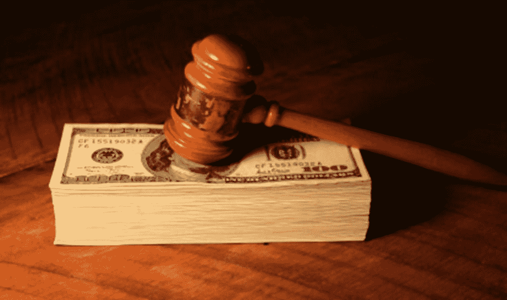

# 起诉预测者？

> 原文：<https://medium.com/geekculture/sue-the-forecaster-f2eb2f1fd38?source=collection_archive---------4----------------------->

## 太多的预测者是傻瓜或骗子。诉讼给这个行业带来了急需的纪律。

Source: [Wikimedia](https://www.google.com/search?q=judge%27s+hammer+money+court+wikimedia&tbm=isch&ved=2ahUKEwjevfTUye72AhUZVfEDHQ7tDHoQ2-cCegQIABAA&oq=judge%27s+hammer+money+court+wikimedia&gs_lcp=CgNpbWcQA1CKCViSKWC3LmgAcAB4AIABRYgB8QSSAQIxMZgBAKABAaoBC2d3cy13aXotaW1nwAEB&sclient=img&ei=RLBEYt6LDpmqxc8Pjtqz0Ac&bih=772&biw=1386&client=safari&hl=en)

## 太多的预测者是傻瓜或骗子。预测傻瓜应该被送回学校学习新方法。预测欺诈应该被解雇，并可能…