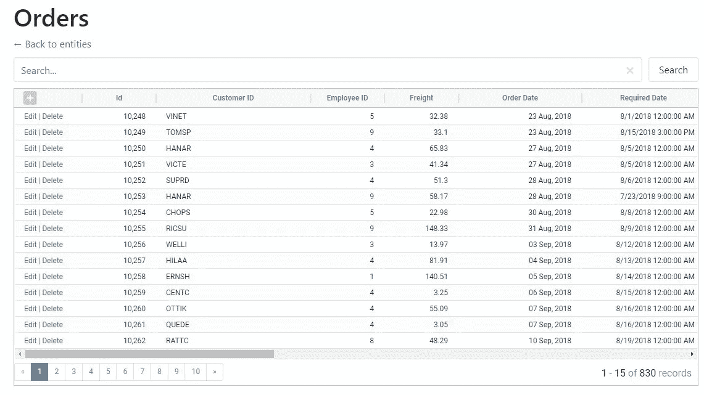
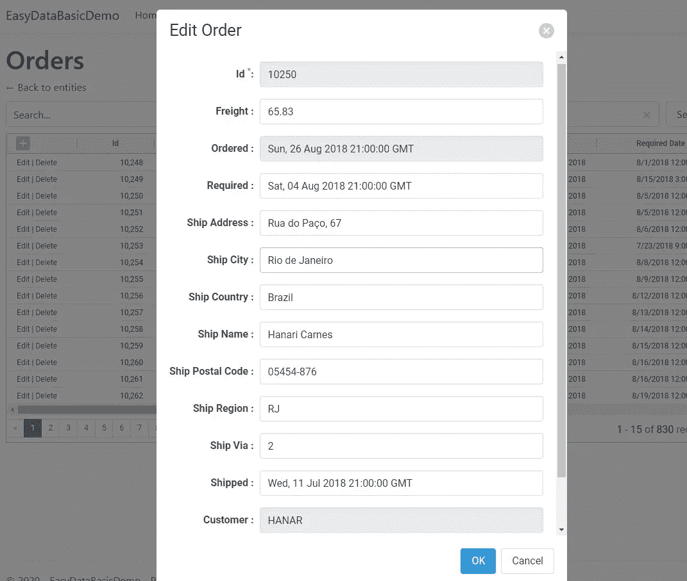

# 在 10 分钟内实现 ASP.NET 核心应用的 CRUD 功能

> 原文：<https://medium.com/geekculture/super-easy-crud-for-asp-net-core-apps-with-easydata-library-6dd97e4ea38a?source=collection_archive---------5----------------------->

# 问题

大多数业务应用程序的首要任务之一是为应用程序使用的主要实体实现 CRUD(创建、读取、更新、删除)操作。

作为解决任务的一部分，每个开发人员都面临以下问题:

*   CRUD 页面和表单的创建是非常枯燥和耗时的。相信我，我去过那里很多次。
*   如果您手动完成，可能会非常慢并且容易出错(丢失字段、忘记验证器等)。
*   当然，你可以使用 Visual Studio 提供的脚手架工具。然而，这也不是一个快速的过程，因为您需要为每个模型类运行这个工具。结果，你得到很多。cs 和。cshtml 文件，如果默认行为或外观不符合您的需要，您必须手动编辑这些文件。在模型类发生变化的情况下，您需要手动更新那些生成的控制器和页面，或者为每个受影响的模型类从头开始重新生成代码和表单。
*   此外，即使是内置的脚手架也没有提供一些重要的，通常是必不可少的功能，如分页或搜索。

# 解决方案:EasyData 库

为了解决这些问题中的大部分(如果不是全部的话)，我们创建了 [EasyData 库](https://github.com/KorzhCom/EasyData)。EasyData 的主要优点是它采用了声明式方法。整个过程可以分为两个主要步骤:

1.  您“描述”您想要处理的数据(实体和属性)以及您的应用程序应该如何处理这些数据(类型、约束、实体之间的关系等)。
2.  基于这些信息，EasyData 库为 CRUD 操作建立了一个 API 端点，并建立了一个普通的基于 JavaScript 的 UI，允许用户通过 API 执行这些操作。

这里最奇妙的是，当使用 Entity Framework Core 时，第一步(“描述”数据)所需要的只是您的 DbContext。只需将它“输入”到库中，EasyData 就会自动提取创建 API 端点和 CRUD UI 所需的所有信息。

# 快速演示

这里有一小段介绍视频，展示了 EasyData 的工作原理:

# 入门指南

首先，为了测试 EasyData，您可以打开并运行这个存储库中可用的[示例项目](https://github.com/korzh/EasyData/tree/master/samples)中的一个。

将 EasyData 安装到您的项目需要以下三个简单的步骤:

## 1.安装 EasyData NuGet 包

*   EasyData。AspNetCore
*   EasyData。实体框架工作核心关系

## 2.在`Startup.Configure`中添加 EasyData 中间件

在中间件选项中，我们还指定了将用作元数据来源的 DbContext 对象的类型。

## 3.为所有 CRUD 操作设置一个总括页面

如果你使用 Razor 页面，添加一个新页面(例如`EasyData.chstml`)。如果是 MVC，你需要一个控制器和一个视图。该页面将“捕捉”所有以某个前缀开头的 URL(默认为`/easydata`，但这是可配置的)。因此，我们在路由定义中使用了一个特殊的总括参数(`"/easydata/{**entity}"`)。

我们还添加了 EasyData 样式和脚本文件(`easydata.min.js`)，它呈现数据管理 UI 并处理客户端的所有 CRUD 操作。

就是这样。现在你可以运行你的网络应用，打开`/easydata`网址，享受 CRUD 功能。

结果将是这样的:

## 一个实体的列表视图屏幕:

## “编辑记录”对话框:

## “查找”对话框(从“编辑记录”打开):

# 它是如何工作的

让我们简单回顾一下所有这些魔法是如何工作的。正如我们之前提到的，EasyData 主要负责三件事:

*   它收集数据库元数据。
*   它为主要的 CRUD 操作建立了一个 API。
*   它呈现 UI(同样基于元数据)并处理该 UI 中的所有用户交互。

让我们详细探索所有这些部分。

## [计]元数据

元数据是关于您的数据的数据:什么实体(表)存储在您的数据库中，它们是如何连接的，它们具有什么属性(字段)，属性的类型是什么，以及我们可以存储在这些属性中的值的约束是什么。

EasyData 收集元数据(以这样或那样的方式)并将其存储在`MetaData`类的实例中。该对象包含实体(表)列表、每个实体的属性(字段)、实体之间的连接以及在 API 中以及在 UI 呈现和处理期间使用的一些附加信息。

为了填充元数据对象，我们指定了一个元数据加载器。在上面的例子中，我们是通过 UseDbContext 调用来实现的。因此，元数据是从 DbConext 对象中加载的。目前(在 1.2 版中)这是唯一可用的元数据加载器。在未来的版本中，可以直接从 DbConnection 对象加载元数据，或者使用其他方法。

## EasyData 中间件

EasyData 中间件负责为客户端发起的所有 CRUD(而不仅仅是)操作建立 REST API。

要将中间件添加到您的管道中，请使用`UseEndpoints`配置委托中的`MapEasyData`扩展函数:

此呼叫应在`MapMvc`或`MapRazorPages`之前进行。默认情况下，EasyData 中间件被分配给`/api/easydata endpoint`，但是您可以通过参数中传递的配置函数(action)来更改它。

为了对`MapEasyData`进行配置，唯一需要做的事情是告诉它在哪里获取元数据。目前，只有一种选择:从 DbContext 获取元数据。所以，这就是为什么我们在上面的例子中添加了`UseDbContext<AppDbContext>()` call。除了获取元数据，`UseDbContext`还为我们的中间件提供了执行 CRUD 操作的所有手段(通过 DbContext 对象)。

## EasyData 用户界面根页面

EasyData 设置过程的第三部分是呈现 CRUD 用户界面的页面。它必须是一个所谓的“包罗万象”的剃刀页面或 MVC 视图。默认情况下，必须为任何以`/easydata/`前缀开头的路径打开该页面。(因此，所有像`/easydata/student`或`/easydata/invoice`这样的路径都必须由这个页面处理。)

注意:`/easydata`是默认前缀。您可以使用另一个名称，但是在这种情况下，有必要在我们的`RootDispatcherView`对象的选项中指定它。

我们的总括页面可以包含您选择的任何 HTML 元素。然而，为了确保 CRUD UI 的可视化和正常操作，它必须包括以下 4 个元素:

*   `<link>`引用 EasyData CSS 文件的元素(`easydata.min.cs`)
*   容器(空的`div`元素)，我们的界面将在其中显示。默认情况下，它必须具有 ID `EasyDataContainer`，但这也可以通过选项进行配置。
*   `<script>`引用了`easydata.min.js`的元素。
*   以及一个在页面加载时创建并启动`EasyDataViewDispatcher`对象的小脚本。

你可以在上面的入门部分看到一个最简单的“总括”页面的例子。

# 包扎

目前，EasyData 可以与。NET Core 3.1 和。净 5。显然，所有 ASP.NET 核心和实体框架核心版本都可以与。NET(核心)的支持。不过增加对之前版本的支持不会有问题。网芯甚至。NET Framework 4.x .如果有人需要，请[在 EasyData 的 GitHub 资源库提交问题](https://github.com/KorzhCom/EasyData/issues)。

当我们已经了解我们将需要哪些数据，但不想在这些数据的最简单操作上花费大量时间时，EasyData 是一个很好的工具，可以用来快速构建新项目的原型或创建 POC(概念验证)。但是，我们希望最终能够在生产环境中全面使用该解决方案。

因此，我们期待着听到您的任何意见或建议。当然，别忘了给 GitHub 上的 EasyData 资源库加个星，尤其是如果这个库对你有帮助，节省了一些时间的话。

因此，我们期待着听到您的任何意见或建议。当然，别忘了给 GitHub 上的 [EasyData 资源库加一颗星，尤其是如果这个库对你有所帮助，节省了一些时间的话。](https://github.com/KorzhCom/EasyData)

*最初发表于*[T5【https://korzh.com】](https://korzh.com/blog/crud-asp-net-core-with-easydata)*。*