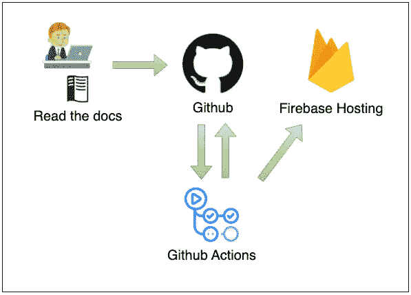

# 超高效地创建“阅读文档”

> 原文：<https://medium.com/geekculture/super-efficient-creation-of-read-the-docs-f1080022e9fd?source=collection_archive---------7----------------------->

# #让我们用[Read the docs]+[Firebase]+[Github Actions]+[Slack notification]做一个漂亮的文档吧

Overall Configuration

# ##简介

Read the Docs 通过自动构建、版本化和托管您的文档来简化软件文档。