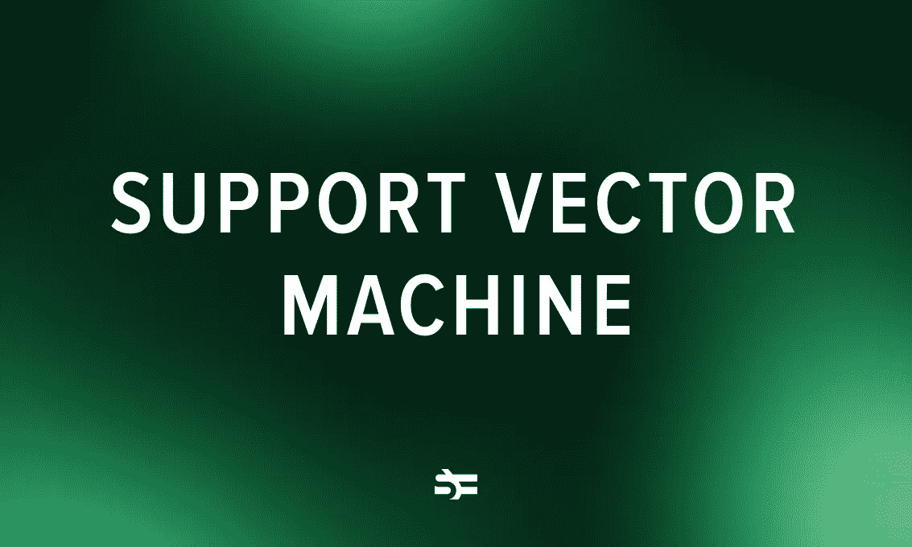

# 支持向量机算法

> 原文：<https://medium.com/geekculture/support-vector-machine-algorithm-37c21a38168f?source=collection_archive---------8----------------------->

支持向量机(SVM)算法是一种广泛使用的机器学习算法，因为它具有高性能、灵活性和高效性。在大多数情况下，你可以在万亿字节的数据上使用它，它仍然会比使用深度神经网络更快、更便宜。

该算法用于广泛的任务，如文本分类，手写和人脸识别，并…