# 支持向量机(SVM)分类

> 原文：<https://medium.com/geekculture/support-vector-machine-svm-classification-6579184d78e5?source=collection_archive---------14----------------------->

SVM 适用于复杂的中小型数据集的分类。目标是找到一个**超平面**，在所有数据点都位于超平面的正确一侧的约束下，最大化两个类之间的**裕度**(超平面和最近数据点之间的距离)。

**Scikit-learn** 库能够对数据集进行二元和多类 SVM 分类，分类器有 **LinearSVC，SVC，NUSVC** 和 **SGDClassifier** 。Scikit-learn 网站上的用户指南表明，他们的实现是基于 **libsvm** 的，这是用 C++编写的，尽管它有一个通过 PyPI 和绑定的 Python 接口&端口存在于少数其他编程语言中，即:Java、MATLAB 和 r。

我意识到 scikit-learn 的 SVM 模型需要对几个超参数进行调整，但是没有提供精确数学公式的细节。我希望这篇文章能够弥合理论和实践之间的差距。

1.  **硬保证金 SVM**

硬边距 SVM 严格规定所有数据点必须在边距线之间的区域之外。

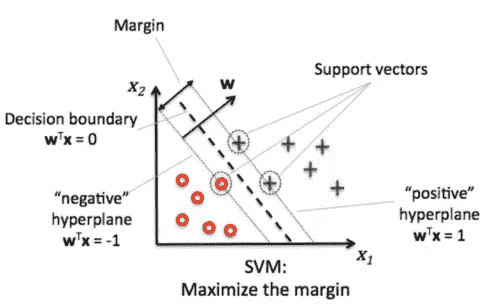

The vector **w** is **orthogonal** to the hyperplane. “negative hyperplane” and “positive hyperplane” are the margin lines. Hyperplane, also named the “Decision boundary” lies right in the middle of the margin lines. The data points that lie on the margin lines are called the support vectors. **Support vectors** determine the maximum margin of the separating hyperplane. If one of those 3 support vectors is removed and SVM is retrained, the new hyperplane would be different.

**超平面**由以下等式定义:

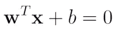

**裕量**由以下等式定义:

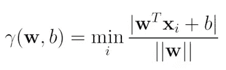

边距也是**比例不变的**，这是我们稍后将受益的一个重要属性:

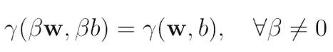

如果超平面能够很好地分离数据集中的类，那么数据就是**线性可分的**。在这种情况下，

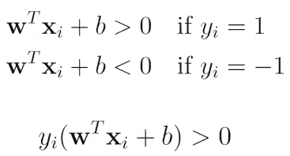

对于线性可分的数据集，有无限多的潜在超平面，但我们选择最大化边缘的超平面，因为边缘小的超平面更容易过拟合。这里我们有一个约束优化问题要解决。我们的目标是**在所有数据点都位于超平面**的正确一侧的约束下最大化余量:

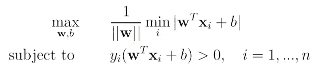

然而，这有一个**非凸目标**，具有多个局部最小值，难以求解(当我们应用梯度下降时，非凸函数可能导致算法陷入局部最小值)。由于分离超平面是尺度不变的，我们可以任意固定 w 和 b 的尺度。我们用这个属性来设置

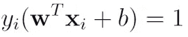

对于最接近超平面的点。在这种情况下，边距变为:

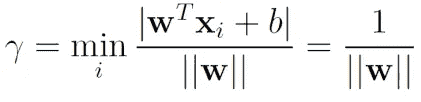

因此，为了最大化边际，我们必须最小化 **||w||** 。因此，新的目标函数和约束变为:

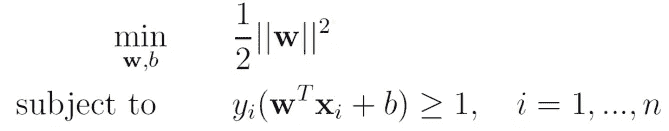

Our initial objective was to maximize the margin, which is 1/**||w||**, but this is **non-convex**. Maximizing 1/**||w||** is same as minimizing **||w||²/2**, but this new objective function is **convex** that is why we changed the objective function here.

给定一个**原始问题**(一个约束最小化问题)，我们可以表达一个**对偶问题**(一个约束最大化问题)。对偶问题的解决方案为原始问题的解决方案提供了一个 T4 下界。在 **Slater 的条件下，强对偶**适用于这里的优化问题。**对偶缺口**变为 0，对偶问题的解与原问题的解相同。SVM 的约束优化问题满足 Slater 条件。

首先，我们可以使用**拉格朗日乘数:α重写 SVM 的约束优化函数。**这个目标函数被称为**拉格朗日原始问题**:

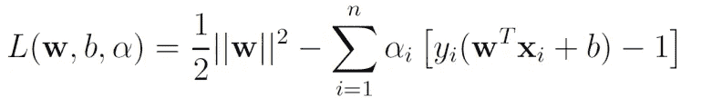

We are minimizing this w.r.t. **w** and **b**, and maximizing w.r.t. **α**.

我们可以为 **w** 和 **b:** 解决这个拉格朗日原始问题

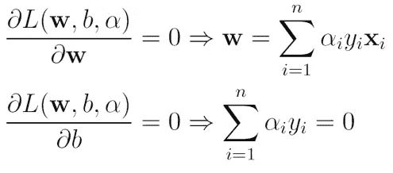

代入 **w** 和 **b** 的值并简化，我们得到对偶表示:

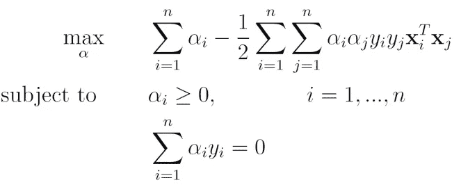

最大化关于 **α** 的对偶问题相当于最小化关于 **w** 和 **b** 的原始问题。对偶优化问题可以通过 **QP(二次规划)解算器**来解决。

这种形式的约束优化满足**卡鲁什-库恩-塔克(KKT)条件**，在这种情况下，要求以下性质成立:

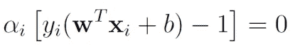

因此，

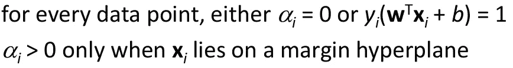

因此，**在训练之后，我们只需要存储支持向量**并丢弃数据点的重要部分。一旦我们通过 QP 解算器找到拉格朗日乘数的最优解，我们就可以找到 **w:**

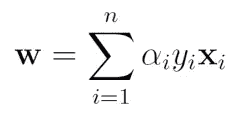

Please note that the Lagrange multipliers, **α**, are **non-zero only for the support vectors**. Thus, in the inference time, while making predictions, we only compute the dot product of the new input vector with the support vectors.

然后，我们可以通过使用 xi 满足的任何支持向量来找到 **b** :

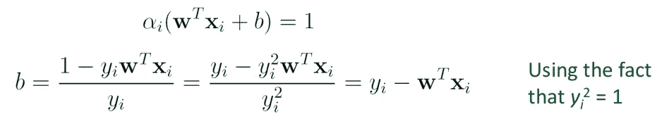

不使用任意的支持向量来寻找 **b** ，一个数值上更稳定的解决方案是对所有的支持向量进行平均:

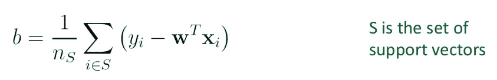

在推理时间里，在进行预测时，我们评估以下符号:

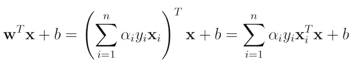

请注意**拉格朗日乘数α仅对于支持向量**是非零的。因此，进行预测是非常便宜的，这需要计算新输入向量与支持向量的点积。

**2。软保证金 SVM**

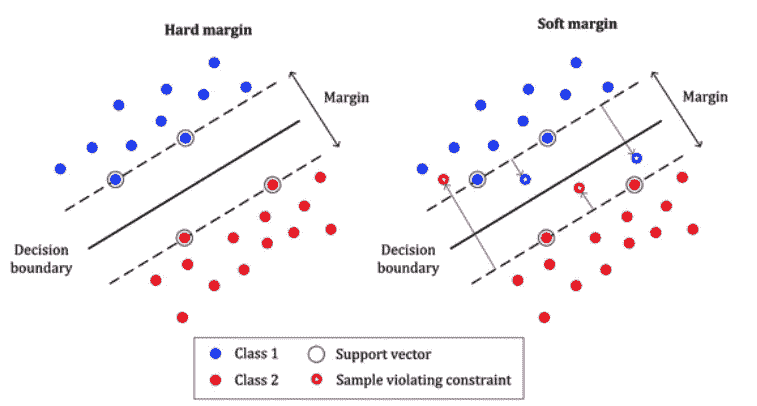

硬边距 SVM 严格规定所有数据点必须在边距线之间的区域之外。因此，它只适用于线性可分的数据。硬利润对异常值也很敏感。

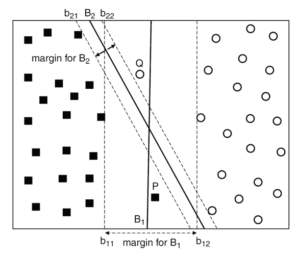

在一些问题中，一个具有较宽边缘的超平面( **B1** )会错误地分类一些数据点，而一个具有较窄边缘的超平面( **B2** )会更适合数据。

在软边距 SVM 中，允许数据点位于边距的错误一侧，但惩罚随着与该边界的距离增加而增加。

对于每个数据点，引入一个非负的**松弛变量** : **ξ** :

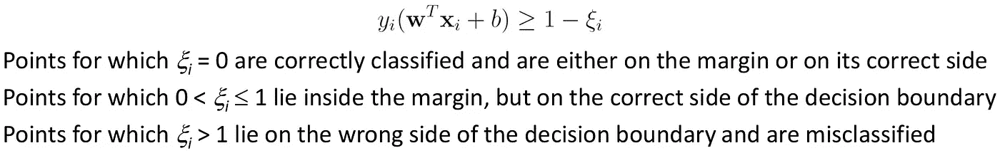

我们的目标是最大化利润，最小化松弛变量的值。最大化余量确保良好的泛化，而最小化松弛变量确保低训练误差。软裕度 SVM 的约束目标函数公式化为:

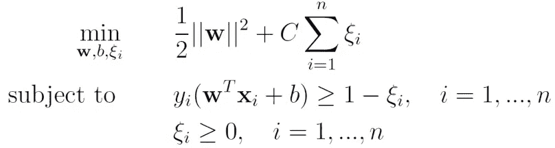

**C is a hyperparameter that controls the trade-off between maximizing the margin and minimizing the training error.**

超参数 **C** 的最佳值应通过交叉验证进行微调。

如果 C 非常大 **→** SVM 试图得到超平面右侧的所有点。

如果 C 非常小 **→** SVM 试图错误分类许多点，以最大限度地提高利润率。

像以前一样我们可以先写出软裕度 SVM 的**拉格朗日量**，

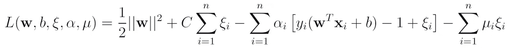

将导数 w.r.t. **w** ， **b** 和 **ξ** 设为 0 后，代入拉格朗日方程并简化，我们得到下面的**对偶问题**:

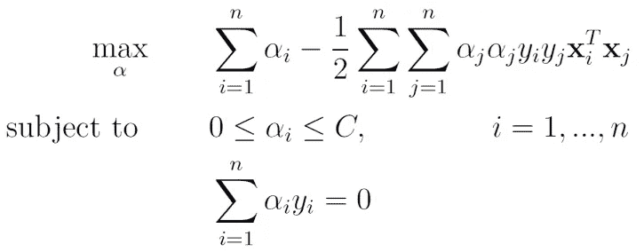

这个问题的 **KKT 双互补条件**是:

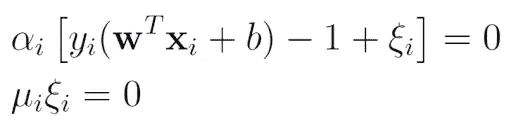

因此，我们可以使用 QP 解算器为每个数据点找到拉格朗日乘数 **α** ，

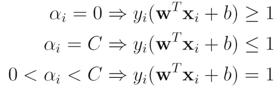

然后 **w** 和 **b** 的最佳值可以由下式得到，

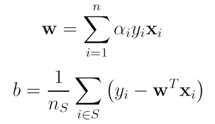

其中 **S** 表示驻留在边缘超平面上的支持向量集，

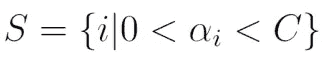

由于软裕度 SVM 的约束目标是尽可能最小化 **ξ** ，因此**不等式约束**也可以写成:

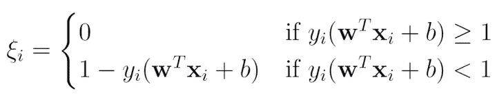

这相当于遵循封闭形式，

**Hinge Loss**

将其代入软边际 SVM 的目标，我们得到软边际 SVM 的无约束公式**。无约束公式具有 **L2 正则化子**和**铰链损失**。**

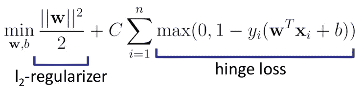

SVM parameters **w** and **b** can be optimized just as in logistic regression.

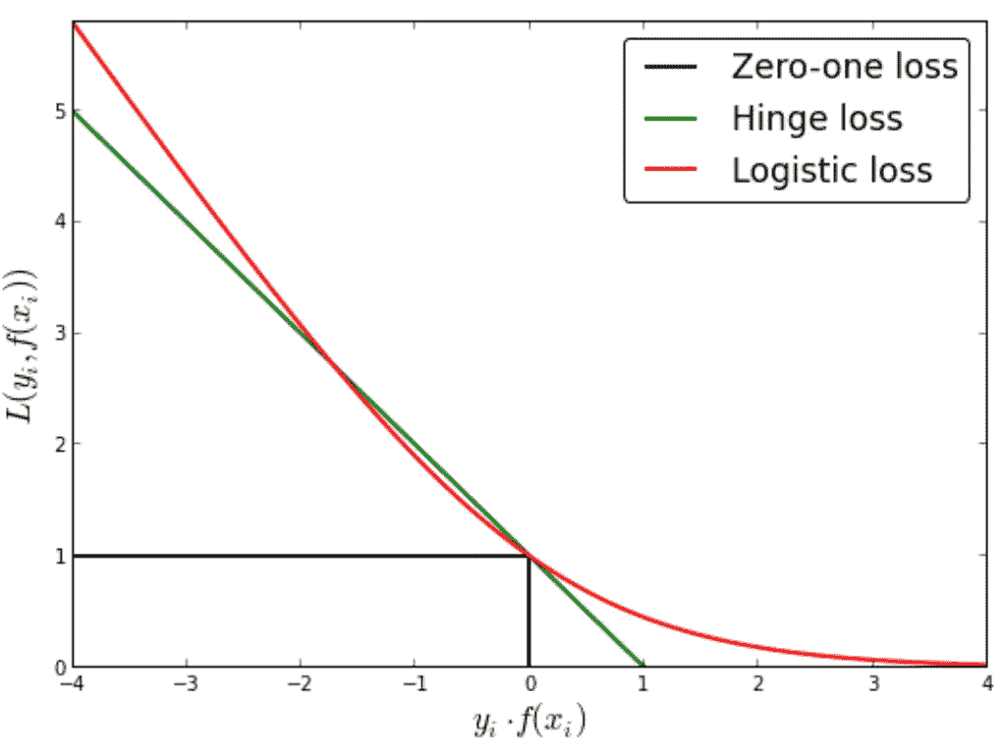

**Hinge Loss**

铰链损耗为**凸**，因此上述优化问题可以通过**梯度下降**解决。

此外，铰链损耗的平坦区域导致**稀疏解**。

**3。非线性 SVM**

非线性 SVM 将数据从其原始输入空间转换到高维空间，其中数据是线性可分的。然后，学习的超平面被投影回其原始输入空间，产生非线性决策边界。

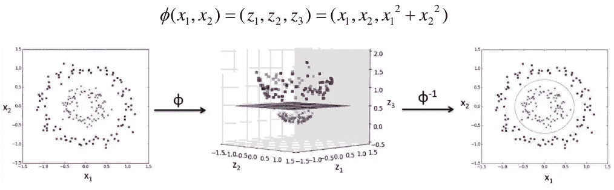

**Adding polynomial features.** A low polynomial degree might not deal with complex dataset, whereas a high polynomial degree might overfit. Using a suitable function **ϕ(x)**, we can transform any data sample **x** to **ϕ(x)**.

非线性 SVM 的目标函数是，

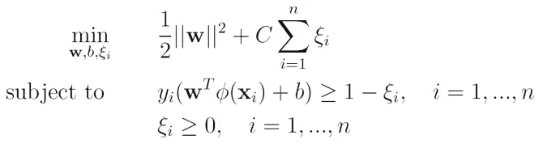

将导数 w.r.t. **w** 、 **b** 和 **ξ** 设为 0 后，代入拉格朗日方程并简化，得到如下**对偶问题**:

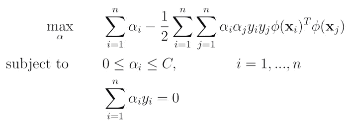

超平面的最优 **w** ，

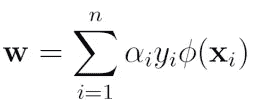

因此超平面的方程是，

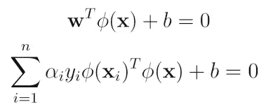

**b** 可以通过以下方式进行评估:

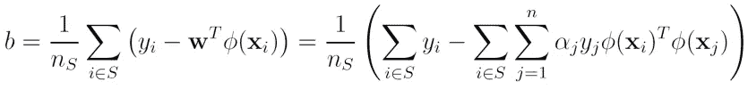

**核**给出了在某个特征空间中计算内积的方法，而无需显式计算特征空间 **ϕ(x)** 。这允许我们隐式地使用高维甚至无限维的特征空间。

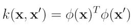

一些常见的**基函数**和它们的**核**，

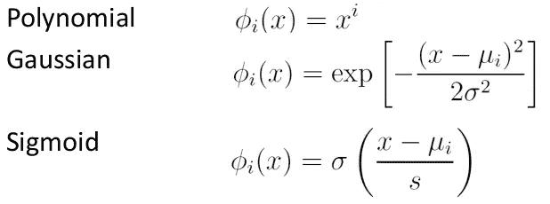

Common basis functions

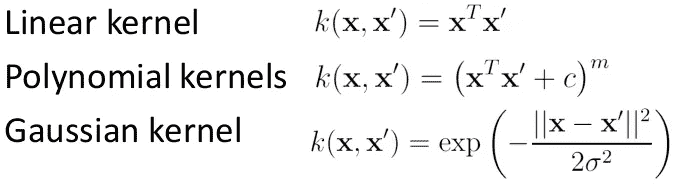

Common kernels

新的内核也可以通过使用更简单的内核来构建，

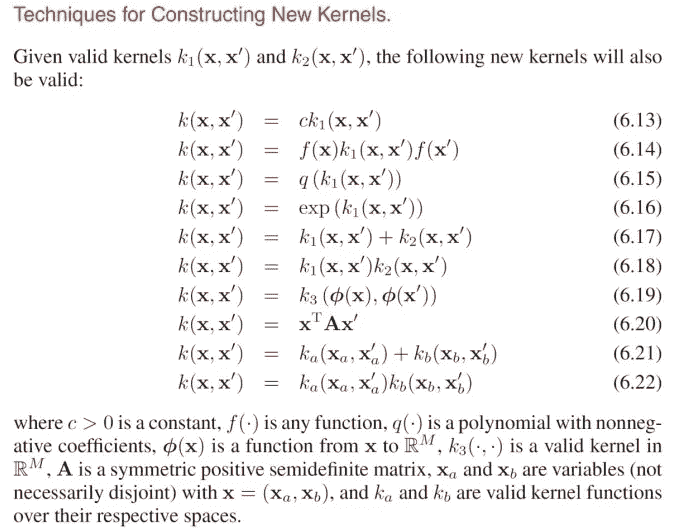

根据 **Mercer 定理**，检验一个函数是否为有效核的简单方法，

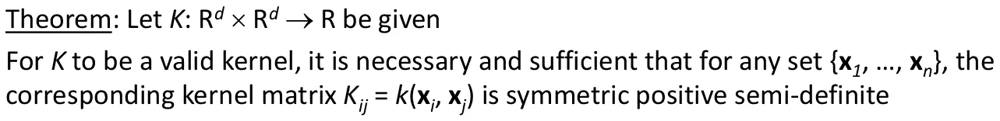

**Mercer’s Theorem**

**4。使用 SVM 进行多类分类**

SVM 只支持二元分类，但可以扩展到多类分类。对于多类分类，有两种不同的方法:**一对一方法**、**一对一方法**。

一对一方法训练 **n_class x (n_class-1) / 2** 个 SVM 型号。

一对多方法训练 **n_class** 数量的模型。

**5。获取每个类别的类别概率分数**

SVM 没有直接提供类别概率估计，但是 **Plott scaling** 提出将逻辑回归模型拟合到经过训练的 SVM 的输出，以获得每个类别的概率分数

**6。Scikit 的内置 SVM 模型-了解**

**a)线性 SVC**

它不支持内核技巧，但训练起来很有效率。它与样本数量 **n** 和特征数量 **d** 成线性比例。时间复杂度: ***O(nd)*** *。它使用一个对所有的方法进行多类分类。*

**b) SGD 分类器**

它不支持内核技巧；训练效率高，但不如线性 SVC 快。但是，它对于处理不适合内存的数据集或处理在线分类任务非常有用。它应用随机梯度下降来训练线性 SVM 分类器。时间复杂度: ***O(nd)*** *。它使用一对一的方法进行多类分类。*

**c) SVC**

它基于 libsvm 库，使用 QP 解算器在 ***O(n d)*** 和 ***O(n d)*** 之间缩放。对于具有数万个样本的大型数据集来说，这是不切实际的。它实现了多类分类的一对一方法。

**d) NuSVC**

NuSVC 实施 v-SVM(SVM 的替代方案)。参数 v 设置了误差分数的上限和支持向量分数的下限。它基于 libsvm 库，使用 QP 解算器在 ***O(n d)*** 和 ***O(n d)*** 之间缩放。对于具有数万个样本的大型数据集来说，这是不切实际的。它实现了多类分类的一对一方法。