# 支持向量机和核

> 原文：<https://medium.com/geekculture/support-vector-machines-and-kernels-8b064ee53fc3?source=collection_archive---------51----------------------->

Photo by [Mockup Graphics](https://unsplash.com/@mockupgraphics?utm_source=medium&utm_medium=referral) on [Unsplash](https://unsplash.com?utm_source=medium&utm_medium=referral)

这是我正在工作的系列的第七部分，在其中我们将讨论和定义介绍性的机器学习算法和概念。在这篇文章的最后，你会找到这个系列的所有前几篇文章。我建议你按顺序读这些。原因很简单，因为我在那里介绍了一些概念，这些概念对于理解本文中讨论的概念至关重要，我将在许多场合引用它们。

今天我们来看看我们最后的监督学习算法，支持向量机(SVMs)。我们将研究直觉，以及如何使用内核的概念来提出复杂的决策边界。

让我们开始吧。

# 支持向量机

支持向量机广泛应用于回归和分类问题。为了理解对支持向量机的需求，考虑以下具有两个特征和两个类别(Xs 和 Os)的分类问题:

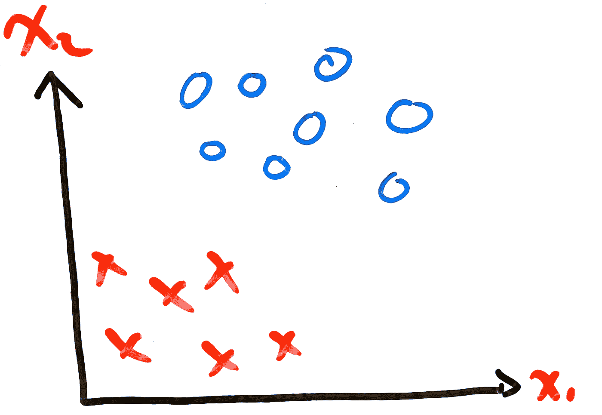

**Figure 1:** Classification Problem with Two Features and Two Classes

我们两个班的分界线是什么？有许多选项:

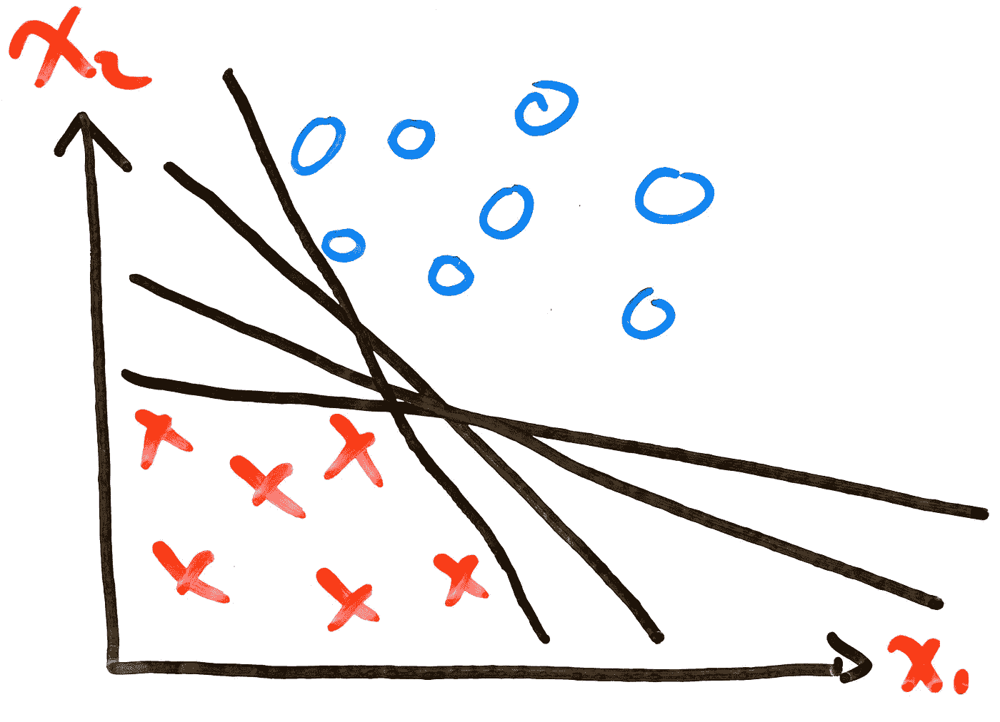

**Figure 2:** Possible Lines Fitting the Classification Problem

在决定使用哪条线最好之前，我们需要想出一些标准来帮助我们区分好的和不好的。在上一篇文章中，我们已经看到了其中的一些标准。以下是一些例子:

*   不要吃太多
*   不是吃不饱
*   对新数据进行很好的概括

现在考虑以下两个例子:

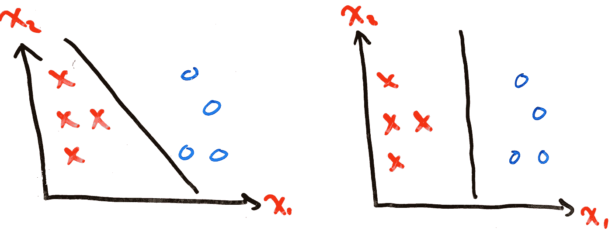

**Figure 3:** Different Possibilities of Fitting a Line Through the Same Points

并为每个添加新的数据点:

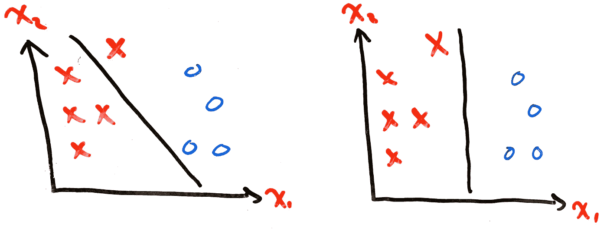

**Figure 4:** Demonstration of How Different Graphs Generalize To New Data

哪个图比较好？肯定是右边的那个。左边的一个错误地将 X 分类为 O，而右边的一个与训练点的距离足够大，可以推广到新数据。这就是 SVM 算法的目标:

> 在 N 维空间中找到一个超平面，该超平面清楚地分类数据点，其中 N 是特征的数量

让我们看看如何。

## 直觉

像往常一样，我们理解任何机器学习算法的第一步将是看它的成本函数。在本系列的第三部分[使用梯度下降的逻辑回归:直觉和实现](/geekculture/logistic-regression-using-gradient-descent-intuition-and-implementation-36a8498afdcb)中，我们看到了逻辑回归算法的成本函数:

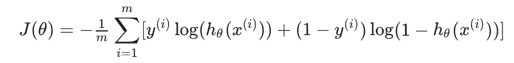

**Equation 1:** Logistic Regression Cost Function

这个等式告诉我们，每个训练示例贡献的成本为:

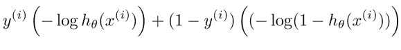

**Equation 2:** Cost of Every Individual Training example

其中`h`是逻辑函数:

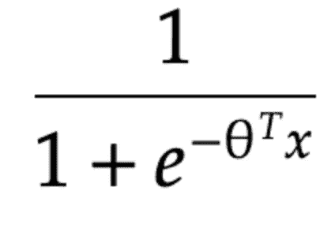

**Equation 3:** Logistic Function Used in Logistic Regression

当`y^(i) = 1`时，**等式 2** 的右边将等于零，留给我们:

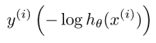

**Equation 4:** Cost When y=1

我们可以画出**等式 4** 的图表，以便更直观地了解它的行为方式:

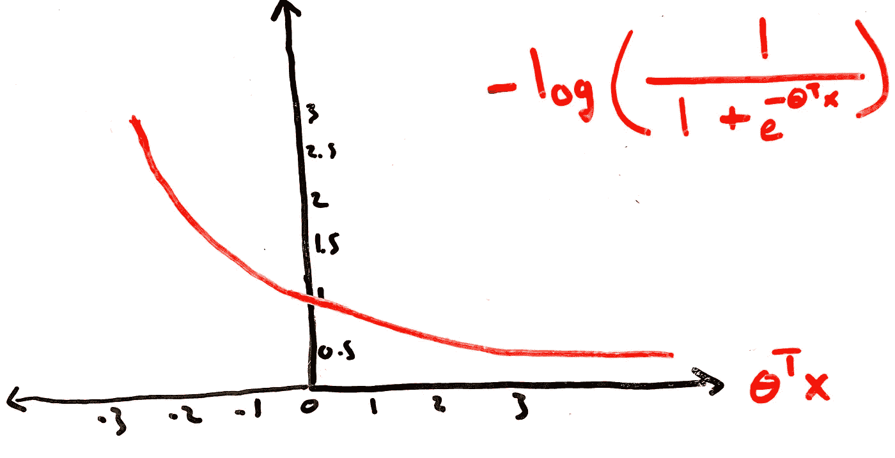

**Figure 5:** Graph of Logistic Regression Cost Function When y=1

我们看到`Theta^T * X`必须远大于零，我们的模型才能产生值 1。支持向量机的成本函数将以同样的方式运行。然而，SVM 将增加更硬的约束，要求`Theta^T * X`大于 1，而不是必须大于 0。这是大概的样子:

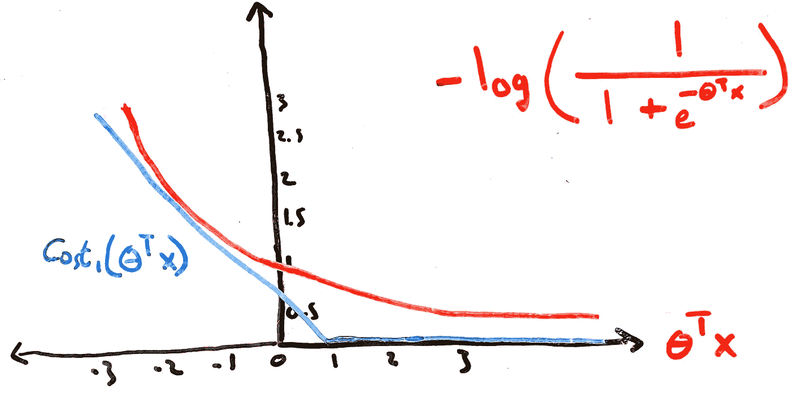

**Figure 6:** Graph of SVM Cost Function When y=1

我们称之为`Cost_1(Theta^T * X)`。我们可以对等式 2 中的`y=0`进行相同的精确分析:

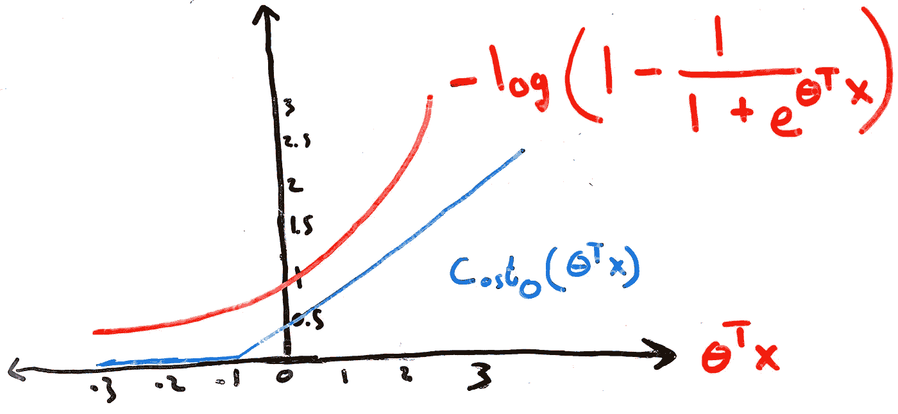

**Figure 7:** Graph of SVM Cost Function When y=0

我们将把这个案例称为`Cost_0(Theta^T * X)`。在我们把所有这些放在一起之前，我们需要做最后一个评论。

我们在研究神经网络时发现，可以在成本函数中添加一个正则化参数来防止过度拟合。事实是，这个正则化参数可以并且应该用于所有的成本函数。例如，下面的**等式 1** 添加了正则化参数:

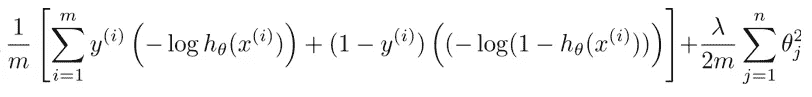

**Equation 4:** Logistic Regression Cost Function With Regularization Parameter

当使用支持向量机时，正则化的概念再次被使用，但是约定是使用稍微不同的符号。该模型旨在最小化以下功能:

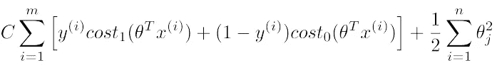

**Equation 5:** SVM Cost Function With Regularization Parameter

注意，我们仍然对`Theta`向量的平方求和，只是不再乘以`lambda/2m`。相反，我们乘以一个常数`C`。我们不会讨论我们为什么这样做，但请记住，这仍然是为了实现同样的事情。

在我们到目前为止看到的所有例子中，我们能够用一条简单的直线来划分不同的类。当然，情况不会总是这样。例如，考虑下面的分类问题:

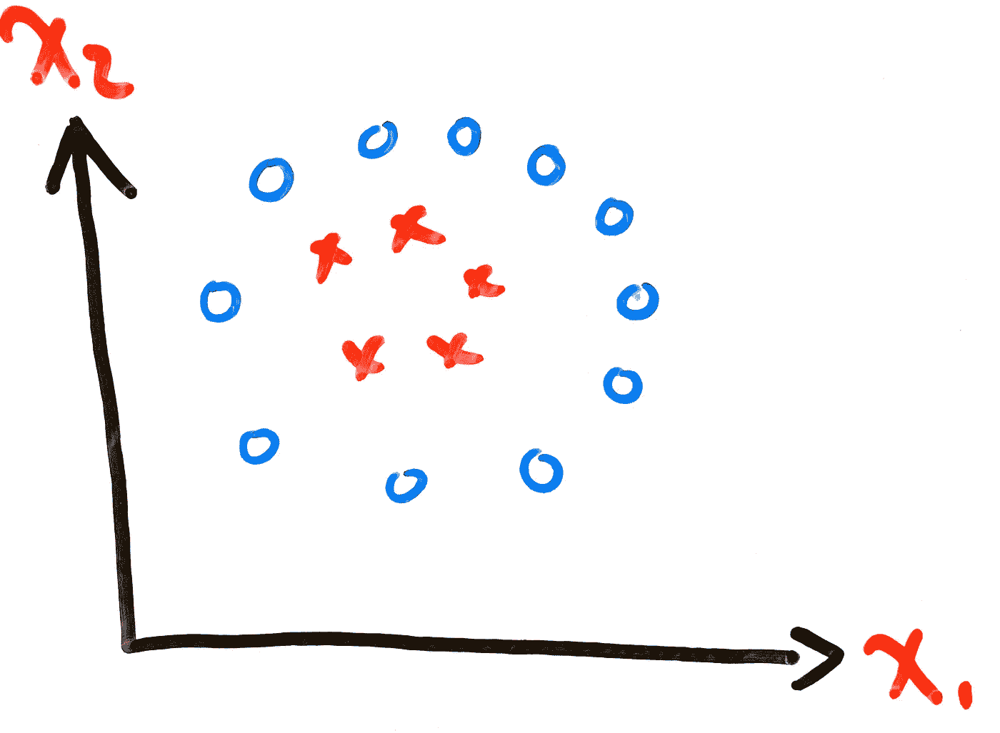

**Figure 8:** Complex Arrangement of Training Points

我们如何让我们的算法得出一个足够复杂的决策边界，能够将积极的类别与消极的类别分开，就像这样:

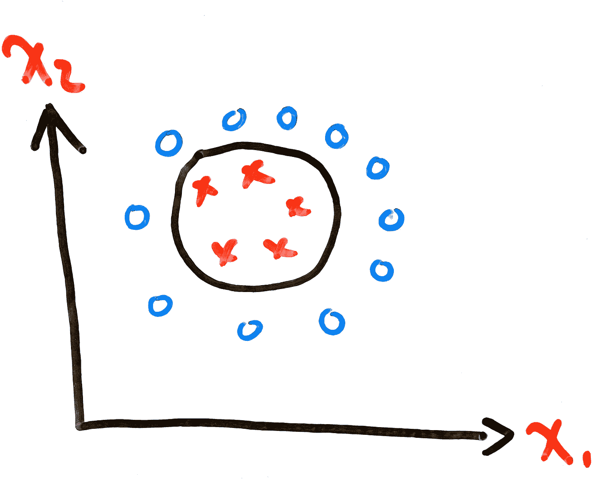

**Figure 8:** Decision Boundary

答案？**内核**。

# 核

当我们在本系列的第 4.1 部分研究神经网络时，我们已经研究过这个问题。当时，我们想要一个不涉及高度有序方程的解决方案。

SVM 以不同的方式处理复杂的决策界限。通常，我们模型中考虑的函数的形式是`Thetas`乘以`Xs`的任意阶。例如:

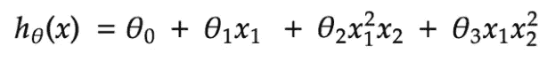

**Equation 5:** Arbitrary Example of A Function To Be Optimized

这一次，我们的`Xs`将以不同的方式计算。我们将有`f_1`、`f_2`、`f_3`等等，而不是`x_1`和`x_2`。这种符号上的变化用来演示我们函数的输入现在必须通过第二个函数。要理解这一点，请看下图:

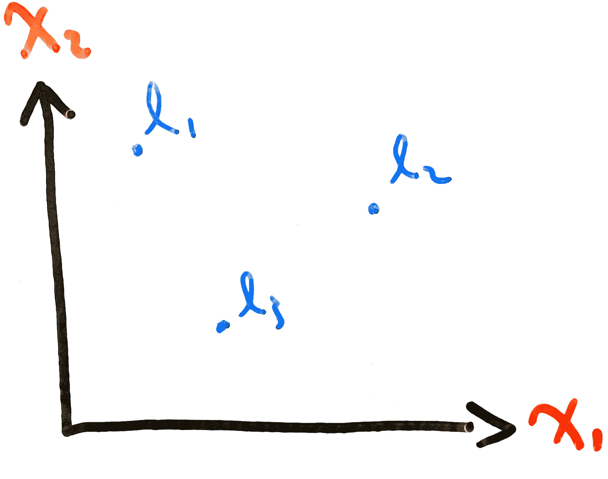

**Figure 9:** Landmarks

`l`这里被称为**地标**。这些地标充当“门槛”。每个标志和训练点之间的距离将使用我们选择的距离公式来计算。我们将这个距离方程称为**相似性函数**。相似性函数是计算任意两点之间的相似性(距离)的任何函数。我们也称之为**内核**。例如，我们可以使用**高斯核**来计算我们的训练点和我们在**图 9** 中突出显示的地标之间的相似性:

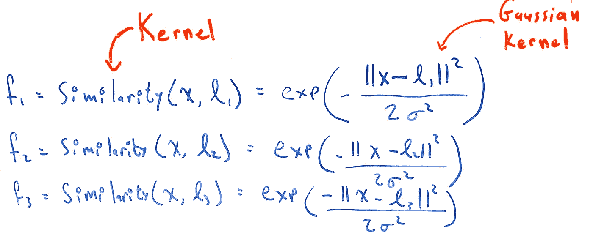

**Figure 10:** Example of Gaussian Kernel Used to Calculate Similarity

让我们通过一个例子来全面了解这一点。我们仍然在使用**图 9** 中的图表，但是让我们给它添加一些训练点:

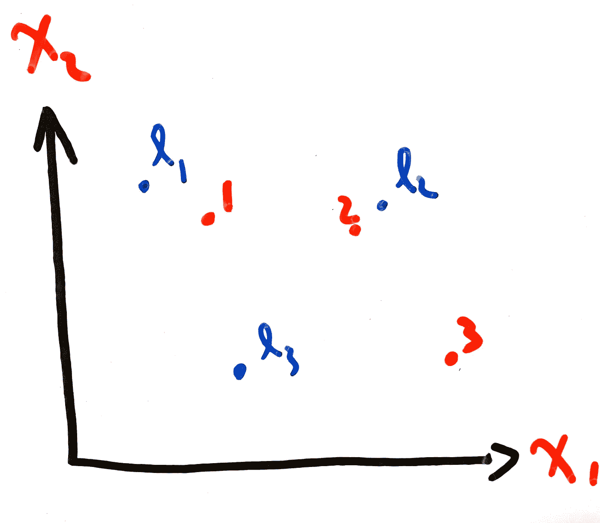

**Figure 10:** Landmarks and Training points

现在，假设我们想要使用以下等式来拟合此图:

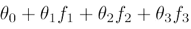

**Equation 6:** Equation We Use to Fit Our Training Data

在训练完这个模型后，我们得到了`Theta_0 = -0.5`、`Theta_1 = 1`、`Theta_2 = 1`和`Theta_3 = 0`。

训练点`1`靠近地标 1，所以`f_1`将近似等于 1(因为`e^0 = 1`并且我们在这里使用高斯核)。类似地，由于训练点`1`远离地标 2 和地标 3，`f_2`和`f_3`将近似等于零。因此，**等式 6** 将等于`-0.5 + 1 = 0.5 >= 0`，因此我们预测训练点 1 的`one`。如果对第二点和第三点进行相同的计算，您将得出结论，即所有靠近界标 1 和界标 2 的点将产生预测值 1，而所有靠近界标 3 的点将产生预测值 0。因此，我们可以近似以下决策边界:

**Figure 11:** Landmarks, Training points and Decision Boundary

# 结论

在本文中，我们介绍了支持向量机算法。在该算法中，目标是选择一个到训练点距离最大的决策边界。我们展示了当我们向我们的模型呈现新数据时，为什么需要大的距离来防止错误发生。

我们还探讨了核的概念，以及在我们的训练数据不可线性分离的情况下，如何使用核来提出更复杂的决策边界。

在下一篇文章中，我们开始讨论**无监督学习算法**。在此之前，我留给你以下几点思考:

*   我们看到了如何使用地标来提出更复杂的决策边界。我们如何选择地标的位置？这是一个很难自己想出来的概念，所以我建议你参考[吴恩达在这方面的经验](https://www.youtube.com/watch?v=XfyR_49hfi8)。
*   如果我们已经有了神经网络，为什么还需要支持向量机？
*   有几种不同的方法来理解支持向量机背后的直觉。在本文中，我们通过首先查看我们的逻辑回归实现，然后以一种可以与 SVM 一起使用的方式操作它，从而获得了一种理解。另一种方式是用向量操作来看它。这里有一个[的精彩演讲，从这个角度描述了支持向量机](https://www.youtube.com/watch?v=_PwhiWxHK8o&t=2592s&ab_channel=ArtificialIntelligence-AllinOneArtificialIntelligence-AllinOne)。

# 过去的文章

1.  **第一部分:** [数据预处理](https://ali-h-khanafer.medium.com/data-pre-processing-ee81bbe5cc77)
2.  **第二部分:** [使用梯度下降的线性回归:直觉和实现](https://ali-h-khanafer.medium.com/linear-regression-using-gradient-descent-intuition-and-implementation-522d43453fc3)
3.  **第三部分:** [梯度下降逻辑回归:直觉与实现](/geekculture/logistic-regression-using-gradient-descent-intuition-and-implementation-36a8498afdcb)
4.  **第四部分— 1:** [神经网络第一部分:术语、动机和直觉](/geekculture/neural-networks-part-1-terminology-motivation-and-intuition-73675fc43947)
5.  **第四部分— 2:** [神经网络第二部分:反向传播和梯度检测](/geekculture/neural-networks-part-2-backpropagation-and-gradient-checking-4f8d1350fb0b)
6.  **第六部分:** [评估你的假设，理解偏差与方差](/geekculture/evaluating-your-hypothesis-and-understanding-bias-vs-variance-86512cce4253)

# 无耻的插头

*   【twitter.com/ali_khanafer2】推特: [推特](https://twitter.com/ali_khanafer2)
*   **领英**:[linkedin.com/in/ali-khanafer-319382152/](https://www.linkedin.com/in/ali-khanafer-319382152/)

# 参考

1.  [吴恩达的机器学习 Coursera 课程](https://www.coursera.org/learn/machine-learning?page=1)
2.  [Rohith Gandhi 的支持向量机——机器学习算法介绍](https://towardsdatascience.com/support-vector-machine-introduction-to-machine-learning-algorithms-934a444fca47)
3.  [麻省理工学院开放课件的学习:支持向量机](https://www.youtube.com/watch?v=_PwhiWxHK8o&t=2592s&ab_channel=ArtificialIntelligence-AllinOneArtificialIntelligence-AllinOne)