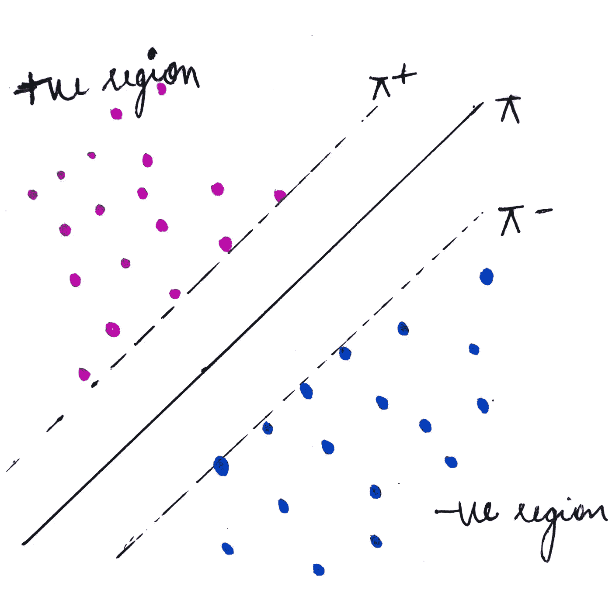
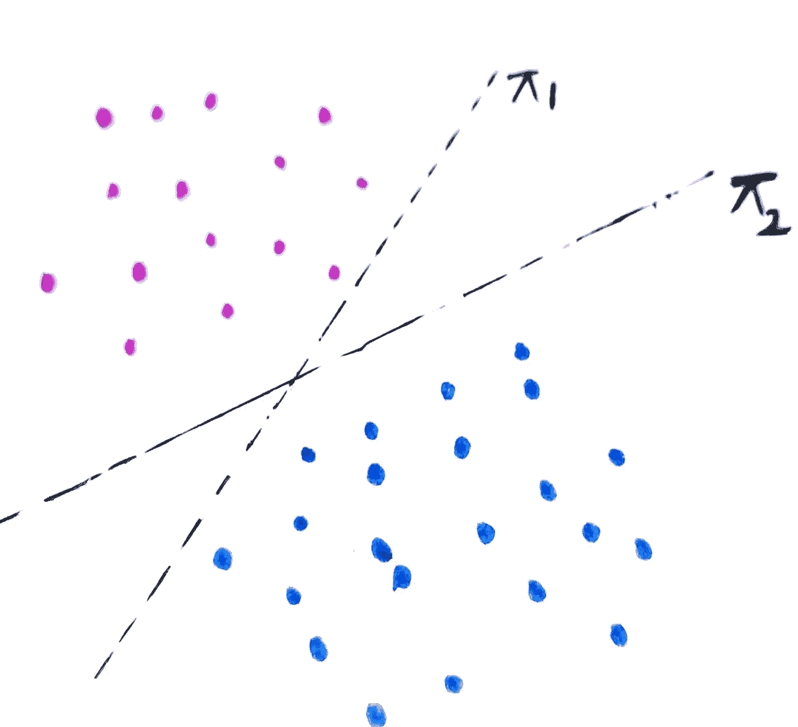
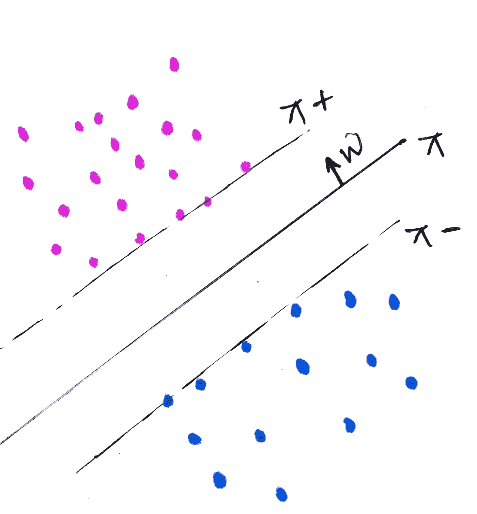
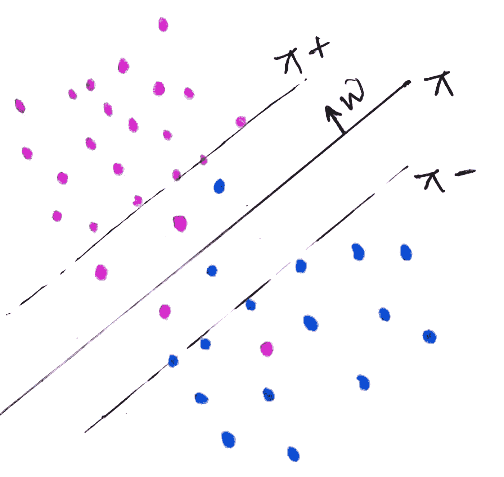
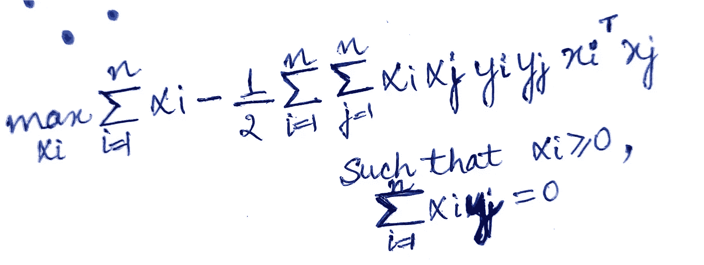
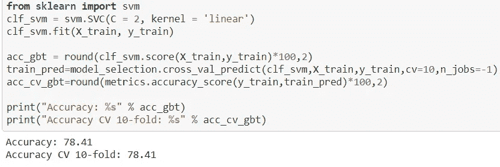

# 支持向量机

> 原文：<https://medium.com/geekculture/support-vector-machines-bc39b26816ea?source=collection_archive---------30----------------------->

Photo by [Pietro Jeng](https://unsplash.com/@pietrozj?utm_source=medium&utm_medium=referral) on [Unsplash](https://unsplash.com?utm_source=medium&utm_medium=referral)

SVM 是一种监督机器学习算法，可用于分类和回归问题。这种算法对线性和非线性可分离数据都能很好地工作，并且非常流行。在这篇博客中，我将集中讨论 SVM 的分类。

## SVM 的工作

***支持向量***
在继续工作之前，我们先来了解一下什么是支持向量。

在左侧，您可以看到由超平面π划分的两类点(粉色和蓝色或+ve 和-ve)。另外还有两个超平面π+和π-与π平行。
注意接触π+和π-的点。这些点称为支持向量。
同样，这些点是离我们的划分超平面π最近的点。

> *π+和π-经过的点，或者最接近π(划分超平面)的点称为支持向量。*

> **SVM 的意识形态。SVM 的核心思想是找到一个尽可能广泛地分开两个类的超平面。**

看下面的图片—

如果你被要求画一个超平面来划分这两类，你可以得到许多超平面。对吗？我们取两个这样的超平面π1 和π2。

在π1 中，我们可以看到它非常接近这两个类的点，而在π2 中，这两个类都在合理的距离内。

因此，SVM 试图找到这样的超平面，它最大化点之间的边缘距离，或者尽可能广泛地分隔类别。
*边际距离是π+和π-之间的距离。* 随着我们的边距增加，泛化精度增加。

## 逻辑回归和支持向量机

[逻辑回归](/geekculture/logistic-regression-2111fa695cdd)和 SVM 的基本区别在于，SVM 试图找到边际最大化超平面，而逻辑回归没有这样做。上图中，LR 也会给出π1 作为划分超平面。但是 SVM 给了我们最合适的超平面，那就是π2。

这就是为什么 SVM 不会受到异常值的影响，因为超平面的选择只取决于支持向量，不像逻辑回归。

# ***数学推导***

设
π:w ' x+b
π+:w ' x+b = 1
π-:wx+b =-1
w—垂直于所有超平面。

设 d =π+和π-之间的距离。
d = 2 / || w||，| | w | |**≦**1
我们的目标是最大化 d.
因此，
*(w*，b*) = argmax (2/||w||)*

但是，只有当我们的数据是线性可分的，即π-和π+之间没有数据点时，上述等式才有效。

因此上面的等式变成了，

> *(w*，b*) = argmax (2/||w||)，这样，yi(w'xi + b) ≥ 1 对于全 xi*

*对于支持向量，yi(w'xi +b) = 1*
上述条件又称为**硬裕度 SVM。**

***非线性可分数据情况下的 SVM***

考虑左边给出的数据点的分布类型，注意这里的错误分类点。
对于一个误分类点，设方程为:
yi(w'xi + b) = k
其中 k:该点到π的有符号距离。

让我们把方程重新写成
yi(w'xi + b) = 1-Z
这里，xi 到其正确超平面(π+或π-)的距离。

> 可以得出结论，
> 如果 Z = 0，yi(w'xi+b) ≥ 1，这意味着正确地分类了 wrt π+和π-。
> Z > 0，分类错误，等于错误方向上离正确超平面(π+和π-)的距离。

> 所以，最终方程为
> **(w*，b *)arg min(| | w | |/2)+c/nσZi，使得 yi(w'xi+b)≥ 1-Zi 且 Zi ≥0**

上述类型的 SVM 被称为**软边际 SVM。** 这个方程式也叫**SVM 的原始形式。**

## SVM 的双重形式

上面是被称为 SVM 对偶形式的方程式。

让我们来研究这个方程的细节

*   *αi > 0 为支持向量，αi = 0 为非支持向量。*
*   在上面的等式中，xi 的 xj 可以用相似性矩阵(xi，xj)代替，该矩阵最终将被 K(xi，xj)代替，K 代表“核心技巧”。

## 内核技巧

核技巧基本上是一种通过将数据点转换到不同的空间来计算它们之间的相似性的方法。内核技巧避免了将数据点显式转换到更高维度的需要。
这是一个内核技巧，因为它支持向量机能够通过使用正确的内核来处理非线性数据。这种类型支持向量机也称为核支持向量机。让我们看看两个这样的内核:-

1.  **多项式核**
    给定两个数据点 x1 和 x2，一个多项式核可以写成:-
    ***K(x1，x2)=(x1’x2+c)^d*** *这里 d 一般是数据点将进行内部变换的维数。例如，如果 d = 2，则称为二次核，依此类推。*
2.  ***RBF 核**
    给定两个数据点 x1 和 x2，一个 RBF 核可以写成:-
    ***K(x1，x2)= exp(-||x1-x2||/2σ)***
    上式中，| | x1-x2 | |实际上是两点之间的距离。
    随着||x1-x2||的增加，即两个数据点之间的距离增加，相似性降低，因此 K(x1，x2)呈指数下降。*

## *训练和运行时间复杂性*

***训练时间** :-
O(n)为内核 SVM
O(nd)，if d < n(更优化)
d =维数，n=数据点数。*

*这就是当 n 较大时，避免使用支持向量机的原因。*

***运行时间:-**
O(kd)，其中 k =支持向量个数，d =维数。
k 的取值范围为 1≤k≤n。*

## *SVM 的实施*

*我将再次使用来自 Kaggle 的泰坦尼克号数据集，任务是创建一个模型来预测哪些乘客在泰坦尼克号沉船中幸存。数据集可以从[这里](https://www.kaggle.com/c/titanic/overview)下载。 *这也是一个二进制分类问题，其中目标“幸存”对于没有在灾难中幸存的人是 0，对于幸存的人是 1。**

*我们已经将数据预处理成 x_train 和 y_train，并从 sklearn 导入 SVM。*

**

*   *这里的 C 参数等于 2。这是 SVM 原始形式的 C。如果 C 增加，出错的可能性降低，从而导致过度拟合。
    如果 C 减少，会导致欠拟合。
    人们可以通过使用超参数调谐技术找到最佳 C。*
*   *这里使用的内核是线性的*

*有关数据的详细实现和理解，请参考此处的。*

*编码快乐！:)*