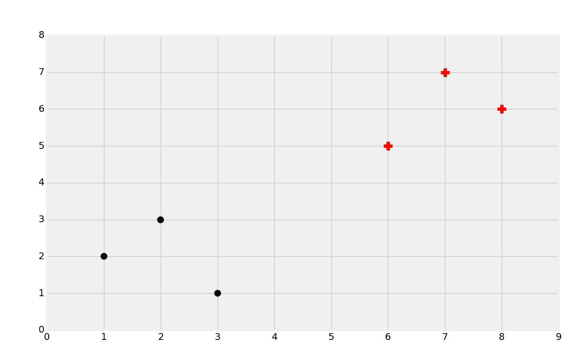
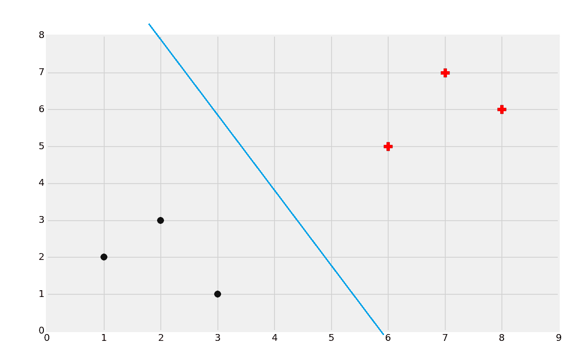
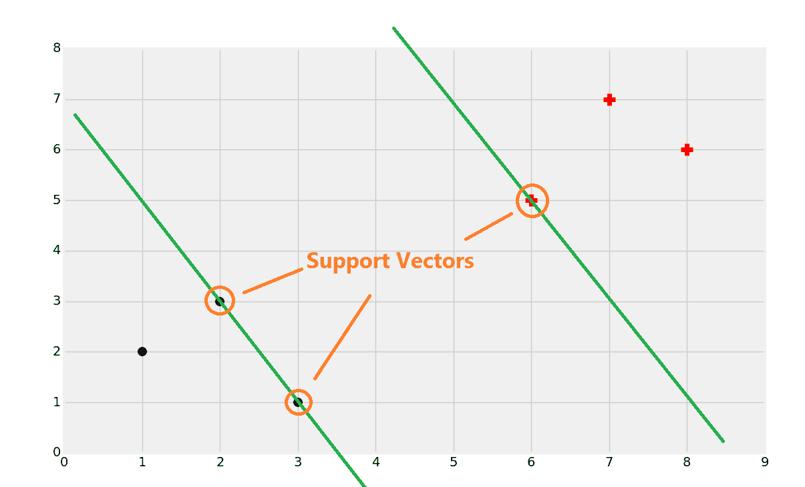
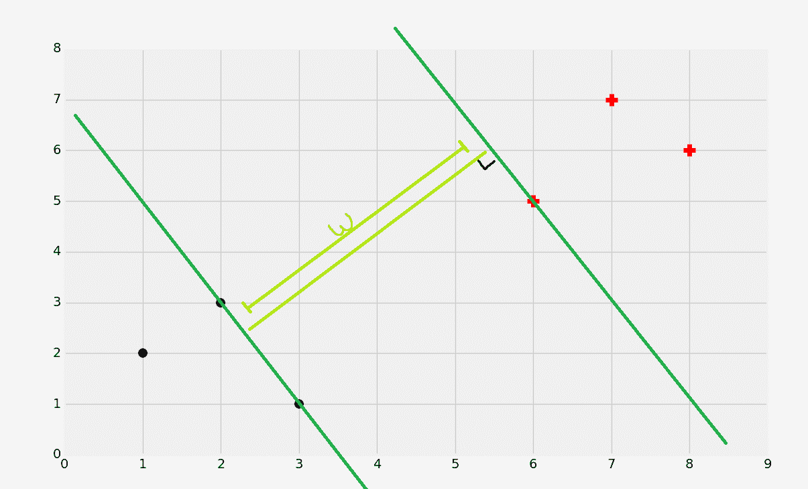
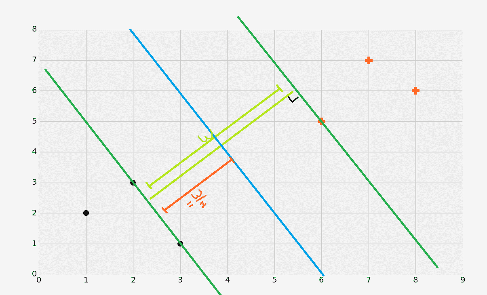
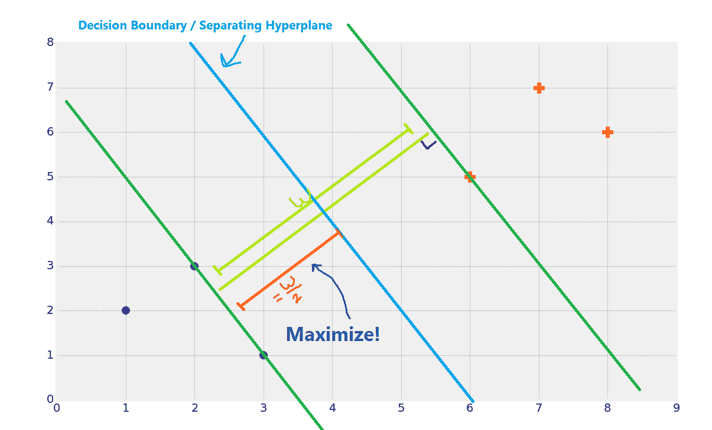
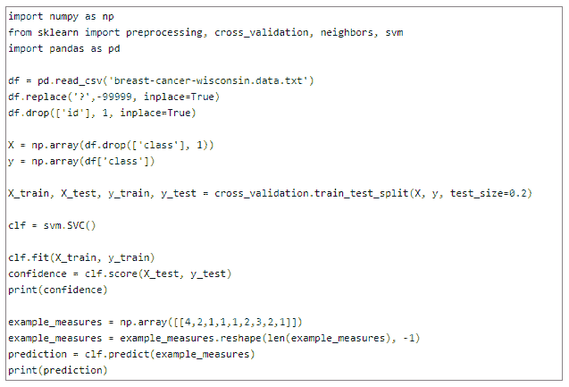
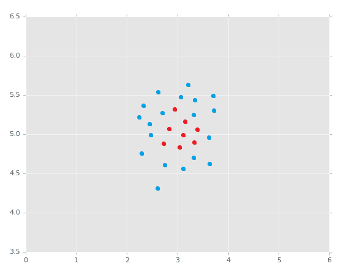

# 支持向量机

> 原文：<https://medium.com/geekculture/support-vector-machines-f59d3689088d?source=collection_archive---------39----------------------->

深入研究技术，它将塑造我们的未来。现在计算机能看、听和学习。同意吗？不管观点如何，欢迎来到未来。机器学习是计算机从行为或经验中学习的科学或方法，而不是为它编写的程序。系统可以响应并从经验中学习，这被称为系统的自动化。机器学习是人工智能的一个子集，它涉及某些算法来实现其结果。我们很容易通过提供的机器学习模型执行大量操作，我们拥有正确的数据集和可靠有效的算法。这种算法的一个类别是支持向量机。在这篇文章中，我们将走过 SVM 算法的各个方面，以及支持向量算法背后的数学。

这篇文章的流程如下:

*   机器学习概述。
*   探索支持向量机
*   SVM 工作:SVM 分类器的提出和实现
*   SVM 的实际应用。

**机器学习概述**

机器学习是一种方法，其中来自数据集的数据被馈送到模型或机器，以便特定模型现在能够预测可能性。机器学习会考虑不同的算法并预测结果。据观察，为了使模型更有效，必须大量采用数据大小。此外，为了使模型预测更精确，必须向机器学习模型提供相关和正确的算法。

让我们通过一些实例来证明，使用的数据越多，模型就越好，并且使用正确的算法也可以提高模型预测率。很明显，每个人都可能意识到 android 应用软件中存在的恶意软件会导致有害的后果。为了消除这种 Android 恶意软件，需要向机器提供大量数据的地方会实施机器学习模型。可用数据的大样本被馈送到具有所有不同类型的恶意软件的机器学习模型，以便该模型在数据训练期间清楚地从中学习，然后基于训练相应地将测试数据或应用程序分类为好软件或恶意软件。此外，当该模型使用支持向量机算法时，与其他算法(如随机森林、决策树和 K-最近邻算法)相比，预测率得到提高，其中 K-最近邻算法的恶意软件检测率低于支持向量机算法。

**机器学习的类型**

机器学习主要分为三种类型。它们是:

**监督学习:**监督学习也被定义为任务驱动型的机器学习类别，因为它通过从许多样本和示例中获得训练，高度专注于并致力于完成某项任务。

在这种监督学习中，数据的各种属性的标签被提供给机器学习模型，该模型识别标签，然后相应地分类和预测新数据。当多次使用并充分训练时，该模型开始识别标签，并以良好的检测或预测率成功地对标签进行分类和检测。这种监督学习的一些广泛使用的应用是人脸识别、电子邮件过滤器分类等。

**无监督学习:**这类机器学习不涉及数据属性的标注。大量的数据被输入到模型中，模型通过理解数据的属性对数据进行聚类或分组。由于这种类型的机器学习涉及数据，并且对数据的属性进行预测，因此无监督学习是数据驱动的。它在根据人们的购买习惯、客户细分等对人们进行分组方面有其应用。

**强化学习:**这种机器学习处理从过去的错误中学习，然后建立经验来完成特定的任务。模型犯的错误越多，它学到的就越多，越不会继续犯同样的错误。强化学习是行为驱动的，它观察行为和环境，并试图避免以前犯过的错误。最好的例子是被送到沼泽地或未开发地区的机器人。在那里，机器人首先学会相应地在表面上行走，然后在犯了几次错误后，它学会平衡自己并在周围环境中行走。

不仅仅是算法和数据集，模型的预测和明智实施还依赖于其他几个因素，如数据预处理、异常值检测、交叉验证等技术。在本文中，我们将探索支持向量机算法，它们的实际实现，并看到它们在 python 语言中的工作

**探索支持向量机**

支持向量机是一种监督分类机器学习算法，用于成功分离标签已知的两种不同数据。在支持向量机的帮助下，我们可以执行回归以及分类操作，包括离群点检测。支持向量机(SVM)是一种高效的机器学习模型，可以执行回归、线性分类或非线性分类。它不限于一个或两个维度。但是，使用 SVM 算法的模型通常用于小型或中型数据集的复杂分类。它遵循一个基本思想，根据该思想生成一个超平面，该超平面将数据分成两组。

**SVM 的特权:**

*   与其他算法相比，支持向量机最适合文本分类。
*   支持向量机将数据集分类以获得最大边缘超平面。
*   在 n 维空间是有效的。
*   支持向量机是一种通用的机器学习算法，其中为决策函数指定了不同的核函数。

**SVM 工作:SVM 分类器启动实施**

**线性可分数据中的 SVM**

使用支持向量机，可以生成数据之间的界线或明显的边界。当我们处理二维数据时，它相当于能够划分数据集的最佳拟合线。支持向量机辅助处理向量空间。因此，分割线是一个分离超平面。

**超平面:**超平面被定义为包含支持向量之间最宽距离余量的数据之间的最佳分隔线。超平面也可以被认为是一个决策边界。

让我们来看一个图像，其中有两个不同的类，分别是黑点和红点。

在支持向量机的上下文中，它的主要目的在于生成“最佳拟合”线，也称为平面，更准确地说是超平面，它在数据之间创建了精细的分隔线。当我们得到超平面的时候，我们认为它是一个决策边界。这被认为是因为它是两个不同阶层之间的分界线。我们不会在计算后重新计算决策边界，以免重新训练数据集。因此，我们的下一步将在于生成我们可以可视化的超平面。

是的，这是正确的。超平面是这里最好的分割平面，但是我们如何到达它呢？为此，首先我们必须专注于寻找支持向量。

现在我们完成了支持向量，我们需要画出最大限度分开的线。此后，考虑到总宽度，很容易生成决策边界:

除以 2，我们得到:

我们的最终决策界限:

因此，如果一个点位于决策边界的左侧，我们可以清楚地说它是一个黑点类。此外，如果一个点位于决策边界的右侧，我们可以说它属于红色加类。

**代码:**

为了描绘数据，我们将采用**乳腺癌数据集**。该数据集由威斯康辛大学麦迪逊分校作为捐赠提供给加州大学欧文分校(UCI)。数据集已经被结构化和组织化。在 Scikit Learn 之后，我们导入预处理来预处理数据或删除任何空块或 NaN 值。导入熊猫，交叉验证，支持向量机。

我们将进一步读取 CSV 文件，并将其转换为导入熊猫的数据框。之后，我们删除离群值或空值，并用一个大数字 as -99999 来代替它。我们将从数据集中删除某些与我们无关或最不重要的列。

**输出:**

0.978571428571

[2]

**说明**:根据样本不同，预测率为 97.8%，do 属于 2 类。在这个数据集上实现 SVM 的好处是，虽然其他算法可以实现相同的预测率，但 SVM 可以用非常低的执行时间更快地预测它，因此支持向量机适用于复杂数据。

**线性不可分数据和非线性平面中的 SVM**

需要强调的一点是，前面的线性可分方法只适用于线性可分数据。

.

**解决线性不可分数据和非线性平面问题:**

**SVM 内核**

对于线性不可分数据，我们无法生成决策边界(超平面)，因此必须使用不同的方法。支持向量机利用核技巧，从而将低维空间转换到高维空间。

处理非线性数据集的一种方法是添加额外的特征，如多项式，这在某些情况下会产生线性可分的数据集。

在图 1 中:给定了一个具有一个特征 x1 的数据集，该数据集也不是线性可分的。但是当添加一个额外的特征 x2 =(x1)2 时，2D 数据集现在是线性可分的。

**代码**:在 moons 数据集上的 Scikit Learn 中完成。

**从 sklearn.datasets 导入** make_moons

**从 sklearn.pipeline 导入**管道

**从 sklearn .预处理导入**多项式特性

多项式 _svm_clf =管道((

(“poly_features”，多项式 Features(degree=3))，(“scaler”，StandardScaler())，

(“svm_clf”，LinearSVC(C=10，loss="hinge "))

))

多项式 _svm_clf.fit(X，y)

*图 2:* 使用多项式特征的线性 SVM 分类器

**多项式内核**

多项式核是线性核的优化形式，能够区分弯曲空间和非线性输入空间。

**在 moons 数据集上测试代码:**

**从 sklearn.svm 导入**SVC poly _ kernel _ SVM _ clf = Pipeline((

(“scaler”，StandardScaler())，

(“svm_clf”，SVC(kernel="poly "，degree=3，coef0=1，C=5))

))

poly_kernel_svm_clf.fit(X，y)

**高斯 RBF 核**

就像多项式特征一样，相似性特征方法对于机器学习算法是有益的，但是当在大的训练集上实施时是昂贵的。但是由于核技巧，通过大量添加相似性特征来获得相似的结果。

**代码:**

RBF _ kernel _ SVM _ clf = Pipeline(((" scaler "，StandardScaler())，

(“svm_clf”，SVC(kernel="rbf "，gamma=5，C=0.001))

))

rbf_kernel_svm_clf.fit(X，y)

*图 5:使用 RBF 核的 SVM 分类器*

**支持向量机的实际应用**

支持向量机主要用于对未知数据的分类。因此，它非常重要，并嵌入到许多实际应用中，例如:

*   **人脸检测:** SVM 首先对人脸图像和非人脸图像进行分类识别。包含 n×n 个像素的训练数据被馈送到包括两类人脸(+1)和非人脸图像(-1)的 SVM 模型。在此基础上，它从每个像素中提取属性，无论是人脸还是非人脸像素，最后根据人脸周围像素的亮度建立边界，从而以相同的方式对每幅图像进行分类。
*   **图像分类:** SVM 是一种非常强大的算法，用于根据给定数据集标签的训练数据对图像进行分类。由于已经用一定量的数据训练了 SVM 分类器，它可以对新的未知测试数据进行分类。它还包括数据混排和交叉验证。
*   **识别手写:** SVM 可用于识别和审查手写文档的有效性或真实性。数据输入过程中使用的手写字符、个人签名、文件等。被 SVM 反复检查。

**结论**

作为整篇文章的结论，我们讨论了机器学习概念，这是我们未来的努力方向。此外，机器学习采用 SVM 算法，从预测到分类和回归，为我们提供多方面的好处。因此，我们推断，与其他算法相比，SVM 算法更可靠，预测精度更高，我们还学习了 SVM 算法背后的数学原理