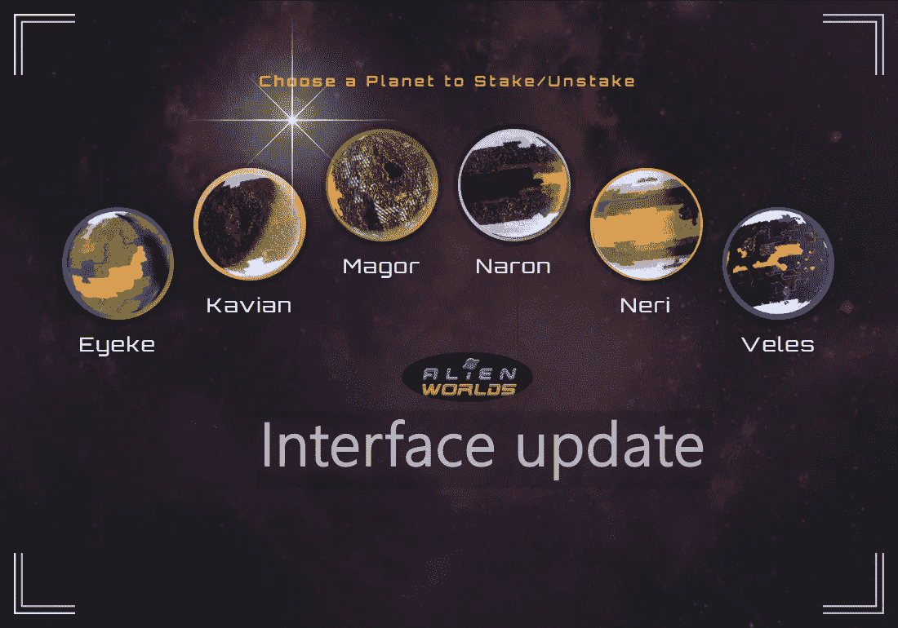
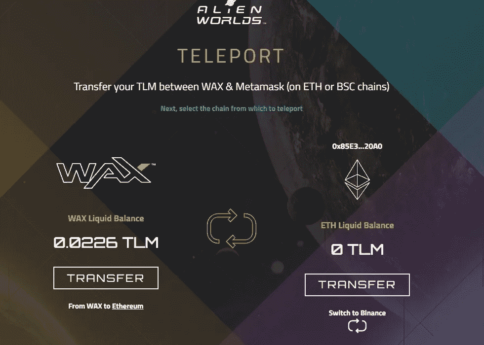

# 令人惊讶的新的和改进的界面在外星世界

> 原文：<https://medium.com/geekculture/surprisingly-new-improved-interface-in-alien-worlds-4357e15e030a?source=collection_archive---------19----------------------->

## 手机友好的小故障终于解决了！

Image is taken from the official website and edited by the author

自从你读到这封信，你可能至少玩过一次《T2》外星世界。如果你还没有尝试过，并且你喜欢太空主题的游戏，我推荐这个区块链游戏。我也玩了一段时间，但我停止了，因为有一个恼人的错误，阻止了我反复挖掘。

我决定回到游戏来检查错误是否已经解决，我惊讶地看到游戏界面的彻底改造。结果一点也不差，但我还在想，那个因为没有足够的系统资源而没有让我开矿的小故障是不是还在，还是已经修复了。

# 假的，没有资源错误

为了更详细地解释这一点，在 WAX 网络上分配系统资源的方式上似乎有一个小故障:CPU、RAM 和 NET。我收到了一个提醒，告诉我要投入更多的 [WAXP](https://coinmarketcap.com/ro/currencies/wax/) 来获得更多的系统资源。最初，我认为这是一个真正的错误，但似乎即使在我为增加可用的计算机资源而提交了必要的 WAXP 之后，这个问题还是发生了。

没有足够的系统能量，我无法采矿。我不是唯一一个经历这种事情的人。根据我在网上看到的评论，我很快意识到这个问题很普遍。

重点是，现在一切都更清楚了:你在右下角有一个通知，提醒你在 10 次游戏后，你需要再次下注 WAXP 才能开采更多。这些剧过一段时间会补充，大概是第二天，从我看过的来看。

# 改进后的界面更加友好

当你进入游戏的主页时，你肯定会对移动的背景感到惊讶，这些背景有时会改变，现在看起来更专业:行星、卫星、星际基地等。该界面已被重新安排到左侧的主菜单中，该菜单是隐藏的，只有当您单击菜单图标时才会显示。

背包不见了，但是你可以在物品页上看到你所有的物品。你可以很容易地找到行星，并在每个行星上选择你想要采矿的地方。在一个页面上，你可以看到你有多少外星世界 Trilium，一个星球上有多少，采矿按钮和计时器，你的 NFT 和许多有用的信息。你可以看到 NFT 的特点，只要悬停在他们的卡上。

Image captured by the author from the Alien Worlds website

游戏界面中还有一个新的部分，允许你连接你的蜡云钱包，但也可以选择链接到你的 MetaMask 钱包，并从蜡网络向币安网络或以太坊网络传输外星世界 Trilium。

这一更新使得外星世界也为移动优化。界面可以根据屏幕大小进行调整，它很清晰，包含了很多透明度。我一直在等这个！

总的来说，我喜欢新的界面，但未来还有进一步改进的空间。一切都被更好地组织起来，以便你一登录就能获得更好的视角。你不需要浏览所有那些你在更新前必须浏览的页面。我很高兴看到进一步的改进，如增加任务和奴才。