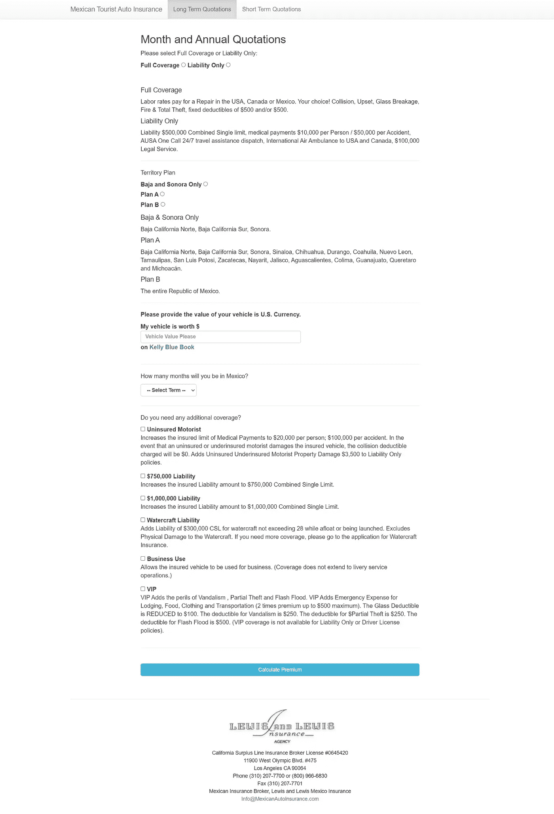
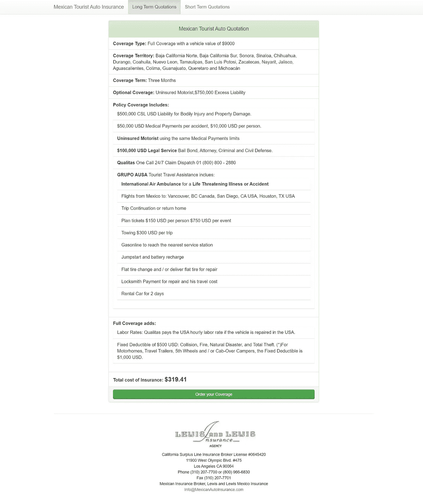

# 在陈旧的工作场所被纸张包围！没有自动化。学习编码…现在。

> 原文：<https://medium.com/geekculture/surrounded-by-paper-in-an-archaic-workplace-no-automation-learn-to-code-now-a8a14e7acce5?source=collection_archive---------58----------------------->

嘿，你好！欢迎来到我的博客，我在这里发布了我作为一名自学成才的开发人员的历程。点击 [***这里***](https://github.com/Jclewis1989) *可以找到我的 GitHub。*

你曾经在基于纸张的办公室工作过吗？我说的是没有自动化，没有便利贴，没有打印每一份文件，把它们放进马尼拉文件夹，没有电子秩序感。在这个地方，没有 Dropbox，没有 CRM，甚至支付网关(Stripe、Authorize.net、Braintree)在 2015 年之前都不存在。

Photo taken by Author — James Lewis

我很难找到关于 pexels.com 的相关照片，哈！所以我拍了一张我现在工作的文件柜室的照片。《老友记》是 20 世纪 70 年代的，2021 年还在上映。我并不是说这是一件好事，恰恰相反。如果没有额外的努力和每月的消耗，保持良好的评论和满足客户是非常耗时和困难的。

> 你可能会想，“为什么是后詹姆斯时代？”

Photo taken from [Amazon](https://www.amazon.com/Web-Design-HTML-JavaScript-jQuery/dp/1118907442/ref=sr_1_4?dchild=1&gclid=Cj0KCQjw2NyFBhDoARIsAMtHtZ5Tax4-Jzv7d7K6OOFp9bTIjKvd_4ejHZzF18uKHmmEALXS_lx53U0aAk_FEALw_wcB&hvadid=325037856712&hvdev=c&hvlocphy=9030983&hvnetw=g&hvqmt=b&hvrand=6947075353272700108&hvtargid=kwd-365909490363&hydadcr=9545_11009276&keywords=jon+duckett+php&qid=1622668699&sr=8-4)

2015 年 11 月 15 日，我收到了我在亚马逊上订购的一本书。这是约翰·达克特的 HTML & CSS。当时我并不知道，但这本书是我完全沉浸在 Web 开发中的关键，也是我、我的同事和我的雇主摆脱一堆文件的方法。

在不详细介绍我们过去和现在的工作流程的情况下，我将解释一下作为一名保险行业的开发人员，我亲身体验到的一些主要好处，以及我如何使用两个特定的应用程序来自动化一些日常办公任务

# 保险费报价工具:

你可以在 GitHub [这里](https://github.com/Jclewis1989/Insurance-Quoting-Tool)查看报价工具的代码。

**什么问题？**

当时，我们的 web 应用程序没有为客户定制保险单报价的选项！没有选择增加任何额外的覆盖面，或增加限额的通用报价是唯一可用的东西。

我们的客户需要打电话或发电子邮件给我们，以获得定制报价。虽然该应用程序无法解决客户大量来电的问题，但它确实让我们加快了报价流程，节省了大约 30 分钟时间——每个代理每天 1 小时。

当我们一年服务 15，000-20，000 个活跃客户，只有 3 个代理在打电话时，你可以想象事情变得有点忙。

**我是如何解决这个问题的？**

我决定看看我们当前的代码库，所以我联系了我们当时的首席开发人员，并能够获得我们的代码库减去数据库的 zip 文件。从那里我可以了解到他是如何设计保险费率的，他是如何使用特定的等式和计算乘数，比较不同地区的费率等等。

我在自己创建的浏览器应用中加入了自己的风格，调整了一些过时的包，并在 JS 中使用了我已经习惯的新语法。

值得我浪费时间吗？

绝对的！我花了几周时间构建了浏览器报价工具，我和我的同事每天都在使用它，过去几年也是如此。

**胜负已定！**

每个代理每周节省几个小时，这为我的雇主每周节省了几个小时，我们的客户得到了更专业、准确、高效和快捷的报价！

下面的屏幕截图。

Screen shot from Author — James Lewis

好的，我们在上面输入了以下字段。下面，你会看到一个正常的主动客户的报价。

1.  保险范围(全险或仅责任险)
2.  区域(仅下索诺拉、A 计划或 B 计划)
3.  车辆价值(美元)
4.  您可能希望为客户端包含的任何选项。(附加保险)

点击“计算保费”，然后我们得到以下！

Screen shot from Author — James Lewis

这是我可以截图并以 PDF 格式通过电子邮件发送的东西。我还不知道服务器端语言或实现 PDF 生成的方法。

# Web Scraper /表单机器人:

**出了什么问题？**

当我们收到业主报价请求时，这个过程非常耗时。

我们的 web 应用程序收到报价请求，然后我们需要将其打印出来，在公司网站的每个字段中键入以生成保险费，然后我们键入每个保险及其各自的保险成本。

基本上，它会变得非常混乱，而且会花费很多时间。

**我是如何解决这个问题的？**

我决定做一个网络刮刀来代替打印报价。这个网页抓取器会将抓取的数据加载到一个预先构建的 html 表单中。

从该表单中，我可以手动编辑某些我无法通过编程验证的字段。例如有效的邮政编码。

然后，我创造了一个形态机器人。该机器人将获取表单中的所有字段，并将它们上传到公司网站上的表单中。因此，我在 python 中处理某些工具，这些工具允许我验证我的工作登录、公司登录，并上传我需要的所有信息，以便为客户生成准确的溢价！

值得我花时间吗？

很容易值得我花时间。100%值得我花时间。房主热线是我的雇主负责的。我们一天收到大约 3 个主页报价请求。每个报价需要 25 分钟。

**胜负！**

这个工具将每次报价的时间缩短到了 2-3 分钟。他很激动。我也是。

下面是抓取/形成机器人过程的视频。(我没有上传抓取视频，涉及太多客户端具体细节。但是机器人在下面。享受吧。

YouTube Video taken from Author — James Lewis

虽然我还没有为我的雇主完成完整的网络应用程序改造，这将在未来几个月内部署。与此同时，报价工具和 web scraper / form bot 等小工具绝对可以节省时间！

我们可以更专注于销售，而不是准备工作！

我希望这能激励一些人！永远不要停止学习，编码是一个非常强大的工具。我很享受这个过程，5 年前，我从来没有想过我能在 GitHub 上建立起自己的东西。

编码快乐！