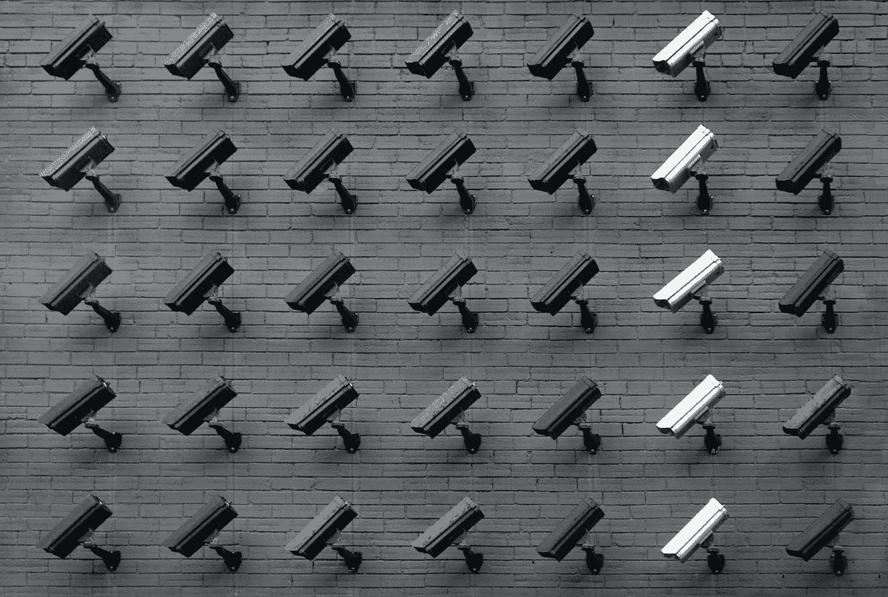

# 监控技术 101

> 原文：<https://medium.com/geekculture/surveillance-tech-101-15fcae65b46c?source=collection_archive---------25----------------------->

## 为什么我们都应该关心隐私(在为时已晚之前)

Photo by [Lianhao Qu](https://unsplash.com/@lianhao?utm_source=unsplash&utm_medium=referral&utm_content=creditCopyText) on [Unsplash](https://unsplash.com/s/photos/surveillance?utm_source=unsplash&utm_medium=referral&utm_content=creditCopyText)

当技术、数据和隐私在与朋友和家人的交谈中出现时，我经常惊讶于很少有人知道和关心它们。在广告技术领域的一段时间里，我震惊地发现了组织在收集和出售个人数据上花费的时间、金钱和精力的真实程度…