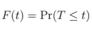
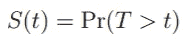
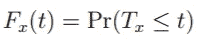
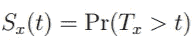
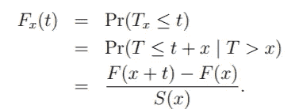
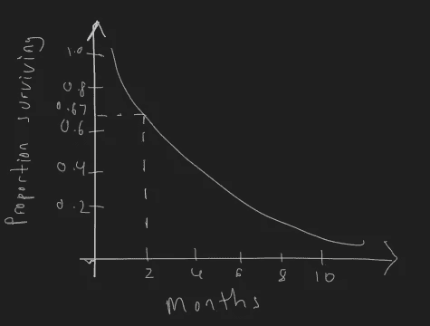

# 生存分析:简介

> 原文：<https://medium.com/geekculture/survival-analysis-a-brief-introduction-e814f88a7a42?source=collection_archive---------64----------------------->

尽管在存活分析中使用了术语“存活”,但它不仅用于存活数据的分析，还可用于广泛的应用领域。阅读了解更多信息！

Photo by [Andreas Wagner](https://unsplash.com/@waguluz_?utm_source=medium&utm_medium=referral) on [Unsplash](https://unsplash.com?utm_source=medium&utm_medium=referral)

# **什么是生存分析？**

生存分析是统计学的一个分支，用于分析感兴趣的事件发生之前的预期时间。该反应通常被称为事件时间或存活时间。它用于了解一个事件(例如死亡)发生前的时间。然而，生存分析不仅仅限于分析生存时间，还可以用于回答各种问题，如“机器故障前的时间是多少？”或者甚至是诸如“客户订阅企业提供的服务的预期持续时间是多长？。

# **符号和基本公式**

假设，给定一台机器发生故障的时间记为 *T，T* 连续分布在区间[0， *w* 内，其中 *w* 为极限，0 < w < ∞。

分布函数表示为:

生存函数表示为:

存活函数可解释为截至时间 *t 时感兴趣的事件(在我们的示例中，机器故障)未发生的概率。分布函数和存活函数可关联如下:*

*S(t)* = 1 — *F(t)*

假设，在时间 *x，*我们研究中的一台机器没有发生故障。然后，我们将时间 *x.* 之后直到机器发生故障的时间记为 *T* ₓ

然后，ₓ的分布函数表示为:

于是，ₓ的生存函数表示为:

*F* ₓ *(t)* 与 *F(t)* 的关系如下:

# 我们如何解释一个生存函数？

在我们的例子中，我们将使用指数生存函数。让我们看看我们的例子，看看我们如何解释一个生存函数。

Exponential survival function(Example). Image by author.

观察上面的生存函数，我们可以说一台机器在 2 个月后仍然工作良好的概率是 0.67。我们还可以从生存函数中做出各种推论，比如，前四个月坏掉的机器比例在 55%左右。

# **审查**

删截是生存分析中数据的一个关键特征。删失在本质上可以被描述为生存分析中的缺失数据，并且对估计过程有巨大的影响。

我们将讨论以下各种形式的审查:

1.  左侧审查
2.  右审查
3.  区间删失

**左删截**发生在感兴趣的事件在被记录之前已经发生，并且我们不知道进入感兴趣状态的时间。

例:假设你在研究的第 100 天对一群人进行调查。你发现他们中的一些人生病了。然而，你不知道他们是什么时候生病的。这是左审查的一个例子。

**右删截**发生在感兴趣的事件发生之前，观察被中断。

**举例:**假设我们正在进行一项研究，测试某种疫苗的有效性。我们的研究持续了 5 年。不可避免的是，我们的一些或大多数受试者可能会活得更长，或者一些受试者可能会因为搬迁或各种原因而停止参与研究。这是一个右删截的例子，我们只能说受试者的寿命超过了删截时间。

**间隔审查**发生在感兴趣的事件在某个时间间隔**内发生时。**

**例子**:假设我们在观察时间，直到一台机器发生故障，但我们只从早上 9 点到下午 5 点工作。所以，在第一天下午 5 点，机器 A 还没有坏。然而，第二天早上，当你到达工作地点时，你发现机器 A 已经坏了。你知道机器在第一天下午 5 点到第二天上午 9 点之间发生了故障，但不知道它发生故障的确切时间。这是区间删失的一个例子。

# **生存分析中常用的方法/模型**

在这篇文章接近尾声的时候，我们简单的说一下生存分析中常用的一些模型。

**幸存者函数的卡普兰-迈耶估计**

卡普兰-迈耶方法是一种估计和绘制作为时间函数的生存函数的方法。它有很少的假设，并且对数据的分布不做任何假设。这是一个简单的方法，并且经常是你在生存分析中的第一张图表。

**Cox 回归模型**

Cox 回归模型是统计学中一个非常革命性的模型，并且是半参数的。这是一个常用的模型来回答关于生存函数的协变量的影响的问题。

**参数模型**

参数方法是一种要求您为数据选择合适的生存分布的方法。我们通常使用最大似然估计来拟合分布的参数。常用的生存分布包括指数分布和威布尔分布。

# **结论**

我认为生存分析是统计学的一个分支，应该更多地被利用和讨论，因为它可以应用于各个领域，并为企业提供有价值的见解。

接下来会有更多关于 r 中生存模型实现的文章，敬请关注！

参考资料:

1.  柯里，我和麦克唐纳，2020 年。*生存模式*。