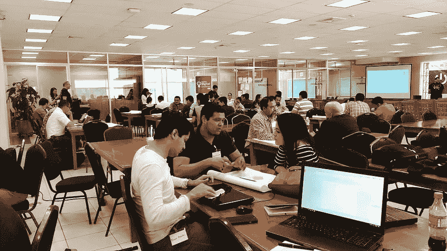

# 生存指南:为你的第一次黑客马拉松。

> 原文：<https://medium.com/geekculture/survival-guide-for-your-first-hackathon-1b799e2d4f8f?source=collection_archive---------6----------------------->

# 什么是黑客马拉松？

黑客马拉松是一种类似于设计冲刺的活动，其中**计算机程序员和其他参与软件开发的人，包括图形设计师、界面设计师、项目经理、领域专家和其他人，在软件项目上紧密协作。**或者更简单地说，黑客马拉松是将编码社区聚集在一起的活动。他们通常超过一个周末。“黑客”们聚在一起提出想法。然后，人们分成小组，致力于将想法转化为应用程序。

## 黑客马拉松的起源:

术语“黑客马拉松”是一个所谓的混合词，由单词**、“黑客”和“马拉松”**组成。“黑客”部分指的是其俚语中程序变更的意思，而不是非法的“黑客”行为。“马拉松”部分指的是集会的持续时间。

# 在黑客马拉松上可以期待什么:

想知道如何让自己在黑客马拉松中获得最佳体验吗？不要再看了；这是你一直在寻找的一切:

## 黑客马拉松的基本准备方法:

## **1。做你的研究&计划:**

提前做好题目或主题的研究，以便做好准备。虽然黑客马拉松是一个你可以随时做任何事情的环境，但提前准备有助于确保成功。找出平均分配工作的方法。

**应对你面临的任何具体挑战**。如果话题或主题事先就有了，和你的团队一起头脑风暴。准备好可以快速实施的想法。最糟糕的事情莫过于注册了一个黑客马拉松，然后在那天出现，却发现自己不知道如何开始。

## 2.团队构成:

你需要有技能的人，要明确的是，不是团队中的每个人都需要成为扎克伯格级别的技术天才。请记住，一个典型的黑客马拉松团队由 3 到 5 人组成，**因此每个人都很重要，只说不做的人没有位置。**找一些你能与之共事的人，以及你在大学或工作中认识的人，或者通过你的社交圈认识的人，这些人会给团队增加价值，即使他们不是程序员。

> **最好的团队是拥有不同技能和知识类型的团队。**

无法组建一个团队？放松，不要担心，很多参与者会找到他们社交圈之外的人来合作。一些黑客马拉松有不和谐频道，松弛频道，FB 组，可能有已经注册你的黑客马拉松的人。

> “技术不需要计算机科学硕士学位，也不需要了解如何用三种语言编写代码来在线构建东西。我们所有人都是技术生态系统的一部分，在开发新解决方案的过程中扮演着同样重要的角色。”— [珍妮·布鲁克斯](https://twitter.com/jmfbrooks)

## 3.挑选主题:

**为你的黑客马拉松设定一个好的主题和理由是它成功的关键。**通常的黑客马拉松会有一个主题可供选择，其他的则更加开放。如果黑客马拉松是由一家公司主办的，集思广益，找出你可以整合他们产品的方法。

主题应该和所有队友一起选择和讨论。注意谁是评委，并利用他们的专业领域来告知你选择建设什么样的项目。不要期望你的队友很棒，如果你期望，那么你自己也要很棒。

> “你需要言行一致。”——[**纳西姆·塔勒布**](https://twitter.com/nntaleb)

## **4。提问:**

**如果有不清楚的地方，你应该询问组织者并得到澄清**。大多数情况下，在活动之前会有一个信息会议，以确保每个人都清楚规则，并在同一页面上。不要成为违反规则而被取消资格的团队。

## 5.集思广益:

**黑客马拉松的想法可能并不总是很棒**。边工作边头脑风暴，即使你还没有敲定产品。带领团队快速做出决策。黑客马拉松有时间限制，我真的相信获胜的产品从活动的第一个小时就决定了。产生想法，尝试开发尽可能多的想法和功能，并将其写在列表上。

要赢得任何黑客马拉松比赛，**你需要一个好的 MVP** 和一个深思熟虑的价值主张。虽然在多个想法上工作可能很诱人，但在短时间内构建大量功能是不实际的。最好的想法是那些简单而创新的想法。当你列出所有想法后，仔细阅读列表上的每一个想法，并通过问这些简单的问题来分析它们:

*   ***是否解决了陈述问题？***
*   ***实现需要多长时间？***
*   ***想法是否有新意，与众不同？***

## **6。区分功能优先级:**

在你列出这些想法后，**最重要的特性将拥有最高的优先级**,并拥有最高优先级。一个不太重要的特征将具有第二优先级，以此类推。实施应从优先级最高的功能开始，然后从优先级较低的功能开始。实现关键路径功能后，您应该能够创建一个包含完整故事的演示文稿，该故事有开头和结尾。

## 7.原型制作:

当你完成了特性优先级排序后，下一步就是在纸上做一个**快速应用草图**并开始创建 UI。这样，所有团队成员都会知道到底需要做什么。

## 8.开始工作:

当你的团队、想法准备好了，就该开始工作了。根据你的优先级，你会以不同的方式使用时间。**在黑客马拉松**中会学到很多东西。我意识到，当你下定决心，你可以学习，看看你能在短时间内做出什么东西。使用你从未使用过的工具和技术，不要害怕，因为黑客马拉松是一个学习如何学习的好地方。到目前为止，团队中的每个人都应该有自己的任务，因此他们可以开始一起实施这些任务。请记住，你正在创建一个原型，而不是一个实际的最终产品。每隔 2-3 小时进行一次简短的**回顾会议，并休息一下。在回顾过程中，与您的团队成员进行会谈，了解他们做了什么和实施了什么，他们遇到了什么问题，并分享您到目前为止取得的进展。如果有人被某个特定的任务卡住了，团队领导应该决定是继续还是拒绝这个功能。**不要浪费太多时间当你卡在一个特定的任务上**，如果你觉得可以用其他特性来补偿，就按照特性优先级列表进行下一个特性。记住，虽然 hackathon 规则说所有的编码都必须在事件本身发生，但是非编码工作可以提前开始。**

## 9.使用赞助产品和原料药:

评委通常受雇于赞助商公司，所以如果你在你的黑客程序中使用他们的 API，那总是一件好事。使用它们也可以增加赢得其他奖项和自己的奖励的机会。这些公司参与推广他们的产品，并帮助学生免费使用。如果赞助商 API 损害了项目的整体质量，就不要实现它。

> **黑客马拉松并不是真的为了赢得奖品。他们是在玩令人敬畏的技术。**

## 10.创建 GitHub 存储库:

回购有助于你区分工作的优先次序，并在团队成员中组织你的项目。

## 11.演示和演示视频:

在你的黑客马拉松项目创建期间，**你的团队也应该考虑演示文稿**。有时候，关键在于你如何表达。花时间做好演示，因为一个好的演示是赢得黑客马拉松的关键。开始准备演示，不要等到黑客马拉松结束才开始。在制作演示文稿时，尽量保持简单。

## *演示文稿中要添加的内容:*

*   应该解释问题陈述，以及你的产品如何帮助解决问题。
*   ***你的产品的关键特性应该突出。***
*   ***与竞争对手*** 有何不同
*   ***做一个市场调查并做好记录***
*   ***提及目标用户。***
*   ***准备好评委提问。***

演示必须有效、有创意、有趣，应该有开始和结束。一开始，你必须清楚地解释你正在解决的问题是什么，以及你是如何解决的。任何不在演示文稿中的东西都是毫无意义的。这将为你的团队节省辩论时间。通常，演示时间大约为 5-10 分钟，明智地使用时间，不要浪费时间，花一两分钟介绍和问题陈述，然后转向解决方案，并在演示视频或现场演示中向他们展示您所做的工作。一旦完成，通过说出**它与竞争对手**的不同之处，谈论**市场研究**并完成它。

> 故事由 50%的陈述、30%的想法和 20%的实施组成。

## 12.投球:

一旦时间到了，你必须向你的同伴解释你做了什么。**在团队中选择 1 人进行演示**，决定谁将发言，谁将制作幻灯片，并指派某人演示项目。**练习投球，保持自信**，努力让它更具互动性。让观众参与演示。
**对你的评价只基于你陈述的 5 分钟左右**，**所以避免谈论你使用过的技术，**或者任何事情的技术背景，除非他们明确地问你。如果有人问相关的问题，请在演示后解释这些内容。
组织者可能会要求您**在 Devfolio、Devpost 或 HackDash 上创建一个页面，**并要求您上传演示视频或推销时使用的视频，以及您的 GitHub repo 的公共链接，这将帮助您记住您所做的内容，并允许您的其他参与者看到您在黑客马拉松期间所做的内容，以及是什么激发了您做这个项目。

## 13.放松身心:

**黑客马拉松是为了娱乐和学习，而不是竞赛**如果你没有娱乐，那就是你做错了。黑客马拉松会让你坐在一个房间里，周围都是零食，并告诉你不要睡觉。尝试吃健康的食物，(这是黑客马拉松，不是快餐马拉松)，确保你有足够的睡眠。黑客马拉松是一场马拉松，不是短跑。请随意休息，这样你就可以充电，然后以全新的视角回到你的工作中。

> 庆祝成功固然好，但更重要的是吸取失败的教训。 " —比尔·盖茨

> 感谢阅读！！希望你玩得开心！