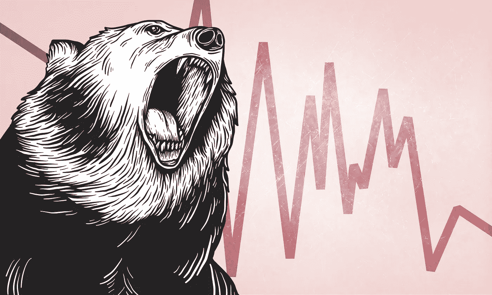
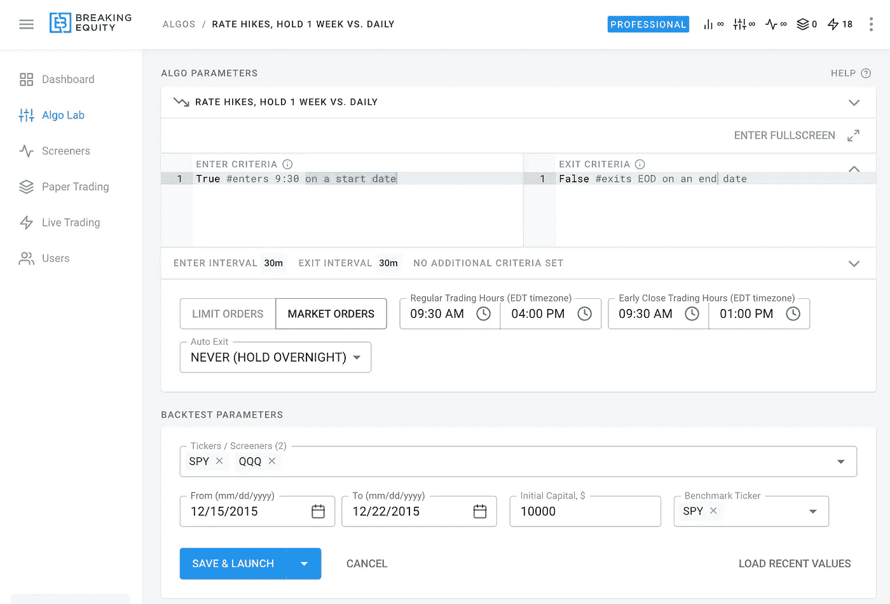
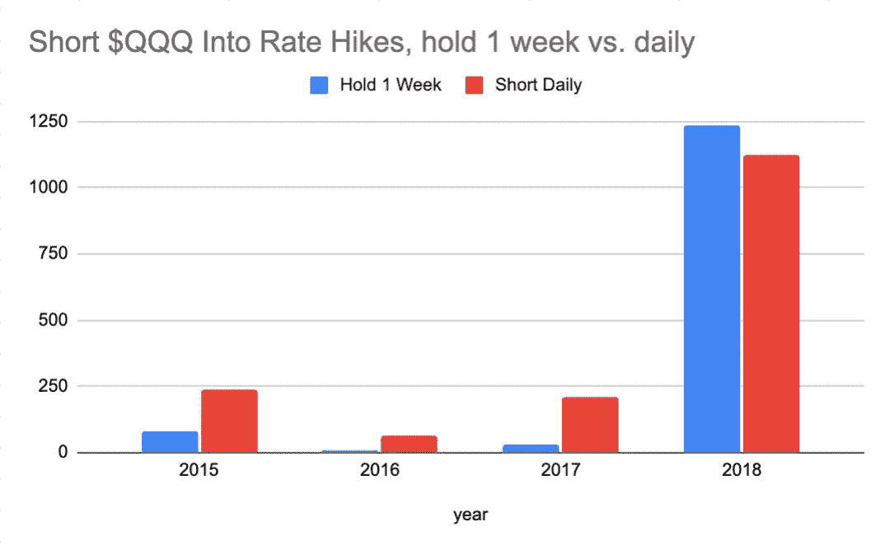
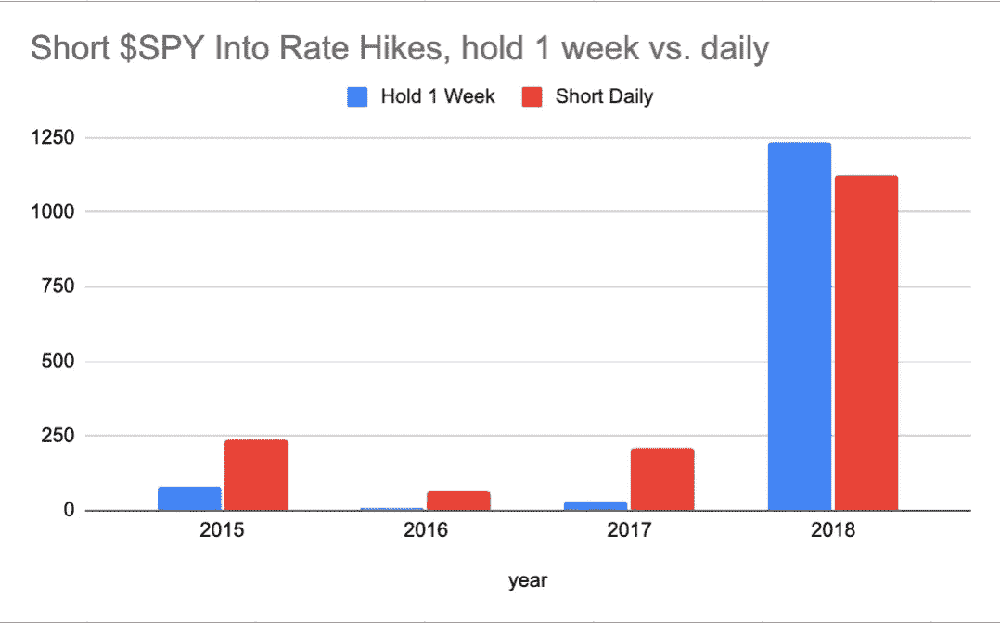

# 通过做空加息度过熊市

> 原文：<https://medium.com/geekculture/surviving-a-bear-market-by-shorting-into-the-rate-hikes-e30627bdc445?source=collection_archive---------12----------------------->

当你做空时，你不仅仅是在做投资决策，你也是在做市场决策。

# 论文

我们生活在预期加息的世界里。股市似乎一点也不喜欢这样。虽然还有许多其他因素，如战争，前所未有的通货膨胀，甚至可能是疫情的回声，但主要论点是，股票市场不喜欢加息，并会对此类事件做出负面反应。作为一个交易者，你可以从中受益，在预期股价下跌时买入“做空”股票。以下是空头仓位的快速定义，供参考。

> 空头头寸是指交易者先卖出一种证券，然后打算以更低的价格回购或回补。当交易者认为某证券的价格在不久的将来可能会下跌时，她可能会决定做空该证券。空头头寸有两种:裸仓和有仓。裸卖空是指交易者在没有持有证券的情况下卖出该证券。

# 战略

仅在美国就有成千上万的股票需要卖空。在这项研究中，我使用$SPY 和$QQQ，因为它们代表了市场的近似值。

为了让它变得可行，我对 2015 年至 2018 年的加息进行了回溯测试。总共有 9 次涨价(数据来自[bankrate.com](https://www.bankrate.com/banking/federal-reserve/history-of-federal-funds-rate/#2011)网站):

*   2015 年 1 x 0.25
*   2016 年 1 x 0.25
*   2017 年 3 x 0.25
*   2018 年 4 x 0.25

我已经对两个策略进行了回溯测试。每次加息，每个人都交易/投资 100 美元 10K .

*   策略 1:在公告日做空，持有 1 周
*   策略 2:在公告日做空，退出 EOD，重复一周

strategy setup in [https://breakingequity.com](https://www.breakingequity.com/)

# 结果呢

每天做空，平仓 EOD 整体表现更好。它还可以保护你免受夜间突然高峰。

*   间谍:1658.7 美元的总收益，而 2015 年至 2018 年的总收益为 1626.9 美元
*   QQQ:1，634.0 美元的总收益，而 2015 年至 2018 年的总收益为 1，353.3 美元

以下是每年的细分情况

Shorting $QQQ, cumulative $ return by year

Shorting $SPY, cumulative $ return by year

[Breaking Equity](http://breakingequity.com/) 是一个自动化交易平台和市场，供散户投资者构建、购买和出售策略。它让算法变得更加实惠和包容，以确保散户投资者利用对冲基金的技术和数据，从而创造公平的竞争环境。

免责声明:不是财务/投资建议。在交易或投资前做好调查和尽职调查。