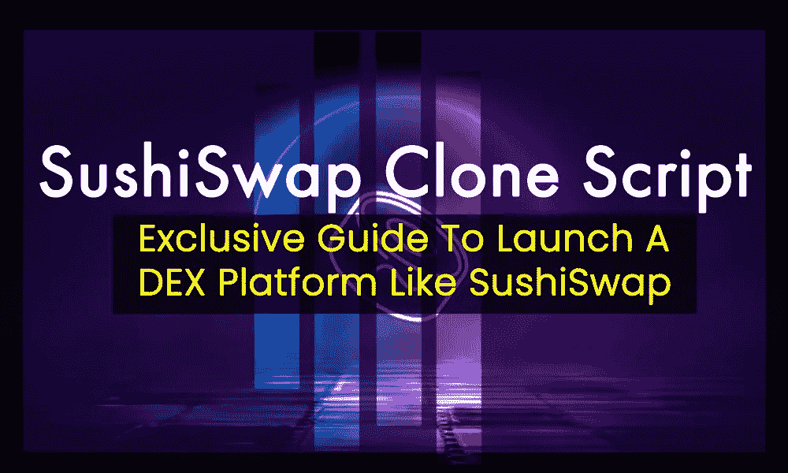

# SushiSwap 克隆脚本—推出 SushiSwap 等 DEX 平台的独家指南

> 原文：<https://medium.com/geekculture/sushiswap-clone-script-exclusive-guide-to-launch-a-dex-platform-like-sushiswap-42c5e57a8f65?source=collection_archive---------11----------------------->

SushiSwap Clone Script — Exclusive guide to Launch a DEX Platform Like SushiSwap

各位区块链商业爱好者好！！！

今天，我将为大家带来使用 SushiSwap 克隆脚本启动像 SushiSwap 这样的 Defi 交换平台的独家指南

让我们深入研究这篇文章…

# SushiSwap 的简要说明:

最近流行的基于 DeFi 的 DEX 平台被称为 Sushiswap，现在在加密领域非常有名。诺米主厨最初于 2020 年 8 月 28 日开始这项工作。因为 Sushiswap 是 Uniswap 的下一个 fork 概念，所以吸引了 DeFi 社区每个发烧友的关注。

Sushiswap 的编码基于 Uniswap、复合金融和渴望金融，并且完全是在健壮的以太坊区块链技术之上设计的。通过提供一个用户友好的界面，与众不同的交易功能和显著的市场流动性水平，该交易所已成为最好的。

SushiSwap 完全基于自动做市(AMM)的理念。DEX 平台的巨大扩张导致了以太坊区块链上的 DeFi 交易所的建立。

这是一个专注于社区的 DeFi 交易所，许多加密货币交易商在流动性池中提供流动性。为提供流动性，赚取的回报相当于币安 DEX 等加密货币交易所的回报。此外，sushiswap 被认为是创收的最佳商业战略之一，因为它具有顶级的创收要素。

您需要一个称为 Sushiswap 克隆脚本的完整解决方案来启动一个类似于 Sushiswap 的 DeFi exchange 公司。

# Sushiswap 克隆脚本？

[**SushiSwap 克隆脚本**](https://www.alwin.io/sushiswap-clone-script) 是基于以太坊区块链的 SushiSwap 平台的副本。Sushiswap 的特性和功能在此克隆脚本中复制。这个脚本使交易者和投资者能够参与代币交换、下注和收集奖励，就像 sushiswap 一样。此外，它们可以从资金池中被动获利，并为流动性提供者创造动力。

作为克隆脚本的所有者，您可以修改您的智能合约以满足您公司的需求。白标 sushiswap 克隆软件具有出色的功能，并且是完全去中心化的。

sushiswap 平台的当前特性和插件完全包含在这个 DeFi exchange 克隆脚本中。通过利用这种预先编写的脚本，可以在 7 天内快速、经济地创建功能丰富且视觉上与 sushiswap 相同的 DeFi exchange。一个高级 Sushiswap 克隆脚本可能需要花费 5k 到 10k 美元购买。此外，它被认为是加密行业最具扩展性的产品。

高端白色标签 SushiSwap 克隆软件是专为那些希望通过建立一个以食品为主题的 DeFi 交易所来进入加密货币市场的企业家而设计的。此 DeFi exchange 克隆脚本已经过多次完全创建、验证、分散和测试，并已为部署做好准备。

大多数创业公司和企业主选择这个克隆脚本用于他们的 DeFi exchange 业务，因为它有很好的修改潜力。

# SushiSwap 克隆脚本的优点:

*   增加用户流量和利润率
*   与竞争对手不同。
*   更准确的客户洞察
*   增加产品的价值。
*   让我们现在开始吧。

# Sushiswap 克隆是如何工作的？

尖端的 sushiswap 克隆软件与当前的 sushiswap 平台功能相同。这个脚本的易于理解和吸引人的功能让用户对你的平台保持兴趣。现在让我们来看看 sushiswap 克隆是如何工作的。

用户必须使用兼容的加密货币钱包注册，如 trust wallet、metamask wallet 或其他接受加密货币的钱包，才能参与平台的令牌交换。它将促进掉期交易，并为用户提供流动性。

*   在连接非保管加密货币钱包后，用户可以选择将哪些代币用作交换或流动性。
*   通过选择交换选项，用户可以在 sushiswap 克隆平台上轻松无缝地进行切换。
*   用户可以很容易地添加流动性，因为脚本包括一个 AMM 模块。
*   加入该协议池的用户将获得流动性提供商令牌，他们可以在以后利用这些令牌。
*   sushiswap 克隆以一种简单的方式运行。

# Sushiswap 克隆软件协议:

高级 sushiswap 克隆中包含的协议如下所示。

*   自动做市商
*   交换协议
*   贷款协议
*   高产农业
*   打桩协议

这个克隆脚本包含了所有这些优秀的协议。

# Sushiswap 克隆的高级功能:

当创建一个类似于 sushiswap 的 DeFi 交换时，你添加的软件特性非常重要。最伟大的 sushiswap 克隆脚本有以下突出的特性，我将为您列出这些特性。

*   即时令牌交换功能
*   自动做市
*   流动性池
*   用户仪表板
*   管理仪表板
*   放款与借款
*   已识别的飞行物(identified flying object)
*   多重加密钱包支持
*   池比率的重新平衡
*   流动性迁移
*   令牌分析
*   赌注和更多。

除了这些优势之外，您还可以根据公司的需要添加更多的交易功能。

# Sushiswap 克隆软件的亮点:

在最可靠的区块链以太坊上使用经过全面测试的可定制源代码构建。对多种加密货币钱包的支持以合理的价格尽快推出了一个壮观的 DeFi 交换。利用尖端技术创造

这些是剧本令人吃惊的亮点。现在让我们来探讨一下这篇文章的关键部分。

# 如何启动像 SushiSwap 这样的 DEX？

使用克隆脚本创建一个 DeFi 交换平台是一个好主意。但是即使你花钱买了一个高端的 sushiswap 克隆脚本来创建一个类似 Sushiswap 的 DEX 平台，你仍然需要采取具体的行动。是他们，

*   T2 有一个成功的商业计划
*   研究市场
*   选择一个你想要建立 DeFi 交换的地点，例如 Sushiswap。
*   检查该国的管辖权和法律可行性。
*   选择一个区块链网络并创建 DeFi exchange 的架构。
*   找到业界合法的 Sushiswap 克隆脚本提供者。
*   *启用*更严格的安全措施
*   验证交换的质量。
*   在服务器上安装 DeFi exchange，开始您的营销活动。
*   拥有独特的客户服务线

当利用白色标签 sushiswap 克隆开发类似于 sushiswap 的 DeFi 交换平台时，请记住以下重要考虑事项。在这些元素中找到最好最真实的 Sushiswap 克隆脚本供应商是一个困难的过程。所以让我说:

# 如何获得最好的 Sushiswap 克隆解决方案提供商？

因为我们生活在一个数字时代，我们知道加密领域有 100 多个克隆脚本提供者。但是，在选择理想的服务之前，您必须了解几个基本部分。此处包含了选择顶级 sushiswap 克隆软件提供商作为您的技术合作伙伴的清单。在加密领域，我反复听到“WeAlwin Technologies”这个名字。因此，我参与了对它们的深入研究。他们在世界各地提供顶级的 Defi 开发服务，并与知识渊博的区块链专家一起为他们的加密同行完成了 300 多个项目。如果你需要任何咨询，看看他们。

希望这篇文章能帮助你开启自己的 Defi exchange 商业之旅。