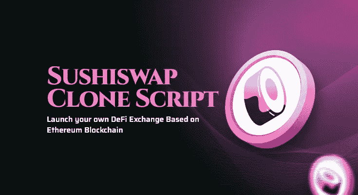

# Sushiswap 克隆脚本—启动 DeFi 交换

> 原文：<https://medium.com/geekculture/sushiswap-clone-script-to-enter-the-food-themed-defi-exchange-market-9b7d8cc536ea?source=collection_archive---------11----------------------->

Decentralized exchange script

如果你是一个想像 sushiswap 一样推出 DeFi 交易所的投机者，那么你来对地方了，伙计们！自 2018 年以来，DeFi 一直是区块链世界的一个流行术语。每个加密初创企业和企业家都有一个梦想，那就是在加密领域开展 DeFi 交易所业务。这是因为在全球市场上，交易员、投资者和初创企业非常受欢迎。

截至目前，已有超过 50 家 DeFi 交易所通过向加密用户提供独特的令牌交换服务，向业界展示了它们的存在。在这些交易所中，Sushiswap 是领先的 DeFi 交易所平台之一，具有独特的交易功能。他们在市场上赢得了最好的名声，因为他们提供了新的交易选项，比如寿司吧、贷款、便当、味噌、授权等等。

Sushiswap 完全基于 DeFi 概念工作，并且是完全分散的。通过使用可定制的 sushiswap 克隆脚本，可以立即开发一个像 sushiswap 这样的 DeFi 交换。因此，许多加密初创公司和商业阶层的人都表示有兴趣从业内著名的 DeFi exchange 克隆脚本提供商那里获得最佳脚本。

如果你不知道 sushiswap 克隆脚本及其工作过程。那么，这篇文章就送给你了。本文将涵盖您需要了解的关于 [**sushiswap 分散式 exchange 克隆脚本**](https://www.coinsclone.com/sushiswap-clone-script/?utm_source=geekrevamp&utm_medium=sushiswap&utm_campaign=sinu) 的所有内容，包括它的特性、优点、工作方式等等。

让我们以…开始这篇有趣的文章

# **sushi swap 概述**

Sushiswap 是新推出的基于 DeFi 的 DEX 平台，现在在加密领域非常突出。这一交流由 Nomi 主厨于 2020 年 8 月 28 日首次推出。Sushiswap 的推出得到了 DeFi 社区每个爱好者的关注，因为它是 Uniswap 的下一个分叉概念。

Sushiswap 完全是在强大的以太坊区块链平台之上开发的，其编码源自 Uniswap、复合金融和渴望金融。该交易所因提供具有独特交易功能的用户友好界面而赢得了最好的声誉，并且在市场中具有较高的流动性。

SushiSwap 完全基于 AMM——自动做市概念。DEX 平台获得了巨大的发展，现在已经在区块链以太坊创建了一个 DeFi 交易所。

这是一个面向社区的 DeFi 交易所，由几个密码交易员向流动性池提供流动性。作为回报，提供流动性会获得回报，这与币安 DEX 等加密交易所相同。此外，sushiswap 被认为是一种很好的创收商业模式，因为它包含了顶级的赚钱功能。

要开始一个类似于 Sushiswap 的 DeFi 交换业务，你需要一个叫做 Sushiswap 克隆脚本的终极解决方案。

# **什么是 Sushiswap 克隆脚本？**

sushiswap 克隆是 SushiSwap 平台的复制品，也是建立在以太坊区块链上的。这个克隆脚本反映了 Sushiswap 的特性和功能。像 sushiswap 一样，这个脚本允许交易者和投资者参与代币交换、下注和赚取奖励。此外，它们可以从资金池中获得被动收入，并为流动性提供者提供激励。

作为克隆脚本的所有者，您可以根据您的业务需求定制您的智能合约。白标 sushiswap 克隆软件是一个完全去中心化的软件，具有非常好的特性。

这个 DeFi exchange 克隆脚本保存了 sushiswap 平台的所有当前特性和插件。使用这个现成的脚本，人们可以在 7 天内以经济高效的方式构建一个功能丰富的 DeFi exchange，它看起来与 sushiswap 相似。高级 Sushiswap 克隆脚本的费用在 7000 美元到 14000 美元之间。此外，它被认为是加密领域最具可扩展性的产品。

优质的白色标签 SushiSwap 克隆软件完全是为那些梦想通过创建一个以食品为主题的 DeFi 交易所进入加密市场的初创公司而设计的。此 DeFi exchange 克隆脚本是经过完全设计、开发、验证、分散、多重测试的，并已准备好进行部署。

由于其出色的定制范围，大多数创业公司/企业家更喜欢这个克隆脚本用于他们的 DeFi exchange 业务。

# **优化脚本的好处**

*   吸引更多用户
*   提高利润率
*   从竞争中脱颖而出
*   更好的客户洞察力
*   提升产品的价值。

现在，让我们深入了解…

# 【Sushiswap 克隆脚本是如何工作的？

超现代的 sushiswap 克隆软件与现有的 Sushiswap 平台操作相同。这个脚本有一个吸引人的可访问的操作方法，让用户参与到你的平台中。现在，让我们看看 sushiswap 克隆的工作过程。

1.  要参与平台中的令牌交换，用户需要向支持的加密钱包(如元掩码钱包、信任钱包或任何其他可接受的加密钱包)注册。这将有助于用户进行掉期交易，并提供流动性。
2.  在连接非保管加密钱包后，用户可以选择代币并决定是交换还是提供流动性以获取利润。
3.  通过单击交换选项，用户可以在 sushiswap 克隆平台中执行无缝和平滑的交换。
4.  由于该脚本有一个 AMM 模块，您的用户也可以轻松地添加流动性。
5.  加入该协议的用户将收到流动性提供商令牌，这些令牌随后会转化为用户的额外收益。

这是 sushiswap 克隆的简单工作程序。

# **Sushiswap 克隆协议**

以下是高级 sushiswap 克隆下的协议列表。

1.  自动做市商
2.  交换协议
3.  贷款协议
4.  高产农业
5.  打桩协议

您可以在这个克隆脚本中获得所有这些精彩的协议。

# **Sushiswap 克隆人的精英特征**

在构建类似 sushiswap 的 DeFi 交换时，您在软件中配备的功能起着重要的作用。这里我列出了一些你可以从最好的 sushiswap 克隆脚本中获得的非凡特性。

1.  即时令牌交换功能
2.  自动做市
3.  流动性池
4.  用户仪表板
5.  管理仪表板
6.  放款与借款
7.  已识别的飞行物(identified flying object)
8.  多重加密钱包支持
9.  池比率的重新平衡
10.  流动性迁移
11.  令牌分析
12.  赌注和更多

除了这些功能，您还可以根据您的业务需要加入额外的交易功能。

# **Sushiswap 克隆的亮点**

1.  建立在最值得信赖的以太坊区块链网络之上
2.  100%测试和可定制的源代码。
3.  多种加密货币钱包支持
4.  以适中的成本在最短的时间内推出一个令人惊叹的 DeFi 交换
5.  使用最新技术制造

这些是剧本中令人大开眼界的亮点。现在，让我们看看文章的重要部分。

# **如何使用 Sushiswap 克隆脚本启动 DeFi 交换？**

通过克隆脚本创建一个 DeFi 交换平台是一个聪明的想法。但是，即使您投资了一个高级 sushiswap 克隆脚本来构建一个类似于 Sushiswap 的 DEX 平台，您也必须遵循某些步骤。他们是，

1.  有一个完美的商业策略
2.  做市场调查
3.  确定您想要创建 DeFi 交换的位置，如 Sushiswap
4.  检查法律可行性和国家的管辖权
5.  选择区块链网络并设计您的 DeFi exchange 架构
6.  确定业内真正的 Sushiswap 克隆脚本提供商
7.  启用严格的安全系统
8.  验证您的交换质量
9.  在服务器上部署 DeFi exchange 并开始营销
10.  拥有独立的客户支持渠道

在使用白色标签 sushiswap 克隆创建 sushiswap 这样的 DeFi 交换平台时，请记住这些重要因素。在这些因素中，识别最佳和最真实的 Sushiswap 克隆脚本提供者是一项复杂的任务。所以，让我说…

# 如何挑选最好的 Sushiswap 克隆软件提供商？

我们处于数字时代，所以我们知道在加密领域有 100 多个克隆脚本提供者。然而，在选择完美的供应商之前，你必须了解一些基本因素。在此，我附上了一份清单，以寻找一个优秀的 sushiswap 克隆软件提供商作为您的技术合作伙伴。

*   经验和投资组合
*   技术栈
*   审查和反馈
*   交流和语言
*   透明的开发过程
*   预算
*   免费演示

因此，在选择脚本提供者之前要考虑这些最重要的因素。

# **结束**

最近几天，分散金融的概念有了很大的发展。人们对 DeFi 行业的吸引力与日俱增。因此，DeFi 市场的炒作已经变得不可思议，因为以太坊区块链上更多的 DeFi 交易所带着独特的概念来支持加密爱好者。

如果你是一个计划在区块链以太坊创建一个 DeFi 交易所的加密初创公司，那么与一个著名的 [**SushiSwap 克隆脚本**](https://www.coinsclone.com/sushiswap-clone-script/?utm_source=geekrevamp&utm_medium=sushiswap&utm_campaign=sinu) 提供商联系将帮助你成功地开始一个 DeFi 交易所业务。

我希望这篇文章有助于按照你的愿望开始一个 DeFi 交易所的商业之旅！